# The TinyHouse App

Welcome to Newline's first Masterclass - **TinyHouse**.

TinyHouse is a structured, self-paced, online learning course designed to help you build a Universal JavaScript application. We'll be working with a variety of different technologies such as **React**, **GraphQL**, and **TypeScript** to learn how we can build a real home-sharing app including authentication, data persistence, payments, and deployment.

In this document, we'll be highlighting the [TinyHouse](http://tinyhouse.app/) application we are to build in this course. By the end of Part II, we'll have a fully functioning home-sharing application where users will be able to sign-in, create a listing, and book other listings.

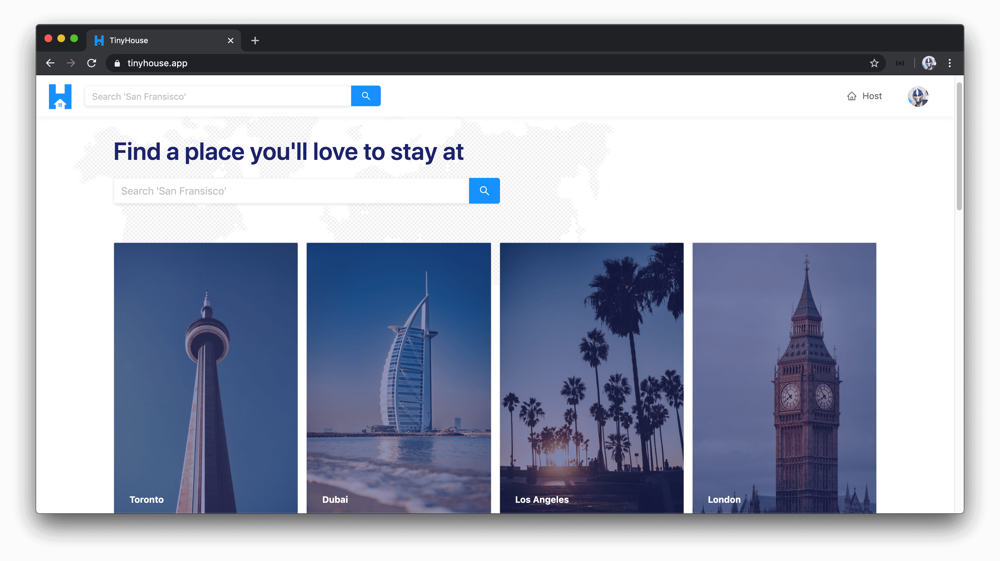

## Features

Here is a summary of all the main features in the TinyHouse application. A user will be able to:

- Sign-in with their Google account information.
- Search for listings in various different locations in the world.
- See specific details about listings.
- Book listings for a period of time.
- Connect their Stripe account to be allowed to create listings (i.e. be a host in TinyHouse) and receive payments from other users.
- Create (i.e. host) listings of their own.
- See a history of the listings they've created, the bookings they've made, and the bookings made to their own listings.
- See a history of listings created by other users.

### Sign-in with Google

Users will be able to sign-in to the TinyHouse application through **Google Sign-In** by providing their Google account information.

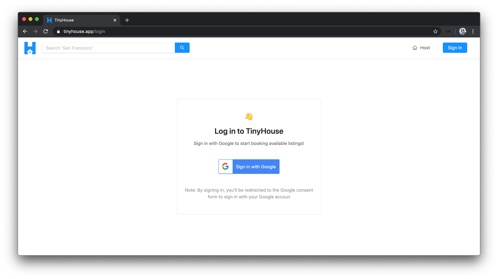

When a user attempts to sign-in with Google Sign-In, they'll be prompted to provide their Google account information and when successful, will be direceted to the TinyHouse application in the logged-in state.

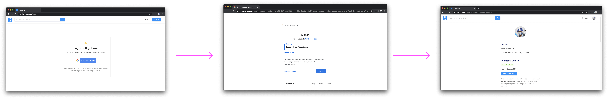

When logged-in, users are able to book listings in the TinyHouse application.

### Search for listings in various different locations in the world

Users are to be able to search for listings in practically any part of the world. To search for listings, users can use the search input available in the homepage or in the app header menu.

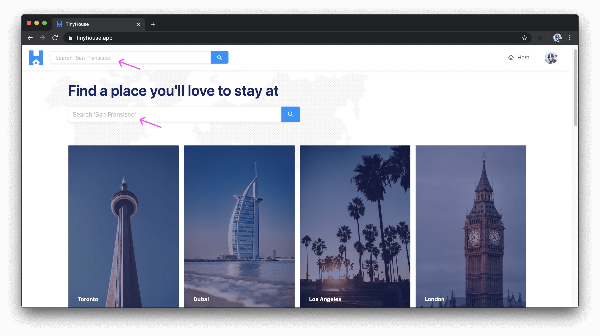

When a search is made, users are then directed to a listings page where they're able to survey all the listings that have been created for a certain location.

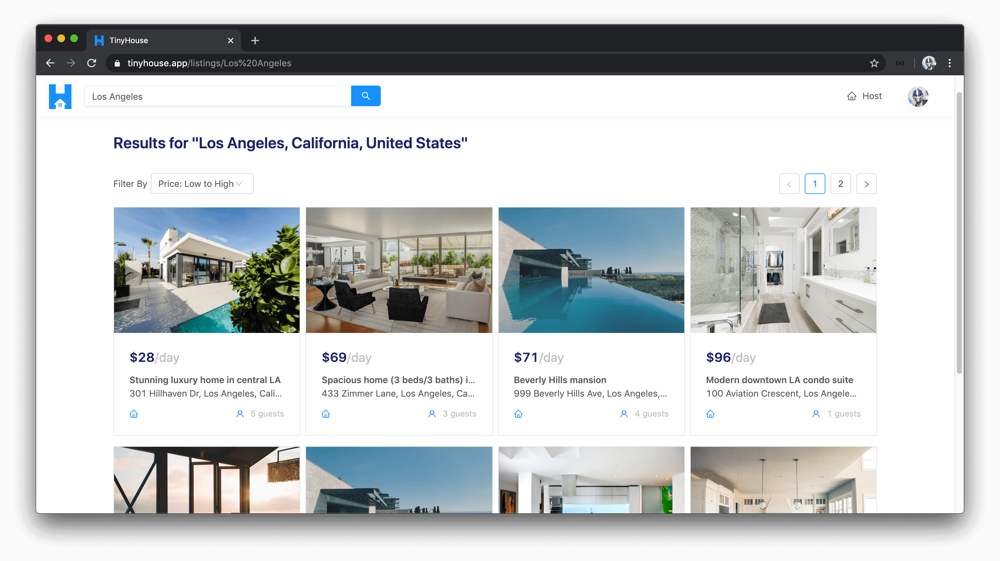

### See listing details

When a user is to select a listing from a list of listings presented to them, specific details about the listing is to be shown to the user consisting of but not limited to the listing's description, title, image, address, and the host of the listing.

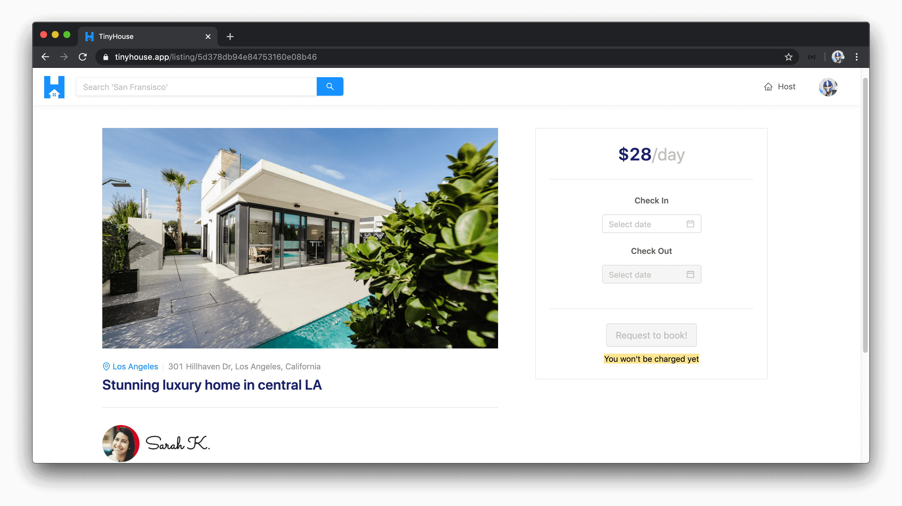

### Book listings for a period of time

In the overview for a specific listing, users are able to request a listing is to be booked for a certain period of time.

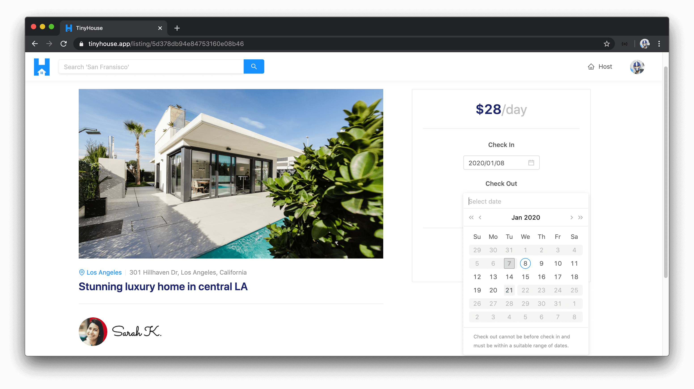

When valid dates are selected, the user is prompted to confirm their booking by providing valid payment information (i.e. valid credit/debit card).

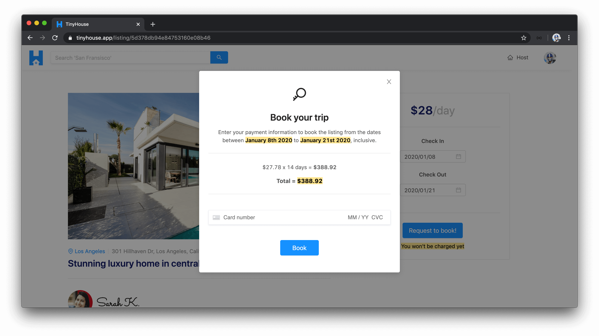

### Connect with Stripe

If a user is interested in hosting and/or creating listings within TinyHouse, they'll first need to connect their Stripe account which will allow them to receive payments from other users. A user will be to connect their Stripe account from their user profile section in the user page.

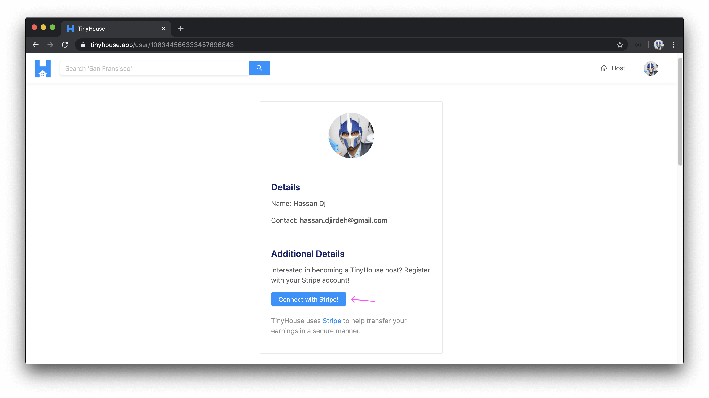

When a user attempts to connect their Stripe account, they'll be prompted to provide their Stripe account information and when successful, will be redirected to the TinyHouse application.

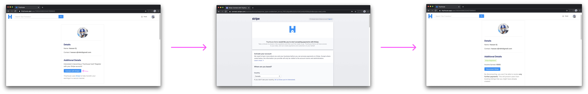

When a user is connected with Stripe, they'll see the overall income they've made and will be able to create listings of their own.

### Create (i.e. host) listings

When signed-in to the application **and** connected with Stripe, users will be able to create new listings. This is to be done in the host page where users are required to provide all valid information for new listings such as but not limited to the listing title, image, address, and price.

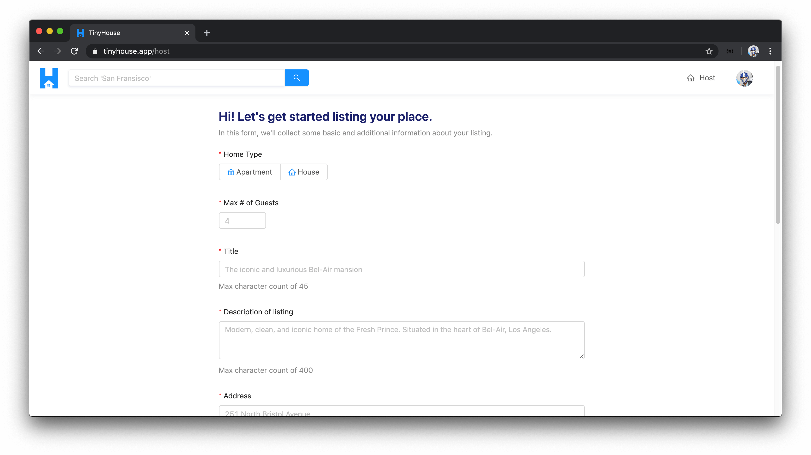

### See history of listings created and bookings made

When signed in and located within the user page of one's own account, the user will be able to see a history of all the listings they've created and the bookings they've made for other listings.

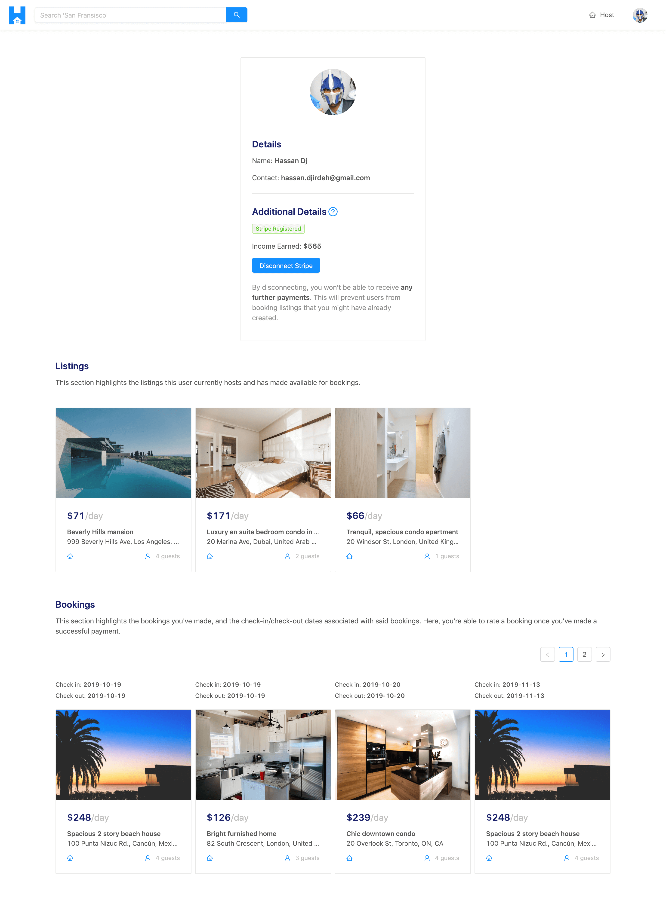

When a user is to view the details of a listing they own, they are also able to see the bookings that have been by other users to the specific listing.

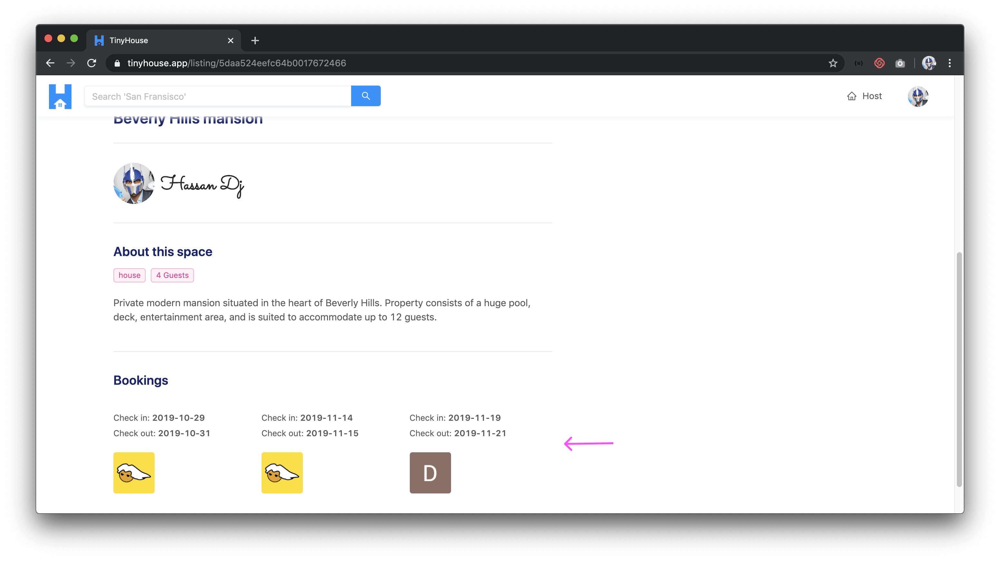

### See history of listings created by other users

When visiting the user page of other users in the TinyHouse application, a user is able to see the listings created by other users.

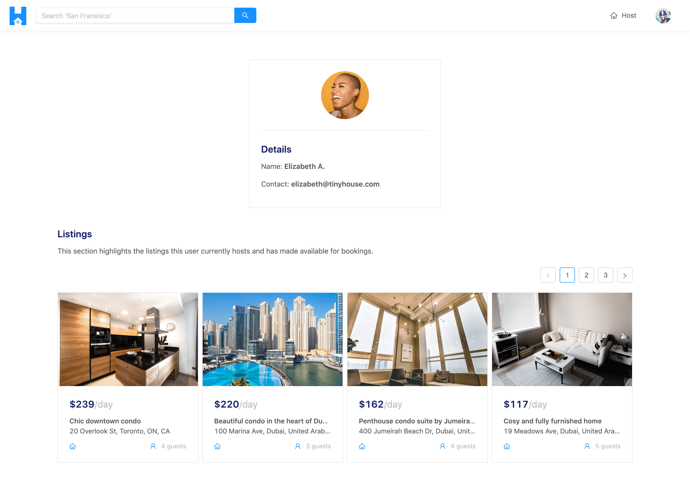
