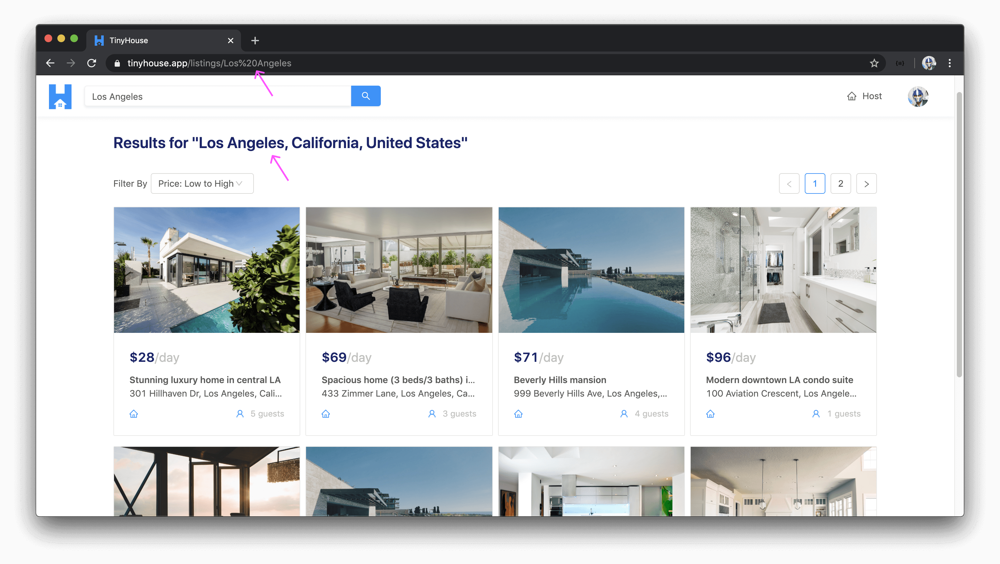
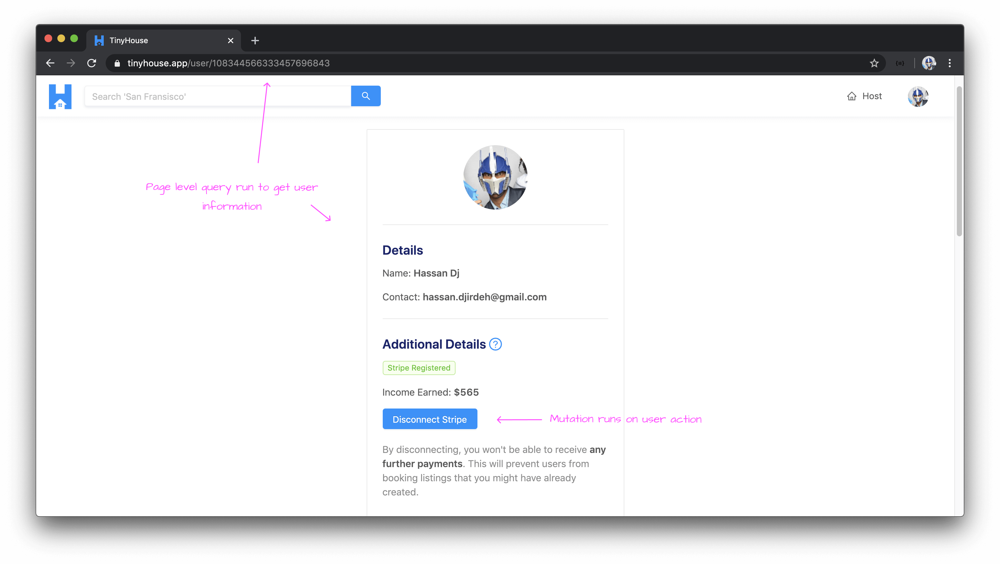
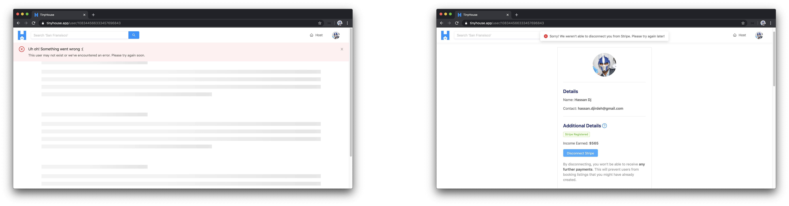

# Code Patterns & Behavior

> 📖 This lesson's lecture slides can be found - [here](./protected/lecture-slides.pdf).

In this lesson, we'll continue from what we've done in the previous lesson and we'll quickly go over some high-level patterns and behavior that we'll employ as we build the server and client projects.

### Folder Structure & Exports

#### Similar functionality is to be grouped together

The very first thing we'll mention is **we'll always look to group similar functionality together** within folders and directories. For example, here's the `src/` directory of our finished server project.

```shell
src/
  database/
    index.ts
  graphql/
    resolvers/
    index.ts
    typeDefs.ts
  lib/
    api/
    utils/
    types.ts
  index.ts
```

If we were to create any GraphQL resolver information, we'll create it and keep it within the `src/graphql/resolvers/` folder. If we had a specific function that needed to interact with a third-party API, we'll keep it in the `src/lib/api/` folder.

As we start to build functionality in our application, we're going to specify and declare where we want to group certain things, and as things continue, we'll continue to group things together.

#### Create explicit index files to "barrel" export functionality

In multiple areas of both our server code and client code, we're going to create **explicit index files** within folders that will help "barrel" export functionality together. As an example, in the `src/lib/` directory of our client project, there exists a `components/` folder where many different parts of our client app will use.

```shell
lib/
  components/
    AppHeaderSkeleton/
    ErrorBanner/
    ListingCard/
    PageSkeleton/
  index.ts
```

In the `lib/components/index.ts` file, we'll re-export each of the components being created within the `lib/components/` folder.

```ts
export * from "./AppHeaderSkeleton";
export * from "./ErrorBanner";
export * from "./ListingCard";
export * from "./PageSkeleton";
```

> **Note:** We're using the `*` symbol to simply re-export everything exported in each of the component files. We could very well use named exports as well.

Why would we be doing this? It's preferential and it's due to how we intend to have the components listed above be _imported_ in other areas of our code. For example, with an `index.ts` file in the `lib/components/` folder re-exporting all the components, we can import them in one line as follows:

```ts
import {
  AppHeaderSkeleton,
  ErrorBanner,
  ListingCard,
  PageSkeleton
} from "./lib/components";
```

This helps avoid the importing of each component one by one:

```ts
import { AppHeaderSkeleton } from "./lib/components/AppHeaderSkeleton";
import { ErrorBanner } from "./lib/components/ErrorBanner";
import { ListingCard } from "./lib/components/ListingCard";
import { PageSkeleton } from "./lib/components/PageSkeleton";
```

This is to help keep things more neat and concise as we proceed through the course.

### Routing & URL Parameters

The next thing we'll talk about is Routing and URL parameters. If you've used web applications before, you're already probably familiar with routes and URLs. Routing is essentially the capability to direct a user from a certain URL to another URL where the user can see information that pertains to that new URL.

Routing is helpful since it allows us to keep context of where we are in our application. It allows us to use the browser back and forward history functionality. Routing also allows us to bookmark URLs and share them with others.

#### URL Parameters to get specific information

In the TinyHouse application, we're going to use routes and dynamic URL parameters to get specific information on certain routes. As an example, if a user was interested in seeing the listings within the region of `Los Angeles`, they'll surface this information by visiting the `/listings/Los%20Angeles` pathname of the application route.



How would this work? In summary:

- The client will receive the value of the dynamic URL parameter (e.g. `Los Angeles`).
- The client will make a request to the server (e.g. a query) and provide the value of the URL parameter as an argument of the request.
- The server receives the request and returns data that satisfies the request made.
- The client receives the data and surfaces the relevant information.

We're going to employ this pattern in many different parts of our app such as when we want to surface information for a certain listing or a certain user.

### Queries & Mutations

#### Queries on page-level & mutations on user action

_For the most part_, in the TinyHouse application, **queries are to usually run when a page first loads** and **mutations are to usually execute based on user action**.

For example, if we were to surface information for a certain user in the `/user/:id` route of our app, a query will be run when the page loads to get the relevant information. Some of the additional actions that can be done on the page (i.e. user disconnects from Stripe) will conduct a mutation when the user action is made.



Following the above pattern, query errors would often be page-level while mutation errors would often be a notification on the page. If a page-level query was to ever fail, we'll have no information to show to the user so we'll surface a page-level error. If a mutation based on user action was to ever fail, the page information should still be present so we'll keep the user on the page and surface an error message.



With this pattern in mind, we'll look to usually have page-level queries be made in the parent section components that are to be rendered for a certain route (e.g. `<User />` component in `/user/:id` route). We'll use `props` to pass this component data down to child components that depend on it. We'll organize mutations to occur in the child component the mutation is to happen in.

```shell
User/
  components/
    UserBookings/
    UserListings/
    UserProfile/
      index.tsx // specific mutation
  index.tsx  // page-level query
```

**This is a general pattern we'll follow for organization and maintainability, not a requirement**. In a few areas of our app (e.g. handling OAuth on the client), we'll do things slightly differently.

### Building New Features

As we proceed through Part II of the course, we'll look to build certain features within specific modules (e.g. connect with Stripe in Module 10). As we look to tackle in building new features, we'll follow a general pattern:

1.  Understand the **scope** and what we intend to accomplish.
2.  Establish the **GraphQL fields** we'll need in our API.
3.  Implement **type definitions** and **resolver functions** for the new GraphQL fields.
4.  Build the **client-side UI** to consume the new GraphQL fields.

In a few specific cases, we may move around between some of these steps but usually, we'll look to do the above in order.

Once we begin to start working through Part II of the course, we'll get more context on a lot of different things we've talked about in this and the previous lesson!
