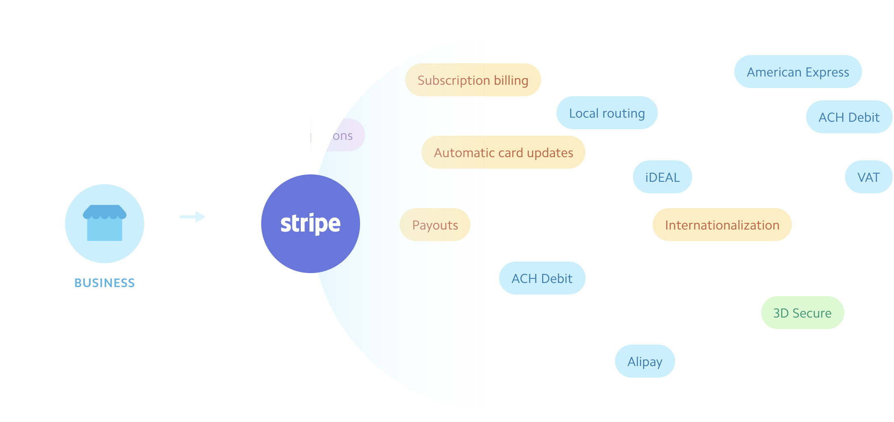

# Stripe & Stripe Connect

> 📠Information about Stripe as an organization can be found - [here](https://stripe.com/about). 
> 📠Details on Stripe pricing can be found - [here](https://stripe.com/pricing). 
> 📠Details on Stripe's Marketplace/Platform product, Stripe Connect, can be found - [here](https://stripe.com/connect). 
> 📖 This lesson's lecture slides can be found - [here](./protected/lecture-slides.pdf).

It's finally time we talk about payments! The business model of the TinyHouse platform is an online marketplace where users can host and book listings. When a booking is made, the user that is making the booking (i.e. the tenant) needs to pay the owner of the listing (i.e. the host) a sum of money. TinyHouse (i.e. we) will take a percentage of that transaction as revenue (a.k.a. a platform fee).

Building and integrating a payment infrastructure on top of an app is **extremely** complex. Do we want our users to be able to pay by debit card? Well, we'll pretty much need to work with every single bank in the country that our platform will be operating in. Do we want our users to be able to pay by credit card? Again, we'll need to work with tools provided to us from credit card companies that we would want to support (VISA, Mastercard, AMEX, etc.). Do we want to accept international payments? Going international is another avenue of difficulty.

If we were to go through the approach of building our own custom payment infrastructure, we'll need to work with all these different parties. This will be **extremely** time-consuming and probably more complex than the actual app we're building. Not to mention, depending on where our app operates, there are strict laws and regulations on services that deal with the transfer of money.

**This is where a third-party payment processor comes in**. Companies like [**Stripe**](https://stripe.com/) and [**PayPal**](http://paypal.com/) specializes in payments. In this course, we'll be using Stripe to facilitate payments for our TinyHouse application.

### Stripe

[**Stripe**](https://stripe.com/) is a technology company that helps builds infrastructure where online businesses, like TinyHouse, can accept payments online. Stripe removes the complexity of dealing with finances and payments by working with various financial institutions, regulators, payment networks, and banks so businesses like ourselves don't have to.

A remarkable number of companies use and utilize Stripe - millions in fact and over 120 countries. This consists of small businesses as well as million to billion dollar organizations like [Amazon](https://www.amazon.com/), [Google](http://google.com/), [Shopify](http://shopify.com/), [Microsoft](http://microsoft.com/), etc.

> **Note:** For more details on Stripe as a company, be sure to check out the about section of Stripe's documentation - <https://stripe.com/about>.

What does it take to use Stripe within an application? There's the simple to understand pricing plan from Stripe which provides an integrated plan that charges 2.9% (plus 30 cents extra) for every successful charge with a card. There's also the customized plan where organizations and businesses can design a custom package by contacting the sales team with Stripe.

Keep in mind that depending on what tool you use from Stripe, there can be smaller additional charges that can be applied (e.g. international payments, using tools like Alipay or WeChat, etc.). However, for the most part, the basic payment plan follows a simple process of essentially charging a small percentage (like 2.9%) and a few additional cents for every successful payment.

> **Note:** For more details on Stripe pricing, be sure to check out the pricing section of Stripe's documentation - <https://stripe.com/pricing>.

### Stripe Connect

Stripe provides many different tools such as their [Payments](https://stripe.com/payments) platform, their [Billing](https://stripe.com/billing) utility, [Analytics](https://stripe.com/sigma), etc. We're interested in leveraging one in particular called [Stripe Connect](https://stripe.com/connect).

[**Stripe Connect**](https://stripe.com/connect) is the solution intended for **marketplaces and platforms since it allows applications to accept money and payout to third parties**. Stripe Connect supports many different business models such as on-demand businesses, e‑commerce, crowdfunding, etc.

Stripe Connect provides many different customizations for _how_ we want payments to be routed within an application. We'll go through some great diagrams and examples obtained from the Stripe Connect [documentation](https://stripe.com/connect#routing-payments).

#### One-to-one

There's the one-to-one model where one customer is charged and one recipient is paid out with a one-to-one relationship between charge and transfer. A valid use case for this is a ride-sharing service.

#### One-to-many

There's the one-to-many model where one customer is charged and the funds are split between multiple recipients. A valid use case for this would be a retail marketplace where a consumer can purchase from multiple online stores within a single application.

#### Many-to-many

There's the many-to-many model where multiple customers are charged and the funds are split out across multiple recipients. A valid use case for this could be a SaaS (Software As A Service) platform that charges customers a monthly fee for access to fitness classes at different studios.

There are also other more complicated scenarios that Stripe Connect allows for such as the capability for the platform to hold funds before paying out to recipients, the capability to simply charge recipients a fee on a semi-frequent basis, etc.

The use case for our application is going to be one of the more simple scenarios and will be the **one-to-one relationship model**. We'll have a single customer (that is to say a tenant) that pays out to a single recipient (that is to say the host of the listing). TinyHouse (i.e. we) will leverage Stripe Connect to have the host pay us a small percentage to use our application and receive payments from tenants.

#### Stripe Connect - Account Types

There exists [three different account types](https://stripe.com/connect/account-types) within the Stripe Connect utility - **Standard**, **Express**, and **Custom**. Many different factors go into choosing the best type of platform account to use. The following table, from Stripe [documentation](https://stripe.com/docs/connect/accounts), lists many of these factors.

For us, integration effort and the user experience is particularly important. If one doesn't want to spend a lot of time building actual onboarding flows for payments/checkout/etc., the Standard or Express account types might be easier to implement. If one needs more control over the connected user’s experience the Express or Custom account types might fit one's needs.

> **Note:** The Custom account type of Stripe Connect is API only while Standard and Express provide integration through OAuth.

The Express account itself can only be created for individuals and businesses based in the United States and Canada. The Custom account type requires us to take care of and build the infrastructure to collect user information, create a user dashboard, handle support, and so on. It's even noted that it's ideal for users that can dedicate significant engineering resources.

**We'll be using the Standard account type for Stripe Connect**. It's by far the easiest to integrate and the user is responsible for disputing liability, not the platform.

In the next coming lessons, we're going to create our Stripe Connect account, retrieve the necessary credentials that we might need, and build out the capability to have users in our application connect with Stripe and be part of our Stripe Connect platform.
