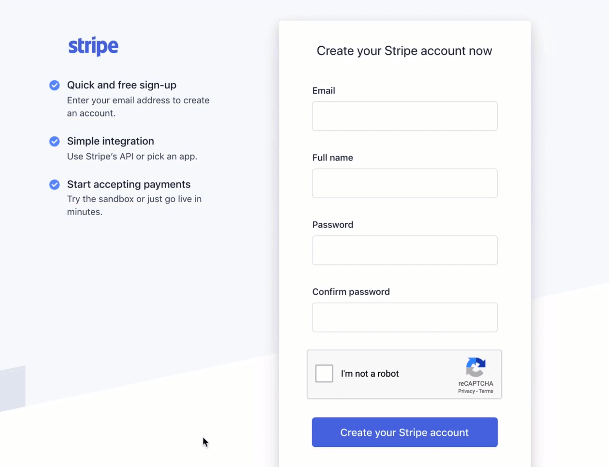
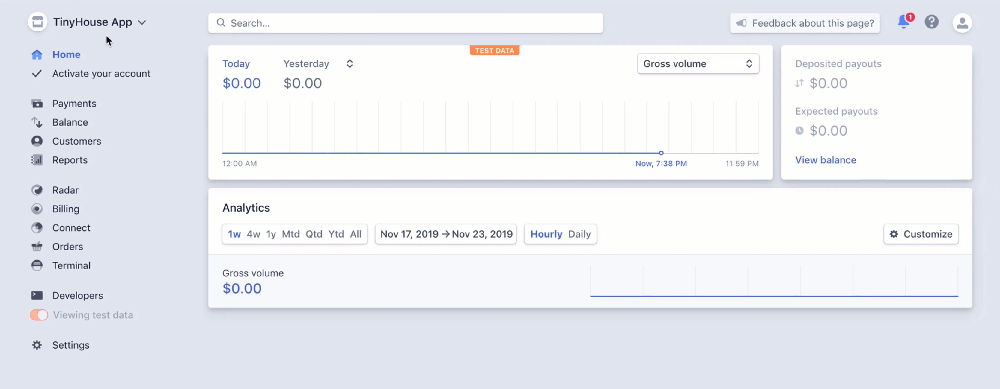
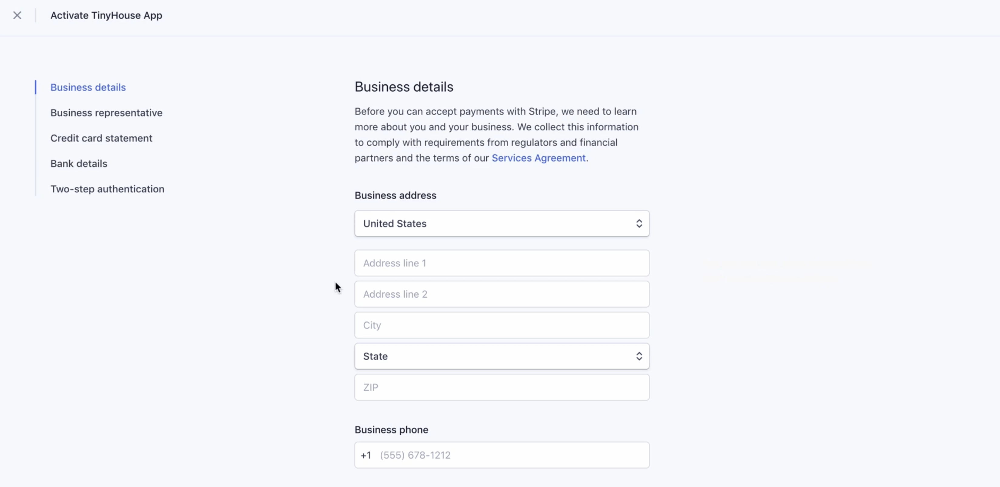
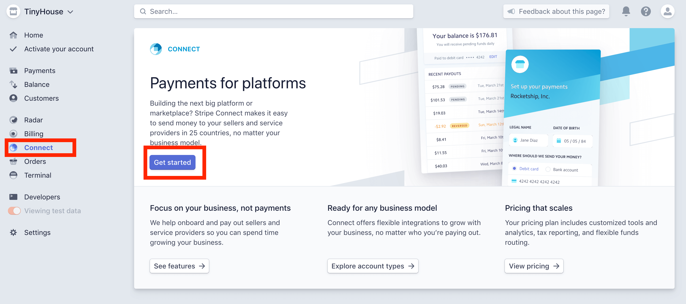
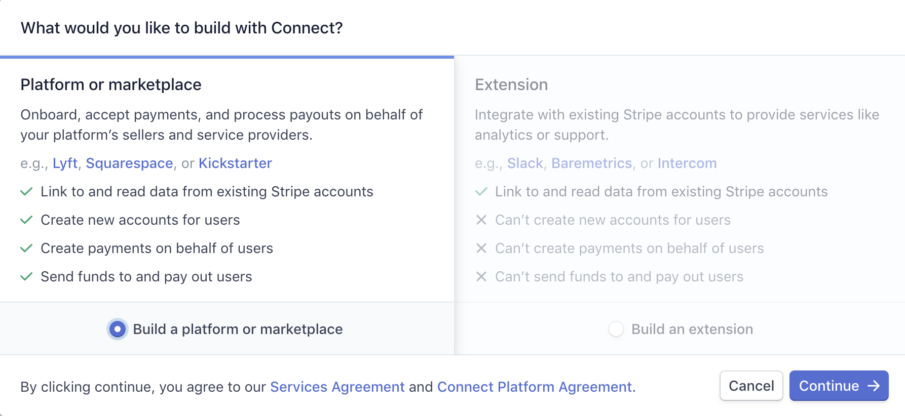
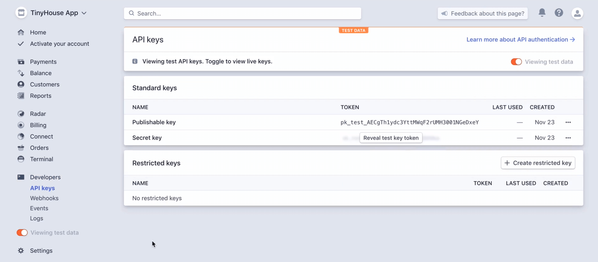
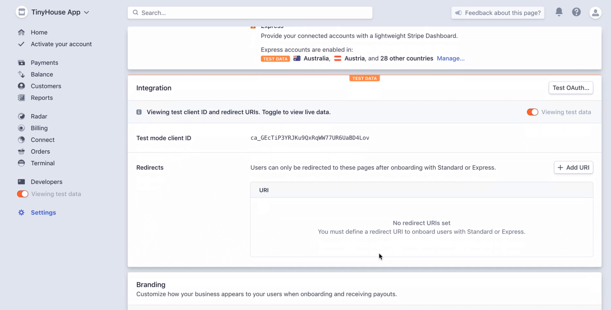
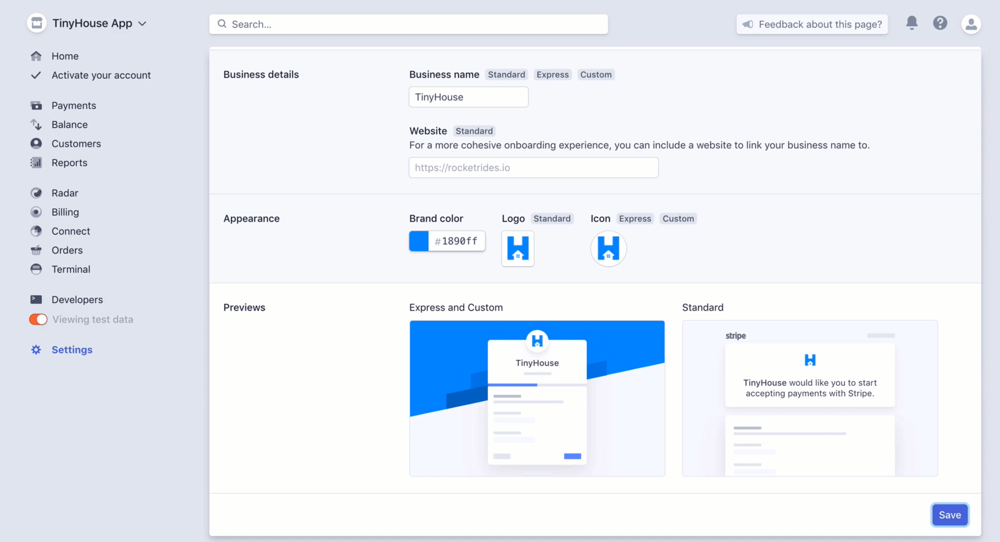

# Stripe Connect OAuth

> 📝 A sample of the `.env` file in our server project, after this lesson is complete, can be found - [here](https://gist.github.com/djirdehh/1d7ca34ce9ff96ab011d388fa76ab9bf). 
> 📝 A sample of the `.env` file in our client project, after this lesson is complete, can be found - [here](https://gist.github.com/djirdehh/66795b1ab0b35ef7bf179776d2f323b7). 
> 📝 Branding details used in our Stripe Connect account settings can be found - [here](https://gist.github.com/djirdehh/fe8f0e057dd556e62fd20f7af875a3b9).

When a user in our application plans to host a listing, we'll need to ensure **they've connected to their own Stripe account through our Stripe platform account**. This is to leverage Stripe Connect's capability to pay the users who have listings in our app when a booking is made. Stripe enables this connection with OAuth 2.0.

Any application that uses OAuth to access Stripe's APIs must have credentials that identify that particular application to Stripe's server. With that said, in this lesson we'll set up the credentials we'll need from Stripe and save them as environment variables for both our server and client projects.

### Stripe Account

Before you can proceed, the first thing you'll need to do is have an account with Stripe. This account is to represent the Stripe account of the TinyHouse application. You'll be able to create an account at <https://dashboard.stripe.com/register>, fill out the required information, and click **Create your Stripe Account**. If you get prompted to fill out more information about your organization or business after you've signed up, feel free to click the **SKIP FOR NOW** option that will be available to you.

After your sign-up is successful, you'll most likely get an email confirmation sent out to you. To confirm and complete your account creation, do find the email from Stripe and click the confirmation link.

When we've logged-in successfully to our new account, we'll land in the dashboard of our Stripe account. In the top left corner, we'll see our Account Name be shown to us. If a name doesn't exist yet, we may see `"Unnamed account"` as the existing name with a prompt stating that we can add a name. Feel free to add a name that you see fit for your Stripe account. We've named our Stripe account `"TinyHouse App"`.

### Viewing test data

In the bottom left corner, we'll notice a tab labeled `Viewing test data` that may be turned on automatically. By having this turned on, Stripe will provide all the payment information and analytics of your account within **a test environment**. If you attempt to toggle it to off (i.e. _not_ view test data), we may be prompted to activate our account to access live data.

Stripe requires us to activate our account by filling out all necessary business information. If we are to create an application/platform that accepts any money, it must be an established business. Stripe needs to know any information about our business it deems important as well as details of an actual business bank account to accept money from our Stripe dashboard.

The good news is we don't actually have to have an established business yet, or a business bank account, or fill out any of this information if we are to stay within the test environment of our Stripe account. This is true for testing with Stripe Connect as well! However, before you go live with Stripe and accept real money, you would have to activate your account and provide the necessary information.

### Stripe Connect

On the left-hand panel of our dashboard, there exist tabs that allow us to use the different Stripe utility tools - like Radar, Connect, Billing, etc.

We're interested in Stripe **Connect**, so we'll click Connect and follow up by clicking the **Get Started** button available to us.

It gives us two options with how we'd like to build with Connect. Either, we're interested in:

-   Using Stripe Connect for a Marketplace or Platform like Lyft, Squarespace, or Kickstarter.
-   Or, we can use Stripe Connect within the context of an extension.

We're interested in having our users in our platform connect with new Stripe accounts, create payments on behalf of users, and send funds to and payout users. As a result, we're interested in the Platform/Marketplace option so we'll pick that and proceed.

With Stripe Connect enabled, it gives us prompts on how we can learn more about Connect, activate our Connect tool, complete our platform profile, and create our first live connected account.

#### Publishable & Secret keys

First, we'll head to the **Developers** section in the left-hand panel and select **API Keys** to collect the necessary API Keys for our server and client projects.

The keys shown in the image above refer to the API keys for our test environment since we have test data enabled. We're presented with two keys - the **Publishable key** and **Secret key**.

-   The **Publishable key** is meant to identify our application account with Stripe and isn't intended to be secret. The Publishable key has the power to create tokens for credit card payments and will be **used in our client React project**.
-   The **Secret key** can perform API requests to our Stripe account without restriction and therefore should be secret and **kept within our server project**.

First and foremost, we'll copy the stripe Publishable key, head over to our React client project and create a `.env` file in the root directory of our React project (i.e. `client/.env`). We'll then create an environment variable called `REACT_APP_S_PUBLISHABLE_KEY` and provide the value we've copied over.

    REACT_APP_S_PUBLISHABLE_KEY=pk_test_************************

Next, we'll copy over our account's Secret key, head over to our server project, and create an environment variable called `S_SECRET_KEY` and provide the value we've copied over.

    S_SECRET_KEY=sk_test_************************

> **Note**: The environment variables we've created here refer to our **test environment** (hence the "`_test_`" keyword in each string value. These test credentials are for development purposes to test with fake payment information. Live credentials will be used only when real payments are ready to be made in our app.

#### Stripe Connect Client ID & Redirect URL

We'll now need to set up a redirect URL for our Stripe Connect account. Our Stripe OAuth redirect URL is the URL our users will be redirected to after they've connected through our Stripe Connect account.

To be able to specify this, we can head over to the settings page, and from there, head over to **Connect Settings**.

This is where we can see our Stripe Connect `client ID` and where we can set our redirect URL. The client ID will be used to construct the URL target where the user can navigate to and then be prompted to log in with their stripe information. It isn't necessarily a secret but we'll need this in our React client project, so we'll copy it over, head over to the `.env` file in our React project, and create a new environment variable labeled `REACT_APP_S_CLIENT_ID` with the value we've just copied.

    REACT_APP_S_CLIENT_ID=ca_******************

When a user successfully logs-in with their Stripe account, we'll want to redirect them somewhere where Stripe will return a `code` in the URL that we'll capture and use to authenticate the fact that the user has logged in with Stripe. Just like how we have a `/login` route in our app for when a user logs in with Google OAuth, we'll have a `/stripe` route in our app dedicated to receiving the `code` returned from Stripe OAuth.

For our local development environment, we'll specify the redirect URL as `http://localhost:3000/stripe`.

#### Stripe Connect Branding

Though this isn't very important, we can provide branding information for how our business will appear to users when they're onboarding or receiving payouts.

We'll specify a Business Name of `TinyHouse`, a brand color that matches the brand of our app (`#1890ff`), and a logo and appropriate icon. Find details of the branding we've used [here](https://gist.github.com/djirdehh/fe8f0e057dd556e62fd20f7af875a3b9).

With the relevant Stripe credentials prepared and stored as environment variables in our app, we'll begin building the GraphQL fields we'll need in our API in the next lesson.
