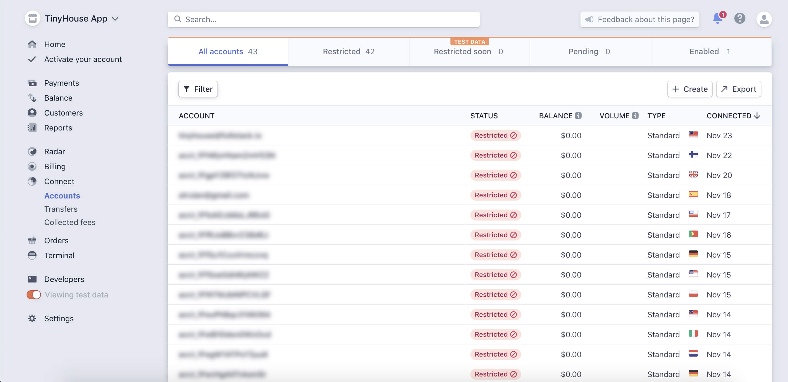
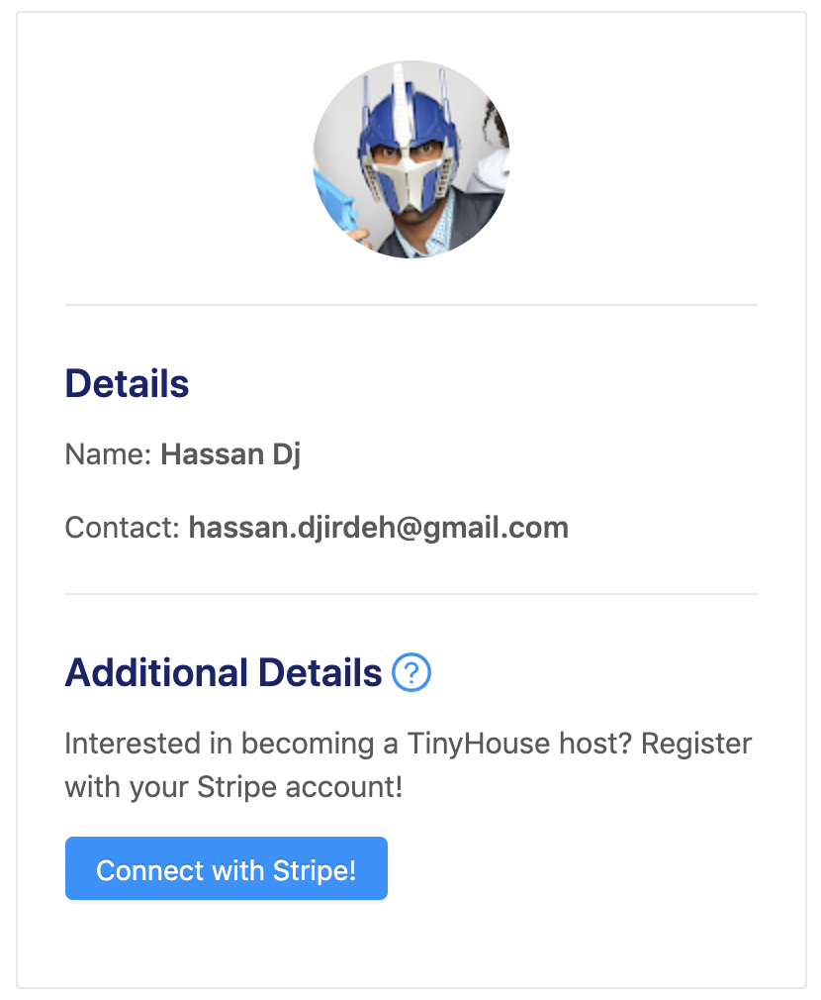
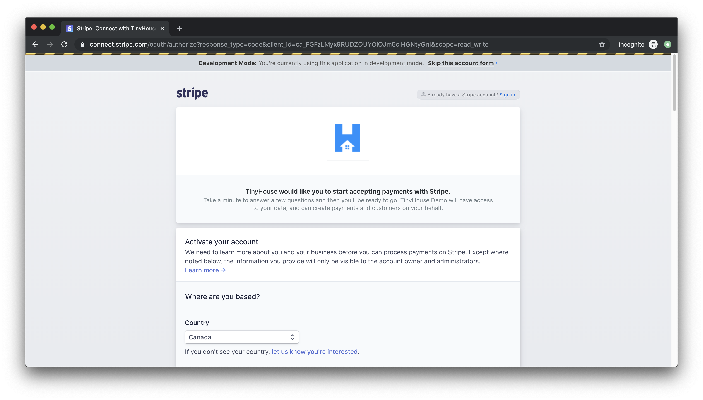
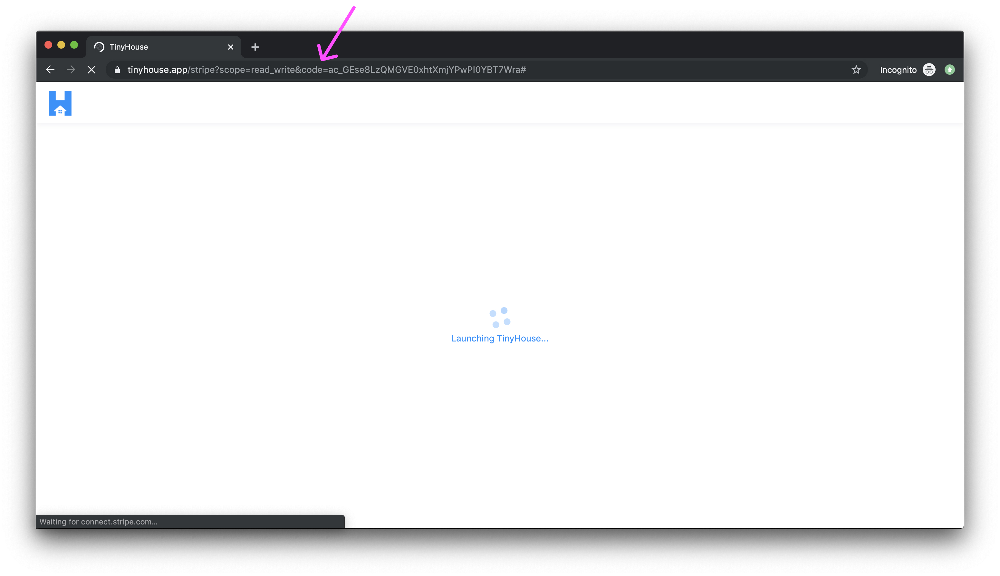
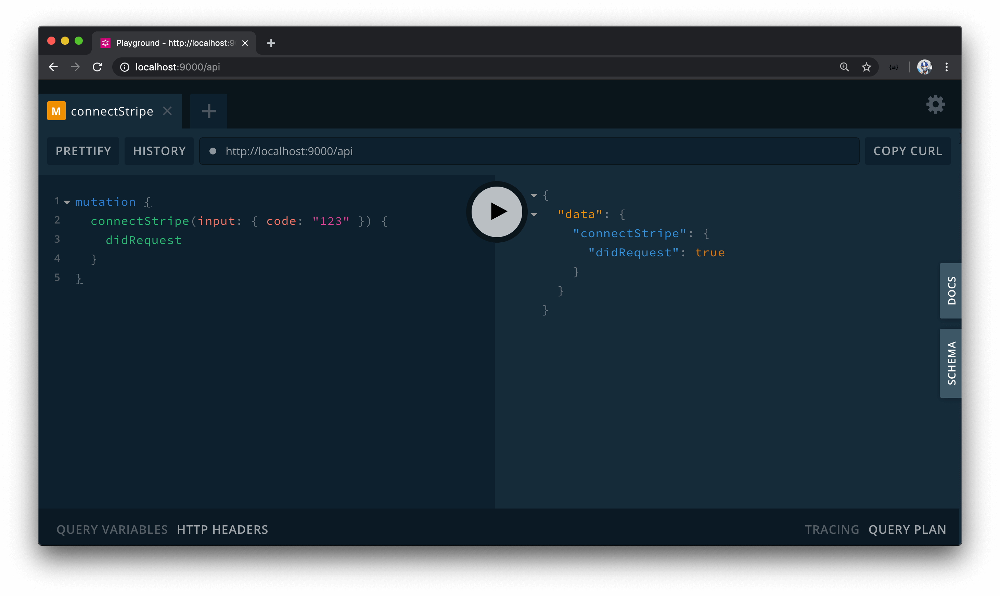
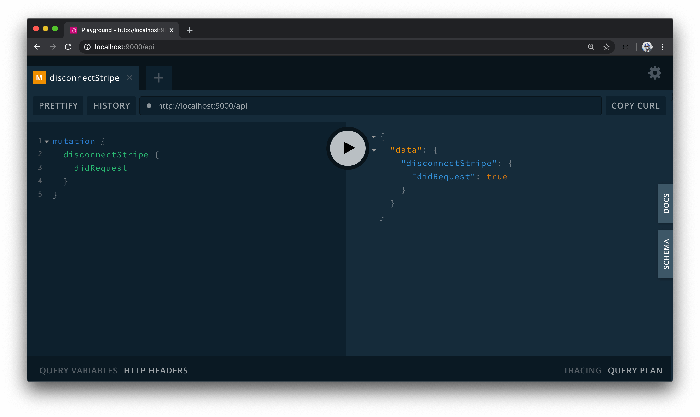

# Stripe Connect GraphQL Fields

> 📝 Stripe documentation on **Using Connect with Standard accounts** can be seen - [here](https://stripe.com/docs/connect/standard-accounts).<br />
> 📖 This lesson's lecture slides can be found - [here](./protected/lecture-slides.pdf).

Let's brainstorm the GraphQL fields we'll need to integrate Stripe Connect into our app. As we've mentioned in the previous lesson, Stripe uses the industry-standard OAuth 2.0 protocol for authorization. At this point, we're not looking to see how payments can be made from tenants to hosts when a booking is made but instead provide the capability for users to connect through our Stripe Platform and be a connected account on our platform. Why do we want this? By having users connected on to our Stripe Platform account - when a payment is made to them - we can be the middleman and ensure the payment is routed to their Stripe account while we take our platform fee.

### Gameplan

Here's an overview of what it would look like when users have connected to our Stripe Connect account, `TinyHouse App`.



At this stage, these users would have a standard Stripe account, be able to log in to their own dashboard and be able to process charges of their own. In short, we want to have users who've logged in to our TinyHouse application be able to connect to their Stripe account and **be a connected account on our Stripe Connect platform**.

The authentication flow for having a user connect to their Stripe account is going to be very similar to the OAuth 2.0 implementation for when a user logs in with their Google Account.

On the client application, we'll have a call to action for the user who's already signed in to our application to connect their Stripe account.



When the user clicks the action to connect, they'll be redirected to Stripe's login page to log in with their Stripe account. This page notifies the user about the Stripe Connect account they're connecting with and this is determined by the Client ID value that is part of the URL. At this moment, for a real live application, the user will need to sign in with their already existing Stripe account or create and activate a new account in the form presented to them. If our Stripe connected account is in test mode, Stripe will give users the capability to skip this account form which will be useful for us during testing.



Once the user is successfully logged in, they'll be redirected to the redirect URL we've specified for our connected account client. We've said in the previous lesson, we'll want users to be redirected to the `/stripe` route of our app. In development, we've set the route as `localhost:3000/stripe` but in production, we'll reference our production app's domain name (e.g. `tinyhouse.app/stripe`). Either way, Stripe returns an authorization code as a query parameter in the URL.



When redirected, our client app receives the authorization code and sends it to our server. Our server uses this authorization code to make another request with Stripe to receive the connected user's account Stripe information. Many different fields are to be returned but we'll be interested in keeping and storing the user's connected **`stripe_user_id`** value. This `stripe_user_id` value will be used later on to act on **behalf of the user**. If someone books this connected user's listing, we'll create a stripe charge and then say we would want the account with this user's `id` to be paid out. On our database, we're going to store this `stripe_user_id` as the `walletId` field of a user document.


In this module, we're not going to concern ourselves with how the actual payments or charges are going to be made. We'll spend our focus on having users in our app connect through Stripe with our connected TinyHouse account, from where we can receive the user's Stripe user ID.

### `connectStripe`, `disconnectStripe`

In this lesson, we're going to create two new GraphQL mutations to help with authenticating users with Stripe OAuth - `connectStripe` and `disconnectStripe`.

The `connectStripe` mutation will take a `code` input that is to be provided by Stripe and make another request to Stripe using the `code` to get the user's "wallet" information. The `disconnectStripe` mutation will allow a user the ability to disconnect their Stripe "wallet" from our platform (or in other words, to remove their Stripe credentials kept in the database).

> **Note:** With Stripe, we'll be able to create the URL on the client to take the user to the consent form to log in so we won't need to have a query or mutation for this.

`connectStripe` and `disconnectStripe` are the two GraphQL root-level mutations we'll need to handle Stripe OAuth. Let's prepare our GraphQL API type definitions and resolvers with these new fields. We'll first head over to the `src/graphql/typeDefs.ts` file in our server project. Similar to how our `logIn` and `logOut` mutations when resolved return a `Viewer` object, we'll look to have the `connectStripe` and `disconnectStripe` mutations return a `Viewer` object when resolved successfully as well.

```ts
export const typeDefs = gql`
  # ...
  # ...

  type Mutation {
    logIn(input: LogInInput): Viewer!
    logOut: Viewer!
    connectStripe: Viewer!
    disconnectStripe: Viewer!
  }
`;
```

> **Note:** If we recall, `viewer` refers to the object of the user viewing our application.

Similar to how our `logIn` mutation expects an `input` object argument object that is to contain a `code` field of type string, we'll have our `connectStripe` mutation also expect to have an input be passed in which is to contain a `code` of type string.

```ts
  type Mutation {
    logIn(input: LogInInput): Viewer!
    logOut: Viewer!
    connectStripe(input: ConnectStripeInput!): Viewer!
    disconnectStripe: Viewer!
  }
```

We'll call the input object type for the `connectStripe` mutation - `ConnectStripeInput`.

```ts
  input ConnectStripeInput {
    code: String!
  }
```

When we built the `logIn` mutation, we mentioned that the log-in capability can happen in one of two ways - one where the client app provides a `code` and the other where the client provides a `viewer` cookie instead. This is why the `input` argument is an optional argument for the `logIn` mutation. However, for our `connectStripe` mutation, we expect the capability to connect with Stripe to only happen with the presence of a valid authorization code which is why `input` for the `connectStripe` mutation is a required argument.

Next, we'll set up the boilerplate of our resolver functions for the fields we've just created in our schema. Since the capability to connect and disconnect with Stripe falls in the context of a viewer viewing our app, we're to have these resolver functions be created as part of the `viewerResolvers` map in the `src/graphql/resolvers/Viewer/index.ts` file.

For now, we'll have both the `connectStripe` and `disconnectStripe` mutations return `{ didRequest: true }` under the root level `Mutation` object.

```ts
// ...

// ...

export const viewerResolver: IResolvers = {
  Query: {
    // ...
  },
  Mutation: {
    // ...
    connectStripe: (): Viewer => {
      return { didRequest: true };
    },
    disconnectStripe: (): Viewer => {
      return { didRequest: true };
    }
  },
  Viewer: {
    // ...
  }
};
```

If we recall, the `didRequest` field is part of the `Viewer` object that is used to indicate that the viewer has been requested. This was useful within the context of logging in or logging out since we would want to notify the client the viewer object was requested from the server to the client. We'll want to do something similar with our `connectStripe` and `disconnectStripe` mutations since we'll look to manipulate and modify the `viewer` (i.e. the logged in user) in the database. Whether the `connectStripe` or `disconnectStripe` mutations are successful or not, we'll want the client notified that a request was made.

With our server running, if we head over to GraphQL playground at <http://localhost:9000/api>, we can see that each of our new mutation fields can be queried.





In the next lesson, we'll update the resolver functions for the newly created mutations to execute the functionality we would want.
