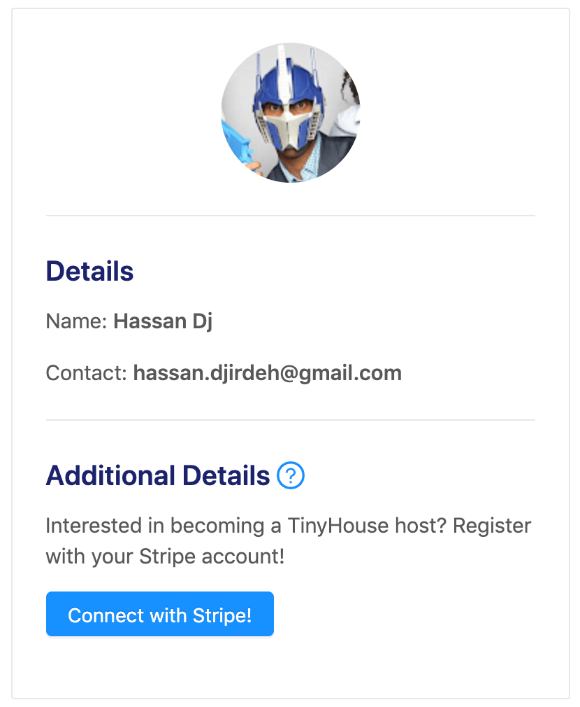
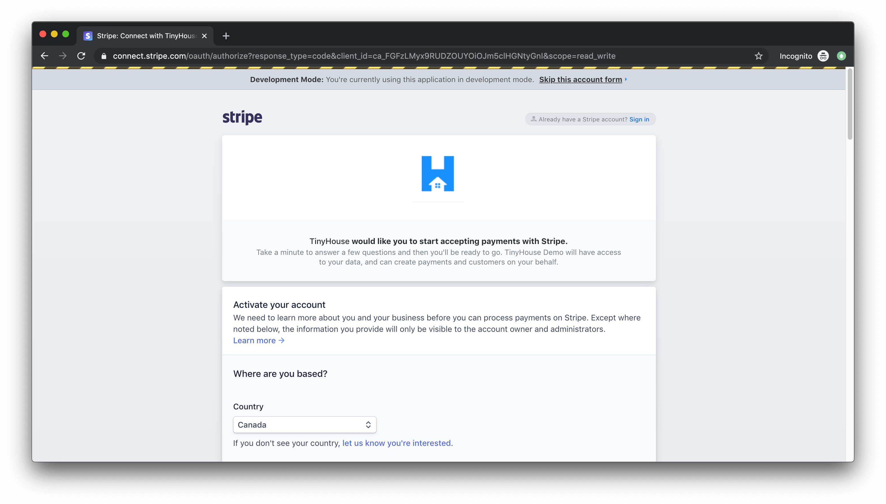
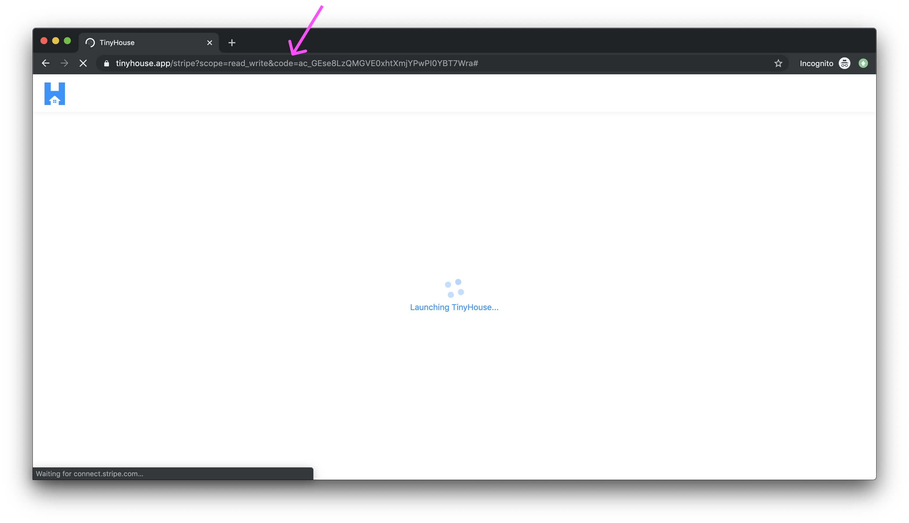
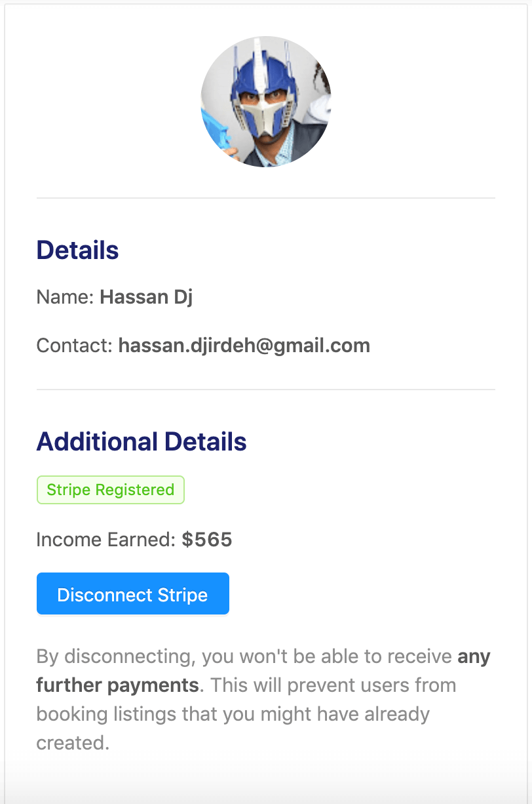
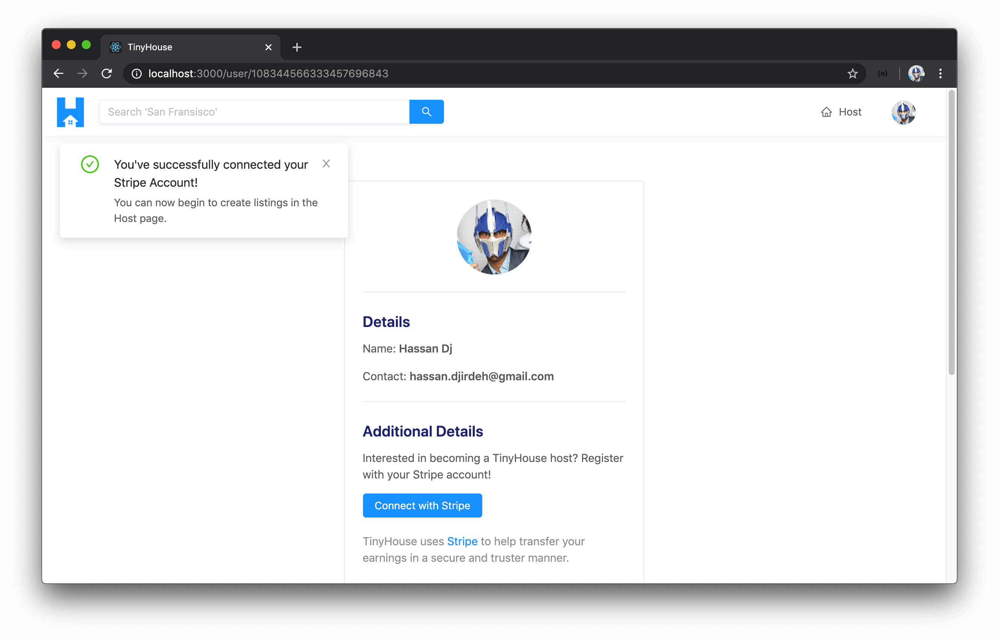
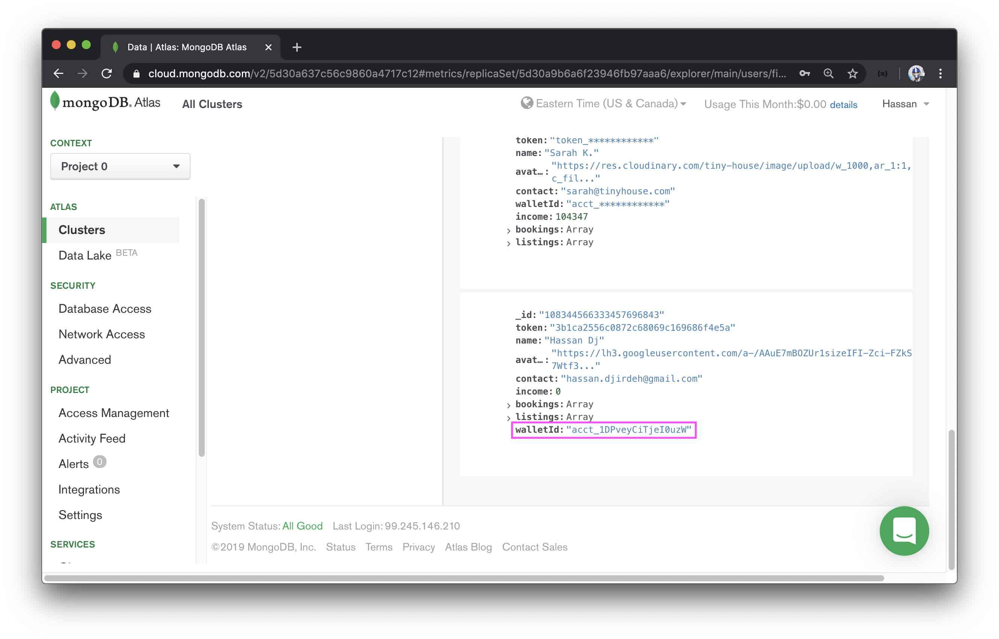
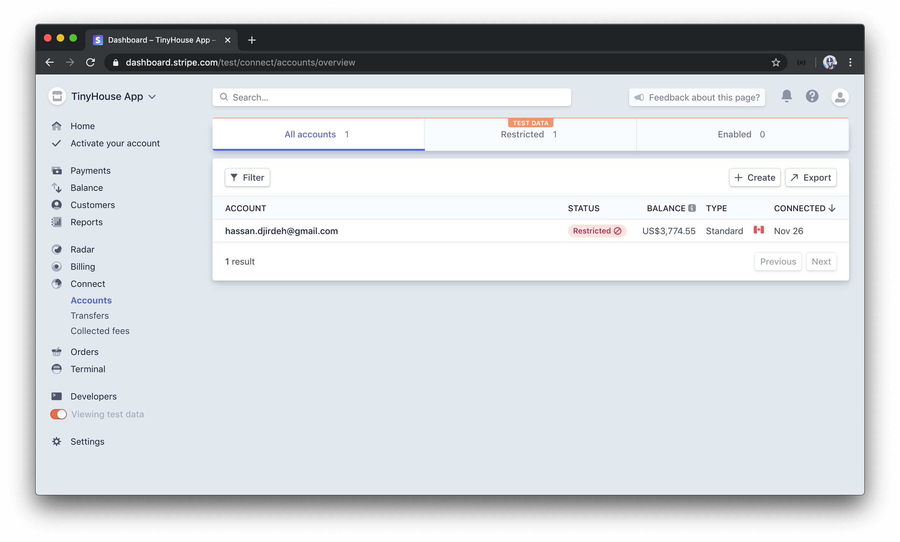

# Connecting with Stripe on the Client

> We're performing [**Step 1: Create the OAuth link**](https://stripe.com/docs/connect/standard-accounts#integrating-oauth), [**Step 2: User creates or connects their account**](https://stripe.com/docs/connect/standard-accounts#connect-users), and [**Step 3: User is redirected back to your site**](https://stripe.com/docs/connect/standard-accounts#redirected) from the steps highlighted in the OAuth connection flow section of using Stripe Connect with Standard accounts.

With the relevant mutations now available in our server to allow the user to connect with Stripe, we'll prepare the client-side functionality to give the user the capability to connect with Stripe through the UI.

Our objective would be to surface a `"Connect with Stripe"` button in the user profile of a logged-in user.



When the user clicks the connect button, they're taken to the Stripe login page to be able to log-in as a connected account on our TinyHouse Stripe account platform.



When the user is to log-in, they'll be redirected to the `/stripe` route of our app where we'll have a component that will receive the `code` query parameter from the URL, run the `connectStripe` mutation, and pass the `code` value as part of the `input` argument of the mutation.



When the `connectStripe` mutation on the server resolves successfully, it means we would have been able to store the `stripe_user_id` for the viewer who's connected with Stripe which would mean we've successfully connected the user to our Stripe platform. We'll then redirect the user to their `/user/:id` page. When a user is successfully connected with Stripe, instead of seeing the `"Connect with Stripe"` button in their user profile, they'll see the income they've made within the app.



`income` is a value of the `user` data object that will be updated when others make bookings and create payments to the host's listings. At this point, there will be a `"Disconnect Stripe"` button that when clicked will disconnect the viewer from Stripe by removing the user's `stripe_user_id` value in the database.

### `connectStripe`

We'll take this step by step. In this lesson, we'll focus on creating and conducting the `connectStripe` mutation. The first thing we'll do is create the GraphQL document for the `connectStripe` mutation in our client project.

We'll head to our `src/lib/graphql/mutations/` folder and create a `ConnectStripe/` folder with an `index.ts` file.

    client/
      src/
        lib/
          graphql/
            mutations/
              // ...
              ConnectStripe/
                index.ts
              // ...
            // ...
        // ...

In the `src/lib/graphql/mutations/index.ts` file, we'll reexport the soon to be created `CONNECT_STRIPE` mutation documents

```ts
export * from "./ConnectStripe";
```

In the `src/lib/graphql/mutations/ConnectStripe/index.ts` file, we'll import the `gql` tag from `apollo-boost`, export a constant labeled `CONNECT_STRIPE`, specify the `ConnectStripe` mutation and declare that it expects an `input` argument of GraphQL type `ConnectStripeInput`. We'll also declare the mutation field and pass the input argument along.

```tsx
import { gql } from "apollo-boost";

export const CONNECT_STRIPE = gql`
  mutation ConnectStripe($input: ConnectStripeInput!) {
    connectStripe(input: $input) {

    }
  }
`;
```

On the server, we've stated that the `connectStripe` mutation is to return all details about the `viewer` such as the viewer's `id`, `avatar`, etc. At this moment, we're only going to be needing the `hasWallet` field that is to be returned. The `hasWallet` field of the `viewer` object is a boolean value that detects the presence of the value for the `walletId` field of the viewer.

```ts
import { gql } from "apollo-boost";

export const CONNECT_STRIPE = gql`
  mutation ConnectStripe($input: ConnectStripeInput!) {
    connectStripe(input: $input) {
      hasWallet
    }
  }
`;
```

With our `connectStripe` GraphQL mutation document prepared, we'll autogenerate the corresponding TypeScript definitions. We'll head over to the terminal and in our client project first run `npm run codegen:schema` to regenerate a `schema.json` file:

    npm run codegen:schema

We'll then run `npm run codegen:generate` to regenerate the TypeScript definitions for our new mutation:

    npm run codegen:generate

### `<UserProfile />` - OAuth Login

In the `<UserProfile />` component, we've already prepared the UI in the user profile section to consist of the `"Connect with Stripe"` button that will allow a logged-in user to connect with Stripe. When the user clicks the connect button, we'll want them to be taken to Stripe's OAuth Login page for our TinyHouse Connect account. In the [Stripe documentation](https://stripe.com/docs/connect/standard-accounts#integrating-oauth), they note that the OAuth link a user can be directed to can be created with <https://connect.stripe.com/oauth/authorize> and appending a few necessary query parameters:

- `response_type` with a value of `code`.
- `client_id` with a value of the connected account's client ID with which we've stored as an environment variable in our React application.
- `scope` with a value of `read_write`.

With that said, in our `<UserProfile />` component file and outside of our component function, we'll construct a constant called `stripeAuthUrl` that will be the OAuth URL we want to create. For the `client_id` query parameter, we'll specify the value of the client environment variable we have in our React project called `REACT_APP_S_CLIENT_ID`.

```tsx
const stripeAuthUrl = `https://connect.stripe.com/oauth/authorize?response_type=code&client_id=${process.env.REACT_APP_S_CLIENT_ID}&scope=read_write`;
```

When the user clicks the connect button in their user profile section, we'll want to direct the user to the OAuth url we've established. To achieve this, in our `"Connect with Stripe"` `<Button />` element we can have an `onClick` handler that will call a method labeled `redirectToStripe()`.

`redirectToStripe()` will be a component method that will use the `window` object and set the `location` target to the value of the `stripeAuthUrl` constant.

```tsx
// ...

export const UserProfile = ({ user, viewerIsUser }: Props) => {

  const redirectToStripe = () => {
    window.location.href = stripeAuthUrl;
  };

  const additionalDetailsSection = viewerIsUser ? (
    <Fragment>
      <Divider />
      <div className="user-profile__details">
        {/* ... */}
        <Button
          type="primary"
          className="user-profile__details-cta"
          onClick={redirectToStripe}
        >
          Connect with Stripe
        </Button>
        {/* ... */}
      </div>
    </Fragment>
  ) : null;

  return (
    // ...
  );
}
```

With our server and client projects running, if we were to click the `"Connect with Stripe"` button in the user profile section, we'll be redirected to the OAuth Login page of our Stripe Connect Platform! We should see the logo and the TinyHouse name we've set up as a business for our connect account page.


For real live payments, the user attempting to be a connected user in our platform needs to activate their account and provide information about themselves and their tenant business (or log-in with an account that has this information prepared) to be able to process payments with Stripe. Since we're building this in development and we're using test credentials, we can click the `"Skip this account form"` action available at the top to help skip this form and pretend that we've activated our account.

When we proceed past the OAuth login page, we'll notice that Stripe returns us to the redirect URL that we've set up, `/stripe` and has the authorization `code` returned to us as part of the URL query parameter.


This is where we need to have functionality that will receive this code and trigger the `connectStripe` mutation and pass this `code` argument along.

We created a `<Login />` component that allowed the user to begin the log-in process however it was also responsible in being the component that received the redirect URL from Google OAuth and consuming the authorization `code` returned from Google's servers. We'll create a `<Stripe />` component that will play a similar role and receive the authorization `code` from Stripe's servers, call the `connectStripe` mutation, and when successful take to the user to their user page.

### `<Stripe />`

We'll first create a `Stripe/` folder that is to have an `index.tsx` file within the `src/sections/` directory.

    client/
      src/
        // ...
        sections/
          // ...
          Stripe/
            index.tsx
          // ...
      // ...

In the `src/sections/index.ts` file, we'll re-export the soon to be created `<Stripe />` component.

```tsx
export * from "./Stripe";
```

In the `<Stripe />` component file, we'll import the majority of things we'll need for this component. We'll import:

- The `React` library.
- The `useEffect` Hook since we'll want to trigger the `connectStripe` mutation upon the components first render.
- The `useMutation` Hook from React Apollo.
- The `<Layout />` and `<Spin />` components from Ant Design that we'll use to help display a loading/spinning indicator when the mutation is in flight.
- The `ConnectStripe` mutation document and it's autogenerated typescript definitions.

We'll also destruct the `<Content />` component from `<Layout />` and we'll export the `Stripe` function component.

```tsx
import React, { useEffect } from "react";
import { useMutation } from "@apollo/react-hooks";
import { Layout, Spin } from "antd";
import { CONNECT_STRIPE } from "../../lib/graphql/mutations";
import {
  ConnectStripe as ConnectStripeData,
  ConnectStripeVariables
} from "../../lib/graphql/mutations/ConnectStripe/__generated__/ConnectStripe";

const { Content } = Layout;

export const Stripe = () => {};
```

Since we're going to need to run the `connectStripe` mutation - we'll declare the `useMutation` Hook at the top of the component function, pass in the autogenerated types for the `connectStripe` mutation, pass in the mutation document, and return the mutation function and the `data`, `loading`, and `error` statuses of the mutation result.

```tsx
// ...

export const Stripe = () => {
  const [connectStripe, { data, loading, error }] = useMutation<
    ConnectStripeData,
    ConnectStripeVariables
  >(CONNECT_STRIPE);
};
```

We'll want to run the `connectStripe()` mutation function when the `<Stripe />` component is to first render. With that said, we'll use the `useEffect` Hook to declare an effect and specify an empty dependencies list since we don't picture running the effect more than once.

```tsx
// ...

export const Stripe = () => {
  const [connectStripe, { data, loading, error }] = useMutation<
    ConnectStripeData,
    ConnectStripeVariables
  >(CONNECT_STRIPE);

  useEffect(() => {}, []);
};
```

We'll want to run the `connectStripe` mutation in the effect callback and we'll want to pass in the `code` retrieved from the query parameter. To access the `code` query parameter, we'll use the [URL](https://developer.mozilla.org/en-US/docs/Web/API/URL/URL) constructor and retrieve the value of the param labeled `code`.

```tsx
// ...

export const Stripe = () => {
  const [connectStripe, { data, loading, error }] = useMutation<
    ConnectStripeData,
    ConnectStripeVariables
  >(CONNECT_STRIPE);

  useEffect(() => {
    const code = new URL(window.location.href).searchParams.get("code");
  }, []);
};
```

With the value of the `code` query parameter available, we'll state that if the value of `code` exists, we'll run the `connectStripe()` mutation function and provide the `input` object variable that is to contain the `code` property.

```tsx
// ...

export const Stripe = () => {
  const [connectStripe, { data, loading, error }] = useMutation<
    ConnectStripeData,
    ConnectStripeVariables
  >(CONNECT_STRIPE);

  useEffect(() => {
    const code = new URL(window.location.href).searchParams.get("code");

    if (code) {
      connectStripe({
        variables: {
          input: { code }
        }
      });
    }
  }, []);
};
```

The `useEffect` Hook will warn us that we should place the `connectStripe()` mutation function as a dependency to the effect since there's a risk for it to change in value. The `connectStripe()` mutation function is being instantiated/created within the `<Stripe />` component. If the `<Stripe />` component goes through another render, we'll get a new copy of this `connectStripe()` function and if we placed it as a dependency; we'll have the effect run again. We wouldn't want this since we want the `connectStripe()` mutation function run only once. To help us achieve this, we'll import the `useRef` Hook from React.

```tsx
import React, { useEffect, useRef } from "react";
```

Right after we desctruct the `connectStripe()` function from the `useMutation` Hook, we'll create a reference object for the `connectStripe()` function so as to have a reference value of the function that won't change in value through the life of the component (unless we specify a change). In our effect callback, we'll then run the mutation function from the `current` property of the newly created reference.

```tsx
// ...

export const Stripe = () => {
  const [connectStripe, { data, loading, error }] = useMutation<
    ConnectStripeData,
    ConnectStripeVariables
  >(CONNECT_STRIPE);
  const connectStripeRef = useRef(connectStripe);

  useEffect(() => {
    const code = new URL(window.location.href).searchParams.get("code");

    if (code) {
      connectStripeRef.current({
        variables: {
          input: { code }
        }
      });
    }
  }, []);
};
```

Before we handle how the `<Stripe />` component should behave when the mutation is successful, we'll look to handle the `loading` and `error` states of the mutation result.

#### `connectStripe()` loading

When the `connectStripe` mutation is `loading`, we'll want to show a loading indicator. In our `<Stripe />` component, we'll check for the `loading` status of the mutation result and when `true`, we'll display the `<Content />` component that is to contain the `<Spin />` component that says "Connecting Your Stripe account...".

```tsx
// ...

export const Stripe = () => {
  const [connectStripe, { data, loading, error }] = useMutation<
    ConnectStripeData,
    ConnectStripeVariables
  >(CONNECT_STRIPE);
  const connectStripeRef = useRef(connectStripe);

  useEffect(() => {
    const code = new URL(window.location.href).searchParams.get("code");

    if (code) {
      connectStripeRef.current({
        variables: {
          input: { code }
        }
      });
    }
  }, []);

  if (loading) {
    return (
      <Content className="stripe">
        <Spin size="large" tip="Connecting your Stripe account..." />
      </Content>
    );
  }
};
```

#### `connectStripe()` error

If our mutation was to error out, we won't want the user to remain in the `/stripe` route but instead will want to take the viewer to their own `/user/:id` page. When the user is directed to the `/user/:id` page after the mutation error, we'll look to display an error banner on the user page to notify the user that something went wrong and they couldn't connect with Stripe. We'll first need the capability to redirect the user away from the `/stripe` page. We'll look to employ the `<Redirect />` component from React Router to help us achieve this so we'll import the `<Redirect />` component from `react-router-dom`.

```tsx
// ...
import { Redirect } from "react-router-dom";
// ...
```

In our component function, we'll say if the mutation `error` result was ever `true`, we'll redirect the viewer to the `/user` page.

```tsx
// ...

export const Stripe = () => {
  const [connectStripe, { data, loading, error }] = useMutation<
    ConnectStripeData,
    ConnectStripeVariables
  >(CONNECT_STRIPE);
  const connectStripeRef = useRef(connectStripe);

  useEffect(() => {
    const code = new URL(window.location.href).searchParams.get("code");

    if (code) {
      connectStripeRef.current({
        variables: {
          input: { code }
        }
      });
    }
  }, []);

  if (loading) {
    return (
      <Content className="stripe">
        <Spin size="large" tip="Connecting your Stripe account..." />
      </Content>
    );
  }

  if (error) {
    return <Redirect to={`/user/`} />;
  }
};
```

If we recall, the `/user/:id` route expects a value for the `id` of the specific user. In the redirect of the mutation error, we want to go to the user page of the viewer viewing the app so we'll need the `id` of this viewer. When we are to have this `<Stripe />` component rendered in the parent `<App />` component, we'll pass the `viewer` state object in the parent `<App />` component down to the `<Stripe />` component as props. With that said, we can state that the `<Stripe/>` component is to expect a `viewer` prop and we'll describe the shape of this `viewer` prop as the `Viewer` interface we have in the `src/lib/types.ts` file.

We'll access the `viewer` prop from the props passed into the component function and in the `<Redirect />` component, we'll state that the `id` URL parameter of the `/user/:id` route is the `id` of the `viewer`.

```tsx
// ...
import { Viewer } from "../../lib/types";

interface Props {
  viewer: Viewer;
}

// ...

export const Stripe = ({ viewer }: Props) => {
  const [connectStripe, { data, loading, error }] = useMutation<
    ConnectStripeData,
    ConnectStripeVariables
  >(CONNECT_STRIPE);
  const connectStripeRef = useRef(connectStripe);

  useEffect(() => {
    const code = new URL(window.location.href).searchParams.get("code");

    if (code) {
      connectStripeRef.current({
        variables: {
          input: { code }
        }
      });
    }
  }, []);

  if (loading) {
    return (
      <Content className="stripe">
        <Spin size="large" tip="Connecting your Stripe account..." />
      </Content>
    );
  }

  if (error) {
    return <Redirect to={`/user/${viewer.id}`} />;
  }
};
```

Though this would work, we don't just want to take the viewer to their user page. We also want to tell them something might have gone wrong. A simple way we can achieve is first appending a query string or query parameter to this redirected route. We can add a `stripe_error=true` query parameter.

```tsx
// ...
import { Viewer } from "../../lib/types";

interface Props {
  viewer: Viewer;
}

// ...

export const Stripe = ({ viewer }: Props) => {
  const [connectStripe, { data, loading, error }] = useMutation<
    ConnectStripeData,
    ConnectStripeVariables
  >(CONNECT_STRIPE);
  const connectStripeRef = useRef(connectStripe);

  useEffect(() => {
    const code = new URL(window.location.href).searchParams.get("code");

    if (code) {
      connectStripeRef.current({
        variables: {
          input: { code }
        }
      });
    }
  }, []);

  if (loading) {
    return (
      <Content className="stripe">
        <Spin size="large" tip="Connecting your Stripe account..." />
      </Content>
    );
  }

  if (error) {
    return <Redirect to={`/user/${viewer.id}?stripe_error=true`} />;
  }
};
```

In the section `<User />` component (i.e. the component rendered in the `/user/:id` route), we can attempt to handle what will occur when the `stripe_error` query parameter ever exists. Somewhere in the `<User />` component function, we can attempt to access the value of the `stripe_error` query parameter with the help of the [URL](https://developer.mozilla.org/en-US/docs/Web/API/URL/URL) constructor.

```tsx
// ...

export const User = ({ viewer, match }: Props & RouteComponentProps<MatchParams>) => {

  // ...

  // ...

  const stripeError = new URL(window.location.href).searchParams.get("stripe_error");

  return (
    // ...
  )
};
```

> [React Router doesn't support a way to access query strings within URL routes](https://github.com/ReactTraining/react-router/issues/4410) which is why we're going with the approach of using the [`URL`](https://developer.mozilla.org/en-US/docs/Web/API/URL/URL) constructor to obtain the of the `stripe_error` query string.

In the `<User />` component, we can now check and see if this `stripeError` constant has a value and if it does, we can create a `stripeErrorBanner` constant element that will be the `<ErrorBanner />` we have imported and is to contain a description that says `"We had an issue connecting with Stripe. Please try again soon"`. In the return statement of the `<User />` component, we'll place the `stripeErrorBanner` constant element near the top.

```tsx
// ...

export const User = ({ viewer, match }: Props & RouteComponentProps<MatchParams>) => {
  // ...

  // ...

  const stripeError = new URL(window.location.href).searchParams.get("stripe_error");
  const stripeErrorBanner = stripeError ? (
    <ErrorBanner description="We had an issue connecting with Stripe. Please try again soon." />
  ) : null;

  return (
    <Content className="user">
      {stripeErrorBanner}
      <Row gutter={12} type="flex" justify="space-between">
        <Col xs={24}>{userProfileElement}</Col>
        <Col xs={24}>
          {userListingsElement}
          {userBookingsElement}
        </Col>
      </Row>
    </Content>
  );
};
```

We'll now go back to our `<Stripe />` component.

#### `connectStripe` success

When `data` from our mutation result exists _and_ the `connectStripe` object from data is present, we'll also want to redirect the viewer to the user page. In the `<Stripe />` component function, we'll place an `if` condition to say if `data` and the `connectStripe` object within `data` is present, take the viewer to their user page but without the `stripe_error` query parameter.

If `data` from the mutation result isn't present, `loading` isn't `true`, and no `error` exists from the mutation we'll have our component just return `null` since this will be unlikely to occur.

```tsx
// ...

export const Stripe = ({ viewer }: Props) => {
  const [connectStripe, { data, loading, error }] = useMutation<
    ConnectStripeData,
    ConnectStripeVariables
  >(CONNECT_STRIPE);
  const connectStripeRef = useRef(connectStripe);

  useEffect(() => {
    const code = new URL(window.location.href).searchParams.get("code");

    if (code) {
      connectStripeRef.current({
        variables: {
          input: { code }
        }
      });
    }
  }, []);

  if (data && data.connectStripe) {
    return <Redirect to={`/user/${viewer.id}`} />;
  }

  if (loading) {
    return (
      <Content className="stripe">
        <Spin size="large" tip="Connecting your Stripe account..." />
      </Content>
    );
  }

  if (error) {
    return <Redirect to={`/user/${viewer.id}?stripe_error=true`} />;
  }

  return null;
};
```

This is primarily how we'll want the `<Stripe />` component to behave except there are a few more other things we'll look to handle.

When the mutation is successful, we'll look to update the `viewer` state object available in the parent `<App />` component to update the viewer object in the client to recognize the `hasWallet` field is `true`. This would be important to do since when we later want to restrict the user from certain actions only until the user has connected with Stripe, we'll need to ensure the `viewer` state object is up to date within our client.

Since we would want to run some functionality when the mutation is successful, we can try and do this within the `onCompleted()` callback function from the `useMutation` Hook. The parameter will be the `data` object returned from the mutation.

If we want to update the `viewer` object in our parent `<App />` component, we'll use the `setViewer()` function available in the parent that will be passed down as props. We'll state that the `<Stripe />` component expects a prop called `setViewer` which is a function that expects a viewer object and returns `void`.

In the `onCompleted()` callback of our mutation, we'll use the `setViewer()` function to update the `hasWallet` field of the `viewer` state object in the parent `<App />` component. Additionally, we'll like to provide the user with a success message that they've connected successfully. We'll import the `displaySuccessNotification()` function from the `src/lib/utils/` folder and run it in the `onCompleted()` callback with a title and description that tells the user they've connected successfully.

```tsx
// ...
import { displaySuccessNotification } from "../../lib/utils";
// ...

interface Props {
  viewer: Viewer;
  setViewer: (viewer: Viewer) => void;
}

export const Stripe = ({ viewer, setViewer }: Props) => {
  const [connectStripe, { data, loading, error }] = useMutation<
    ConnectStripeData,
    ConnectStripeVariables
  >(CONNECT_STRIPE, {
    onCompleted: data => {
      if (data && data.connectStripe) {
        setViewer({ ...viewer, hasWallet: data.connectStripe.hasWallet });
        displaySuccessNotification(
          "You've successfully connected your Stripe Account!",
          "You can now begin to create listings in the Host page."
        );
      }
    }
  });
  const connectStripeRef = useRef(connectStripe);

  useEffect(() => {
    const code = new URL(window.location.href).searchParams.get("code");

    if (code) {
      connectStripeRef.current({
        variables: {
          input: { code }
        }
      });
    }
  }, []);

  if (data && data.connectStripe) {
    return <Redirect to={`/user/${viewer.id}`} />;
  }

  if (loading) {
    return (
      <Content className="stripe">
        <Spin size="large" tip="Connecting your Stripe account..." />
      </Content>
    );
  }

  if (error) {
    return <Redirect to={`/user/${viewer.id}?stripe_error=true`} />;
  }

  return null;
};
```

### Navigating to /stripe without a code

The one last thing we'll handle in the `<Stripe />` component is if the user tries to access the `/stripe` route in the app without the `code` query parameter. This can happen if the user tries to hit the `/stripe` route directly in the URL bar. If this was to occur, nothing will happen and the user will probably just see a blank page. However, we'll look to avoid this from happening since the `<Stripe />` component should only hold the responsibility to receive the authorization code from Stripe and run the `connectStripe` mutation.

We'll handle this by stating that if the user accesses the `/stripe` route and there's no `code` in the query parameters, we'll redirect them to the `/login` page directly. We're using the `/login` page as the redirect since if a viewer is not logged in, we won't be able to take them to their own user page.

We'll want to handle this in the effect callback within the `useEffect` Hook. We shouldn't (and probably can't) use the `<Redirect />` component from React Router in the `useEffect` Hook since the `useEffect` Hook is used to run side effects, not to render JSX.

Since the `<Stripe />` component is to be rendered as a route level component, we'll have access to React Router's `history` object as a prop. We'll attempt to access the `history` object from the props passed in the component and we'll use the `RouteComponentProps` interface from `react-router-dom` to describe its shape.

```tsx
import { Redirect, RouteComponentProps } from "react-router-dom";
```

In the prepared effect callback, we'll check to see if a value for the `code` query parameter doesn't exist. If it doesn't exist, we'll use the `replace()` function from the `history` object to replace the route pathname with `/login`. We'll also add the `history` object as a dependency to the effect. With this change and all the changes made to the `<Stripe />` component, the `src/sections/Stripe/index.tsx` file will appear as the following:

```tsx
import React, { useEffect, useRef } from "react";
import { Redirect, RouteComponentProps } from "react-router-dom";
import { useMutation } from "@apollo/react-hooks";
import { Layout, Spin } from "antd";
import { CONNECT_STRIPE } from "../../lib/graphql/mutations";
import {
  ConnectStripe as ConnectStripeData,
  ConnectStripeVariables
} from "../../lib/graphql/mutations/ConnectStripe/__generated__/ConnectStripe";
import { displaySuccessNotification } from "../../lib/utils";
import { Viewer } from "../../lib/types";

interface Props {
  viewer: Viewer;
  setViewer: (viewer: Viewer) => void;
}

const { Content } = Layout;

export const Stripe = ({ viewer, setViewer, history }: Props & RouteComponentProps) => {
  const [connectStripe, { data, loading, error }] = useMutation<
    ConnectStripeData,
    ConnectStripeVariables
  >(CONNECT_STRIPE, {
    onCompleted: data => {
      if (data && data.connectStripe) {
        setViewer({ ...viewer, hasWallet: data.connectStripe.hasWallet });
        displaySuccessNotification(
          "You've successfully connected your Stripe Account!",
          "You can now begin to create listings in the Host page."
        );
      }
    }
  });
  const connectStripeRef = useRef(connectStripe);

  useEffect(() => {
    const code = new URL(window.location.href).searchParams.get("code");

    if (code) {
      connectStripeRef.current({
        variables: {
          input: { code }
        }
      });
    } else {
      history.replace("/login");
    }
  }, [history]);

  if (data && data.connectStripe) {
    return <Redirect to={`/user/${viewer.id}`} />;
  }

  if (loading) {
    return (
      <Content className="stripe">
        <Spin size="large" tip="Connecting your Stripe account..." />
      </Content>
    );
  }

  if (error) {
    return <Redirect to={`/user/${viewer.id}?stripe_error=true`} />;
  }

  return null;
};
```

In the parent `<App />` component, we'll import the `<Stripe />` component from the adjacent `sections/` folder.

```tsx
import {
  AppHeader,
  Home,
  Host,
  Listing,
  Listings,
  Login,
  NotFound,
  Stripe,
  User
} from "./sections";
```

In the return statement of our `<App />` component, we'll look to have the `<Stripe />` component be returned for the `/stripe` route. We'll use the render props pattern to render the `<Stripe />` component and pass the `viewer` and `setViewer` props it is to expect.

```tsx
<Route
  exact
  path="/stripe"
  render={props => <Stripe {...props} viewer={viewer} setViewer={setViewer} />}
/>
```

That should be it! Let's see how our functionality now works.

By clicking the `"Connect with Stripe button"` in the user profile section, we'll be taken to the OAuth login page where we're supposed to activate (or log-in) with a Stripe account.


When we proceed past the OAuth login page (in development we can skip it), we're taken to the `/stripe` route of our app. When the `connectStripe` mutation is successful, we'll be taken to our `user/:id` page where we get the notification that we've connected successfully!



If we were to take look at the `walletId` value for the user document in our database for the profile we've just connected with Stripe with, we'll see the `walletId` value populated with the `stripe_user_id` value returned from Stripe's servers.



If we were to visit the Stripe dashboard for the TinyHouse App Stripe Connect account, we'll see one connected account in our connect platform!



Amazing work! In the next coming lesson, we'll update the UI for our `<UserProfile />` component to show a user's income when they've connected with Stripe and we'll also prepare the functionality to have the user be able to disconnect from Stripe.
