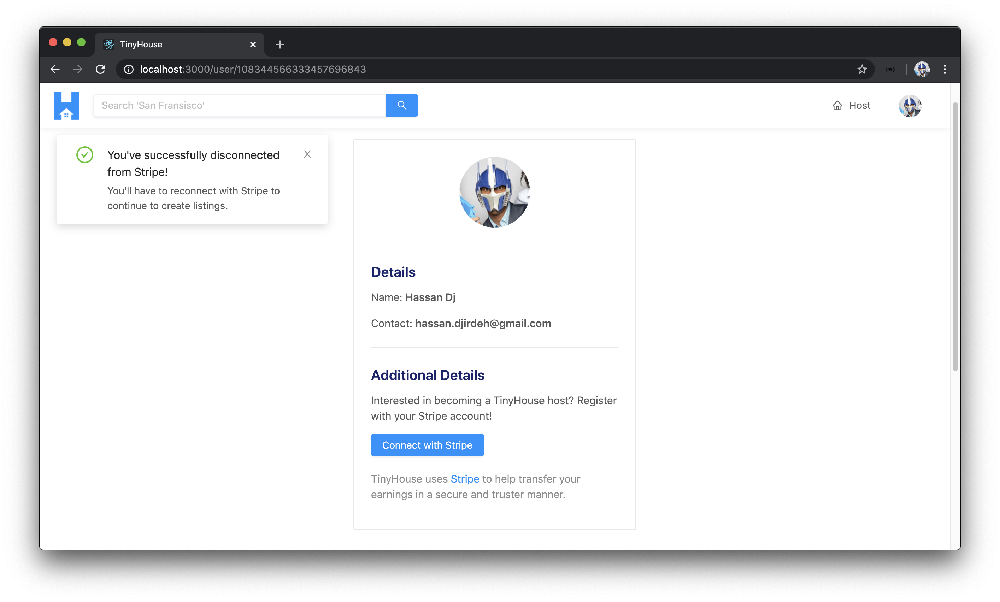

# Disconnecting from Stripe on the Client

We've managed to create the functionality to have a logged-in user in our app connect with Stripe. In this lesson, we'll look to visually indicate that the user is in the connected state and have an action responsible for allowing the user to disconnect from Stripe.

### User connected with Stripe

At this moment, when we query for a `user` object in the `/user/:id` page, we're already querying for the `hasWallet` field within the `User` graphQL object. The `hasWallet` field indicates the presence of a value in the `walletId` of the user in our database. If the `hasWallet` field is truthy, it means we have the `stripe_user_id` of the user.

If we take a look at the `<UserProfile />` component we've prepared, we've specified that the additional details section is only shown when a user is logged in. However, the information that encompasses the button to connect with the Stripe should only be shown when the user hasn't yet connected with Stripe.

We'll take the markup that encompasses the button and description to allow a user to connect with Stripe and place it within a constant element we'll call `additionalDetails`. We'll say if the `hasWallet` field in the `user` object available as props is not true, the `additionalDetails` constant will contain the `"Connect with Stripe"` related markup we've seen before.

We'll also place the `additionalDetails` constant element within the `additionalDetailsSection` constant element.

```tsx
// ...

export const UserProfile = ({ user, viewerIsUser }: Props) => {
  const additionalDetails = user.hasWallet ? (
    <Fragment></Fragment>
  ) : (
    <Fragment>
      <Paragraph>
        Interested in becoming a TinyHouse host? Register with your Stripe account!
      </Paragraph>
      <Button
        type="primary"
        className="user-profile__details-cta"
        onClick={redirectToStripe}
      >
        Connect with Stripe
      </Button>
      <Paragraph type="secondary">
        TinyHouse uses{" "}
        <a
          href="https://stripe.com/en-US/connect"
          target="_blank"
          rel="noopener noreferrer"
        >
          Stripe
        </a>{" "}
        to help transfer your earnings in a secure and truster manner.
      </Paragraph>
    </Fragment>
  );

  const additionalDetailsSection = viewerIsUser ? (
    <Fragment>
      <Divider />
      <div className="user-profile__details">
        <Title level={4}>Additional Details</Title>
        {additionalDetails}
      </div>
    </Fragment>
  ) : null;

  // ...
};
```

We'll now look to prepare the markup in the `additionalDetails` constant for when the user is connected with Stripe (i.e. `user.hasWallet` is `true`). We'll first import one other component from Ant Design that we'll use - the [`<Tag />`](https://ant.design/components/tag/) component.

```tsx
import { Avatar, Button, Card, Divider, Tag, Typography } from "antd";
```

We'll also import the utility function `formatListingPrice()` that is used to format price number values in our client app. We'll import the `formatListingPrice()` function from the `src/lib/utils/` folder.

```tsx
import { formatListingPrice } from "../../../../lib/utils";
```

In the `additionalDetails` constant element within the `<UserProfile />` component, when the user `hasWallet` field is `true`, the markup we'll prepare will have:

-   A green `<Tag />` that says `"Stripe Registered"`.
-   A `<Paragraph />` to display the income of the user with which we'll be able to access from the `user.income` field. If the `income` value within `user` exists, we'll use the `formatListingPrice()` function to format the income. Otherwise we'll simply show `$0`.
-   A `<Button />` to allow the user to disconnect from Stripe.
-   A secondary `<Paragraph />` that will tell the user that if they were to disconnect from Stripe, this will prevent other users from booking listings that they might have already created.

```tsx
// ...

export const UserProfile = ({ user, viewerIsUser }: Props) => {
  const additionalDetails = user.hasWallet ? (
    <Fragment>
      <Paragraph>
        <Tag color="green">Stripe Registered</Tag>
      </Paragraph>
      <Paragraph>
        Income Earned:{" "}
        <Text strong>{user.income ? formatListingPrice(user.income) : `$0`}</Text>
      </Paragraph>
      <Button type="primary" className="user-profile__details-cta">
        Disconnect Stripe
      </Button>
      <Paragraph type="secondary">
        By disconnecting, you won't be able to receive{" "}
        <Text strong>any further payments</Text>. This will prevent users from booking
        listings that you might have already created.
      </Paragraph>
    </Fragment>
  ) : (
    <Fragment>
      <Paragraph>
        Interested in becoming a TinyHouse host? Register with your Stripe account!
      </Paragraph>
      <Button
        type="primary"
        className="user-profile__details-cta"
        onClick={redirectToStripe}
      >
        Connect with Stripe
      </Button>
      <Paragraph type="secondary">
        TinyHouse uses{" "}
        <a
          href="https://stripe.com/en-US/connect"
          target="_blank"
          rel="noopener noreferrer"
        >
          Stripe
        </a>{" "}
        to help transfer your earnings in a secure and truster manner.
      </Paragraph>
    </Fragment>
  );

  const additionalDetailsSection = viewerIsUser ? (
    <Fragment>
      <Divider />
      <div className="user-profile__details">
        <Title level={4}>Additional Details</Title>
        {additionalDetails}
      </div>
    </Fragment>
  ) : null;

  // ...
};
```

If we take a look at our user page now and if we're connected with Stripe, we'll see the new section be shown in the user profile section.


### `disconnectStripe`

We'll now focus on providing the capability for a user to disconnect from Stripe when connected. We have the `disconnectStripe` mutation set up on the server so we'll first create the mutation document in our client.

We'll head to our `src/lib/graphql/mutations/` folder and create a `DisconnectStripe/` folder that is to have an `index.ts` file.

    client/
      src/
        lib/
          graphql/
            mutations/
              // ...
              DisconnectStripe/
                index.ts
              // ...
            // ...
        // ...

The `disconnectStripe` mutation takes no arguments and we'll want the `hasWallet` field from the viewer object to be returned.

```tsx
import { gql } from "apollo-boost";

export const DISCONNECT_STRIPE = gql`
  mutation DisconnectStripe {
    disconnectStripe {
      hasWallet
    }
  }
`;
```

In the `src/lib/graphql/mutations/index.ts` file, we'll re-export the `DISCONNECT_STRIPE` mutation document.

```ts
export * from "./DisconnectStripe";
```

We'll run the `codegen:generate` command to autogenerate the TypeScript definitions.

    npm run codegen:generate

We'll have the `disconnectStripe` mutation be used in the `<UserProfile />` component. In the `<UserProfile/>` component file, we'll import the `useMutation` Hook, the `DISCONNECT_STRIPE` mutation document, and the relevant TypeScript definitions for the `disconnectStripe` mutation. There are no variables for this mutation so we'll only import the data interface.

```tsx
import { useMutation } from "@apollo/react-hooks";
// ...
import { DISCONNECT_STRIPE } from "../../../../lib/graphql/mutations/";
import { DisconnectStripe as DisconnectStripeData } from "../../../../lib/graphql/mutations/DisconnectStripe/__generated__/DisconnectStripe";
import { User as UserData } from "../../../../lib/graphql/queries/User/__generated__/User";
// ...
```

At the beginning of our `<UserProfile />` component function, we'll use the `useMutation` Hook, pass along the appropriate type definitions, and destruct the `disconnectStripe` mutation function. The only result field we'll use will be the `loading` state of our mutation.

```tsx
// ...

export const UserProfile = ({ user, viewerIsUser }: Props) => {
  const [disconnectStripe, { loading }] = useMutation<DisconnectStripeData>(
    DISCONNECT_STRIPE
  );

  // ...
};
```

To handle the success and error states of the mutation, we'll look to either display a success notification or an error message. Since we're not going to render anything for these conditions, we'll simply handle these conditions with the `onCompleted()` and `onError()` callback functions as part of the mutation results.

We'll import the `displaySuccessNotification` and the `displayErrorMessage` functions from the `src/lib/utils` folder.

```tsx
import {
  formatListingPrice,
  displaySuccessNotification,
  displayErrorMessage
} from "../../../../lib/utils";
```

In the `onCompleted()` callback function of our `disconnectStripe` mutation, we'll check for the `data` object and if the `disconnectStripe` object within `data` exists. If `data` and `data.disconnectStripe` is present, we'll simply run the `displaySuccessNotification()` function with a message that says `"You've successfully disconnected from Stripe!"` and a description that says `"You'll have to reconnect with Stripe to continue to create listings"`.

```tsx
// ...

export const UserProfile = ({ user, viewerIsUser }: Props) => {
  const [disconnectStripe, { loading }] = useMutation<DisconnectStripeData>(
    DISCONNECT_STRIPE,
    {
      onCompleted: data => {
        if (data && data.disconnectStripe) {
          displaySuccessNotification(
            "You've successfully disconnected from Stripe!",
            "You'll have to reconnect with Stripe to continue to create listings."
          );
        }
      }
    }
  );

  // ...
};
```

In the `onError()` callback of the mutation, we'll use the `displayErrorMessage()` utility function to display an error message that says `"Sorry! We weren't able to disconnect you from Stripe. Please try again later!"`.

```tsx
// ...

export const UserProfile = ({ user, viewerIsUser }: Props) => {
  const [disconnectStripe, { loading }] = useMutation<DisconnectStripeData>(
    DISCONNECT_STRIPE,
    {
      onCompleted: data => {
        if (data && data.disconnectStripe) {
          displaySuccessNotification(
            "You've successfully disconnected from Stripe!",
            "You'll have to reconnect with Stripe to continue to create listings."
          );
        }
      },
      onError: () => {
        displayErrorMessage(
          "Sorry! We weren't able to disconnect you from Stripe. Please try again later!"
        );
      }
    }
  );

  // ...
};
```

When the `disconnectStripe` mutation is successful, we'll want to ensure the `viewer` state object available in our client is updated. With that said, we'll state that the `<UserProfile />` component is to expect the `viewer` object and `setViewer()` function as props. The type of the `viewer` prop object will be the `Viewer` interface we'll import from the `src/lib/types.ts` file.

```tsx
import { Viewer } from "../../../../lib/types";

interface Props {
  user: UserData["user"];
  viewer: Viewer;
  viewerIsUser: boolean;
  setViewer: (viewer: Viewer) => void;
}
```

In our mutation `onCompleted` callback, we'll use the `setViewer()` function and the `viewer` object to update the `hasWallet` property of the `viewer` object in our client.

```tsx
// ...

export const UserProfile = ({ user, viewer, viewerIsUser, setViewer }: Props) => {
  const [disconnectStripe, { loading }] = useMutation<DisconnectStripeData>(
    DISCONNECT_STRIPE,
    {
      onCompleted: data => {
        if (data && data.disconnectStripe) {
          setViewer({ ...viewer, hasWallet: data.disconnectStripe.hasWallet });
          displaySuccessNotification(
            "You've successfully disconnected from Stripe!",
            "You'll have to reconnect with Stripe to continue to create listings."
          );
        }
      },
      onError: () => {
        displayErrorMessage(
          "Sorry! We weren't able to disconnect you from Stripe. Please try again later!"
        );
      }
    }
  );

  // ...
};
```

Let's make sure the `viewer` and `setViewer` props are to be passed down to this `<UserProfile />` component. In the uppermost parent `<App />` component, we'll pass down `viewer` and `setViewer` as props to the `<User />` component.

```tsx
          <Route
            exact
            path="/user/:id"
            render={props => <User {...props} viewer={viewer} setViewer={setViewer} />}
          />
```

In the `<User />` component page, we'll declare the `setViewer` prop and we'll pass the `viewer` and `setViewer` props further down to the `<UserProfile/>` component.

```tsx
interface Props {
  viewer: Viewer;
  setViewer: (viewer: Viewer) => void;
}

export const User = ({
  viewer,
  setViewer,
  match
}: Props & RouteComponentProps<MatchParams>) => {
  // ...

  const userProfileElement = user ? (
    <UserProfile
      user={user}
      viewer={viewer}
      viewerIsUser={viewerIsUser}
      setViewer={setViewer}
    />
  ) : null;

  // ...
};
```

In the `<UserProfile />` component, we'll look to use the `disconnectStripe()` mutation function and the `loading` state from our mutation result. We'll place the `loading` status of the mutation as the value of the `loading` prop in our `"Disconnect Stripe"` button. The `onClick` handler of the `"Disconnect Stripe"` button will trigger a callback that calls the `disconnectStripe()` mutation function.

```tsx
// ...

export const UserProfile = ({ user, viewerIsUser }: Props) => {
  const additionalDetails = user.hasWallet ? (
    <Fragment>
      {/* ... */}
      <Button
        type="primary"
        className="user-profile__details-cta"
        loading={loading}
        onClick={() => disconnectStripe()}
      >
        Disconnect Stripe
      </Button>
      {/* ... */}
    </Fragment>
  ) : (
    <Fragment>{/* ... */}</Fragment>
  );

  // ...
};
```

### Refetch user data after disconnecting from Stripe

There's one last thing we'll look to handle. When the `disconnectStripe` mutation is successful, we'll want the UI of the user profile section to update and show the markup that's associated with a user that's not connected with Stripe any longer. Since the markup in the user profile section is dependant on the `hasWallet` field of the `user` object - we'll need to **refetch** the `user` query in the parent `<User />` component to ensure the information in the user profile section is up to date.

In the parent `<User />` component, we'll destruct the `refetch` property from the `useQuery` Hook.

```tsx
  const { data, loading, error, refetch } = useQuery<UserData, UserVariables>(USER, {
    variables: {
      id: match.params.id,
      bookingsPage,
      listingsPage,
      limit: PAGE_LIMIT
    }
  });
```

We'll then set-up an `async` function in the `<User />` component called `handleUserRefetch()` that will simply trigger the refetch function.

```tsx
  const handleUserRefetch = async () => {
    await refetch();
  };
```

We'll then ensure the `handleUserRefetch()` function is passed down as a prop to the `<UserProfile />` component.

```tsx
  const userProfileElement = user ? (
    <UserProfile
      user={user}
      viewer={viewer}
      viewerIsUser={viewerIsUser}
      setViewer={setViewer}
      handleUserRefetch={handleUserRefetch}
    />
  ) : null;
```

In our `<UserProfile />` component, we'll state that the `handleUserRefetch` function is expected as a prop and in the `onCompleted` callback of the `disconnectStripe` mutation, we'll trigger the `handleUserRefetch()` function. With this change and all the changes we've made to the `<UserProfile />` component, the `src/sections/User/UserProfile/index.tsx` file will look like the following:

```tsx
import React, { Fragment } from "react";
import { useMutation } from "@apollo/react-hooks";
import { Avatar, Button, Card, Divider, Tag, Typography } from "antd";
import {
  formatListingPrice,
  displaySuccessNotification,
  displayErrorMessage
} from "../../../../lib/utils";
import { DISCONNECT_STRIPE } from "../../../../lib/graphql/mutations";
import { DisconnectStripe as DisconnectStripeData } from "../../../../lib/graphql/mutations/DisconnectStripe/__generated__/DisconnectStripe";
import { User as UserData } from "../../../../lib/graphql/queries/User/__generated__/User";
import { Viewer } from "../../../../lib/types";

interface Props {
  user: UserData["user"];
  viewer: Viewer;
  viewerIsUser: boolean;
  setViewer: (viewer: Viewer) => void;
  handleUserRefetch: () => void;
}

const stripeAuthUrl = `https://connect.stripe.com/oauth/authorize?response_type=code&client_id=${process.env.REACT_APP_S_CLIENT_ID}&scope=read_write`;
const { Paragraph, Text, Title } = Typography;

export const UserProfile = ({
  user,
  viewer,
  viewerIsUser,
  setViewer,
  handleUserRefetch
}: Props) => {
  const [disconnectStripe, { loading }] = useMutation<DisconnectStripeData>(
    DISCONNECT_STRIPE,
    {
      onCompleted: data => {
        if (data && data.disconnectStripe) {
          setViewer({ ...viewer, hasWallet: data.disconnectStripe.hasWallet });
          displaySuccessNotification(
            "You've successfully disconnected from Stripe!",
            "You'll have to reconnect with Stripe to continue to create listings."
          );
          handleUserRefetch();
        }
      },
      onError: () => {
        displayErrorMessage(
          "Sorry! We weren't able to disconnect you from Stripe. Please try again later!"
        );
      }
    }
  );

  const redirectToStripe = () => {
    window.location.href = stripeAuthUrl;
  };

  const additionalDetails = user.hasWallet ? (
    <Fragment>
      <Paragraph>
        <Tag color="green">Stripe Registered</Tag>
      </Paragraph>
      <Paragraph>
        Income Earned:{" "}
        <Text strong>{user.income ? formatListingPrice(user.income) : `$0`}</Text>
      </Paragraph>
      <Button
        type="primary"
        className="user-profile__details-cta"
        loading={loading}
        onClick={() => disconnectStripe()}
      >
        Disconnect Stripe
      </Button>
      <Paragraph type="secondary">
        By disconnecting, you won't be able to receive{" "}
        <Text strong>any further payments</Text>. This will prevent users from booking
        listings that you might have already created.
      </Paragraph>
    </Fragment>
  ) : (
    <Fragment>
      <Paragraph>
        Interested in becoming a TinyHouse host? Register with your Stripe account!
      </Paragraph>
      <Button
        type="primary"
        className="user-profile__details-cta"
        onClick={redirectToStripe}
      >
        Connect with Stripe
      </Button>
      <Paragraph type="secondary">
        TinyHouse uses{" "}
        <a
          href="https://stripe.com/en-US/connect"
          target="_blank"
          rel="noopener noreferrer"
        >
          Stripe
        </a>{" "}
        to help transfer your earnings in a secure and truster manner.
      </Paragraph>
    </Fragment>
  );

  const additionalDetailsSection = viewerIsUser ? (
    <Fragment>
      <Divider />
      <div className="user-profile__details">
        <Title level={4}>Additional Details</Title>
        {additionalDetails}
      </div>
    </Fragment>
  ) : null;

  return (
    <div className="user-profile">
      <Card className="user-profile__card">
        <div className="user-profile__avatar">
          <Avatar size={100} src={user.avatar} />
        </div>
        <Divider />
        <div className="user-profile__details">
          <Title level={4}>Details</Title>
          <Paragraph>
            Name: <Text strong>{user.name}</Text>
          </Paragraph>
          <Paragraph>
            Contact: <Text strong>{user.contact}</Text>
          </Paragraph>
        </div>
        {additionalDetailsSection}
      </Card>
    </div>
  );
};
```

Let's now see how the `disconnectStripe` mutation works. When connected with Stripe for our user account, we'll click the `"Disconnect Stripe"` button available in the user profile section of our `/user/:id` page. When successfully disconnected from Stripe, we'll see the success notification message and the `user` query in the `<User />` component is refetched to get the most up to date information showing the correct user profile information!



Great! For a user that's logged in to our application, they now can connect and disconnect from Stripe.
