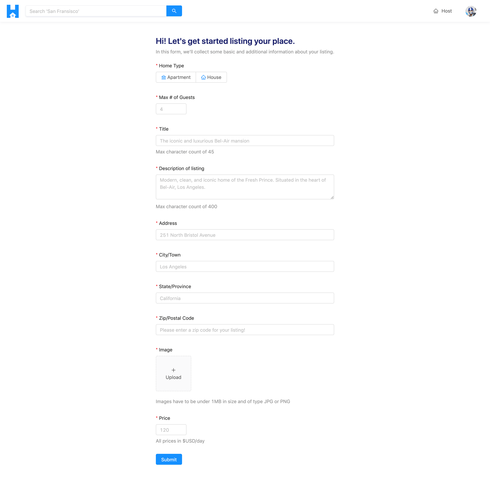

# Module 11 Introduction

In this module, we'll focus on allowing users to host their own listings on the TinyHouse platform.

Users will able to submit and create a new listing in the form presented in the `/host` route of our app which in the complete state will look similar to the following:

In this module, we'll:

-   Introduce the `hostListing` GraphQL mutation.
-   Build the `hostListing()` resolver function that is to receive the appropriate input and subsequently update certain collections in our database.
-   On the client, build the form in the `/host` page and trigger the `hostListing` mutation when the host form is completed and submitted.
