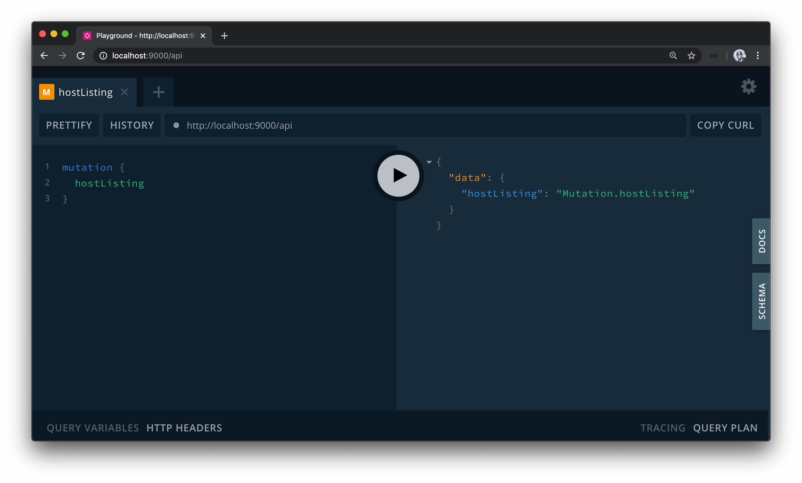

# HostListing GraphQL Fields

For users in our application to add listings (i.e. host listings) in the TinyHouse application, we'll need to create the functionality where users can upload and insert new listing data into our database. We'll only allow for this functionality for users who have:

1.  Logged into our application.
2.  And have connected with Stripe.

We'll need users who intend to host listings connected with Stripe since we'll use the user's `stripe_user_id` value for them to receive payments on our connected Stripe platform. We'll discuss more about this in the next coming modules but for now we'll talk about the GraphQL fields we'll need to have for users to create listings.

All we'll need to have users be able to create listings is one new root level mutation we'll call `hostListing`. This `hostListing` mutation will receive an input that contains various different information about a new listing such as the listing address, title, image, etc. When the `hostListing` mutation is successful, a new listing document will be added to the `"listings"` collection in our database.

The `hostListing` mutation sounds like it will be fairly straightforward to implement. The more complicated things we'll look to consider with this mutation is:

- How we intend to receive address information for the new listing location and use Google's Geocoding API to geocode the address information.
- How we would want to handle image uploads from the client onto the server.

We'll take this step by step. For this lesson, we'll establish a GraphQL field in our GraphQL type definitions file and an accompanying resolver function before we begin to build the implementation. In the `src/graphql/typeDefs.ts` file, we'll introduce a new mutation labeled `hostListing` that at this moment will just return a string.

```ts
  type Mutation {
    logIn(input: LogInInput): Viewer!
    logOut: Viewer!
    connectStripe(input: ConnectStripeInput!): Viewer!
    disconnectStripe: Viewer!
    hostListing: String!
  }
```

We already have a `listingResolvers` map dedicated to containing the resolver functions that pertain to the domain of a listing. We'll introduce a `Mutation` object in this `listingResolvers` map, within the `src/graphql/resolvers/Listing/index.ts` file, that is to contain a `hostListing()` mutation resolver. We'll have this `hostListing()` resolver function return a string that says `Mutation.hostListing`.

```ts
export const listingResolvers: IResolvers = {
  // ...
  Mutation: {
    hostListing: () => {
      return "Mutation.hostListing";
    }
  }
  // ...
};
```

With our server running, when we head to GraphQL Playground and attempt to run the `hostListing` mutation, we'll get the string message we've just set up.



In the next lesson, we'll look to implement the functionality the `hostListing()` resolver should have.
