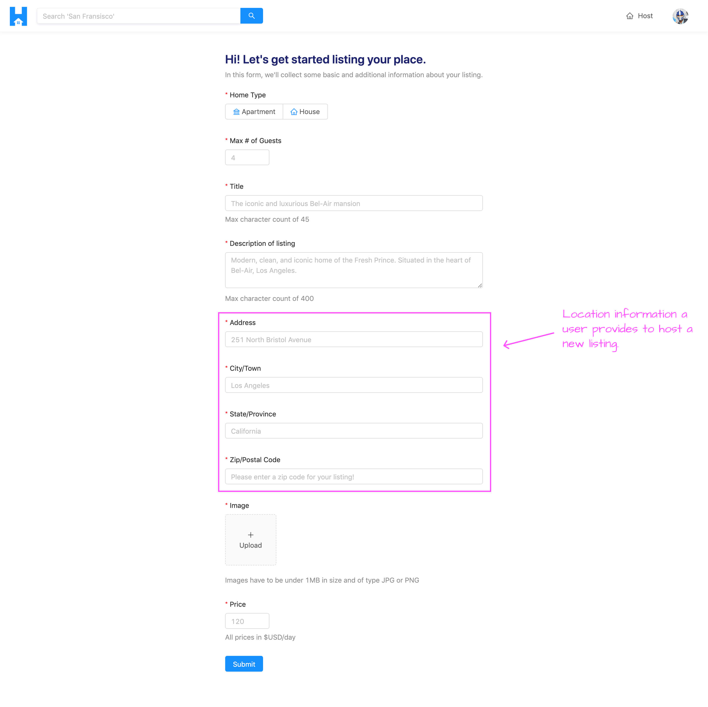

# Building the HostListing Resolver

### Gameplan

In this lesson, we'll look to have the `hostListing()` resolver receive an input with new listing information and add a new listing document to the `"listings"` collection in our database.

It's probably important to first discuss what kind of information is going to be provided from the client to the server to create a listing. When we build the form where the user can create a new listing, the form will collect the following information:

- The listing type (i.e. apartment or house).
- The maximum number of guests.
- The title of the listing.
- The description of the listing.
- The address, city (or town), state (or province), and zip (or postal code) of the listing.
- The image of the listing.
- The price of the listing per day.

There are other fields in our listing documents in the database that govern the context of what a listing is to have in our app such as the number of bookings in a listing, the id of the host of the listing, etc. For most of these other fields, we won't need the client to provide this information since we'll govern the values in the server when the listing is being created. For example, when a new listing is being made, the bookings of that listing will be empty and the host id will be the id of the viewer making the request to create the listing.

The fields we're going to capture from the client are for the most part going to be mapped one to one. For example, whatever the user says the title of the listing is going to be, we'll simply make it the title of the listing document. This is the same for capturing the description, image, type, price, and the maximum number of guests for a listing.

Things will be a little different for the address information we're going to capture. We're not simply going to take the address information provided from the client and place those values directly in our database. This is for a few reasons:

1.  Our database isn't going to accept information such as the postal code of a listing. The only location information we have for a listing document is `address`, `country`, `admin`, and `city`.
2.  We'll want the `country`, `admin`, and `city` information within every listing document to be the **geocoded information that Google's Geocoding API gives us**. We won't want to store the city or country information the user types directly in the form into our database for a multitude of reasons. One being the fact that users might provide information differently, they may misspell something, etc. **If we had different variations of the same representation of a location, this would affect how listings can be searched for in the `/listings/:location?` page**!

In our server, the Google Geocoder functionality we've set-up requires a single input and outputs valid geographic information for the input regardless of how terse or verbose the input is. It can be just the address of a location or it can be a more formatted address that contains the specific address with the postal code, city, and country.

From the client, we'll have the user provide information for the address, city, state, and postal code of the new listing.



When the mutation to create the listing (i.e. `hostListing`) is made, we'll concatenate all this information to a single address within the input of the mutation. For example, assume a user was to state in the client form, the address of a new listing is `"251 North Bristol Avenue"`, the city is `"Los Angeles"`, the state is `"California"`, and the zip code is `"90210"`. In the client, we'll parse this information and simply pass a concatenated address that has all this information into the server (i.e. `"251 North Bristol Avenue, Los Angeles, California, 90210"`).

The `hostListing` mutation will accept the concatenated address in the `input` argument, run it through Google's Geocoding API, and retrieve the `country`, `admin`, and `city` information of the address and provide that in our new listing document.

With our gameplan sort of established, let's begin to build out our `hostListing` mutation.

### `hostListing`

In our GraphQL API type definitions file (`src/graphql/typeDefs.ts`), we'll state that our `hostListing` mutation is to receive an input of object type `HostListingInput` and when the mutation resolves successfully, we'll want it to return the newly created listing document to the client so it'll return a `Listing` object type.

```ts
  type Mutation {
    logIn(input: LogInInput): Viewer!
    logOut: Viewer!
    connectStripe(input: ConnectStripeInput!): Viewer!
    disconnectStripe: Viewer!
    hostListing(input: HostListingInput!): Listing!
  }
```

We'll describe the shape of the `HostListingInput` object type and we'll note the fields we've mentioned the client will pass on to the server. This input will contain:

- `title` of type `String`.
- `description` of type `String`.
- `image` of type `String`. We'll discuss how we're going to handle image uploads shortly but it will be received as a string.
- `type` with which will be of the `ListingType` Enum.
- `address` of type `String`.
- `price` which is to be an `Int`.
- `numOfGuests` which is to be an `Int` as well.

```ts
  input HostListingInput {
    title: String!
    description: String!
    image: String!
    type: ListingType!
    address: String!
    price: Int!
    numOfGuests: Int!
  }
```

We'll then create the TypeScript interface type for this `HostListingInput` argument in the types file kept within the listing resolvers folder (`src/graphql/resolvers/Listing/types.ts`). We'll export an interface called `HostListingArgs` which is to have an input of type `HostListingInput`. The shape of the `HostListingInput` interface will be as we described in our GraphQL API type definitions. We'll import the `ListingType` interface from the `src/lib/types.ts` file which we'll use to describe the shape of the `type` field within `HostListingInput`.

```ts
export interface HostListingInput {
  title: string;
  description: string;
  image: string;
  type: ListingType;
  address: string;
  price: number;
  numOfGuests: number;
}

export interface HostListingArgs {
  input: HostListingInput;
}
```

In the `listingResolvers` map (within `src/graphql/resolvers/Listing/index.ts`), we'll import the `HostListingArgs` interface from the adjacent types file and we'll declare our `hostListing()` resolver will receive an `input` argument. We'll also look to destruct the database and request objects available as context and when the mutation function is resolved successfully, it will return `Promise<Listing>`.

```ts
import {
  // ...,
  HostListingArgs
} from "./types";

export const listingResolvers: IResolvers = {
  Query: {
    // ...
  },
  Mutation: {
    hostListing: async (
      _root: undefined,
      { input }: HostListingArgs,
      { db, req }: { db: Database; req: Request }
    ): Promise<Listing> => {
      // ...
    }
  },
  Listing: {
    // ...
  }
};
```

There are a few things we'll want to do in the `hostListing()` resolver function. The first thing we'll want to do is verify that the input provided by the user is valid. A valid input is one where we want to verify that the `title` and `description` fields don't exceed a certain number of characters, the `type` selected is an apartment or a house and the `price` isn't less than 0. We're going to provide some of these restrictions on the client-side as well but we'll add these server-side validations as an extra precaution.

We'll have these validations handled in a separate function that we'll call `verifyHostListingInput()` and will receive the `input` argument. We'll construct the `verifyHostListingInput()` function above the `listingResolvers` map object that is to receive an `input` argument. We'll import the `HostListingInput` interface from the adjacent types file to describe the shape of the input.

```ts
import {
  // ...,
  HostListingInput
  // ...
} from "./types";

const verifyHostListingInput = (input: HostListingInput) => {};

export const listingResolvers: IResolvers = {
  Query: {
    // ...
  },
  Mutation: {
    hostListing: async (
      _root: undefined,
      { input }: HostListingArgs,
      { db, req }: { db: Database; req: Request }
    ): Promise<Listing> => {
      verifyHostListingInput(input);
    }
  },
  Listing: {
    // ...
  }
};
```

From the input argument of the `verifyHostListingInput()` function, we'll destruct the fields that we'll want to validate - `title`, `description`, `type`, and `price`.

```ts
const verifyHostListingInput = ({
  title,
  description,
  type,
  price
}: HostListingInput) => {};
```

We'll provide the following validation checks in the `verifyHostListingInput()` function:

- If the length of the `title` is greater than 100 characters, we'll throw an error that says `"listing title must be under 100 characters"`.
- If the length of the `description` is greater than 5000 characters, we'll throw an error that says `"listing description must be under 5000 characters"`.
- If the type of `listing` is neither an `apartment` or `house`, we'll throw an error that says `"listing type must either an apartment or house"`. We'll import the `ListingType` TypeScript Enum from the `src/lib/types.ts` for it to be used here.
- If the `price` of the listing is less than 0, we'll throw an error that says `"price must be greater than 0"`

```ts
import { Database, Listing, ListingType, User } from "../../../lib/types";
```

```ts
const verifyHostListingInput = ({
  title,
  description,
  type,
  price
}: HostListingInput) => {
  if (title.length > 100) {
    throw new Error("listing title must be under 100 characters");
  }
  if (description.length > 5000) {
    throw new Error("listing description must be under 5000 characters");
  }
  if (type !== ListingType.Apartment && type !== ListingType.House) {
    throw new Error("listing type must be either an apartment or house");
  }
  if (price < 0) {
    throw new Error("price must be greater than 0");
  }
};
```

In our `hostListing()` resolver function, if the input is valid, we'll look to validate that a viewer who's logged in to our application is making the listing since we only want listings to be created for users who've already logged in to the application. We have an `authorize()` function in the `src/lib/utils/` folder that's already imported and can be used here. We'll use the `authorize()` function, pass in the `db` and `req` objects, and attempt to retrieve a user based on the CSRF token available in the request. If the `viewer` doesn't exist, we'll throw an error saying `"viewer could not be found"`.

```ts
export const listingResolvers: IResolvers = {
  Query: {
    // ...
  },
  Mutation: {
    hostListing: async (
      _root: undefined,
      { input }: HostListingArgs,
      { db, req }: { db: Database; req: Request }
    ): Promise<Listing> => {
      verifyHostListingInput(input);

      let viewer = await authorize(db, req);
      if (!viewer) {
        throw new Error("viewer cannot be found");
      }
    }
  },
  Listing: {
    // ...
  }
};
```

If the `viewer` object exists, we can now look to get the `country`, `admin`, and `city` information from our geocoder based on the `address` in the `input` object. We'll run the `geocode()` function from the `Google` object imported in this file, pass the `input.address` field, and destruct the `country`, `admin`, and `city` information. If any of these location fields can't be found from the geocoder, we'll throw an error that says "invalid address input".

```ts
export const listingResolvers: IResolvers = {
  Query: {
    // ...
  },
  Mutation: {
    hostListing: async (
      _root: undefined,
      { input }: HostListingArgs,
      { db, req }: { db: Database; req: Request }
    ): Promise<Listing> => {
      verifyHostListingInput(input);

      let viewer = await authorize(db, req);
      if (!viewer) {
        throw new Error("viewer cannot be found");
      }

      const { country, admin, city } = await Google.geocode(input.address);
      if (!country || !admin || !city) {
        throw new Error("invalid address input");
      }
    }
  },
  Listing: {
    // ...
  }
};
```

At this moment, if there are no errors, we can prepare to insert a new listing document to the `"listings"` collection in our database. We'll use the [`insertOne()`](https://docs.mongodb.com/manual/reference/method/db.collection.insertOne/) method of the Node Mongo Driver to insert a new document to the `"listings"` collection.

The `_id` field of the new document we'll insert will be a new ObjectId we'll create with the help of the `ObjectId` constructor from MongoDB. We'll then use the [spread operator](https://developer.mozilla.org/en-US/docs/Web/JavaScript/Reference/Operators/Spread_syntax) to add the fields from the `input` object directly into the new document.

We'll specify some other fields in the new document as well. For example:

- The `bookings` field will be an empty array.
- `bookingsIndex` will be an empty object
- We'll pass the `country`, `admin`, and `city` fields from our geocoder.
- The `host` field will have a value of the `id` of the viewer creating the listing.

```ts
export const listingResolvers: IResolvers = {
  Query: {
    // ...
  },
  Mutation: {
    hostListing: async (
      _root: undefined,
      { input }: HostListingArgs,
      { db, req }: { db: Database; req: Request }
    ): Promise<Listing> => {
      verifyHostListingInput(input);

      let viewer = await authorize(db, req);
      if (!viewer) {
        throw new Error("viewer cannot be found");
      }

      const { country, admin, city } = await Google.geocode(input.address);
      if (!country || !admin || !city) {
        throw new Error("invalid address input");
      }

      const insertResult = await db.listings.insertOne({
        _id: new ObjectId(),
        ...input,
        bookings: [],
        bookingsIndex: {},
        country,
        admin,
        city,
        host: viewer._id
      });
    }
  },
  Listing: {
    // ...
  }
};
```

There's one other thing we're going to do in the `hostListing()` resolver function. Every user document in the `"users"` collection is to have a `listings` field that contains an array of listing ids **to represent the listings that the user has**. We'll look to _update_ the user document of the viewer making the request to state that the id of this new listing will be part of the listings array of that user document.

We'll first look to access the newly inserted listing document. [There are a few ways one can perhaps do this](https://stackoverflow.com/questions/40766654/node-js-mongodb-insert-one-and-return-the-newly-inserted-document/40767118) but we can achieve this by accessing the first item in the `.ops` array in the insert result. We'll assign the insert result to a new constant called `insertedListing` and we'll be sure to describe its shape as the `Listing` interface. We'll then run the [`updateOne()`](https://docs.mongodb.com/manual/reference/method/db.collection.updateOne/) method from the Node MongoDB driver to help update a document in the `"users"` collection. We'll find the document where the `_id` field is that of the `viewer_id` and we'll simply push the `_id` of the `insertedListing` to the `listings` field in this document.

Finally, we'll have the `hostListing()` resolver function return the newly inserted listing document.

```ts
export const listingResolvers: IResolvers = {
  // ...
  Mutation: {
    hostListing: async (
      _root: undefined,
      { input }: HostListingArgs,
      { db, req }: { db: Database; req: Request }
    ): Promise<Listing> => {
      verifyHostListingInput(input);

      let viewer = await authorize(db, req);
      if (!viewer) {
        throw new Error("viewer cannot be found");
      }

      const { country, admin, city } = await Google.geocode(input.address);
      if (!country || !admin || !city) {
        throw new Error("invalid address input");
      }

      const insertResult = await db.listings.insertOne({
        _id: new ObjectId(),
        ...input,
        bookings: [],
        bookingsIndex: {},
        country,
        admin,
        city,
        host: viewer._id
      });

      const insertedListing: Listing = insertResult.ops[0];

      await db.users.updateOne(
        { _id: viewer._id },
        { $push: { listings: insertedListing._id } }
      );

      return insertedListing;
    }
  }
  // ...
};
```

Our `hostListing` mutation can now receive an `input` object that contains information about a new listing. In the `hostListing()` resolver, we verify if `input` is valid and we verify the viewer making the request. We then try to resolve the `country`, `admin`, and `city` information from the address that was provided. If all this is successful, we insert a new document into the `"listings"` collection and we update the user document of the viewer making the request.

In the next lesson, we'll begin to build the client functionality to have the form available in the `/host` page which would receive information for the user creating a new listing and trigger the `hostListing` mutation.
