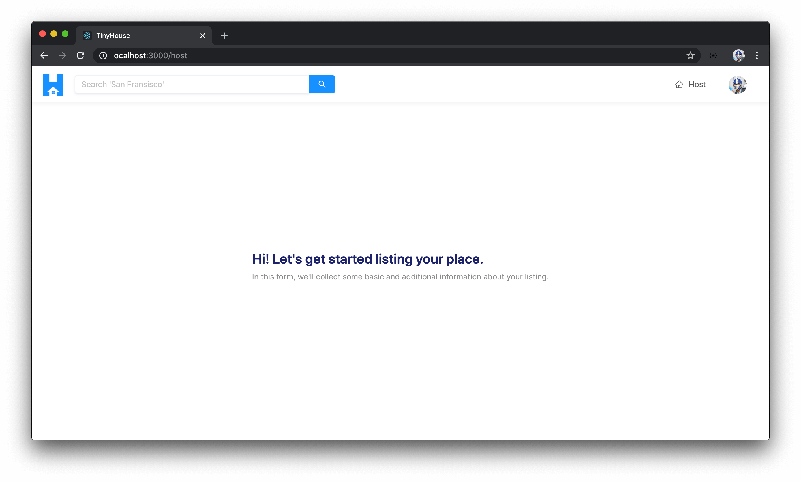

# Building the UI of the Host page

We'll now begin to work on the form on the client app where a user can create (i.e. host) a new listing. The form we'll build will essentially be the UI of the `/host` route of our application.

The form isn't going to be very difficult to establish. We'll essentially provide different form inputs that represent the information we'll want the user to provide for their new listing. The entire form will be part of a single component called the `<Host />` component.


If a user is either not signed in to our application or hasn't connected with Stripe, they'll be unable to see the form and instead will be told that they'll need to sign and connect with Stripe to create a listing.


In this lesson, we'll begin by establishing the UI of the entire `/host` page before we plan to introduce the `hostListing` mutation and the capability to run the mutation.

### `<Host />`

In the `<Host />` component within the `src/sections/Host/index.tsx` file, let's import the first few Ant Design components we'll need. We'll import the `<Layout />` and `<Typography />` components. We'll destruct the `<Content />` sub-component from `<Layout />` and we'll destruct the `<Text />` and `<Title />` sub-components from `<Typography />`.

```tsx
import React from "react";
import { Layout, Typography } from "antd";

const { Content } = Layout;
const { Text, Title } = Typography;
```

In the `<Host />` component return statement, we'll return the `<Content />` component that is to contain a `<div />` element that further contains a `<Title />` that says `"Hi! Let's get started listing your place."` We'll add some secondary text right below it that says `"In this form, we'll collect some basic and additional information about your listing"`.

```tsx
import React from "react";
import { Layout, Typography } from "antd";

const { Content } = Layout;
const { Text, Title } = Typography;

export const Host = () => {
  return (
    <Content className="host-content">
      <div className="host__form-header">
        <Title level={3} className="host__form-title">
          Hi! Let's get started listing your place.
        </Title>
        <Text type="secondary">
          In this form, we'll collect some basic and additional information about your
          listing.
        </Text>
      </div>
    </Content>
  );
};
```

If we were to take a look at our app now, we'll see the title section we'll want to show for this page.



As we mentioned, we only want the user to create a listing in this `/host` page when they're **logged in our application and connected with Stripe**. The `viewer` state object we have in the parent `<App />` instance has information for both of these cases. If the viewer is not logged in, there won't be a `viewer.id` field (or any other field in the `viewer` object). If the viewer is not connected with Stripe, the `hasWallet` field in the `viewer` object will return `false`. With that said, let's pass this `viewer` object down as props to the `<Host />` component rendered in the `/host` route from the parent `<App />` component.

We'll employ the render props pattern to render the `<Host/>` component and we'll pass the `viewer` state object down.

```tsx
<Route exact path="/host" render={props => <Host {...props} viewer={viewer} />} />
```

In the `<Host />` component file, we'll declare that the `viewer` prop is expected to be passed in. We'll import the `Viewer` interface from the `src/lib/types.ts` file to describe the shape of the `viewer` object prop.

```tsx
import { Viewer } from "../../lib/types";

interface Props {
  viewer: Viewer;
}

// ...

export const Host = ({ viewer }: Props) => {
  // ...
};
```

In the `<Host />` component, we'll check if the `viewer.id` doesn't exist or the `viewer.hasWallet` field isn't `true`. If either of these conditions is met, we'll have our component return a `<Title />` that says `"You'll have to be signed in and connected with Stripe to host a listing!"` and some secondary text that says `"We only allow users who've signed in to our application and have connected with Stripe to host new listings"`. We'll also provide a link to the `/login` route of our app to tell the user that they can log-in from the login page. To provide a link to the `/login` page, we'll be sure to import the `<Link />` component from `react-router-dom`.

```tsx
// ...
import { Link } from "react-router-dom";
// ...

// ...

export const Host = ({ viewer }: Props) => {
  if (!viewer.id || !viewer.hasWallet) {
    return (
      <Content className="host-content">
        <div className="host__form-header">
          <Title level={4} className="host__form-title">
            You'll have to be signed in and connected with Stripe to host a listing!
          </Title>
          <Text type="secondary">
            We only allow users who've signed in to our application and have connected
            with Stripe to host new listings. You can sign in at the{" "}
            <Link to="/login">/login</Link> page and connect with Stripe shortly after.
          </Text>
        </div>
      </Content>
    );
  }

  return (
    <Content className="host-content">
      <div className="host__form-header">
        <Title level={3} className="host__form-title">
          Hi! Let's get started listing your place.
        </Title>
        <Text type="secondary">
          In this form, we'll collect some basic and additional information about your
          listing.
        </Text>
      </div>
    </Content>
  );
};
```

If we were either not logged in OR not connected with Stripe, we'll see the title and text notifying us that we'll need to log-in and connect with Stripe.


We want the user to be logged in since every listing that is created needs to be attached to a certain user in our application. We want users to be connected with Stripe since this is the only way users can receive payments for their listings. However, we can't prevent them from disconnecting from Stripe _after_ they've already created their listing which is why later on when we build out the booking capability, we'll look to prevent a user from booking a listing where the host has pulled away their Stripe information.

### Host Form

We'll now set up the UI for the form we want to show in the `/host` page. Forms and form validations in client-side applications are an interesting topic. Often, they begin through very simple means but can become very complicated, very quickly. This is exacerbated when it comes to thinking about how we want to deal with form-level and/or field-level validations within forms.

We're going to utilize an important advantage thanks to a pretty powerful component Ant Design gives us, called the [`<Form />`](https://ant.design/components/form/) component. The `<Form />` component from Ant Design doesn't necessarily give us the UI for certain form elements, like a radio input or a checkbox since other components exist for this, but it provides the capability to validate fields with certain rules AND to collect information.

The `<Form />` component from Ant Design provides a useful [`<Item />`](https://ant.design/components/form/#Form-Item-Component) sub-component that helps display a form label, help text, etc. As of the current version of Ant Design, v3, when this lesson was being screencast, the `<Form />` component also contains a function, labeled [`Form.create()`](<https://ant.design/components/form/#Form.create(options)>) that acts as a Higher Order Component Function that receives a component and produces another component where a `form` prop object is provided. This `form` object provides the capability to introduce validations on form fields and capture values from the form fields.

Let's look to see how this `<Form />` component can help us. We'll first import the `<Form />` component from Ant Design and wrap the uppermost `<div />` element in the `<Host />` component return statement (i.e. the template shown to the user when they've logged in and connected with Stripe). We'll specify in the `layout` prop for the `<Form />` component that the form is going to be in the `"vertical"` layout.

We'll also destruct an `Item` sub-component from the `Form` component.

```tsx
import React from "react";
import { Link } from "react-router-dom";
import { Form, Layout, Typography } from "antd";
import { Viewer } from "../../lib/types";

const { Content } = Layout;
const { Text, Title } = Typography;
const { Item } = Form;

export const Host = () => {
  // ...

  return (
    <Content className="host-content">
      <Form layout="vertical">
        <div className="host__form-header">
          <Title level={3} className="host__form-title">
            Hi! Let's get started listing your place.
          </Title>
          <Text type="secondary">
            In this form, we'll collect some basic and additional information about your
            listing.
          </Text>
        </div>
      </Form>
    </Content>
  );
};
```

#### Title Input

The `<Form />` component from Ant Design doesn't provide the actual UI elements we'll show, like inputs or radio buttons, and those are to come from different components we'll import and use. We'll import and use the [`<Input />`](https://ant.design/components/input/) component to capture the **title** of the listing.

We'll place the `<Input />` component and provide a placeholder of an example of a title, something like `"The iconic and luxurious Bel-Air mansion".` Remember on the server, we added a server-side validation where the title can only have a maximum number of `100` characters. The server-side validation acts as a safeguard and on the client, we'll be more restrictive and add a `maxlength` of 45 characters for the title input. We'll then use the `<Item />` sub-component from the form to provide a label to this form element saying `Title` and some extra help text that says "`Max character count of 45`".

```tsx
// ...
import { Form, Input, Layout, Typography } from "antd";
// ...

export const Host = () => {
  // ...

  return (
    <Content className="host-content">
      <Form layout="vertical">
        <div className="host__form-header">
          <Title level={3} className="host__form-title">
            Hi! Let's get started listing your place.
          </Title>
          <Text type="secondary">
            In this form, we'll collect some basic and additional information about your
            listing.
          </Text>
        </div>

        <Item label="Title" extra="Max character count of 45">
          <Input maxLength={45} placeholder="The iconic and luxurious Bel-Air mansion" />
        </Item>
      </Form>
    </Content>
  );
};
```

If we take a look at our page now, we'll see the form input and we'll see the form label and extra help text shown along with it.


#### Description TextArea

We'll display another input but this time we'll display the `<TextArea />` sub-component within `<Input />` to have a `textarea` be shown to capture more text for the **description** of the listing. We can declare the number of `rows` in this `textarea` to be `3` and we'll provide a max length of `400` characters (less than the server-side guard of 5000 characters). For the description input, we'll state a placeholder of an example description of a listing - something like `"Modern, clean, and iconic home of the Fresh Prince. Situated in the heart of Bel-Air, Los Angeles."`.

We'll wrap this `<Input.TextArea />` with the `<Item />` form component which is to have a title that says `"Description of listing"` and we'll provide extra help text of `"Max character count of 400"`.

```tsx
// ...
import { Form, Input, Layout, Typography } from "antd";
// ...

export const Host = () => {
  // ...

  return (
    <Content className="host-content">
      <Form layout="vertical">
        <div className="host__form-header">
          <Title level={3} className="host__form-title">
            Hi! Let's get started listing your place.
          </Title>
          <Text type="secondary">
            In this form, we'll collect some basic and additional information about your
            listing.
          </Text>
        </div>

        <Item label="Title" extra="Max character count of 45">
          <Input maxLength={45} placeholder="The iconic and luxurious Bel-Air mansion" />
        </Item>

        <Item label="Description of listing" extra="Max character count of 400">
          <Input.TextArea
            rows={3}
            maxLength={400}
            placeholder="Modern, clean, and iconic home of the Fresh Prince. Situated in the heart of Bel-Air, Los Angeles."
          />
        </Item>
      </Form>
    </Content>
  );
};
```

#### Address, City, State, Postal Code Inputs

We'll look to display a series of other text inputs:

- One to capture the direct **address** of the listing. We'll provide a placeholder here that says `"251 North Bristol Avenue"` and the the `<Item />` label will be `"Address"`.
- Another to capture the **city** (or town). We'll provide a label of `"City/Town"` and an input placeholder of `"Los Angeles"`.
- An input to capture the **state** (or province). We'll provide a label of `"State/Province"` and an input placeholder of `"California"`.
- An input to capture the **zip/postal code**. We'll provide a label of `"Zip/Postal Code"` and an input placeholder of `"Please enter a zip code for your listing!"`.

```tsx
export const Host = () => {
  // ...

  return (
    <Content className="host-content">
      <Form layout="vertical">
        <div className="host__form-header">
          <Title level={3} className="host__form-title">
            Hi! Let's get started listing your place.
          </Title>
          <Text type="secondary">
            In this form, we'll collect some basic and additional information about your
            listing.
          </Text>
        </div>

        <Item label="Title" extra="Max character count of 45">
          <Input maxLength={45} placeholder="The iconic and luxurious Bel-Air mansion" />
        </Item>

        <Item label="Description of listing" extra="Max character count of 400">
          <Input.TextArea
            rows={3}
            maxLength={400}
            placeholder="Modern, clean, and iconic home of the Fresh Prince. Situated in the heart of Bel-Air, Los Angeles."
          />
        </Item>

        <Item label="Address">
          <Input placeholder="251 North Bristol Avenue" />
        </Item>

        <Item label="City/Town">
          <Input placeholder="Los Angeles" />
        </Item>

        <Item label="State/Province">
          <Input placeholder="California" />
        </Item>

        <Item label="Zip/Postal Code">
          <Input placeholder="Please enter a zip code for your listing!" />
        </Item>
      </Form>
    </Content>
  );
};
```

If we were to take a look at the `/host` page at this moment, we'll see the form inputs we've created presented and available to us. Great!


#### Price Input

There are a few other inputs that are to be in our form that aren't direct text inputs. We'll look to capture the **price** value of the listing through an input but where the user is to only provide a value of a number.

With Ant Design, we can create a number input by using the [`<InputNumber />`](https://ant.design/components/input-number/#header) component which can be used to help capture numbers between certain ranges. We'll import the `<InputNumber />` component and use it to capture the price of the listing. We'll specify a minimum value of `0` and provide a placeholder of `"120"`. In the form item label we'll say `"Price"` and for the extra help text we'll state `"All prices in $USD/day"`.

```tsx
// ...
import { Form, Input, InputNumber, Layout, Typography } from "antd";
// ...

export const Host = () => {
  // ...

  return (
    <Content className="host-content">
      <Form layout="vertical">
        <div className="host__form-header">
          <Title level={3} className="host__form-title">
            Hi! Let's get started listing your place.
          </Title>
          <Text type="secondary">
            In this form, we'll collect some basic and additional information about your
            listing.
          </Text>
        </div>

        <Item label="Title" extra="Max character count of 45">
          <Input maxLength={45} placeholder="The iconic and luxurious Bel-Air mansion" />
        </Item>

        <Item label="Description of listing" extra="Max character count of 400">
          <Input.TextArea
            rows={3}
            maxLength={400}
            placeholder="Modern, clean, and iconic home of the Fresh Prince. Situated in the heart of Bel-Air, Los Angeles."
          />
        </Item>

        <Item label="Address">
          <Input placeholder="251 North Bristol Avenue" />
        </Item>

        <Item label="City/Town">
          <Input placeholder="Los Angeles" />
        </Item>

        <Item label="State/Province">
          <Input placeholder="California" />
        </Item>

        <Item label="Zip/Postal Code">
          <Input placeholder="Please enter a zip code for your listing!" />
        </Item>

        <Item label="Price" extra="All prices in $USD/day">
          <InputNumber min={0} placeholder="120" />
        </Item>
      </Form>
    </Content>
  );
};
```

If we took a look at the `/host` page now, we'll see a number input shown to us. If we type a negative number and click elsewhere, it'll be incremented to the minimum value of 0.


#### ListingType Radio Buttons

When it comes to having the user decide between a listing type of a house or an apartment, we can leverage Ant Designs [`<Radio />`](https://ant.design/components/radio/) component to provide the user with radio inputs to pick one of two values for the listing type. We'll have these radio buttons be displayed right above the title input in the form.

```tsx
// ...
import { Form, Input, InputNumber, Layout, Radio, Typography } from "antd";
// ...

export const Host = () => {
  // ...

  return (
    <Content className="host-content">
      <Form layout="vertical">
        <div className="host__form-header">
          <Title level={3} className="host__form-title">
            Hi! Let's get started listing your place.
          </Title>
          <Text type="secondary">
            In this form, we'll collect some basic and additional information about your
            listing.
          </Text>
        </div>

        <Item label="Home Type">
          <Radio.Group>
            <Radio.Button>
              <span>Apartment</span>
            </Radio.Button>
            <Radio.Button>
              <span>House</span>
            </Radio.Button>
          </Radio.Group>
        </Item>

        <Item label="Title" extra="Max character count of 45">
          <Input maxLength={45} placeholder="The iconic and luxurious Bel-Air mansion" />
        </Item>

        <Item label="Description of listing" extra="Max character count of 400">
          <Input.TextArea
            rows={3}
            maxLength={400}
            placeholder="Modern, clean, and iconic home of the Fresh Prince. Situated in the heart of Bel-Air, Los Angeles."
          />
        </Item>

        <Item label="Address">
          <Input placeholder="251 North Bristol Avenue" />
        </Item>

        <Item label="City/Town">
          <Input placeholder="Los Angeles" />
        </Item>

        <Item label="State/Province">
          <Input placeholder="California" />
        </Item>

        <Item label="Zip/Postal Code">
          <Input placeholder="Please enter a zip code for your listing!" />
        </Item>

        <Item label="Price" extra="All prices in $USD/day">
          <InputNumber min={0} placeholder="120" />
        </Item>
      </Form>
    </Content>
  );
};
```

Radio inputs don't have an inherent value so we'll have to provide concrete values for what each of these radio inputs will refer to when clicked. The two different listing types we have in our app are `"APARTMENT"` and `"HOUSE"`. Instead of specifying these values directly, we can perhaps use the `ListingType` Enum available as a global type from our autogenerated TypeScript definitions. By using the `ListingType` Enum, it'll ensure we're providing a value that matches one of the available two.

We'll import the `ListingType` Enum from the `globalTypes.ts` file kept in our `src/lib/graphql/` folder. We'll also provide icons to each Radio Button for presentational purposes. We'll import the `<Icon />` component from Ant Design, and we'll import the `iconColor` constant we have in our `src/lib/utils/` folder.

```tsx
import { Form, Icon, Input, InputNumber, Layout, Radio, Typography } from "antd";
// ...
import { ListingType } from "../../lib/graphql/globalTypes";
import { iconColor } from "../../lib/utils";
```

We'll use the `ListingType` Enum to declare the values of each radio button and we'll place a `"bank"` icon for the apartment option and a `"home"` icon for the house option.

```tsx
<Item label="Home Type">
  <Radio.Group>
    <Radio.Button value={ListingType.APARTMENT}>
      <Icon type="bank" style={{ color: iconColor }} /> <span>Apartment</span>
    </Radio.Button>
    <Radio.Button value={ListingType.HOUSE}>
      <Icon type="home" style={{ color: iconColor }} /> <span>House</span>
    </Radio.Button>
  </Radio.Group>
</Item>
```

If we take a look at our app now, we'll see the two radio buttons presented to us each having an icon. If we clicked one, Ant Design will give us the selected styling around it indicating which one we've selected.


### Image Upload & Base64 Encoding

> The image upload capability we'll build will mimic very close to the `Avatar` example shown in the Ant Design [documentation](https://ant.design/components/upload/) for the `<Upload>` component. A code example of the implementation we'll mimic can be seen - [here](https://codesandbox.io/s/x560j).

There's one other form item we're interested in capturing and that is to be the **image** of a listing. This would be more complicated to capture so we'll spend a little more time here. Ant Design provides a fairly powerful [`<Upload />`](https://ant.design/components/upload/) component that helps facilitate the uploading of files from the client.

There are a few different variations of how the `<Upload />` component can be used but we'll be interested in using the `Avatar` example/variation shown in the Ant Design [documentation](https://ant.design/components/upload/).


In the example shown above, when an image is uploaded through the `<Upload />` component, our machine's file navigator will open and when we select an image, a preview of the image is then shown.


How is this image being uploaded where a preview is then shown to us? In this example, the Ant Design `<Upload />` component takes the image uploaded from the file navigator and prepares the image in **base64 encoded format**.

[Base64 encoding](https://developer.mozilla.org/en-US/docs/Web/API/WindowBase64/Base64_encoding_and_decoding) is essentially a way to convert data into simple printable characters. **Base64 is often used when data needs to be stored and transferred over a medium that expects textual based data**. The image for a new listing in the `/host` page is a good example of this. We can't transfer this listing image as an image file from our client to our server through our GraphQL API. Instead, we can _convert_ it to base64 encoded format which is a string representation of the data where we're then able to send it to the server through the GraphQL API!

Let's prepare the image upload component in our `/host` form. We'll prepare the entire image uploader element with all the accompanying functions and we'll explain things as we go.

The first thing we'll do is import the `<Upload />` component from Ant Design.

```tsx
import { Upload } from "antd";
```

We'll prepare another form item just before the price form item in our form with a label of `"Image"`. We'll have a few restrictions here so we'll have the form item extra help text state `"Images have to be under 1MB in size and of type JPG or PNG"`. We'll place the `<Upload />` component within a `<div />` element in the form item.

```tsx
export const Host = () => {
  // ...

  return (
    <Content className="host-content">
      <Form layout="vertical">
        <div className="host__form-header">
          <Title level={3} className="host__form-title">
            Hi! Let's get started listing your place.
          </Title>
          <Text type="secondary">
            In this form, we'll collect some basic and additional information about your
            listing.
          </Text>
        </div>

        <Item label="Home Type">
          <Radio.Group>
            <Radio.Button>
              <span>Apartment</span>
            </Radio.Button>
            <Radio.Button>
              <span>House</span>
            </Radio.Button>
          </Radio.Group>
        </Item>

        <Item label="Title" extra="Max character count of 45">
          <Input maxLength={45} placeholder="The iconic and luxurious Bel-Air mansion" />
        </Item>

        <Item label="Description of listing" extra="Max character count of 400">
          <Input.TextArea
            rows={3}
            maxLength={400}
            placeholder="Modern, clean, and iconic home of the Fresh Prince. Situated in the heart of Bel-Air, Los Angeles."
          />
        </Item>

        <Item label="Address">
          <Input placeholder="251 North Bristol Avenue" />
        </Item>

        <Item label="City/Town">
          <Input placeholder="Los Angeles" />
        </Item>

        <Item label="State/Province">
          <Input placeholder="California" />
        </Item>

        <Item label="Zip/Postal Code">
          <Input placeholder="Please enter a zip code for your listing!" />
        </Item>

        <Item
          label="Image"
          extra="Images have to be under 1MB in size and of type JPG or PNG"
        >
          <div className="host__form-image-upload">
            <Upload name="image" />
          </div>
        </Item>

        <Item label="Price" extra="All prices in $USD/day">
          <InputNumber min={0} placeholder="120" />
        </Item>
      </Form>
    </Content>
  );
};
```

The `<Upload />` component from Ant Design has a `listType` prop which helps dictate the style of the uploader. We'll provide a value of `"picture-card"` for this prop which is the style of the example we saw in the documentation. The `showUploadList` prop dictates whether we want to show some list related UI where actions like remove/delete or preview the image is presented. We're not interested in this so we'll state a value of `false` for the `showUploadList` prop.

```tsx
<Item label="Image" extra="Images have to be under 1MB in size and of type JPG or PNG">
  <div className="host__form-image-upload">
    <Upload name="image" listType="picture-card" showUploadList={false} />
  </div>
</Item>
```

Ant Design's `<Upload />` component contains an `action` prop where an AJAX upload request that is declared here is to be fired the moment the upload is made. We don't want to fire an AJAX request the moment the image is uploaded. We simply want the preview to be shown and capture the base64 value of the image which will only be sent to the server **after the entire form is submitted**.

The unfortunate thing is this `action` prop is required to preview the image which is a little unfortunate. We can do something a little hacky here and bypass this action by placing a mock HTTP response to mock the fact that an image was uploaded as part of an actual request. This same set-up is also made in the Ant Design [documentation](https://ant.design/components/upload/) for the `<Upload />` component.

```tsx
<Item label="Image" extra="Images have to be under 1MB in size and of type JPG or PNG">
  <div className="host__form-image-upload">
    <Upload
      name="image"
      listType="picture-card"
      showUploadList={false}
      action="https://www.mocky.io/v2/5cc8019d300000980a055e76"
    />
  </div>
</Item>
```

#### `beforeUpload()`

There are two additional callback function props we'll use - `beforeUpload()` and `onChange()`. `beforeUpload()` is a function that will execute just before the upload has been made and it's where we can check if the image is of a valid type (i.e. if the image file is either `jpeg` or `png` and is less than 1MB in size). We'll use the `beforeUpload()` prop and have it call a function we'll shortly create labeled `beforeImageUpload()`.

```tsx
<Item label="Image" extra="Images have to be under 1MB in size and of type JPG or PNG">
  <div className="host__form-image-upload">
    <Upload
      name="image"
      listType="picture-card"
      showUploadList={false}
      action="https://www.mocky.io/v2/5cc8019d300000980a055e76"
      beforeUpload={beforeImageUpload}
    />
  </div>
</Item>
```

We can have the `beforeImageUpload()` function be created outside of our component function since it'll have no need to access or affect anything within the component, it'll simply receive the image file from the callback function and return a boolean. The type of the `file` component will be the `File` interface that's available within the scope of TypeScript in general. The `File` interface provides information about files and will allow us to access their content.

```tsx
const beforeImageUpload = (file: File) => {};
```

In the `beforeImageUpload()` function, we'll first check if the file type is either `jpeg` or `png`. We'll create a constant to represent this called `fileIsValidImage` and we can check for the type of the file from the `type` field of the `file` object.

```tsx
const beforeImageUpload = (file: File) => {
  const fileIsValidImage = file.type === "image/jpeg" || file.type === "image/png";
};
```

Next, we can check if the file size is less than 1MB. We can do this with the `file.size` property and we'll check for its size in a constant called `fileIsValidSize`. The `file.size` property is in bytes. To have it in MB in binary form, we can divide the bytes by `1024` twice.

```tsx
const beforeImageUpload = (file: File) => {
  const fileIsValidImage = file.type === "image/jpeg" || file.type === "image/png";
  const fileIsValidSize = file.size / 1024 / 1024 < 1;
};
```

If the file is not a valid image or not a valid size, we can return `false` otherwise return both properties which will be `true`.

```tsx
const beforeImageUpload = (file: File) => {
  const fileIsValidImage = file.type === "image/jpeg" || file.type === "image/png";
  const fileIsValidSize = file.size / 1024 / 1024 < 1;

  if (!fileIsValidImage) {
    return false;
  }

  if (!fileIsValidSize) {
    return false;
  }

  return fileIsValidImage && fileIsValidSize;
};
```

Instead of only returning false if one of these isn't satisfied, we can look to display an error message to the user to notify them of the issue. To do this we can first import the `displayErrorMessage()` function from our `src/lib/utils/` folder.

```tsx
import { iconColor, displayErrorMessage } from "../../lib/utils";
```

For each of the invalid file cases, we can look to display an error. If the file is not a valid image, we'll fire an error message of `"You're only able to upload valid JPG or PNG files!"`. If the file is not a valid size, we'll fire an error message of `"You're only able to upload valid images files of under 1MB in size!"`.

```tsx
const beforeImageUpload = (file: File) => {
  const fileIsValidImage = file.type === "image/jpeg" || file.type === "image/png";
  const fileIsValidSize = file.size / 1024 / 1024 < 1;

  if (!fileIsValidImage) {
    displayErrorMessage("You're only able to upload valid JPG or PNG files!");
    return false;
  }

  if (!fileIsValidSize) {
    displayErrorMessage(
      "You're only able to upload valid image files of under 1MB in size!"
    );
    return false;
  }

  return fileIsValidImage && fileIsValidSize;
};
```

#### `onChange()`

With our validation check performed in the `beforeUpload()` callback function of the `<Upload />` component, let's prepare what will happen when the upload is made successfully with the callback function to be applied to the `onChange()` prop. Keep in mind that this `onChange()` function will trigger when a change is made which means it'll trigger when the image is first uploaded and when the image upload is complete.

We'll have it call another function we'll create labeled `handleImageUpload()` which we'll keep in the component function since we'll need to modify some component state.

```tsx
export const Host = () => {
  const handleImageUpload = () => {};

  return (
    <Content className="host-content">
      <Form layout="vertical">
        {/* ... */}

        <Item
          label="Image"
          extra="Images have to be under 1MB in size and of type JPG or PNG"
        >
          <div className="host__form-image-upload">
            <Upload
              name="image"
              listType="picture-card"
              showUploadList={false}
              action="https://www.mocky.io/v2/5cc8019d300000980a055e76"
              beforeUpload={beforeImageUpload}
              onChange={handleImageUpload}
            />
          </div>
        </Item>

        {/* ... */}
      </Form>
    </Content>
  );
};
```

There's going to be two state values we'll want to track in the `<Host />` component so let's import the `useState` Hook from React.

```tsx
import React, { useState } from "react";
```

One state property value we'll want to track is when the image upload is loading which will help us show some UI to the user. We'll call this state property `imageLoading` and the function responsible for updating this property `setImageLoading()` and we'll initialize it with a value of `false`.

We'll also want to be able to track the actual base64 value of the image that is to be uploaded so we'll create a state property called `imageBase64Value` and the function responsible for updating it `setImageBase64Value()`. We'll initialize the value as `null` and we'll state the type of this state property to either be a string or `null`.

```tsx
export const Host = () => {
  const [imageLoading, setImageLoading] = useState(false);
  const [imageBase64Value, setImageBase64Value] = useState<string | null>(null);

  const handleImageUpload = () => {};

  // ...

  return (
    <Content className="host-content">
      <Form layout="vertical">
        {/* ... */}

        <Item
          label="Image"
          extra="Images have to be under 1MB in size and of type JPG or PNG"
        >
          <div className="host__form-image-upload">
            <Upload
              name="image"
              listType="picture-card"
              showUploadList={false}
              action="https://www.mocky.io/v2/5cc8019d300000980a055e76"
              beforeUpload={beforeImageUpload}
              onChange={handleImageUpload}
            />
          </div>
        </Item>

        {/* ... */}
      </Form>
    </Content>
  );
};
```

When the `handleImageUpload()` function gets called, the `<Upload />` component will pass an `info` object that contains information about the upload as well as information about the file that's been uploaded. We can declare the type of this `info` object by importing an interface called `UploadChangeParam` directly from the `<Upload />` component type definitions file from Ant Design.

```tsx
// ...
import { UploadChangeParam } from "antd/lib/upload";
// ...

export const Host = () => {
  const [imageLoading, setImageLoading] = useState(false);
  const [imageBase64Value, setImageBase64Value] = useState<string | null>(null);

  const handleImageUpload = (info: UploadChangeParam) => {};

  // ...

  return (
    <Content className="host-content">
      <Form layout="vertical">
        {/* ... */}

        <Item
          label="Image"
          extra="Images have to be under 1MB in size and of type JPG or PNG"
        >
          <div className="host__form-image-upload">
            <Upload
              name="image"
              listType="picture-card"
              showUploadList={false}
              action="https://www.mocky.io/v2/5cc8019d300000980a055e76"
              beforeUpload={beforeImageUpload}
              onChange={handleImageUpload}
            />
          </div>
        </Item>

        {/* ... */}
      </Form>
    </Content>
  );
};
```

From the `info` argument passed into the `handleImageUpload()` function, we can destruct and retrieve the `file` object.

```tsx
const handleImageUpload = (info: UploadChangeParam) => {
  const { file } = info;
};
```

The `file` object we've destructured here doesn't just represent the file that's been uploaded from our file navigator. It is of a particular type from the `<Upload />` component that gives us information about the status of the file being uploaded. We can check the `status` property of the `file` to see if the file is `"uploading"`. If so, this would mean that our `<Upload />` element should be in the loading state so we'll call the `setImageLoading()` function and pass a value of `true` and we'll `return` early.

```tsx
const handleImageUpload = (info: UploadChangeParam) => {
  const { file } = info;

  if (file.status === "uploading") {
    setImageLoading(true);
    return;
  }
};
```

If the `file.status` is `"done"`, we can determine and see if this file object contains another property called `originFileObj`. The `originFileObj` property is what the `<Upload />` component tells us is the actual original file object. When the `originFileObj` property from the `file` is available, we can have another function be called that we'll create labeled `getBase64Value()`. The first argument will be the `originFileObj` itself and for the second argument we can pass in a callback function that would receive a parameter and when available will simply run the `setImageBase64Value()` function and pass that parameter along. We'll also then ensure we set the image loading state back to `false`.

```tsx
const handleImageUpload = (info: UploadChangeParam) => {
  const { file } = info;

  if (file.status === "uploading") {
    setImageLoading(true);
    return;
  }

  if (file.status === "done" && file.originFileObj) {
    getBase64Value(file.originFileObj, imageBase64Value => {
      setImageBase64Value(imageBase64Value);
      setImageLoading(false);
    });
  }
};
```

This might make more sense when we create the `getBase64Value()` function so let's go ahead and create it. We'll create it outside of our component function since it'll have no need to do anything with regards to properties in our component.

```tsx
const getBase64Value = () => {};
```

The first argument will be the image file itself. We've mentioned it can be of type `File` which is a reference to the `File` interface available in Typescript. However, with the way the `<Upload />` component works, this item from the file object can be a [`Blob`](https://developer.mozilla.org/en-US/docs/Web/API/Blob) as well. A [**`Blob`**](https://developer.mozilla.org/en-US/docs/Web/API/Blob) is essentially a file-like object which has minor differences to what a traditional `File` object is. This isn't a big deal on our part since whether it's a `File` or a `Blob`, we'll be able to get the base64 value with the same means.

The second argument is the `callback` function where the actual base64 value of the image is expected to be passed in and `void` is to be returned.

```tsx
const getBase64Value = (
  img: File | Blob,
  callback: (imageBase64Value: string) => void
) => {};
```

In the `getBase64Value()` function, let's try and get the base64 value of the image and then trigger the `callback` function to update the state property we have in our `<Host />` component.

To get the base64 value, we can use the [`FileReader`](https://developer.mozilla.org/en-US/docs/Web/API/FileReader) constructor in JavaScript. The `FileReader` object allows us to read the contents of a `File` or `Blob`. We'll run the `FileReader` object function and pass the result to a constant we'll call `reader`.

We can then run the [`readAsDataURL`](https://developer.mozilla.org/en-US/docs/Web/API/FileReader/readAsDataURL) function available from the `FileReader` to read the contents of the file.

```tsx
const getBase64Value = (
  img: File | Blob,
  callback: (imageBase64Value: string) => void
) => {
  const reader = new FileReader();
  reader.readAsDataURL(img);
};
```

The `FileReader` has an `onload` property that has an event handler that is executed when the 'load' event is fired and this happens when the file has been read, which in our case will be done from the function `readAsDataURL()`. When this is triggered, this means the file has been read and we can call our `callback` function and pass the `result` of the reader which at this moment should be the base64 value.

```tsx
const getBase64Value = (
  img: File | Blob,
  callback: (imageBase64Value: string) => void
) => {
  const reader = new FileReader();
  reader.readAsDataURL(img);
  reader.onload = () => {
    callback(reader.result);
  };
};
```

This is where we'll do another small hack to get by. The `FileReader` API tells us that the result of the reader can either be a `string` (which is what we want) or an `ArrayBuffer` type or `null`. From what I've gathered, this result _should_ be a string and it's unlikely to be either `null` or an `ArrayBuffer` if the image is of a valid type that was uploaded properly. As a result, we'll use type assertion and simply assert the type of the `reader.result` as a string.

```tsx
const getBase64Value = (
  img: File | Blob,
  callback: (imageBase64Value: string) => void
) => {
  const reader = new FileReader();
  reader.readAsDataURL(img);
  reader.onload = () => {
    callback(reader.result as string);
  };
};
```

> Notice the use of our own callback function? **[Callback functions](https://developer.mozilla.org/en-US/docs/Glossary/Callback_function) are just functions that are passed to other functions as arguments**. We've passed a function that will call `setImageBase64Value()` with the base64 result from the `FileReader` and will also call `setImageLoading` to reset the loading status to `false`. We executed this callback function only when the base64 result was available from the `FileReader`.

With our `beforeUpload()` and `onChange()` functions prepared, let's now use the loading and base64 state values in our `<Upload />` component. In the `<Upload />` component, we'll use a conditional statement and say if the `imageBase64` value exists, display an `img` element within where the `src` is the `imageBase64` value. If it doesn't exist, we'll look to display a `<div />` element that is to have an `<Icon />` and some text that says `"Upload"`.

For the `<Icon />`, we can control the type of the icon depending on whether our upload is in the loading state. If it's loading, we'll use the `"loading"` icon type. If it's not, we'll show the `"plus"` icon type. We'll use the `imageLoading` state property to determine this.

```tsx
// ...
import {
  Button,
  Form,
  Icon,
  Input,
  InputNumber,
  Layout,
  Radio,
  Typography,
  Upload
} from "antd";
// ...

export const Host = () => {
  // ...

  return (
    <Content className="host-content">
      <Form layout="vertical">
        {/* ... */}

        <Item
          label="Image"
          extra="Images have to be under 1MB in size and of type JPG or PNG"
        >
          <div className="host__form-image-upload">
            <Upload
              name="image"
              listType="picture-card"
              showUploadList={false}
              action="https://www.mocky.io/v2/5cc8019d300000980a055e76"
              beforeUpload={beforeImageUpload}
              onChange={handleImageUpload}
            >
              {imageBase64Value ? (
                
              ) : (
                <div>
                  <Icon type={imageLoading ? "loading" : "plus"} />
                  <div className="ant-upload-text">Upload</div>
                </div>
              )}
            </Upload>
          </div>
        </Item>

        {/* ... */}
      </Form>
    </Content>
  );
};
```

When we now take a look at the `/host` page, we'll notice a new form item that has the upload element shown.


If we were to upload an image and while the image is being uploaded, we'll see the loading indicator in the `<Upload />` component.


When the image is uploaded, a preview of the image is shown!


If we were to upload a file that isn't of a valid `jpeg` or `png` format, we'll get an error message displayed to us that says `"You're only able to upload valid JPG or PNG files!"`.


If we were to upload an image over the 1MB limit, we'll get the error message that states `"You're only able to upload valid images files of under 1MB in size!"`.


At this moment, we can see we've created a state property in the `<Host />` component to capture the base64 value of the image uploaded but we haven't created state properties to capture values for the other form elements (title, description, address, etc). In the next lesson, we're going to see how Ant Design's `<Form />` component will allow us to collect information without the need for us to explicitly define the state for each form element. We've only specified a state property for the image input because we've done a little bit of custom work to capture the base64 value.

The last thing we'll do in this lesson is look to display a button that the user would use to submit the form. We'll import the `<Button />` component from Ant Design and we'll place an `<Item />` at the end of the form that contains the `Button` element of type `"primary"` and will have text that says`"Submit"`. With this change and all the changes we've made for the `<Host />` component, the `src/sections/Host/index.tsx` will look like the following:

```tsx
import React, { useState } from "react";
import { Link } from "react-router-dom";
import {
  Button,
  Form,
  Icon,
  Input,
  InputNumber,
  Layout,
  Radio,
  Typography,
  Upload
} from "antd";
import { UploadChangeParam } from "antd/lib/upload";
import { ListingType } from "../../lib/graphql/globalTypes";
import { iconColor, displayErrorMessage } from "../../lib/utils";
import { Viewer } from "../../lib/types";

interface Props {
  viewer: Viewer;
}

const { Content } = Layout;
const { Text, Title } = Typography;
const { Item } = Form;

export const Host = ({ viewer }: Props) => {
  const [imageLoading, setImageLoading] = useState(false);
  const [imageBase64Value, setImageBase64Value] = useState<string | null>(null);

  const handleImageUpload = (info: UploadChangeParam) => {
    const { file } = info;

    if (file.status === "uploading") {
      setImageLoading(true);
      return;
    }

    if (file.status === "done" && file.originFileObj) {
      getBase64Value(file.originFileObj, imageBase64Value => {
        setImageBase64Value(imageBase64Value);
        setImageLoading(false);
      });
    }
  };

  if (!viewer.id || !viewer.hasWallet) {
    return (
      <Content className="host-content">
        <div className="host__form-header">
          <Title level={4} className="host__form-title">
            You'll have to be signed in and connected with Stripe to host a listing!
          </Title>
          <Text type="secondary">
            We only allow users who've signed in to our application and have connected
            with Stripe to host new listings. You can sign in at the{" "}
            <Link to="/login">/login</Link> page and connect with Stripe shortly after.
          </Text>
        </div>
      </Content>
    );
  }

  return (
    <Content className="host-content">
      <Form layout="vertical">
        <div className="host__form-header">
          <Title level={3} className="host__form-title">
            Hi! Let's get started listing your place.
          </Title>
          <Text type="secondary">
            In this form, we'll collect some basic and additional information about your
            listing.
          </Text>
        </div>

        <Item label="Home Type">
          <Radio.Group>
            <Radio.Button value={ListingType.APARTMENT}>
              <Icon type="bank" style={{ color: iconColor }} /> <span>Apartment</span>
            </Radio.Button>
            <Radio.Button value={ListingType.HOUSE}>
              <Icon type="home" style={{ color: iconColor }} /> <span>House</span>
            </Radio.Button>
          </Radio.Group>
        </Item>

        <Item label="Title" extra="Max character count of 45">
          <Input maxLength={45} placeholder="The iconic and luxurious Bel-Air mansion" />
        </Item>

        <Item label="Description of listing" extra="Max character count of 400">
          <Input.TextArea
            rows={3}
            maxLength={400}
            placeholder="Modern, clean, and iconic home of the Fresh Prince. Situated in the heart of Bel-Air, Los Angeles."
          />
        </Item>

        <Item label="Address">
          <Input placeholder="251 North Bristol Avenue" />
        </Item>

        <Item label="City/Town">
          <Input placeholder="Los Angeles" />
        </Item>

        <Item label="State/Province">
          <Input placeholder="California" />
        </Item>

        <Item label="Zip/Postal Code">
          <Input placeholder="Please enter a zip code for your listing!" />
        </Item>

        <Item
          label="Image"
          extra="Images have to be under 1MB in size and of type JPG or PNG"
        >
          <div className="host__form-image-upload">
            <Upload
              name="image"
              listType="picture-card"
              showUploadList={false}
              action="https://www.mocky.io/v2/5cc8019d300000980a055e76"
              beforeUpload={beforeImageUpload}
              onChange={handleImageUpload}
            >
              {imageBase64Value ? (
                
              ) : (
                <div>
                  <Icon type={imageLoading ? "loading" : "plus"} />
                  <div className="ant-upload-text">Upload</div>
                </div>
              )}
            </Upload>
          </div>
        </Item>

        <Item label="Price" extra="All prices in $USD/day">
          <InputNumber min={0} placeholder="120" />
        </Item>

        <Item>
          <Button type="primary">Submit</Button>
        </Item>
      </Form>
    </Content>
  );
};

const beforeImageUpload = (file: File) => {
  const fileIsValidImage = file.type === "image/jpeg" || file.type === "image/png";
  const fileIsValidSize = file.size / 1024 / 1024 < 1;

  if (!fileIsValidImage) {
    displayErrorMessage("You're only able to upload valid JPG or PNG files!");
    return false;
  }

  if (!fileIsValidSize) {
    displayErrorMessage(
      "You're only able to upload valid image files of under 1MB in size!"
    );
    return false;
  }

  return fileIsValidImage && fileIsValidSize;
};

const getBase64Value = (
  img: File | Blob,
  callback: (imageBase64Value: string) => void
) => {
  const reader = new FileReader();
  reader.readAsDataURL(img);
  reader.onload = () => {
    callback(reader.result as string);
  };
};
```

In the next lesson, we'll continue what we've done here to trigger the `hostListing` mutation when the form is submitted!
