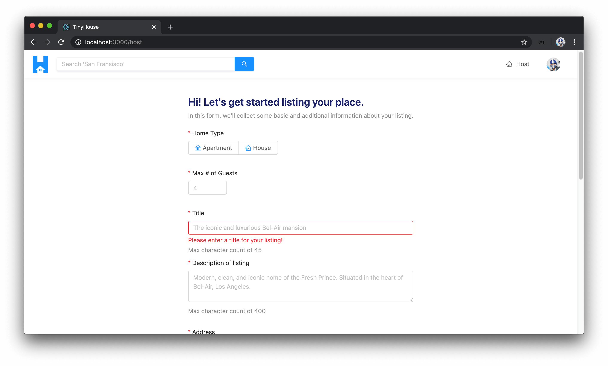
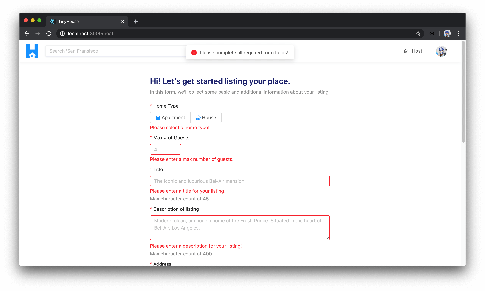
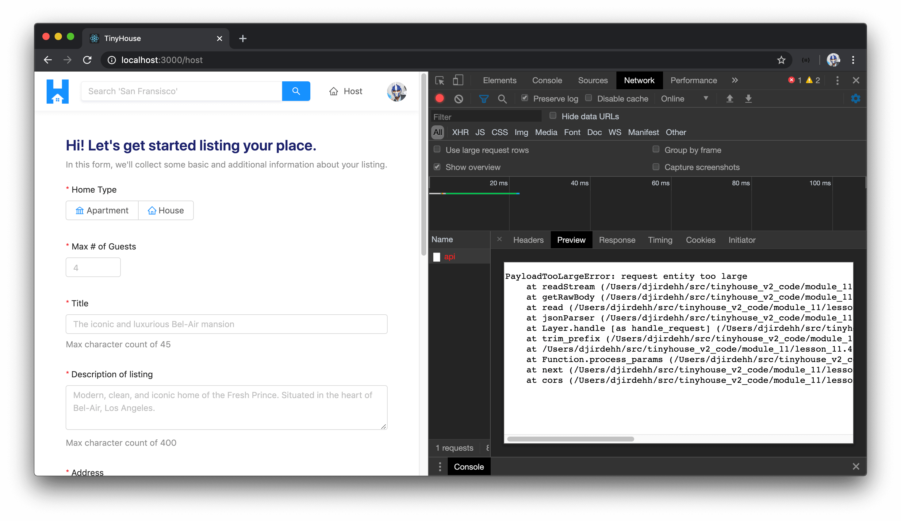
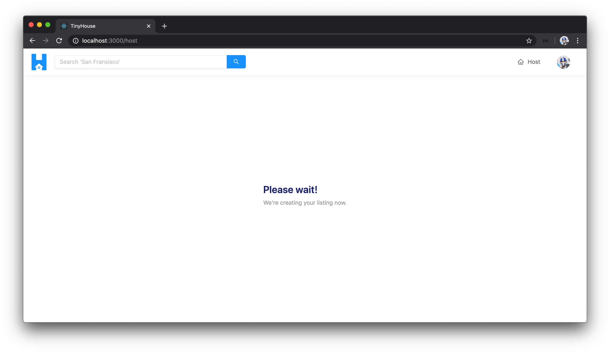
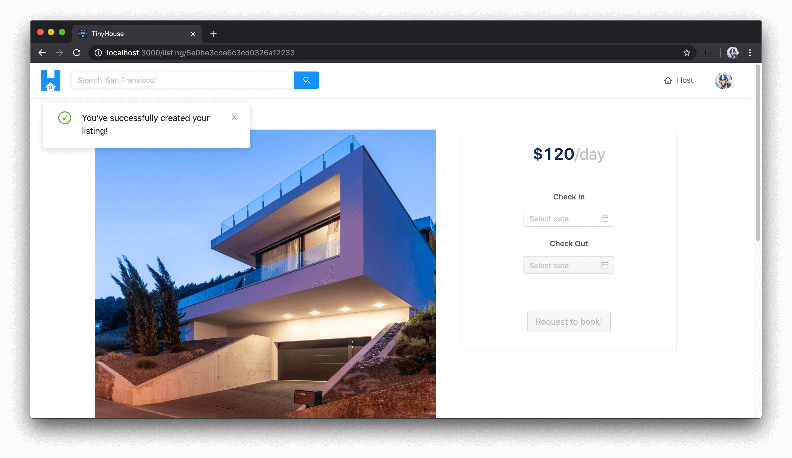
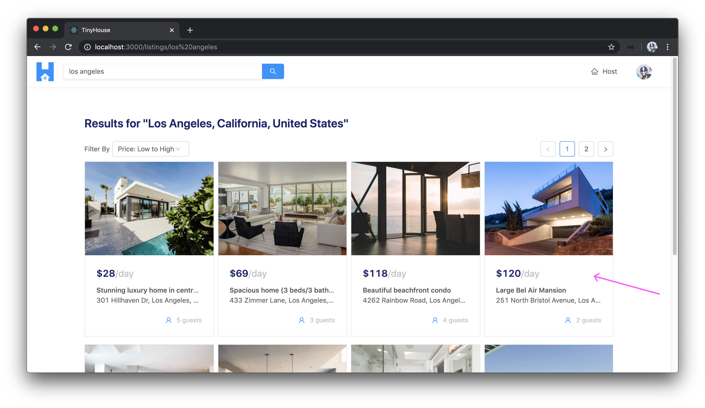
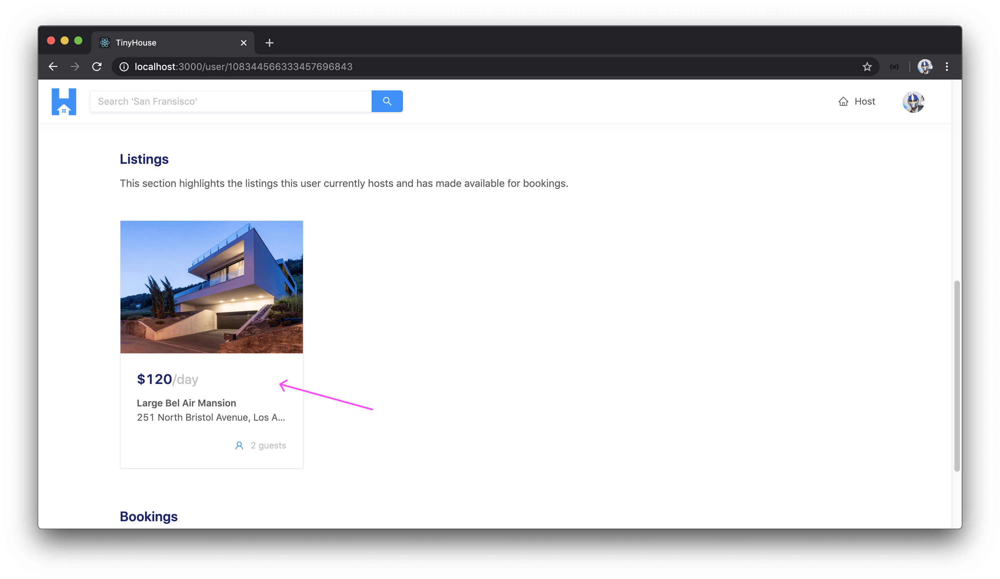

# Executing the HostListing Mutation

The majority of the work we've needed to do for the form shown in the `/host` page was completed in the last lesson. In this lesson, we need to collect the values a user is to enter in the form and when the user decides to submit the form, we'll trigger the `hostListing` mutation we have in our API and pass the relevant input along.

### `hostListing`

The first thing we'll do is ensure we have the GraphQL mutation document for the `hostListing` mutation. In the `src/lib/graphql/mutations/` folder for our client, we'll create another folder to contain an `index.ts` file that will have the `hostListing` mutation document.

    client/
      src/
        lib/
          graphql/
            mutations/
              // ...
              HostListing/
                index.ts
              // ...
            // ...
        // ...
      // ...

In the `src/lib/graphql/mutations/index.ts` file, we'll re-export the soon to be created `hostListing` mutation document.

```ts
export * from "./HostListing";
```

In the `src/lib/graphql/mutations/HostListing/index.ts` file, we'll import the `gql` tag from `apollo-boost` and construct the mutation document `HOST_LISTING`. We'll specify the mutation and the `input` that it is to expect and we'll pass that input to the `hostListing` mutation field. If we recall, the `hostListing` mutation will return the `Listing` object itself that is created and added to the `"listings"` collection in our database. The only thing we'll need from the returned listing object is the listing `id`.

```ts
import { gql } from "apollo-boost";

export const HOST_LISTING = gql`
  mutation HostListing($input: HostListingInput!) {
    hostListing(input: $input) {
      id
    }
  }
`;
```

In our terminal, we'll run the `codegen:schema` command to ensure the `schema.json` file in our client application is up to date.

    npm run codegen:schema

When complete, we'll run the `codegen:generate` command to generate the typings for our GraphQL documents.

    npm run codegen:generate

### `Form.create()`

We'll then head over to the `<Host />` component kept in the `src/sections/Host/index.tsx` file. Before we import and use the `hostListing` mutation, let's see how we can access the values from the form. We mentioned in the previous lesson how the `<Form />` component from Ant Design contains a function that acts as a higher-order function that allows us to produce another component where the `form` data object is to be available. We'll want this higher component prepared and exported.

At the bottom of the `<Host />` component file, we'll create another component constant called `WrappedHost` to represent the `<Host />` component that is to be wrapped with form specific functionality. We can use the `Form.create()` function available in the imported `Form` component that takes an options object with which we'll only provide a value for the `name` property of `host_form`.

```tsx
export const WrappedHost = Form.create({
  name: "host_form"
});
```

The `Form.create()` function receives an options object and returns a function to wrap our `<Host />` component. Instead of assigning the returned function to another variable and running it, we can do this in one step by simply just concatenating the second function arguments right beside the first one.

```tsx
export const WrappedHost = Form.create({
  name: "host_form"
})(Host);
```

`Form.create()` is a generic that is intended to receive the props of the form as well the component being wrapped. We already have a `Props` interface created for the `viewer` prop that is passed into the `<Host />` component. We'll import the `FormComponentProps` interface from the type definitions of the `Form` component in Ant Design.

```tsx
import { FormComponentProps } from "antd/lib/form";
```

In the `Form.create()` function, we'll pass in the generic of an intersection type of our component `Props` and the `FormComponentProps`.

```tsx
export const WrappedHost = Form.create<Props & FormComponentProps>({
  name: "host_form"
})(Host);
```

In our `<Host />` component function, we can now access the `form` object available from the higher-order function. We'll also specify that the type of the prop argument of the `<Host />` component function is to be an intersection of the `Props` and `FormComponentProps` interfaces.

```tsx
export const Host = ({ viewer, form }: Props & FormComponentProps) => {
  // ...
};
```

This `form` object contains a series of functions and properties where we can validate our form and collect information, etc.

#### `getFieldDecorator()` - ListingType

We can use the `getFieldDecorator()` function available in this `form` object to decorate our form items and provide field-level validations to them. Let's see how this can work. In the `<Host />` component function, we'll destruct the `getFieldDecorator()` function from the `form` object.

```tsx
const { getFieldDecorator } = form;
```

Within our first form item (for capturing the listing type), we can call the `getFieldDecorator()` function within the form item. `getFieldDecorator()` receives a few arguments and returns a function that accepts a React Node with which it decorates.

```tsx
<Item label="Home Type">
  {getFieldDecorator()(
    <Radio.Group>
      <Radio.Button value={ListingType.APARTMENT}>
        <Icon type="bank" style={{ color: iconColor }} /> <span>Apartment</span>
      </Radio.Button>
      <Radio.Button value={ListingType.HOUSE}>
        <Icon type="home" style={{ color: iconColor }} /> <span>House</span>
      </Radio.Button>
    </Radio.Group>
  )}
</Item>
```

The syntax here might appear strange but it's similar to how we used the `Form.create()` function. In the first brackets, we intend to pass in the parameters the `getFieldDecorator()` function is to accept. This `getFieldDecorator()` function will _return another function that expects a React Node_ so we'll pass the entire radio group in as the second argument.

[There are many things we can do here to decorate our form fields](<https://ant.design/components/form/#getFieldDecorator(id,-options)-parameters>) but the only thing we'll do within our form items is to validate that the user filled out all the required information. The first argument to the decorator is a unique identifier to what each form item is to represent. For the listing type form item, we'll say the `id` is `"type"` to convey that it is the listing type.

In the second argument of the `getFieldDecorator()` function for the listing type section, we can specify an options object. Within these options, we'll only declare a `rules` array to dictate that this field is required and a warning message will be shown if the user doesn't fill it in of `"Please select a home type!"`.

```tsx
<Item label="Home Type">
  {getFieldDecorator("type", {
      rules: [
        {
          required: true,
          message: "Please select a home type!"
        }
      ]
    })(
      <Radio.Group>
        <Radio.Button value={ListingType.APARTMENT}>
          <Icon type="bank" style={{ color: iconColor }} /> <span>Apartment</span>
        </Radio.Button>
        <Radio.Button value={ListingType.HOUSE}>
          <Icon type="home" style={{ color: iconColor }} /> <span>House</span>
        </Radio.Button>
      </Radio.Group>
    );
  }
</Item>
```

#### `getFieldDecorator()` - Max # of Guests

We'll specify a similar decorator for every input in our form to say that they're all required. In the last lesson, we forgot to add a form input intended to capture the maximum number of guests.

We'll create this input right after the listing type radio group with an item label of `Max # of Guests` and a minimum value for the input number of `1`.

```tsx
<Item label="Max # of Guests">
  <InputNumber min={1} placeholder="4" />
</Item>
```

We'll then specify a form decorator to dictate that this field is required with a warning message of `"Please enter the max number of guests!"`. We'll say the `id` of this decorator is `"numOfGuests"`.

```tsx
<Item label="Max # of Guests">
  {getFieldDecorator("numOfGuests", {
    rules: [
      {
        required: true,
        message: "Please enter the max number of guests!"
      }
    ]
  })(<InputNumber min={1} placeholder="4" />)}
</Item>
```

#### `getFieldDecorator()` - Title

For the title input, we'll have a decorator to make sure it's required and a warning message of `"Please enter a title for your listing!"`.

```tsx
<Item label="Title" extra="Max character count of 45">
  {getFieldDecorator("title", {
    rules: [
      {
        required: true,
        message: "Please enter a title for your listing!"
      }
    ]
  })(<Input maxLength={45} placeholder="The iconic and luxurious Bel-Air mansion" />)}
</Item>
```

#### `getFieldDecorator()` - Description

For the description input, we'll add a decorator to say it's required with a validation message of `"Please enter a description for your listing!"`.

```tsx
<Item label="Description of listing" extra="Max character count of 400">
  {getFieldDecorator("description", {
    rules: [
      {
        required: true,
        message: "Please enter a description for your listing!"
      }
    ]
  })(
    <Input.TextArea
      rows={3}
      maxLength={400}
      placeholder="Modern, clean, and iconic home of the Fresh Prince. Situated in the heart of Bel-Air, Los Angeles."
    />
  )}
</Item>
```

#### `getFieldDecorator()` - Address, City, State, & Postal Code

For the address, city (or town), state (or province), and zip/postal code inputs, they'll have decorators referencing their fields. They'll all be required and they'll have warning messages accordingly if the user attempts to submit the form without providing the necessary values.

```tsx
<Item label="Address">
  {getFieldDecorator("address", {
    rules: [
      {
        required: true,
        message: "Please enter an address for your listing!"
      }
    ]
  })(<Input placeholder="251 North Bristol Avenue" />)}
</Item>

<Item label="City/Town">
  {getFieldDecorator("city", {
    rules: [
      {
        required: true,
        message: "Please enter a city (or region) for your listing!"
      }
    ]
  })(<Input placeholder="Los Angeles" />)}
</Item>

<Item label="State/Province">
  {getFieldDecorator("state", {
    rules: [
      {
        required: true,
        message: "Please enter a state for your listing!"
      }
    ]
  })(<Input placeholder="California" />)}
</Item>

<Item label="Zip/Postal Code">
  {getFieldDecorator("postalCode", {
    rules: [
      {
        required: true,
        message: "Please enter a zip code for your listing!"
      }
    ]
  })(<Input placeholder="Please enter a zip code for your listing!" />)}
</Item>
```

#### `getFieldDecorator()` - Image

Similarly, we'll add a decorator to the image upload input with a warning message of something along the lines of `"Please provide an image for your listing!"`.

```tsx
<Item label="Image" extra="Images have to be under 1MB in size and of type JPG or PNG">
  <div className="host__form-image-upload">
    {getFieldDecorator("image", {
      rules: [
        {
          required: true,
          message: "Please enter provide an image for your listing!"
        }
      ]
    })(<Upload>// ...</Upload>)}
  </div>
</Item>
```

#### `getFieldDecorator()` - Price

Finally, we'll have a field decorator for the price input to say that a price is also required.

```tsx
<Item label="Price" extra="All prices in $USD/day">
  {getFieldDecorator("price", {
    rules: [
      {
        required: true,
        message: "Please enter a price for your listing!"
      }
    ]
  })(<InputNumber min={0} placeholder="120" />)}
</Item>
```

Let's see how these changes would currently behave. We'll need to ensure we're importing the higher-order `<Host />` component so in the `src/index.tsx` file, we'll import `WrappedHost` instead of `Host` and we'll alias it as `Host`.

```tsx
import {
  AppHeader,
  Home,
  WrappedHost as Host,
  Listing,
  Listings,
  Login,
  NotFound,
  Stripe,
  User
} from "./sections";
```

If we take a look at the `/host` page now, we'll see the form inputs appear as expected however we'll also see small star symbols along with each form item label which is a tell that the inputs are to be required. At this moment, the submit button of our form doesn't really do anything. However, if we attempted to type something in an input, erase it, and click elsewhere - we'll see the warning message of that form item be shown!



Great! However, when the form is submitted, we'll want to see the field level validations for all the form inputs that haven't been provided. We'll want to trigger a form submit event when the `"Submit"` button at the bottom of our form is clicked. This can often be done in normal `form` elements in HTML by attaching a `type` attribute of `submit` and attaching an `onSubmit()` attribute to the `form` element.

With the Ant Design `<Button />` element, we can do this with the available `htmlType` prop attribute with which we'll provide a value of `submit`. In the `<Form />` element, we'll attach an `onSubmit` prop that will trigger a function we'll set up called `handleHostListing()`.

```tsx
export const Host = () => {
  // ...

  return (
    <Content className="host-content">
      <Form layout="vertical" onSubmit={handleHostListing}>
        {/* ... */}

        {/* ... */}

        {/* ... */}

        <Item>
          <Button type="primary" htmlType="submit">
            Submit
          </Button>
        </Item>
      </Form>
    </Content>
  );
};
```

We'll create this `handleHostListing()` function in the component and it will expect an `evt` object that is to be passed in from the form submit event. We can declare the type of a form event in React by the `FormEvent` interface we can import from the React library.

```tsx
import React, { useState, FormEvent } from "react";
```

When a `form` is submitted, it makes a request and _reloads_ the page by default. We don't want that. We want the event to be triggered where we can capture the form values and call our mutation. With that said, we'll run the `preventDefault()` function of the event object to prevent the default situation of making an actual request.

```tsx
export const Host = () => {
  // ...

  const handleHostListing = (evt: FormEvent) => {
    evt.preventDefault();
  };

  return (
    <Content className="host-content">
      <Form layout="vertical" onSubmit={handleHostListing}>
        {/* ... */}

        {/* ... */}

        {/* ... */}

        <Item>
          <Button type="primary" htmlType="submit">
            Submit
          </Button>
        </Item>
      </Form>
    </Content>
  );
};
```

In the `handleHostListing()` function, we'll want to capture the values from the form and verify if all form information has been provided. We can achieve this by running the `validateFields()` method from the `form` prop object with which the first argument is an error property that determines if any errors are to exist in the form. The second argument is the actual values of the form.

```tsx
const handleHostListing = async (evt: FormEvent) => {
  evt.preventDefault();

  form.validateFields((err, values) => {});
};
```

Errors from the `validateFields()` method will be present if any of the form inputs that are required haven't been given a value. We can check and say if the `err` parameter exists, we'll display an error message that tells the user `"Please complete all required form fields!"` and we'll return early.

```tsx
const handleHostListing = async (evt: FormEvent) => {
  evt.preventDefault();

  form.validateFields((err, values) => {
    if (err) {
      displayErrorMessage("Please complete all required form fields!");
      return;
    }
  });
};
```

If we head back to the `/host` page and try and click the `"Submit"` button right away, the form submit event will be fired, the `handleHostListing()` function will be called, and the `validateFields()` method of the form object is triggered. All field-level validation errors are shown and we have the page-level error message shown to us that says `"Please complete all required form fields"`.



### `hostListing()`

At this moment, we've been able to provide some decent field and form level validations on the client and we're able to capture the values in the form. We now need to prepare our data and trigger the `hostListing` mutation and pass the input data along. With that said, let's import the `useMutation` Hook from React Apollo, the `HOST_LISTING` mutation document, and the corresponding type definitions.

```tsx
import { useMutation } from "@apollo/react-hooks";
import { HOST_LISTING } from "../../lib/graphql/mutations";
import {
  HostListing as HostListingData,
  HostListingVariables
} from "../../lib/graphql/mutations/HostListing/__generated__/HostListing";
```

At the beginning of our `<Host />` component function, we'll use the `useMutation` Hook to construct our `hostListing` mutation. We'll pass in the TypeScript data and variables of the mutation and the mutation document itself. We'll destruct the mutation function as `hostListing()` and the `loading` and `data` properties of the mutation result.

```tsx
export const Host = () => {
  // ...

  const [hostListing, { loading, data }] = useMutation<
    HostListingData,
    HostListingVariables
  >(HOST_LISTING);

  return (
    // ...
  );
};
```

In our `handleHostListing()` function, let's prepare the form data and trigger the mutation function.

We mentioned earlier that we're going to pass a single `address` field in the input object that will be a concatenation of all the address information provided in the form. Let's prepare this `address` field. In the `handleHostListing()` function, we'll create a constant called `fullAddress` and will simply be a string that contains the `address`, `city`, `state`, and `postalCode` fields from the `values` object of the `form` prop (which is the values captured in the form).

```tsx
const handleHostListing = async (evt: FormEvent) => {
  evt.preventDefault();

  form.validateFields((err, values) => {
    if (err) {
      displayErrorMessage("Please complete all required form fields!");
      return;
    }

    const fullAddress = `${values.address}, ${values.city}, ${values.state}, ${values.postalCode}`;
  });
};
```

We'll then prepare an `input` constant object for the input expected for the `hostListing` mutation. We'll use the [spread operator](https://developer.mozilla.org/en-US/docs/Web/JavaScript/Reference/Operators/Spread_syntax) to pass all the fields in form `values` along to the `input`. We'll make some changes to some additional fields within the `input` object we intend to prepare and send to the server:

- We'll specify the `address` of the input to be the `fullAddress` value we've constructed.
- We'll update the `image` field of the input to be of the base64 value we are to track in the `imageBase64Value` state property.
- For the `price` field we'll make a small change since we've asked the user to provide the value in dollars. On the server, we store monetary values as cents so we'll multiply the `value.price` value by 100.

```tsx
const handleHostListing = async (evt: FormEvent) => {
  evt.preventDefault();

  form.validateFields((err, values) => {
    if (err) {
      displayErrorMessage("Please complete all required form fields!");
      return;
    }

    const fullAddress = `${values.address}, ${values.city}, ${values.state}, ${values.postalCode}`;

    const input = {
      ...values,
      address: fullAddress,
      image: imageBase64Value,
      price: values.price * 100
    };
  });
};
```

The `input` object we've established has all the fields the mutation expects. However, it also contains a few additional fields like the `city`, `state`, and `postalCode` information captured in the form. We don't need these since we are only expected to pass a single `address` field onto the server. As a result, we'll use the JavaScript [`delete` operator](https://developer.mozilla.org/en-US/docs/Web/JavaScript/Reference/Operators/delete) to simply delete the `city`, `state`, and `postalCode` fields from the `input` object.

We'll then call the `hostListing` mutation function and pass the `input` as a variable.

```tsx
const handleHostListing = (evt: FormEvent) => {
  evt.preventDefault();

  form.validateFields((err, values) => {
    if (err) {
      displayErrorMessage("Please complete all required form fields!");
      return;
    }

    const fullAddress = `${values.address}, ${values.city}, ${values.state}, ${values.postalCode}`;

    const input = {
      ...values,
      address: fullAddress,
      image: imageBase64Value,
      price: values.price * 100
    };
    delete input.city;
    delete input.state;
    delete input.postalCode;

    hostListing({
      variables: {
        input
      }
    });
  });
};
```

This is pretty much how we'll want the `hostListing` mutation to be triggered by the `<Host />` component. How would we want to handle the loading, success, and error states of this mutation?

#### `hostListing()` - Loading

When the `hostListing()` mutation request is loading, we'll simply have a `<Title />` and `<Text />` shown that says `"Please Wait!"` and `"We're creating your listing now!"` respectively.

```tsx
export const Host = () => {
  // ...

  if (loading) {
    return (
      <Content className="host-content">
        <div className="host__form-header">
          <Title level={3} className="host__form-title">
            Please wait!
          </Title>
          <Text type="secondary">We're creating your listing now.</Text>
        </div>
      </Content>
    );
  }

  return (
    // ...
  );
};
```

#### `hostListing()` - Error

If our mutation ever errors, we'll use the `onError()` callback result of our `useMutation` Hook to display an error message that says `"Sorry, we weren't able to create your listing."`

```tsx
const [hostListing, { loading, data }] = useMutation<
  HostListingData,
  HostListingVariables
>(HOST_LISTING, {
  onError: () => {
    displayErrorMessage(
      "Sorry! We weren't able to create your listing. Please try again later."
    );
  }
});
```

#### `hostListing()` - Success

When the `hostListing` mutation is successful, we'll do one of two things.

We'll import and use the `displaySuccessNotification()` function in the `onCompleted()` callback of the `useMutation` Hook to show a success message that says `"You've successfully created your listing!"`.

```tsx
import {
  iconColor,
  displaySuccessNotification,
  displayErrorMessage
} from "../../lib/utils";
```

```tsx
const [hostListing, { loading, data }] = useMutation<
  HostListingData,
  HostListingVariables
>(HOST_LISTING, {
  onCompleted: () => {
    displaySuccessNotification("You've successfully created your listing!");
  },
  onError: () => {
    displayErrorMessage(
      "Sorry! We weren't able to create your listing. Please try again later."
    );
  }
});
```

The other thing we're going to do is take the user _away_ from the `/host` page the moment the listing has successfully been created. We'll like to take the user directly to the `/listing/:id` page of the recently created listing. To help make this redirect, we can import and use the `<Redirect />` component from `react-router-dom`.

```tsx
import { Link, Redirect } from "react-router-dom";
```

In our `<Host />` component function, we can check that when `data` and the `hostListing` object within `data` is available, we'll redirect the user to the `/listing/:id` route. The `/listing/:id` route accepts a URL parameter of the listing `id` itself. In the `HOST_LISTING` mutation document, we've specified the `hostListing` mutation is to return the `id` of the created listing when successful. We'll use the returned `id` as the URL parameter of the redirect target route path.

```tsx
export const Host = () => {
  // ...

  if (data && data.hostListing) {
    return <Redirect to={`/listing/${data.hostListing.id}`} />;
  }

  return (
    // ...
  );
};
```

At this moment, if we were to visit the `/host` page and attempt to create a listing, we'll get an error. If we open the network logs, it tells us that the request entity was too large.



Why is this happening? The default HTTP request body json size in our server is 1MB. Base64 representation of the image _increases_ the size of the image itself due to how base64 encoding works. What's most likely happening is that our entire request exceeds 1MB even if our image file was less than 1MB in size.

What we can do, in our server project, is simply increase the body size limit of our requests. We'll head over to our server project and import the `bodyParser` package in the root `src/index.ts` file. If we don't have the `bodyParser` package in our server project, we can install it as a dependency with `npm i body-parser`.

```ts
import bodyParser from "body-parser";
```

Right before we instantiate our `ApolloServer` instance, we'll apply middleware to our `express` app and in the middleware specify a limit of our request body size as 2MB. We can do this with the `bodyParser.json()` function.

```ts
require("dotenv").config();

import express, { Application } from "express";
import bodyParser from "body-parser";
import cookieParser from "cookie-parser";
import { ApolloServer } from "apollo-server-express";
import { connectDatabase } from "./database";
import { typeDefs, resolvers } from "./graphql";

const mount = async (app: Application) => {
  const db = await connectDatabase();

  app.use(bodyParser.json({ limit: "2mb" }));
  app.use(cookieParser(process.env.SECRET));

  const server = new ApolloServer({
    typeDefs,
    resolvers,
    context: ({ req, res }) => ({ db, req, res })
  });

  server.applyMiddleware({ app, path: "/api" });
  app.listen(process.env.PORT);

  console.log(`[app] : http://localhost:${process.env.PORT}`);
};

mount(express());
```

With our server changes saved, let's now see how our application would behave. We'll head back to the `/host` route of our client application, fill out all the form items in the host form, and click the `"Submit"` button.

We'll first see the loading information in the `/host` page that tells us the listing is being created.



When the `hostListing` mutation is successful, we're taken to the `/listing/:id` page of the newly created listing and a success notification message will be shown notifying us that we've successfully created our listing!



We've already built the `/listing/:id` page before so all we needed to do was direct a user who's successfully created a new listing to the `/listing/:id` page and provide the appropriate `id` parameter.

If we were to search for the city of the listing that has just been created, we'll notice the listing as part of the search results.



If we were to visit our own `/user/:id` page, we'll see the listing we've created as part of the listings section shown on the user page!



Amazing work so far! In the next module, we'll talk a bit more about listing images and see if there's a better way of storing these images in our database.
