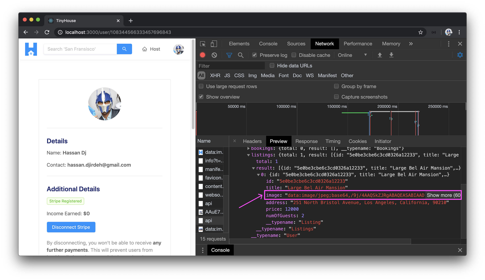
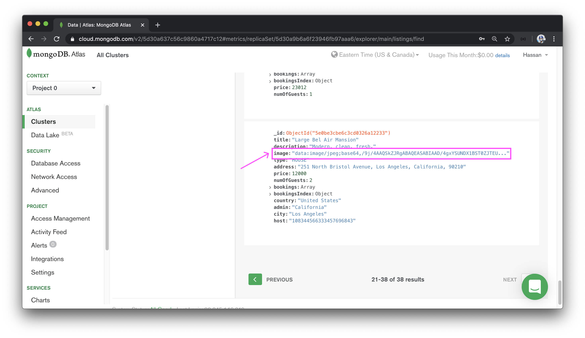
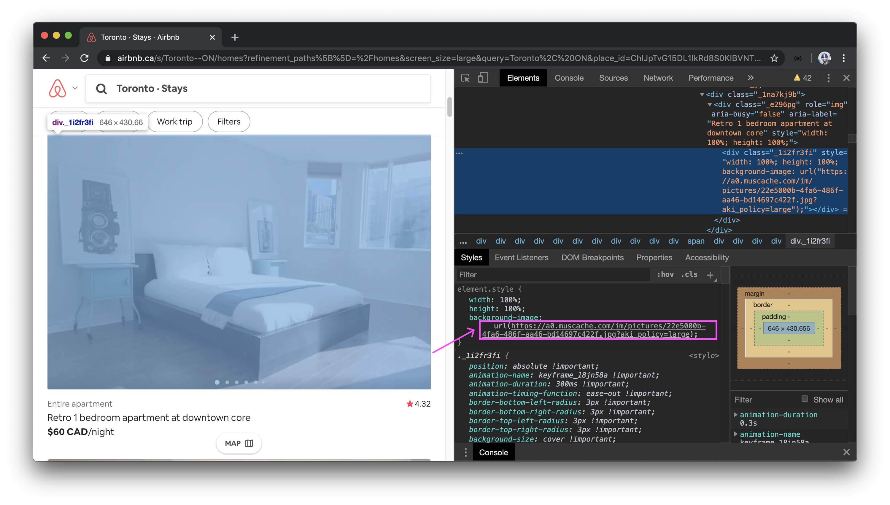
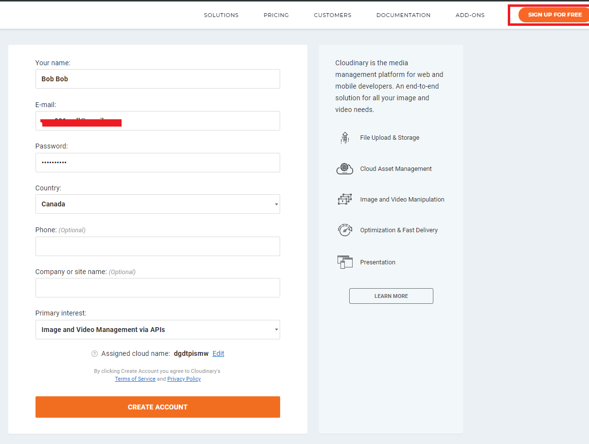
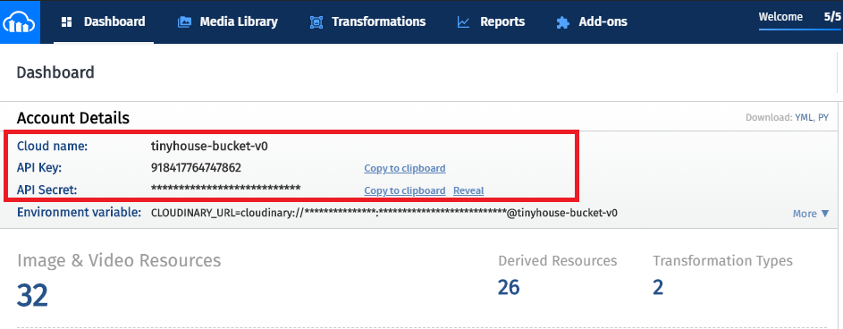

# Cloudinary & Image Storage

> 📝 A sample of the `.env` file in our server project, after this lesson is complete, can be found - [here](https://gist.github.com/djirdehh/c157bf6fbb6d77197f58c279f7b1478a). 

Let's go to the `/user/:id` route of of our own profile page in our application and examine the listing we've recently created in the last module. If we survey the data returned from our `Query.user` GraphQL field in our network inspector, we can see that the listing we just created has the base64 encoded version of the image file as the image data.

If we were to survey the `"listings"` collection in MongoDB Atlas and find the same recently created listing, we can see the same base64 encoded string in the image field.

This shouldn't be surprising because that is what we told our server to do. We encoded an image file in the client and sent the encoded image as a string to our server to be stored in our database. Thus, when we request listing data, the `listing.image` field will return the base64 encoded string directly from our database.

Although there is nothing wrong with this method of storing images, **it isn't ideal**. There are two inherent flaws with this:

1.  Images can take a lot of storage space in our database. Image files by nature are large. In addition, by base64 encoding the binary image files into a string, it actually [increases the size of the source image by about 33%](https://developer.mozilla.org/en-US/docs/Web/API/WindowBase64/Base64_encoding_and_decoding#Encoded_size_increase). The `image` field takes up more space than the rest of the fields of a single listing document combined.
2.  If all our listings had base64 images, transmitting and querying all that image data in our GraphQL queries will slow down our response time which can make our app feel laggy and un-optimized.

This is where a cloud-based image and video management service comes in! These services store our images for us on the cloud and all we need to do is save the URL link of the image in our database instead of the image itself. If our app was to even have videos, these services can help store videos as well.

**All major applications we use day-to-day use a cloud-based image and video management service**. For example, let's check out [Airbnb](http://airbnb.com/). We can visit one of a certain listing and look for the image in the document inspector.

We'll see that this particular image is hosted by the following URL.

<https://a0.muscache.com/im/pictures/22e5000b-4fa6-486f-aa46-bd14697c422f.jpg?aki_policy=large>

Cloud-based image management services solve the previous two problems we talked about above:

1.  We won't need to store the images directly into our database anymore since we'll just be storing the URL link to it. This makes our database smaller which increases the speed of certain database operations, such as copying, reading, backups, etc! Not to mention, this can save money since database memory costs money.
2.  It makes our app much more responsive because we're not transmitting or querying all that image data from our GraphQL queries. Our GraphQL queries will only query for the URLs for the image fields of listings and when we pass the URLs to the HTML `` tags in our client, they will load the individual images in parallel.

Another significant advantage that we won't necessarily use but is incredibly helpful is that these cloud-based image services often allow the capability to manipulate and enhance images with a URL-based API. With popular cloud-based solutions, practically any kind of image manipulation that we can think can be done such as changing the pixel size, adding filters, rotating, rounding corners, and much more.

If we take a closer look at the URL we found for that listing in Airbnb, we'll see a query parameter that says `aki_policy=large`. We can probably gather that this image has been given a `large` size based on this particular parameter. If we were to change the value of the `aki_policy` parameter to `medium`, we'll get a slightly smaller image. `small` gives us an even smaller image, and so on. This is incredibly helpful for a multitude of reasons. As an example, we can obtain certain image sizes we're looking for directly from the URL which can help avoid the need to manipulate image sizes with CSS.

### Cloudinary

Though many different cloud solutions exist, one of the more popular cloud-based image and video management services is [Cloudinary](http://cloudinary.com/). Cloudinary has a free plan allowing us to store around 25 GB of managed images for free which is perfect for trying it out in development.

If you don't have a Cloudinary account, the first thing you'll need to do head over to the Cloudinary site - [cloudinary.com](http://cloudinary.com) and click on the SIGN UP FOR FREE button. Here's where you'll fill in your information and sign up.

Once signed up, Cloudinary should send you a verification email for the email for your account.

Within the signup form, you should have the opportunity to provide the name of your choice for your account where you can store your images and videos. We encourage you to pick a name that you prefer. You'll also have the opportunity to change your cloud name in the account settings section of your dashboard.

When you've verified with your Cloudinary account and have signed in with it, you'll land within the Dashboard of your account (this is the `/console` route). Here we'll see some stats about our Cloudinary account but what is of interest to us is the account details section at the top.

To use Cloudinary's API in our server application and make changes to a certain Cloudinary account, we'll need to have all three of these account credentials here - **Cloud Name**, **API Key**, and **API Secret**. Since this is environment-specific information, let's store this information in the `.env` file of our server project.

We'll copy over the cloud name first and store its value as an environment variable called **CLOUDINARY_NAME.**

    CLOUDINARY_NAME=tinyhouse-bucket-v0

We'll copy the API Key value and store it as an environment variable we'll call **CLOUDINARY_KEY**.

    CLOUDINARY_KEY=******************

Finally, we'll copy over the API Secret value and store it as an environment variable we'll call **CLOUDINARY_SECRET**.

    CLOUDINARY_SECRET=*********************

In the next lesson, we'll pick up from here and begin modifying our server code to utilize Cloudinary to host listing images for our web app.
