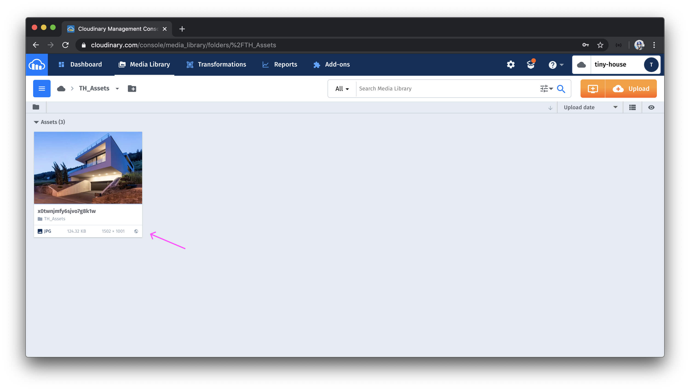

# Image uploads with Cloudinary

> To upload an image asset to the cloud with the Cloudinary API, we'll follow the approach highlighted in the **Upload method** section of the Cloudinary documentation which can be seen - [here](https://cloudinary.com/documentation/image_upload_api_reference#upload_method).
> 📝 This module's quiz can be found - [here](./protected/multiple-choice-questions.pdf).<br/>
> 🗒️ Solutions for this module's quiz can be found - [here](./protected/multiple-choice-answers.pdf).

To use the Cloudinary API in our Node server application, we'll need to first install the relevant [cloudinary](https://github.com/cloudinary/cloudinary_npm) package. We'll head to our terminal and in our server project, install the `npm` `cloudinary` library as a dependency.

```shell
npm i cloudinary
```

The community has recently prepared a declaration file directly in the `npm` `cloudinary` package so we won't have to install additional typings.

### `Cloudinary`

Just like how we've set up dedicated files for Stripe and Google to prepare functions to interact with their APIs, we'll create a Cloudinary.ts file in our `src/lib/api/` folder responsible in having the function needed to interact with the Cloudinary API.

```shell
server/
  src/
    // ...
    lib/
      api/
        Cloudinary.ts
        // ...
  // ...
```

In the `src/lib/api/index.ts` file, we'll re-export the soon to be created `Cloudinary` object.

```ts
export * from "./Cloudinary";
```

In the `src/lib/api/Cloudinary.ts` file, we'll import the `cloudinary` module and export an object we'll create called `Cloudinary`. The exported object will have an asynchronous function labeled `upload()` that will expect an `image` argument of type string.

```ts
import cloudinary from "cloudinary";

export const Cloudinary = {
  upload: async (image: string) => {
    // ...
  }
};
```

In our `hostListing()` resolver function, we'll call the `upload()` function available in our constructed `Cloudinary` object and pass the listing base64 encoded image as an argument to the function. The `upload()` function will then use the Cloudinary API to upload the image as an asset to our Cloudinary account storage. When successfully uploaded, we'll want the `upload()` function to return the uploaded image URL.

We can make an upload happen with an `upload()` function available in the `cloudinary` module. It's a little verbose but it'll appear something like this - `cloudinary.v2.uploader.upload()`. This would be an asynchronous function where we'll be interested in the response that is to be returned.

```ts
import cloudinary from "cloudinary";

export const Cloudinary = {
  upload: async (image: string) => {
    const res = await cloudinary.v2.uploader.upload();
  }
};
```

The `cloudinary.v2.uploader.upload()` function takes two arguments:

- The file that is going to be uploaded which will be the `image` we're going to pass in.
- An options object.

In the options object, we can specify [options for how we want the upload to happen](https://cloudinary.com/documentation/image_upload_api_reference#optional_parameters). For example, we can specify the _folder_ we'll like to upload this image on in our Cloudinary storage. This isn't a requirement but it helps organize our Cloudinary cloud server. You can upload an image to any folder you may be interested in but we'll upload it to a folder labeled `"TH_Assets"`.

```ts
import cloudinary from "cloudinary";

export const Cloudinary = {
  upload: async (image: string) => {
    const res = await cloudinary.v2.uploader.upload(image, {
      folder: "TH_Assets/"
    });
  }
};
```

To upload to our Cloudinary storage, we'll need to specify the credentials of our account within the options object. We saved the Cloudinary environment credentials of our account in our server `.env` file in the last lesson so we'll specify and label them here as follows.

- `api_key` will have the `CLOUDINARY_KEY` environment variable as the value.
- `api_secret` will have the `CLOUDINARY_SECRET` environment variable as the value.
- `cloud_name` will have the `CLOUDINARY_NAME` environment variable as the value.

```ts
import cloudinary from "cloudinary";

export const Cloudinary = {
  upload: async (image: string) => {
    const res = await cloudinary.v2.uploader.upload(image, {
      api_key: process.env.CLOUDINARY_KEY,
      api_secret: process.env.CLOUDINARY_SECRET,
      cloud_name: process.env.CLOUDINARY_NAME,
      folder: "TH_Assets/"
    });
  }
};
```

This should pretty much do the upload the way we want it to.

The only other thing we'll want to do in this function is return the URL of the uploaded image. In the Cloudinary documentation, the [sample response from the upload contains a large number of different fields](https://cloudinary.com/documentation/image_upload_api_reference#sample_response). We're interested in retrieving the URL of the upload. There is to exist a `url` and `secure_url` fields in the sample response. We'll go with attempting to access and return the `secure_url` field.

Lastly, we'll disable the `@typescript-eslint/camelcase` rule around the properties defined in our options object.

```ts
import cloudinary from "cloudinary";

export const Cloudinary = {
  upload: async (image: string) => {
    /* eslint-disable @typescript-eslint/camelcase */
    const res = await cloudinary.v2.uploader.upload(image, {
      api_key: process.env.CLOUDINARY_KEY,
      api_secret: process.env.CLOUDINARY_SECRET,
      cloud_name: process.env.CLOUDINARY_NAME,
      folder: "TH_Assets/"
    });

    return res.secure_url;
    /* eslint-enable @typescript-eslint/camelcase */
  }
};
```

### `hostListing()`

We'll now look to update the `hostListing` mutation. In the `listingResolvers` map within `src/graphql/resolvers/Listing/index.ts`, we'll import the `Cloudinary` object from the `src/lib/api/` folder.

```ts
import { Cloudinary, Google } from "../../../lib/api";
```

In our `hostListing()` mutation resolver function, right before we insert a new document to the listings collection, we'll call the `upload()` function within our `Cloudinary` instance and pass the base64 encoded image along. We'll obtain the result of this function as a constant labelled `imageUrl` and specify that as the value of the `image` field in the listing document we'll add to the database. Our `hostListing()` mutation in its entirety will look as follows:

```ts
export const listingResolvers: IResolvers = {
  // ...
  Mutation: {
    hostListing: async (
      _root: undefined,
      { input }: HostListingArgs,
      { db, req }: { db: Database; req: Request }
    ): Promise<Listing> => {
      verifyHostListingInput(input);

      let viewer = await authorize(db, req);
      if (!viewer) {
        throw new Error("viewer cannot be found");
      }

      const { country, admin, city } = await Google.geocode(input.address);
      if (!country || !admin || !city) {
        throw new Error("invalid address input");
      }

      const imageUrl = await Cloudinary.upload(input.image);

      const insertResult = await db.listings.insertOne({
        _id: new ObjectId(),
        ...input,
        image: imageUrl,
        bookings: [],
        bookingsIndex: {},
        country,
        admin,
        city,
        host: viewer._id
      });

      const insertedListing: Listing = insertResult.ops[0];

      await db.users.updateOne(
        { _id: viewer._id },
        { $push: { listings: insertedListing._id } }
      );

      return insertedListing;
    }
  }
  // ...
};
```

That's it! If we were to now create a new listing in our client application, the image of the created listing should reference the image URL in our Cloudinary account. If we head to the dashboard of our Cloudinary account and navigate to the media library section, there will be a new folder called `TH_Assets` (if it didn't exist before). By launching this particular folder, we'll see the image upload that Cloudinary has made.



Cloudinary offers a variety of different things we can do with images we've uploaded. We can customize them, edit them, enlarge them, shrink them, etc. For our use case, our purpose has been completed. We just want to host all our listing images outside of our database and in cloud-based storage where we can retrieve and use the image URLs in our application.
