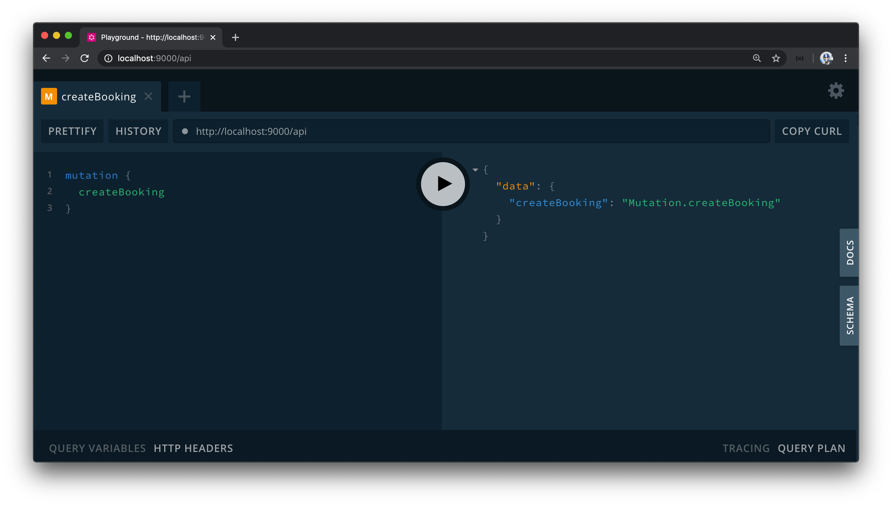

# CreateBooking GraphQL Fields

For users to book a listing in our app, we'll need functionality to handle this as well as the capability to process transactions between the tenant and host. **When a booking is made to a listing, the tenant (i.e. person making the booking) will pay the host (i.e. person who owns the listing) a set price**. We, TinyHouse, will take a small percentage of the payment as a platform fee. Let's brainstorm what GraphQL fields we'll need to accomplish this.

All we'll need for this is a single root level mutation we'll call `createBooking`. On the client, when the tenant picks the dates of when the booking should be made, provides their payment information, and finally confirms their booking - the `createBooking` mutation will be fired which facilitates that the booking has been made. Fairly straightforward, however, we'll need to handle a few things within this mutation such as recognizing the dates in which the tenant has picked for their booking and facilitating a Stripe charge from the tenant to the host.

We'll handle this step by step. In this lesson, we'll set up the GraphQL mutation field before we finalize the implementation in the next coming lessons. In our GraphQL type definitions within the `src/graphql/typeDefs.ts` file of our server project, we'll create a new field in the root `Mutation` object called `createBooking` and for now, we'll have it return a `String` when resolved successfully.

```ts
  type Mutation {
    logIn(input: LogInInput): Viewer!
    logOut: Viewer!
    connectStripe(input: ConnectStripeInput!): Viewer!
    disconnectStripe: Viewer!
    hostListing(input: HostListingInput!): Listing!
    createBooking: String!
  }
```

`createBooking` is the last mutation and root-level GraphQL field we'll create for our app! Since this mutation falls within the domain of bookings, we'll head over to the `bookingResolvers` map and look to create the resolver for this mutation field. In the `src/graphql/resolvers/Booking/index.ts` file, we'll first create a `Mutation` object and within, we'll create the resolver function called `createBooking()` that at this moment resolves to `"Mutation.createBooking"`.

```ts
export const bookingResolvers: IResolvers = {
  Mutation: {
    createBooking: () => {
      return "Mutation.createBooking";
    }
  }
  // ...
};
```

When we head to the GraphQL Playground of our server project and attempt to run the `createBooking` mutation, we'll see the expected return of `"Mutation.createBooking"`.



In the next coming lessons, we'll see how we can use the Stripe API to create a Stripe charge which will play a role in the `createBooking()` mutation resolver.
