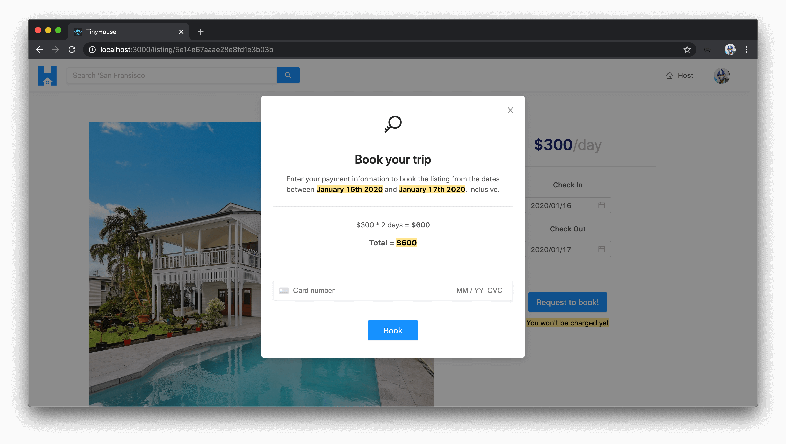
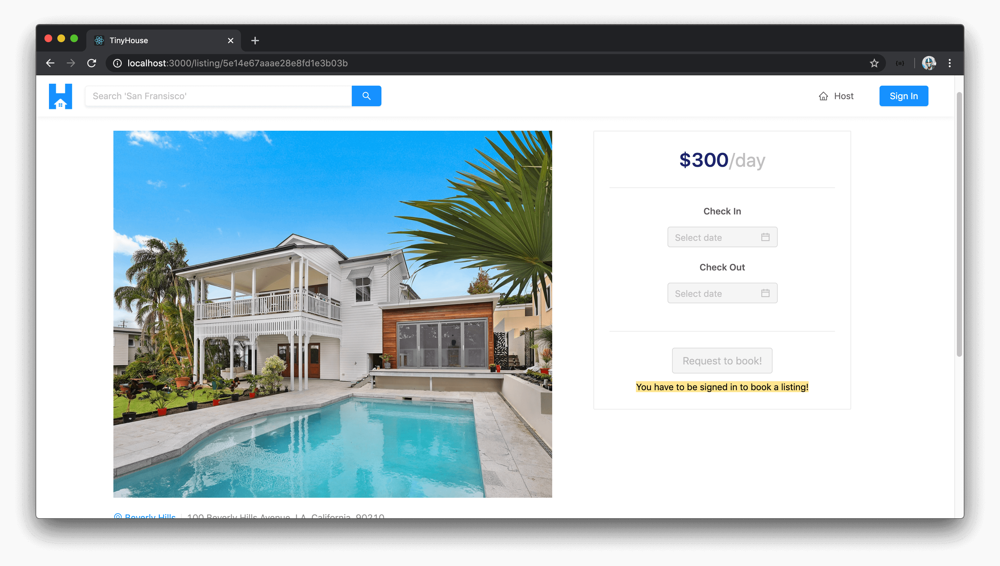
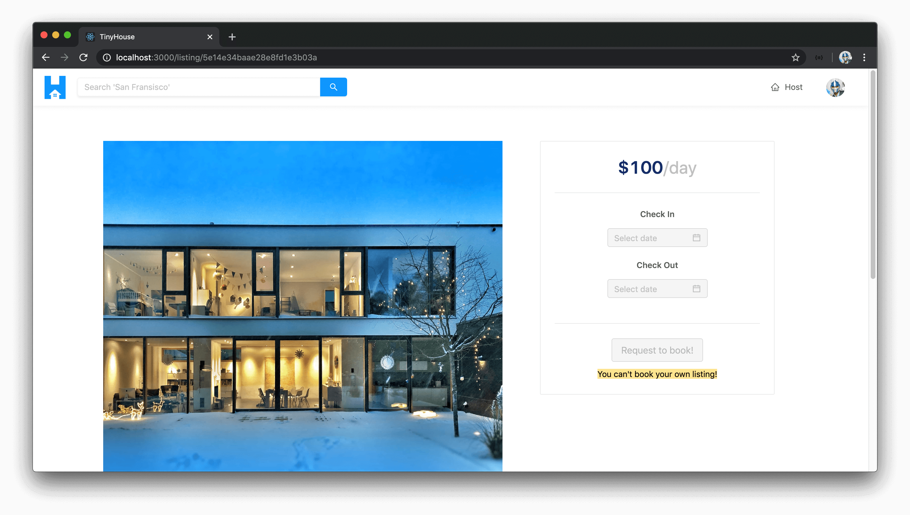
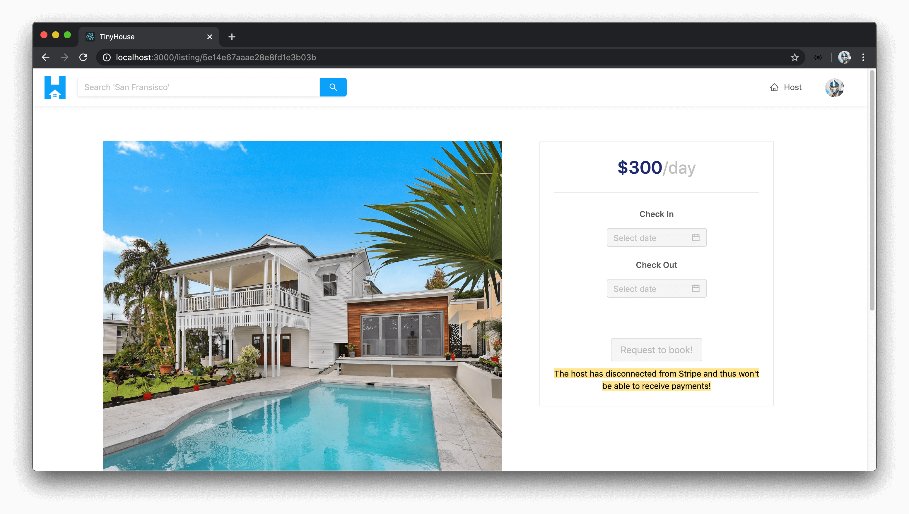

# Disabling booked dates on the client

### Gameplan

We built the `/listing/:id` page a few modules before which is the page that surfaces and displays information about a certain listing. In the `<Listing />` component rendered in the `/listing/:id` page, we retrieve the value of the dynamic `id` parameter available in the URL which we use as an argument for the `listing` query that allows us to retrieve information about a certain listing.

We also set up the component called `<ListingCreateBooking />`, rendered as a child of `<Listing />`, as the surface area where we allow a user to select the dates to check-in and check-out of a listing. We haven't built functionality further than that.

There are a few things we want to achieve here. When the user selects the check-in and check-out dates for a booking and clicks the `"Request to book!"` button, we'll want to surface a modal. This modal will be the confirmation modal where the user can confirm their booking and the dates they want to be booked. A summary of the total price it will cost them for the booking is to be displayed as well as an element where the user can provide their credit or debit card information to book their listing.



The element where the user will be able to provide their card information will be a component that we'll get and use from [Stripe](https://stripe.com/payments/elements) itself. There are a few reasons why this is helpful:

1.  The card payment component we'll use will ensure that **the user is to provide valid credit or debit card information**. If invalid information is presented, the component would have client-side UI to reflect what is incorrect. This won't be handled by us through custom means since it'll be taken care of by the component we'll use from Stripe.
2.  More importantly, when someone is to provide their payment information - it is **sensitive information**. By using elements provided to us from Stripe, we can create the capability for users to provide their information without us having to worry about handling sensitive card data on the client.

When the listing is confirmed to be booked through the `"Book"` action in the modal, this is where we'll fire the `createBooking` mutation and pass in the variables the `createBooking` mutation expects. The `createBooking` mutation expects an input that contains the `id` of the listing being booked, the `source` of the payment (which we'll get from the Stripe element), and the `checkIn` and `checkOut` dates being booked.

This are some of the main remaining things we want to handle. Additionally, there are a few other things we'll need to look into as well. In our server, we've provided some capability when a user _shouldn't_ be able to book a listing. We'll also want to provide some client-side validations as well to prevent the user from even launching the booking modal if they shouldn't be booking the listing in the first place. For example, we can _disable_ the check-in and check-out datepickers and the `"Request to Book"` button when:

- A user is not signed in to our application.
- A user attempts to book a listing of their own.
- A user attempts to book a listing where the host of the listing has **disconnected from Stripe**. In this context, we'll be unable to facilitate the payment to the host so we shouldn't allow someone to make a booking.

When bookings have been made to a listing, the listing `bookingsIndex` object will be updated to reflect which bookings have been made for it. We'll need to update the check-in and check-out datepicker inputs to prevent users from booking dates that have already been booked!

### Prevent user from booking a listing

Since there are a couple of things for us to do, we'll take it step by step. We'll first look to handle the client-side checks for disabling the check-in/check-out datepickers and the \`"Request to book!" button when the user should not be able to book a listing.

In the `<ListingCreateBooking />` component in the `src/sections/Listing/components/ListingCreateBooking/index.tsx` file, we'll create a constant element called `buttonMessage` that we'll provide a value for `"You won't be charged yet"`. This will be the message we want to show under the `"Request to book!"` button when a user can book a listing but is how we'll convey that this won't confirm the booking yet. We'll place the `buttonMessage` element within a `<Text />` component that has the `"secondary"` type and a `mark` prop.

```tsx
const { Paragraph, Text, Title } = Typography;

// ...
// ...

let buttonMessage = "You won't be charged yet";

export const ListingCreateBooking = ({
  price,
  checkInDate,
  checkOutDate,
  setCheckInDate,
  setCheckOutDate
}: Props) => {
  return (
    <div className="listing-booking">
      <Card className="listing-booking__card">
        <div>{/* ... */}</div>
        <Divider />
        <Button
          disabled={buttonDisabled}
          size="large"
          type="primary"
          className="listing-booking__card-cta"
        >
          Request to book!
        </Button>
        <Text type="secondary" mark>
          {buttonMessage}
        </Text>
      </Card>
    </div>
  );
};
```

#### Prevent booking when user is not logged in

We'll look to prevent a user from booking a listing if **they aren't logged in**. For this, we'll need access to the `viewer` object we have in our client app that keeps context of the status of the viewer (i.e. the user viewing the app). The parent `<Listing />` component doesn't have the `viewer` object available so we'll need to pass it two levels down from the root parent `<App />` component.

In the parent `<App />` component, we'll employ the render props pattern to render the `<Listing />` component for its route and we'll pass an additional `viewer` prop down.

```tsx
<Route
  exact
  path="/listing/:id"
  render={props => <Listing {...props} viewer={viewer} />}
/>
```

In the `<Listing />` component file, we'll declare that it is to expect the `viewer` prop object.

```tsx
import { Viewer } from "../../lib/types";
```

```tsx
interface Props {
  viewer: Viewer;
}
```

We'll declare the viewer prop as a value of the `props` argument and we'll pass it further down to the child `<ListingCreateBooking />` component.

```tsx
export const Listing = ({ viewer, match }: Props & RouteComponentProps<MatchParams>) => {
  // ...

  const listingCreateBookingElement = listing ? (
    <ListingCreateBooking
      viewer={viewer}
      price={listing.price}
      checkInDate={checkInDate}
      checkOutDate={checkOutDate}
      setCheckInDate={setCheckInDate}
      setCheckOutDate={setCheckOutDate}
    />
  ) : null;

  return (
    // ...
  )
};
```

In the `<ListingCreateBooking />` component, we'll specify it is to also accept a `viewer` prop object.

```tsx
// ...
import { Viewer } from "../../../../lib/types";

interface Props {
  viewer: Viewer;
  // ...
}

export const ListingCreateBooking = (
  viewer
  // ...
) => {
  // ...
};
```

With the `viewer` object available in the `<ListingCreateBooking />` component, we can check to see if the viewer is available by simply seeing if the `id` property of the `viewer` object is available. We'll set up a `checkInInputDisabled` constant in the component that will be true when `viewer.id` doesn't exist.

We can then say if the `checkInInputDisabled` value is ever `true`, so would be the `checkOutInputDisabled` value (i.e. if the user can't select a date for check-in, they shouldn't be able to select a date for check-out). If the `checkOutInputDisabled` property is ever true, the `"Request to book!"` button will be disabled as well. Finally, we'll say if the `viewer.id` value doesn't exist, the `buttonMessage` property will be updated to say - `"You have to be signed in to book a listing!"`.

We'll then add the `checkInInputDisabled` property as the value for the `disabled` prop for the check-in `<DatePicker />` input component.

```tsx
export const ListingCreateBooking = (/* ... */) => {
  // ...

  const checkInInputDisabled = !viewer.id;
  const checkOutInputDisabled = checkInInputDisabled || !checkInDate;
  const buttonDisabled = checkOutInputDisabled || !checkInDate || !checkOutDate;

  let buttonMessage = "You won't be charged yet";
  if (!viewer.id) {
    buttonMessage = "You have to be signed in to book a listing!";
  }

  return (
    <div className="listing-booking">
      <Card className="listing-booking__card">
        <div>
          <Paragraph>{/* ... */}</Paragraph>
          <Divider />
          <div className="listing-booking__card-date-picker">
            <Paragraph strong>Check In</Paragraph>
            <DatePicker
              value={checkInDate ? checkInDate : undefined}
              format={"YYYY/MM/DD"}
              showToday={false}
              disabled={checkInInputDisabled}
              disabledDate={disabledDate}
              onChange={dateValue => setCheckInDate(dateValue)}
              onOpenChange={() => setCheckOutDate(null)}
            />
          </div>
          <div className="listing-booking__card-date-picker">{/* ... */}</div>
        </div>
        <Divider />
        {/* ... */}
      </Card>
    </div>
  );
};
```

If we were to now take a look at the `/listing/:id` page of a listing when not logged in, we'll notice the check-in datepicker input is disabled since `viewer.id` doesn't exist. The check-out datepicker input and the `"Request to book!"` button are also disabled. The text below the confirmation button will say `"You have to be signed in to book a listing!"`.



#### Prevent booking when viewer attempts to book own listing

The next thing we'll check for is that **the viewer isn't attempting to book their own listing**. From the GraphQL query we make for the listing information, the `host` field is to have the user information of the user who owns the listing. To verify a viewer isn't booking a listing of their own, we can check `viewer.id` isn't equal to the `host.id`.

In the parent `<Listing />` component, we'll pass a prop labeled `host` that reflects the listing host.

```tsx
export const Listing = ({ viewer, match }: Props & RouteComponentProps<MatchParams>) => {
  // ...

  const listingCreateBookingElement = listing ? (
    <ListingCreateBooking
      viewer={viewer}
      host={listing.host}
      price={listing.price}
      checkInDate={checkInDate}
      checkOutDate={checkOutDate}
      setCheckInDate={setCheckInDate}
      setCheckOutDate={setCheckOutDate}
    />
  ) : null;

  return (
    // ...
  )
};
```

In the `<ListingCreateBooking />` component, we'll state that it is to accept a prop labeled `host`. We'll describe the shape of the `host` prop by importing the shape of the `Listing` data interface from the autogenerated types for the `listing` query and declare a lookup type to access the type of the `host` field within this listing data interface.

```tsx
import { Listing as ListingData } from "../../../../lib/graphql/queries/Listing/__generated__/Listing";

interface Props {
  viewer: Viewer;
  host: ListingData["listing"]["host"];
  // ...
}

export const ListingCreateBooking = ({
  viewer,
  host,
  price,
  checkInDate,
  checkOutDate,
  setCheckInDate,
  setCheckOutDate
}: Props) => {
  // ...
};
```

In the `<ListingCreateBooking />` component, we'll create a constant called `viewerIsHost` that holds true when the `viewer.id` matches the `host.id`. We'll say the `checkInInputDisabled` property is `true` when `viewerIsHost` is ever `true`. We'll update the `buttonMessage` property, in this case, to say `"You can't book your own listing!"`.

```tsx
export const ListingCreateBooking = (/* ... */) => {
  // ...

  const viewerIsHost = viewer.id === host.id;
  const checkInInputDisabled = !viewer.id || viewerIsHost;
  const checkOutInputDisabled = checkInInputDisabled || !checkInDate;
  const buttonDisabled = checkOutInputDisabled || !checkInDate || !checkOutDate;

  let buttonMessage = "You won't be charged yet";
  if (!viewer.id) {
    buttonMessage = "You have to be signed in to book a listing!";
  } else if (viewerIsHost) {
    buttonMessage = "You can't book your own listing!";
  }

  return (
    // ...
  );
};
```

If we were to launch the listing page of one of our recently create listings, we'll see that we're unable to check-in or check-out to make a booking and we're presented with the message - `"You can't book your own listing!"`.



#### Prevent booking when host has disconnected from Stripe

The last thing we'll consider here is when a **viewer attempts to book a listing where the `host` has disconnected from Stripe**. This will be fairly simple to check for and we can use the `hasWallet` field within the `host` object. In the database, a user document has the `walletId` field that is populated when a user has connected with Stripe. In our GraphQL API, we've mentioned the client wouldn't necessarily need to know the actual `walletId` value so we instead return a boolean called `hasWallet`.

We'll have the `checkInInputDisabled` constant also be `true` if the `hasWallet` field within the `host` object doesn't exist. In this condition, we'll place a message that says `"The host has disconnected from Stripe and thus won't be able to receive payments."`.

```tsx
export const ListingCreateBooking = (/* ... */) => {
  // ...

  const viewerIsHost = viewer.id === host.id;
  const checkInInputDisabled = !viewer.id || viewerIsHost || !host.hasWallet;
  const checkOutInputDisabled = checkInInputDisabled || !checkInDate;
  const buttonDisabled = checkOutInputDisabled || !checkInDate || !checkOutDate;

  let buttonMessage = "You won't be charged yet";
  if (!viewer.id) {
    buttonMessage = "You have to be signed in to book a listing!";
  } else if (viewerIsHost) {
    buttonMessage = "You can't book your own listing!";
  } else if (!host.hasWallet) {
    buttonMessage =
      "The host has disconnected from Stripe and thus won't be able to receive payments.";
  }

  return (
    // ...
  );
};
```

To test this out, we can create a listing with an account that is logged-in and connected with Stripe. We'll then have the account disconnect from Stripe and log-in with another user account that will attempt to book the listing created by the former account. In this condition, we'll notice that the datepicker inputs are disabled and we're presented with the message that says `"The host has disconnected from Stripe"`.



### Disable dates that have been booked

The last thing we'll handle in this lesson is to make sure **the dates that have already been booked for the listing is disabled in the datepicker elements**. The `bookingsIndex` object is available in the `listing` data object available in the parent that is to contain information about the dates that have been booking in a listing. In the `<Listing />` component, we'll pass a prop called `bookingsIndex` with the value being the `listing.bookingsIndex` object.

```tsx
export const Listing = ({ viewer, match }: Props & RouteComponentProps<MatchParams>) => {
  // ...

  const listingCreateBookingElement = listing ? (
    <ListingCreateBooking
      viewer={viewer}
      host={listing.host}
      price={listing.price}
      bookingsIndex={listing.bookingsIndex}
      checkInDate={checkInDate}
      checkOutDate={checkOutDate}
      setCheckInDate={setCheckInDate}
      setCheckOutDate={setCheckOutDate}
    />
  ) : null;

  return (
    // ...
  )
};
```

In the `<ListingCreateBooking />` component, we'll want to declare that the component is to accept the `bookingsIndex` prop. We'll specify the type of the prop for the type of the `bookingsIndex` field within the listing object from our GraphQL data.

```tsx
interface Props {
  viewer: Viewer;
  host: ListingData["listing"]["host"];
  price: number;
  bookingsIndex: ListingData["listing"]["bookingsIndex"];
  // ...
}
```

```tsx
export const ListingCreateBooking = ({
  viewer,
  host,
  price,
  bookingsIndex,
  checkInDate,
  checkOutDate,
  setCheckInDate,
  setCheckOutDate
}: Props) => {
  // ...
};
```

The `bookingsIndex` field is sent as a `string` from the server to the client. At the beginning of the `<ListingCreateBooking />` component, we'll specify a new constant called `bookingsIndexJSON` that is an object representation of the string. We can achieve this with the help of the [`JSON.parse()`](https://developer.mozilla.org/en-US/docs/Web/JavaScript/Reference/Global_Objects/JSON/parse) function available in JavaScript.

```tsx
export const ListingCreateBooking = (/* ...*/) => {
  const bookingsIndexJSON = JSON.parse(bookingsIndex);

  // ...
};
```

The `JSON.parse()` function doesn't tell us what the type of the returned property is going to be. To ensure we're taking advantage of TypeScript, let's look to define a type for the `bookingsIndexJSON` constant. We'll do this in a `types.ts` file adjacent to the `index.tsx` file where the `<ListingCreateBooking />` component is being built.

```shell
client/
  src/
    // ...
    sections/
      Listing/
        components/
          // ...
          ListingCreateBooking/
            // ...
            types.ts
          // ...
      // ...
    // ...
  // ...
```

In the `src/sections/Listing/components/ListingCreateBooking/types.ts` file, we'll export and create an interface called `BookingsIndex` that essentially resembles the shape of the `bookingsIndexJSON` object within a listing. It will be very similar to what we had on the server. It'll be a key-value pair that has two nested objects. The first one will be the `BookingsIndexYear` interface that is to have another nested key-value pair for `BookingsIndexMonth`. The `BookingsIndexMonth` interface will be a key-value pair with the values being `boolean`.

```ts
interface BookingsIndexMonth {
  [key: string]: boolean;
}

interface BookingsIndexYear {
  [key: string]: BookingsIndexMonth;
}

export interface BookingsIndex {
  [key: string]: BookingsIndexYear;
}
```

In the adjacent index file, we'll import the `BookingsIndex` interface.

```tsx
import { BookingsIndex } from "./types";
```

And assign `BookingsIndex` as the type of the `bookingsIndexJSON` constant.

```tsx
const bookingsIndexJSON: BookingsIndex = JSON.parse(bookingsIndex);
```

The `disabledDate()` function, in the `<ListingCreateBooking />` component we created before, is a function to dictate which dates should be disabled in both our check-in and check-out date pickers.

When the iterated date value in the `disabledDate()` function exists and in the return statement, we can say the function will return `true` (i.e. date will be disabled) when the date is before end of today or **when a date is booked**. We'll determine that the date is booked by passing the iterated date object to another function we'll shortly create called `dateIsBooked()`.

```tsx
const disabledDate = (currentDate?: Moment) => {
  if (currentDate) {
    const dateIsBeforeEndOfDay = currentDate.isBefore(moment().endOf("day"));

    return dateIsBeforeEndOfDay || dateIsBooked(currentDate);
  } else {
    return false;
  }
};
```

The `dateIsBooked()` function would accept the `currentDate` property which should be of type `Moment` and will check that the year, month, and day value of this `currentDate` property within `bookingsIndexJSON` isn't truthy.

```tsx
const dateIsBooked = (currentDate: Moment) => {
  const year = moment(currentDate).year();
  const month = moment(currentDate).month();
  const day = moment(currentDate).date();

  if (bookingsIndexJSON[year] && bookingsIndexJSON[year][month]) {
    return Boolean(bookingsIndexJSON[year][month][day]);
  } else {
    return false;
  }
};
```

We're not done yet! Right now, a user can still pick overlapping bookings by picking a check-in date before a previous booking and _then_ picking a check-out date after the previous booking. Therefore, we will need some functionality to loop through each date the user is trying to book and ensure none of them have been booked in between.

We have a method already called `verifyAndSetCheckOutDate()` that we use to provide an additional check to verify the user is selecting a valid check-out date. In this function, we'll look to add an additional check to prevent overlapping bookings. Similar to what we did on the server, we'll use a `dateCursor` which will start at the beginning (i.e. `checkInDate`) and we'll simply loop through the dates between check-in and check-out and try to see if any of these dates have already been booked. If any dates between check-in and check-out are booked, we'll fire an error message notifying the user and return early.

```tsx
const verifyAndSetCheckOutDate = (selectedCheckOutDate: Moment | null) => {
  if (checkInDate && selectedCheckOutDate) {
    if (moment(selectedCheckOutDate).isBefore(checkInDate, "days")) {
      return displayErrorMessage(
        `You can't book date of check out to be prior to check in!`
      );
    }

    let dateCursor = checkInDate;

    while (moment(dateCursor).isBefore(selectedCheckOutDate, "days")) {
      dateCursor = moment(dateCursor).add(1, "days");

      const year = moment(dateCursor).year();
      const month = moment(dateCursor).month();
      const day = moment(dateCursor).date();

      if (
        bookingsIndexJSON[year] &&
        bookingsIndexJSON[year][month] &&
        bookingsIndexJSON[year][month][day]
      ) {
        return displayErrorMessage(
          "You can't book a period of time that overlaps existing bookings. Please try again!"
        );
      }
    }
  }

  setCheckOutDate(selectedCheckOutDate);
};
```

At this moment, if bookings were made for a listing - they'll appear as disabled date elements in each of the datepickers. If we attempt to pick a check-in and check-out date that overlapped dates that have already been booked, we'll be prevented from doing so. We'll confirm this when we build out the functionality to have bookings be made in our app.

With all the changes made in the `<ListingCreateBooking />` component, the `src/sections/Listing/components/ListingCreateBooking/index.tsx` file will appear as the following:

```tsx
import React from "react";
import { Button, Card, DatePicker, Divider, Typography } from "antd";
import moment, { Moment } from "moment";
import { Listing as ListingData } from "../../../../lib/graphql/queries/Listing/__generated__/Listing";
import { displayErrorMessage, formatListingPrice } from "../../../../lib/utils";
import { Viewer } from "../../../../lib/types";
import { BookingsIndex } from "./types";

const { Paragraph, Text, Title } = Typography;

interface Props {
  viewer: Viewer;
  host: ListingData["listing"]["host"];
  price: number;
  bookingsIndex: ListingData["listing"]["bookingsIndex"];
  checkInDate: Moment | null;
  checkOutDate: Moment | null;
  setCheckInDate: (checkInDate: Moment | null) => void;
  setCheckOutDate: (checkOutDate: Moment | null) => void;
}

export const ListingCreateBooking = ({
  viewer,
  host,
  price,
  bookingsIndex,
  checkInDate,
  checkOutDate,
  setCheckInDate,
  setCheckOutDate
}: Props) => {
  const bookingsIndexJSON: BookingsIndex = JSON.parse(bookingsIndex);

  const dateIsBooked = (currentDate: Moment) => {
    const year = moment(currentDate).year();
    const month = moment(currentDate).month();
    const day = moment(currentDate).date();

    if (bookingsIndexJSON[year] && bookingsIndexJSON[year][month]) {
      return Boolean(bookingsIndexJSON[year][month][day]);
    } else {
      return false;
    }
  };

  const disabledDate = (currentDate?: Moment) => {
    if (currentDate) {
      const dateIsBeforeEndOfDay = currentDate.isBefore(moment().endOf("day"));

      return dateIsBeforeEndOfDay || dateIsBooked(currentDate);
    } else {
      return false;
    }
  };

  const verifyAndSetCheckOutDate = (selectedCheckOutDate: Moment | null) => {
    if (checkInDate && selectedCheckOutDate) {
      if (moment(selectedCheckOutDate).isBefore(checkInDate, "days")) {
        return displayErrorMessage(
          `You can't book date of check out to be prior to check in!`
        );
      }

      let dateCursor = checkInDate;

      while (moment(dateCursor).isBefore(selectedCheckOutDate, "days")) {
        dateCursor = moment(dateCursor).add(1, "days");

        const year = moment(dateCursor).year();
        const month = moment(dateCursor).month();
        const day = moment(dateCursor).date();

        if (
          bookingsIndexJSON[year] &&
          bookingsIndexJSON[year][month] &&
          bookingsIndexJSON[year][month][day]
        ) {
          return displayErrorMessage(
            "You can't book a period of time that overlaps existing bookings. Please try again!"
          );
        }
      }
    }

    setCheckOutDate(selectedCheckOutDate);
  };

  const viewerIsHost = viewer.id === host.id;
  const checkInInputDisabled = !viewer.id || viewerIsHost || !host.hasWallet;
  const checkOutInputDisabled = checkInInputDisabled || !checkInDate;
  const buttonDisabled = checkOutInputDisabled || !checkInDate || !checkOutDate;

  let buttonMessage = "You won't be charged yet";
  if (!viewer.id) {
    buttonMessage = "You have to be signed in to book a listing!";
  } else if (viewerIsHost) {
    buttonMessage = "You can't book your own listing!";
  } else if (!host.hasWallet) {
    buttonMessage =
      "The host has disconnected from Stripe and thus won't be able to receive payments!";
  }

  return (
    <div className="listing-booking">
      <Card className="listing-booking__card">
        <div>
          <Paragraph>
            <Title level={2} className="listing-booking__card-title">
              {formatListingPrice(price)}
              <span>/day</span>
            </Title>
          </Paragraph>
          <Divider />
          <div className="listing-booking__card-date-picker">
            <Paragraph strong>Check In</Paragraph>
            <DatePicker
              value={checkInDate ? checkInDate : undefined}
              format={"YYYY/MM/DD"}
              showToday={false}
              disabled={checkInInputDisabled}
              disabledDate={disabledDate}
              onChange={dateValue => setCheckInDate(dateValue)}
              onOpenChange={() => setCheckOutDate(null)}
            />
          </div>
          <div className="listing-booking__card-date-picker">
            <Paragraph strong>Check Out</Paragraph>
            <DatePicker
              value={checkOutDate ? checkOutDate : undefined}
              format={"YYYY/MM/DD"}
              showToday={false}
              disabled={checkOutInputDisabled}
              disabledDate={disabledDate}
              onChange={dateValue => verifyAndSetCheckOutDate(dateValue)}
            />
          </div>
        </div>
        <Divider />
        <Button
          disabled={buttonDisabled}
          size="large"
          type="primary"
          className="listing-booking__card-cta"
        >
          Request to book!
        </Button>
        <Text type="secondary" mark>
          {buttonMessage}
        </Text>
      </Card>
    </div>
  );
};
```

In the next few lessons, we'll create the confirmation modal and we'll conduct the `createBooking` mutation when the user provides valid payment information. Great job so far!
