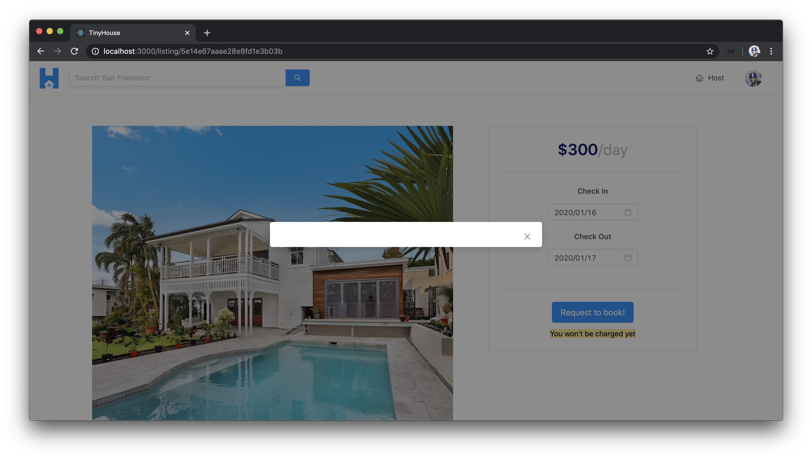
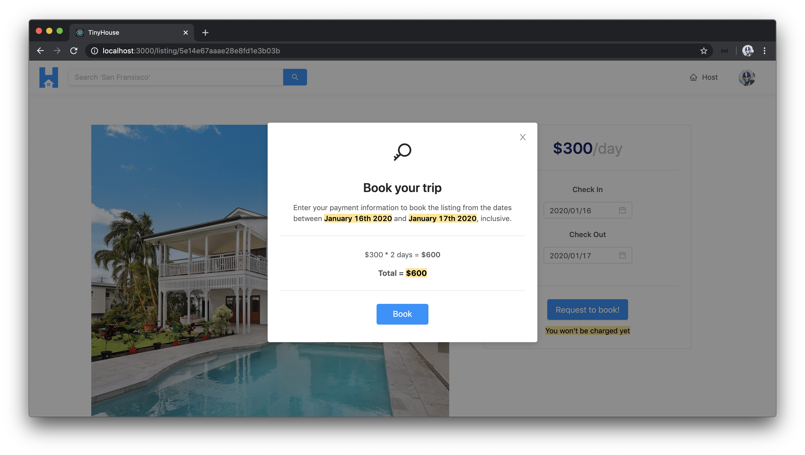

# Creating the Booking Confirmation Modal

> 📝 Diagram from Stripe documentation on the **Flow of funds with fees** when a direct charge is made in a Stripe Connect setting can be found - [here](https://stripe.com/docs/connect/direct-charges#flow-of-funds-with-fees).

In this lesson, let's look to prepare the modal that gets displayed to the user when the `"Request to book"` button has been selected in the booking section within the `/listing/:id` page. Modal dialogs are helpful since they often allow us to create a new floating layer over a certain page to get user feedback or display information without having the need to interrupt a user's workflow. We'll be using the Ant Design [`<Modal />`](https://ant.design/components/modal/) component to help facilitate this for us.

We'll create the confirmation modal within a component of its own that we'll call `<ListingCreateBookingModal />`. We'll prepare this component folder within the `components/` folder in the `src/sections/Listing/` directory.

```shell
client/
  src/
    // ...
    sections/
      Listing/
        components/
          // ...
          ListingCreateBookingModal/
            index.tsx
          // ...
        // ...
      // ...
  // ...
```

In the `src/sections/Listing/components/index.tsx` file, we'll look to re-export the soon to be created modal component.

```ts
export * from "./ListingCreateBookingModal";
```

In the `<ListingCreateBookingModal />` index file, we'll import the `React` library and the `<Modal />` component from Ant Design. We'll export a component function we'll call `<ListingCreateBookingModal />`.

```tsx
import React from "react";
import { Modal } from "antd";

export const ListingCreateBookingModal = () => {
  return (
    // ...
  )
}
```

In the component return statement, we'll look to display Ant Design's `<Modal />` component. There are a few props we'll pass in to help prepare it the way we want it to.

There exists a `visible` prop that receives a boolean value to help determine when the modal should be shown or not. When the `visible` prop has a value of `true`, the modal will show and with a value of `false`, the modal won't show. It'll be helpful to have this property value kept as part of component state. We'll have it as part of component state in the `<Listing />` component that will be a parent of this modal component.

With that said, let's assume a prop will be passed into the `<ListingCreateBookingModal />` component called `modalVisible` which is to be a `boolean` and will be the value of the `visible` prop.

The few other props we'll look to pass in will help have our Modal be centered - with the `centered prop`. We won't want to display a footer in the modal so we'll pass a value of `null` for the `footer` prop. The value of the `onCancel` prop is a callback that will trigger a function that we can use to _close_ the modal. Let's assume we'll also have a function that will be passed in from the parent called `setModalVisible()` that will be used to update the `modalVisible` state property. The `setModalVisible()` function prop will receive a boolean and will return `void`. The `onCancel` prop will trigger and call the `setModalVisible()` function and pass in a value of `false`.

```tsx
import React from "react";
import { Modal } from "antd";

interface Props {
  modalVisible: boolean;
  setModalVisible: (modalVisible: boolean) => void;
}

export const ListingCreateBookingModal = ({ modalVisible, setModalVisible }: Props) => {
  return (
    <Modal
      visible={modalVisible}
      centered
      footer={null}
      onCancel={() => setModalVisible(false)}
    ></Modal>
  );
};
```

Let's look to have this component be rendered in the `<Listing />` component. In the `<Listing />` component, we'll import the `<ListingCreateBookingModal />` component. We'll also create a new state property with a setter function that will help determine when this modal component will be shown. We'll label this state property as `modalVisible` and initialize it with `false`. We'll also destruct a function that can be used to update this state property labeled `setModalVisible()`.

Lastly, we'll look to create a constant to represent the modal component and have it rendered in the `<Listing />` component template. It shouldn't matter where we render the modal since it'll be automatically placed in the center, but we'll have it outside of the `<Row />` section.

```tsx
import {
  ListingBookings,
  ListingCreateBooking,
  ListingCreateBookingModal,
  ListingDetails
} from "./components";

// ...

export const Listing = ({ viewer, match }: Props & RouteComponentProps<MatchParams>) => {
  // ...
  const [modalVisible, setModalVisible] = useState(false);

  // ...

  const listingCreateBookingModalElement = (
    <ListingCreateBookingModal
      modalVisible={modalVisible}
      setModalVisible={setModalVisible}
    />
  );

  // ...

  return (
    <Content className="listings">
      <Row gutter={24} type="flex" justify="space-between">
        <Col xs={24} lg={14}>
          {listingDetailsElement}
          {listingBookingsElement}
        </Col>
        <Col xs={24} lg={10}>
          {listingCreateBookingElement}
        </Col>
      </Row>
      {listingCreateBookingModalElement}
    </Content>
  );
};
```

To have this modal be shown, we'll need the `modalVisible` state property in the `<Listing />` component be `true`. We want the `"Request to Book"` button action in the `<ListingCreateBooking/>` component to facilitate the launching of the modal. As a result, we'll pass the `setModalVisible()` setter function in the `<Listing />` component down to the `<ListingCreateBooking />` component.

```tsx
export const Listing = ({ viewer, match }: Props & RouteComponentProps<MatchParams>) => {
  // ...
  const [modalVisible, setModalVisible] = useState(false);

  // ...

  const listingCreateBookingElement = listing ? (
    <ListingCreateBooking
      viewer={viewer}
      host={listing.host}
      price={listing.price}
      bookingsIndex={listing.bookingsIndex}
      checkInDate={checkInDate}
      checkOutDate={checkOutDate}
      setCheckInDate={setCheckInDate}
      setCheckOutDate={setCheckOutDate}
      setModalVisible={setModalVisible}
    />
  ) : null;

  // ...
  return (
    // ...
  );
};
```

In the `<ListingCreateBooking />` component, we'll specify the `setModalVisible` prop that is to be passed down. In the `"Request to Book"` button, we'll add the `onClick` prop which will trigger a callback and call the `setModalVisible()` function and pass a value of `true`.

```tsx
interface Props {
  // ...
  setModalVisible: (modalVisible: boolean) => void;
}

export const ListingCreateBooking = ({
  // ...
  setModalVisible
}: Props) => {
  // ...
  return (
    <div className="listing-booking">
      <Card className="listing-booking__card">
        <div>{/* ... */}</div>
        <Divider />
        <Button
          disabled={buttonDisabled}
          size="large"
          type="primary"
          className="listing-booking__card-cta"
          onClick={() => setModalVisible(true)}
        >
          Request to book!
        </Button>
        <Text type="secondary" mark>
          {buttonMessage}
        </Text>
      </Card>
    </div>
  );
};
```

Let's see how this would currently behave. We'll head to the `/listing/:id` page of a listing that we aim to book. We'll pick some date values in the check-in and check-out datepicker input to have our button be enabled. When we click the `"Request to book"` button, the modal is shown!



The close icon in the modal will trigger the `onCancel` prop callback with which we revert the `modalVisible` state value to `false` and have the modal be closed.

With the modal now being able to be shown to us, let's look to populate it with the content we'll expect to show. In the `<ListingCreateBookingModal/>` component file, there are a few components from Ant Design we'll need to use - `<Button />`, `<Divider />`, `<Icon />`, and `<Typography />`. We'll import these components and we'll destruct the `<Paragraph />`, `<Text />`, and `<Title />` components from `<Typography />`.

There are a few props we'll expect this component will receive that will help show some useful information in the modal element. These props will be the `price` of the listing per day which is to be a `number` value and the `checkIn` and `checkOut` dates selected by the user. The `checkIn` and `checkOut` props will be Moment date objects so we'll import the appropriate interface from the `moment` library to define their shape.

```tsx
import React from "react";
import { Button, Divider, Icon, Modal, Typography } from "antd";
import { Moment } from "moment";

interface Props {
  price: number;
  modalVisible: boolean;
  checkInDate: Moment;
  checkOutDate: Moment;
  setModalVisible: (modalVisible: boolean) => void;
}

const { Paragraph, Text, Title } = Typography;

const ListingCreateBookingModal = ({
  price,
  modalVisible,
  checkInDate,
  checkOutDate,
  setModalVisible
}: Props) => {
  // ...
};
```

There is a small amount of data preparation we'll make. Between the check-in and check-out dates, we'll be interested in getting the number of days that have been booked. With the `moment` library, this is fairly straightforward to do and we can use the [`diff()`](https://momentjs.com/docs/#/displaying/difference/) function to get the difference between two moment dates and we'll say we'll want it in `"days"`. This will give us the difference between the two days. If we recall, we've mentioned we're interested in always counting the day being checked-in as an additional day, so we'll add `1` to this.

```tsx
// ...

const ListingCreateBookingModal = ({
  price,
  modalVisible,
  checkInDate,
  checkOutDate,
  setModalVisible
}: Props) => {
  const daysBooked = checkOutDate.diff(checkInDate, "days") + 1;

  return (
    // ...
  )
};
```

The `price` value to be available as a prop is to be the price of the listing per day. To determine the total price the user will pay, we'll multiply the price per day with the number of days being booked.

```tsx
// ...

const ListingCreateBookingModal = ({
  price,
  modalVisible,
  checkInDate,
  checkOutDate,
  setModalVisible
}: Props) => {
  const daysBooked = checkOutDate.diff(checkInDate, "days") + 1;
  const listingPrice = price * daysBooked;

  return (
    // ...
  )
};
```

We'll now prepare the template of the `<ListingCreateBookingModal />` component. We'll display a `<Title />` that will show just an icon of a key. We'll have this followed with another `<Title />` that says `"Book your trip"`. We'll have a `<Paragraph />` that says `"Enter your payment information to book the listing from the dates between"`. Within this `<Paragraph />` is where we'll want to show the check-in and check-out dates. To have the dates displayed as strings in the format `"MMMM Do YYYY"`, we'll use the [`moment.format()`](https://momentjs.com/docs/#/displaying/format/) function. In the paragraph section, we'll place the dates within `<Text />` components that have the `strong` and `mark` prop. We'll also import the `moment` function from the `moment` library.

With these changes, the `<ListingCreateBookingModal />` component will appear as follows:

```tsx
// ...

const ListingCreateBookingModal = ({
  price,
  modalVisible,
  checkInDate,
  checkOutDate,
  setModalVisible
}: Props) => {
  const daysBooked = checkOutDate.diff(checkInDate, "days") + 1;
  const listingPrice = price * daysBooked;

  return (
    <Modal
      visible={modalVisible}
      centered
      footer={null}
      onCancel={() => setModalVisible(false)}
    >
      <div className="listing-booking-modal">
        <div className="listing-booking-modal__intro">
          <Title className="listing-boooking-modal__intro-title">
            <Icon type="key"></Icon>
          </Title>
          <Title level={3} className="listing-boooking-modal__intro-title">
            Book your trip
          </Title>
          <Paragraph>
            Enter your payment information to book the listing from the dates between{" "}
            <Text mark strong>
              {moment(checkInDate).format("MMMM Do YYYY")}
            </Text>{" "}
            and{" "}
            <Text mark strong>
              {moment(checkOutDate).format("MMMM Do YYYY")}
            </Text>
            , inclusive.
          </Paragraph>
        </div>
      </div>
    </Modal>
  );
};
```

We'll place a `<Divider />` after the introduction section and then look to display information about the summary of the pricing the user will pay. In the first paragraph element, we'll essentially want to tell the user that the price per day multiplied by the number of days booked will be equal to this total price that they would pay. We'll import the `formatListingPrice()` utility function from our client's `src/lib/utils/` folder and use it to format the listing price.

In the price charges summary section, we'll also have a `<Paragraph />` element that attempts to summarize the total calculated price.

```tsx
// ...
import { formatListingPrice } from "../../../../lib/utils";

const ListingCreateBookingModal = ({
  price,
  modalVisible,
  checkInDate,
  checkOutDate,
  setModalVisible
}: Props) => {
  const daysBooked = checkOutDate.diff(checkInDate, "days") + 1;
  const listingPrice = price * daysBooked;

  return (
    <Modal
      visible={modalVisible}
      centered
      footer={null}
      onCancel={() => setModalVisible(false)}
    >
      <div className="listing-booking-modal">
        <div className="listing-booking-modal__intro">{/* ... */}</div>

        <Divider />

        <div className="listing-booking-modal__charge-summary">
          <Paragraph>
            {formatListingPrice(price, false)} x {daysBooked} days ={" "}
            <Text strong>{formatListingPrice(listingPrice, false)}</Text>
          </Paragraph>
          <Paragraph className="listing-booking-modal__charge-summary-total">
            Total = <Text mark>{formatListingPrice(listingPrice, false)}</Text>
          </Paragraph>
        </div>
      </div>
    </Modal>
  );
};
```

Finally, we'll have the modal component display a button that will be the confirmation button to actually make the booking. We'll place another `<Divider />` and render the `<Button />` component that will be of type `"primary"` and size `"large"`, and have text says `"Book"`. With this change and all the changes we've made for the `<ListingCreateBookingModal />` component, the `src/sections/Listing/components/ListingCreateBookingModal/index.tsx` file will appear as follows:

```tsx
import React from "react";
import { Button, Divider, Icon, Modal, Typography } from "antd";
import moment, { Moment } from "moment";
import { formatListingPrice } from "../../../../lib/utils";

interface Props {
  price: number;
  modalVisible: boolean;
  checkInDate: Moment;
  checkOutDate: Moment;
  setModalVisible: (modalVisible: boolean) => void;
}

const { Paragraph, Text, Title } = Typography;

export const ListingCreateBookingModal = ({
  price,
  modalVisible,
  checkInDate,
  checkOutDate,
  setModalVisible
}: Props) => {
  const daysBooked = checkOutDate.diff(checkInDate, "days") + 1;
  const listingPrice = price * daysBooked;

  return (
    <Modal
      visible={modalVisible}
      centered
      footer={null}
      onCancel={() => setModalVisible(false)}
    >
      <div className="listing-booking-modal">
        <div className="listing-booking-modal__intro">
          <Title className="listing-boooking-modal__intro-title">
            <Icon type="key"></Icon>
          </Title>
          <Title level={3} className="listing-boooking-modal__intro-title">
            Book your trip
          </Title>
          <Paragraph>
            Enter your payment information to book the listing from the dates between{" "}
            <Text mark strong>
              {moment(checkInDate).format("MMMM Do YYYY")}
            </Text>{" "}
            and{" "}
            <Text mark strong>
              {moment(checkOutDate).format("MMMM Do YYYY")}
            </Text>
            , inclusive.
          </Paragraph>
        </div>

        <Divider />

        <div className="listing-booking-modal__charge-summary">
          <Paragraph>
            {formatListingPrice(price, false)} * {daysBooked} days ={" "}
            <Text strong>{formatListingPrice(listingPrice, false)}</Text>
          </Paragraph>
          <Paragraph className="listing-booking-modal__charge-summary-total">
            Total = <Text mark>{formatListingPrice(listingPrice, false)}</Text>
          </Paragraph>
        </div>

        <Divider />

        <div className="listing-booking-modal__stripe-card-section">
          <Button size="large" type="primary" className="listing-booking-modal__cta">
            Book
          </Button>
        </div>
      </div>
    </Modal>
  );
};
```

In the parent `<Listing />` component, we'll need to ensure we pass the props that our modal component is to accept. The `price` will be the price of the listing. The values for the `checkInDate` and `checkOutDate` props will come from the state properties in the `<Listing />` component of the same name.

We'll only want to pass the values for the price and checkIn/checkOut dates when the `listing` object and the `checkIn`/`checkOut` state properties are defined. As a result, we'll place a ternary statement and say the `<ListingCreateBookingModal />` component should only be rendered when the `listing` object exists and the `checkInDate` and `checkOutDate` properties are defined. Otherwise, the element constant will be `null`.

```tsx
const listingCreateBookingModalElement =
  listing && checkInDate && checkOutDate ? (
    <ListingCreateBookingModal
      price={listing.price}
      modalVisible={modalVisible}
      checkInDate={checkInDate}
      checkOutDate={checkOutDate}
      setModalVisible={setModalVisible}
    />
  ) : null;
```

At this moment in time, if we were to select dates to check-in and check-out for a booking to be made to a listing and launch the confirmation modal - we'll be presented with a summary of the pricing that needs to be made and the dates we're interested in booking for.



There is still a big piece missing in our model and that is the actual section where the user will be able to provide their payment information. In the next lesson, we'll introduce this capability.
