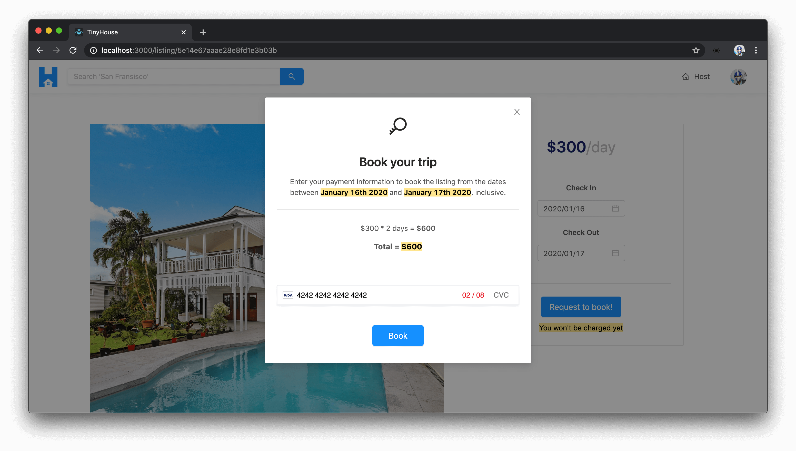
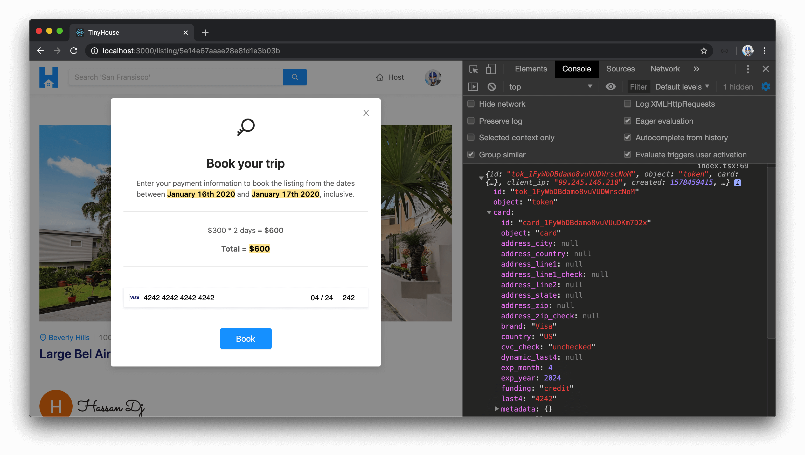

# Displaying the Payment Form with React Stripe Elements

> 📝 The **Stripe Elements for the web** documentation referenced in this lesson can be found - [here](https://stripe.com/docs/stripe-js).<br />
> 📝 The **Stripe Elements in React** documentation referenced in this lesson can be found - [here](https://stripe.com/docs/recipes/elements-react).<br />
> 📝 Documentation on **Test card numbers and tokens** that can be used within a test Stripe environment can be found - [here](https://stripe.com/docs/testing#cards).

With the `<ListingCreateBookingModal />` now presented and shown when a user attempts to request a booking, let's attempt to present the UI element where we'll be able to capture a user's credit or debit card information.

Stripe provides a library known as [**Stripe Elements**](https://stripe.com/payments/elements) which are prebuilt UI components that help capture payment information from users. Stripe Elements provides many different UI elements to capture debit/credit card information, apple pay, bank information, etc. In our app, we're only going to be accepting debit or card credit information from a user interested in making a booking.

The Stripe Elements [examples](https://stripe.com/docs/stripe-js) are often shown with HTML, CSS, and normal JavaScript. However, Stripe does offer a React component library that provides these Stripe elements as React components - [**Stripe Elements in React**](https://stripe.com/docs/recipes/elements-react). We'll be using the React library to introduce a Stripe component element to capture debit/credit card information.

Here are some of the steps that can be taken to introduce a Stripe React element as documented in the [Stripe Elements in React documentation](https://stripe.com/docs/recipes/elements-react).

1.  We'll need to install the [`react-stripe-elements`](https://github.com/stripe/react-stripe-elements) library.

2.  When the `react-stripe-elements` is installed, we're told to add a `<script />` tag in the `index.html` file of the `public/` folder of our React application to load the Stripe library. This is for PCI (i.e. Payment Card Industry) compliance and we're told **we must load the `Stripe.js` library directly from Stripe’s servers at runtime and not install it from npm or as an app dependency**.

3.  The next step is to create the payment form. The `react-stripe-elements` library gives us a `<CardElement/ >` component and an `injectStripe()` higher-order function.

- The `<CardElement/>` component is the card element we'll want to show the user.
- The `injectStripe()` function allows us to create a higher-order component that provides an injected `stripe` prop object we can use to determine the details of the payment.

4.  In the uppermost parent component, we should have our app contained within a `<StripeProvider />` component from `react-stripe-elements` which initializes Stripe and accepts an API key with which we'll pass the publishable key of our Stripe account.

5.  We can then use the `<Elements />` component from `react-stripe-elements` to wrap the payment form. The documentation tells us the `<Elements />` component is to wrap the parent that is to contain the different Stripe components.

6.  Finally, when a payment is made from the client, we can retrieve the `token` information from the injected `stripe` object prop with which the `id` will be the `source` information that we'll pass into our server from our client to dictate the payment source that was made.

7.  The rest of the documentation talks about how the server will then conduct the charge - with which we've already done.

For more details on the steps above, be sure to check out the [Using Stripe Elements in React](https://stripe.com/docs/recipes/elements-react) documentation.

Let's achieve the above step by step. First, we'll install the `react-stripe-elements` library in our client application. We'll also install the community prepared typings from the DefinitelyTyped repository.

```shell
npm i react-stripe-elements @types/react-stripe-elements
```

We'll then head over to the `public/index.html` file in our client app and load the Stripe library directly from Stripe's servers.

```html
<script src="https://js.stripe.com/v3/"></script>
```

In our root level `<App />` component file (`src/index.tsx`), we'll import the `<StripeProvider />` and `<Elements />` components from the `react-stripe-elements` library.

```tsx
import { StripeProvider, Elements } from "react-stripe-elements";
```

In the return statement of our parent `<App />` component, we'll wrap our entire app with the `<StripeProvider />` component to have stripe available everywhere. For the `apiKey` prop of `<StripeProvider />`, we'll provide the value of the `REACT_APP_S_PUBLISHABLE_KEY` environment variable we have in our client project.

TypeScript will warn us that the `apiKey` prop should be a string and the environment variable we provide can either be a `string` or `undefined`. In this case, we'll assume when our app starts, the key will always be available as a string from the environment configuration. With that said, we'll cast the type as a `string`.

```tsx
const App = () => {
  // ...

  // ...

  return (
    <StripeProvider apiKey={process.env.REACT_APP_S_PUBLISHABLE_KEY as string}>
      <Router>{/* ... */}</Router>
    </StripeProvider>
  );
};
```

The `<Elements />` component from `react-stripe-elements` should be the parent of all Stripe components we'll want to display. We'll only display the Stripe `<CardElement />` component within the `<Listing />` section component so with that said - we'll wrap the `<Listing />` component rendered in the `/listing/:id` route of our `<App />` component with `<Elements />`.

```tsx
<Route
  exact
  path="/listing/:id"
  render={props => (
    <Elements>
      <Listing {...props} viewer={viewer} />
    </Elements>
  )}
/>
```

Next, we'll head over to the `<ListingCreateBookingModal />` component (in the `src/sections/Listing/components/ListingCreateBookingModal/index.tsx` file) and import three things we'll need from `react-stripe-elements`, the `<CardElement />`, the `injectStripe()` higher-order function, and a namespace labeled `ReactStripeElements`.

```tsx
import { CardElement, injectStripe, ReactStripeElements } from "react-stripe-elements";
```

At the bottom of our `<ListingCreateBookingModal />` file, we'll create and export a new constant called `WrappedListingCreateBookingModal` that is to use the `injectStripe()` higher order function and place the `<ListingCreateBookingModal />` component within.

```tsx
export const WrappedListingCreateBookingModal = injectStripe(ListingCreateBookingModal);
```

At this moment, our `<ListingCreateBookingModal />` component function is the result of a higher-order component that is to receive a `stripe` object prop. To help define the shape of this object prop, we'll use the `ReactStripeElements` namespace.

`ReactStripeElements` isn't an interface of its own but instead a [namespace](https://www.typescriptlang.org/docs/handbook/namespaces.html). In TypeScript, namespaces act as internal modules that help organize the types and interfaces within a module. Within the `ReactStripeElements` namespace, there exists an interface called `InjectedStripeProps` which is the object interface that indicates the type of the `stripe` object available in our component.

In the `ListingCreateBookingModal()` function, we'll declare the `stripe` prop that it is to exist and we'll declare the shape of all our props as `Props & ReactStripeElements.InjectedStripeProps`.

```tsx
// ...

export const ListingCreateBookingModal = ({
  price,
  modalVisible,
  checkInDate,
  checkOutDate,
  setModalVisible,
  stripe
}: Props & ReactStripeElements.InjectedStripeProps) => {
  // ...
};
```

Right above the `<Button />` element in the returned template of the `<ListingCreateBookingModal />` component, we'll place the `<CardElement />` component. The one thing we'll want from the `<CardElement />` component is to have the postal code section hidden and we'll achieve this by using the `hidePostalCode` prop. We don't plan on showing postal code information in our payment form since we don't plan on capturing a user's postal code when a payment is made.

```tsx
export const ListingCreateBookingModal = ({
  price,
  modalVisible,
  checkInDate,
  checkOutDate,
  setModalVisible,
  stripe
}: Props & ReactStripeElements.InjectedStripeProps) => {
  // ...

  // ...

  return (
    <Modal
      visible={modalVisible}
      centered
      footer={null}
      onCancel={() => setModalVisible(false)}
    >
      {/* ... */}

      <div className="listing-booking-modal__stripe-card-section">
        <CardElement hidePostalCode className="listing-booking-modal__stripe-card" />
        <Button size="large" type="primary" className="listing-booking-modal__cta">
          Book
        </Button>
      </div>
    </Modal>
  );
};
```

At this moment, we'll need to ensure we're importing the higher-order component in the parent. In the `<Listing />` component file, we'll import `WrappedListingCreateBookingModal as ListingCreateBookingModal`.

```tsx
import {
  ListingBookings,
  ListingCreateBooking,
  WrappedListingCreateBookingModal as ListingCreateBookingModal,
  ListingDetails
} from "./components";
```

If we launch our client application, visit a valid listing page and attempt to book the listing for a period of time - we'll be presented with the confirmation modal that has the Stripe card element shown to us! The card element requests the card number, the expiry date, and the three-digit CVC code.


The card element validates the payment information provided. If we were to type a random set of numbers for the card number input, it would recognize that this is an invalid card!


If we were to provide an expiry date in the past, it would recognize that this is invalid as well.



Amazing! We're still in the testing environment of our Stripe set-up. In the [testing section](https://stripe.com/docs/testing#cards) of the Stripe documentation, Stripe tells us that **genuine card information cannot be used in test mode**. Instead, we can use a large list of valid test card numbers. For example, we'll be able to mimic a Visa card by providing a card number of `4242 4242 4242 4242`. The expiry time could be any future date and the CVC code could be any three digits.

What are we interested in happening when we click the `"Book"` button after valid payment information is provided? We know that we would want the `createBooking` mutation in our API to run. Before we build the functionality to have the `createBooking` mutation executed, let's try and get the token information from the payment element when the `"Book"` button is clicked.

In the `<ListingCreateBookingModal/>` component, we'll attach an `onClick` prop to the `"Book"` button in the modal that is to call a function we'll soon create called `handleCreateBooking()`.

```tsx
export const ListingCreateBookingModal = ({
  price,
  modalVisible,
  checkInDate,
  checkOutDate,
  setModalVisible,
  stripe
}: Props & ReactStripeElements.InjectedStripeProps) => {
  // ...

  // ...

  return (
    <Modal
      visible={modalVisible}
      centered
      footer={null}
      onCancel={() => setModalVisible(false)}
    >
      {/* ... */}

      <div className="listing-booking-modal__stripe-card-section">
        <CardElement hidePostalCode className="listing-booking-modal__stripe-card" />
        <Button
          size="large"
          type="primary"
          className="listing-booking-modal__cta"
          onClick={handleCreateBooking}
        >
          Book
        </Button>
      </div>
    </Modal>
  );
};
```

We'll create the `handleCreateBooking()` function in the component. The first thing we can check for in the function is to see if the injected `stripe` object is defined. If for some reason, the `stripe` object doesn't exist or is undefined, we'll want to display an error of sorts later, but for now, we'll just return early.

```tsx
const handleCreateBooking = async () => {
  if (!stripe) {
    return;
  }
};
```

If the `stripe` object prop does exist, the moment that this payment is made and the user wants to create the booking, we can look to run the `stripe.createToken()` function. The `stripe.createToken()` function will give us the `token` of the payment that has been made. We'll destruct this token and alias it to a variable labeled `stripeToken`. At this moment, we'll simply place a `console.log()` at the end of the `handleCreateBooking()` function and try to see what this token will look like.

```tsx
const handleCreateBooking = async () => {
  if (!stripe) {
    return;
  }

  let { token: stripeToken } = await stripe.createToken();
  console.log(stripeToken);
};
```

If we head back to our app, launch the confirmation modal, provide valid payment information, and click `"Book"` - we'll get information about the payment source that was provided (such as the brand, country, funding, etc.).



From this token information, we'll be interested in capturing the `id` of the token which is to be the source of payment being made that we'll pass over as part of the input to the `createBooking` mutation. In the next lesson, we'll investigate this and look to finalize where we've done here by triggering the `createBooking` mutation.
