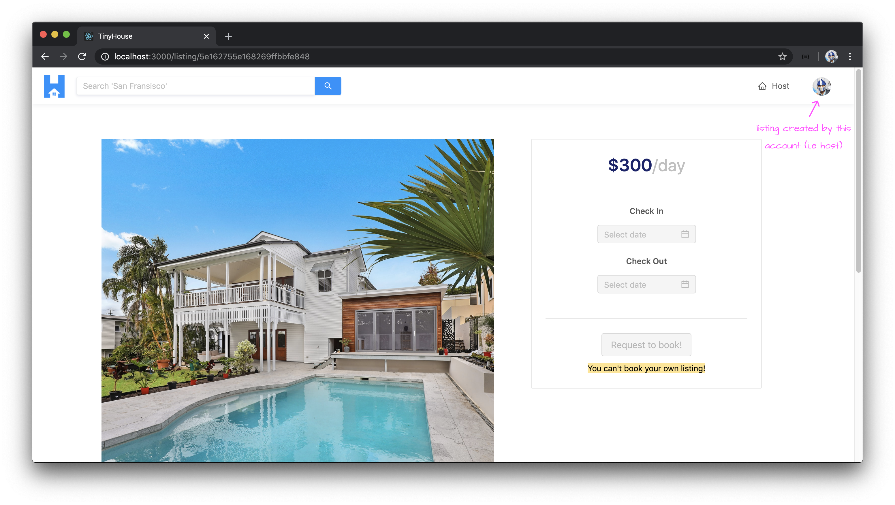
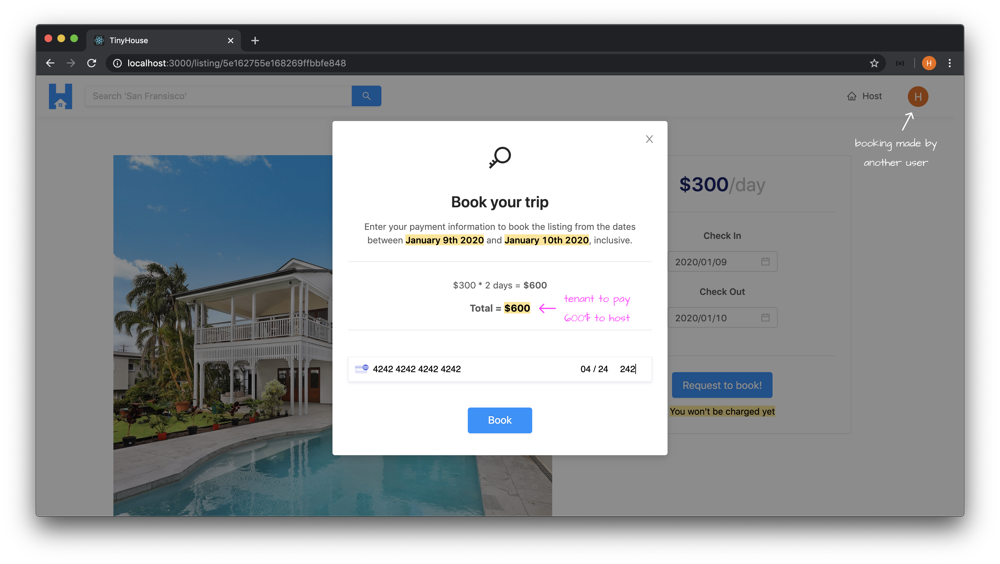
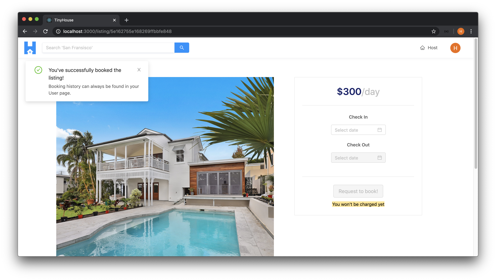
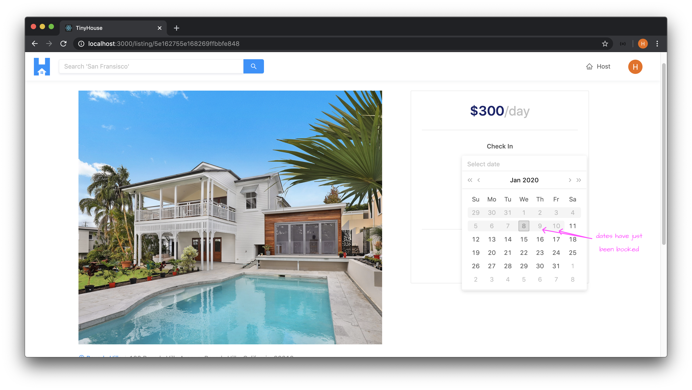
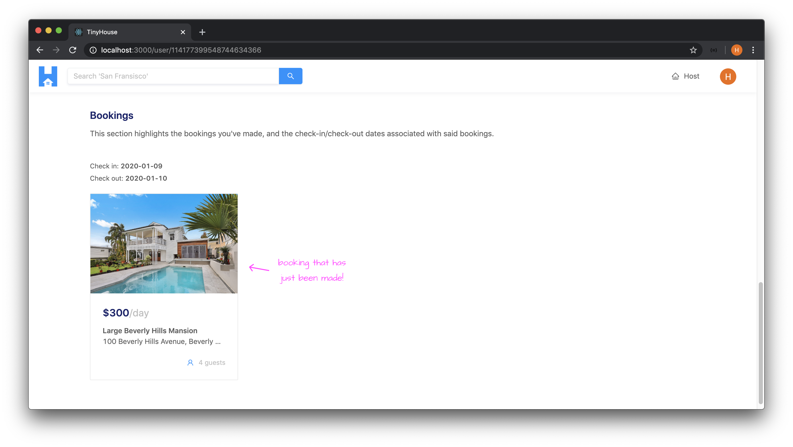
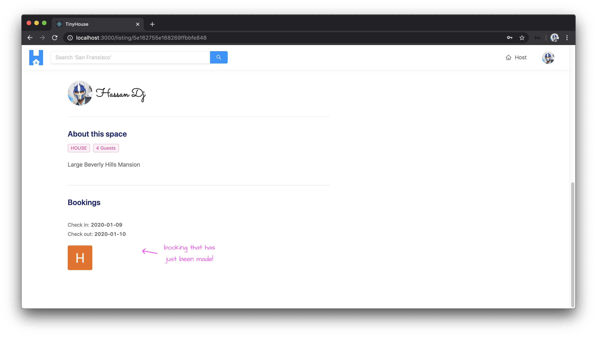
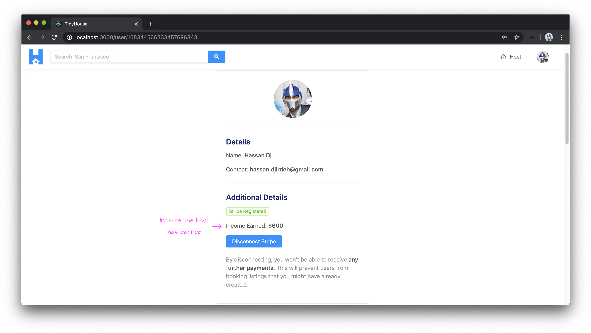
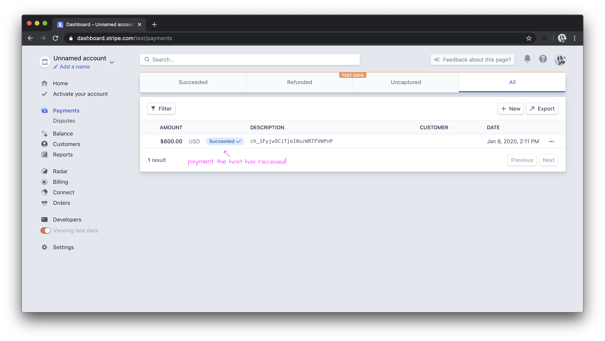
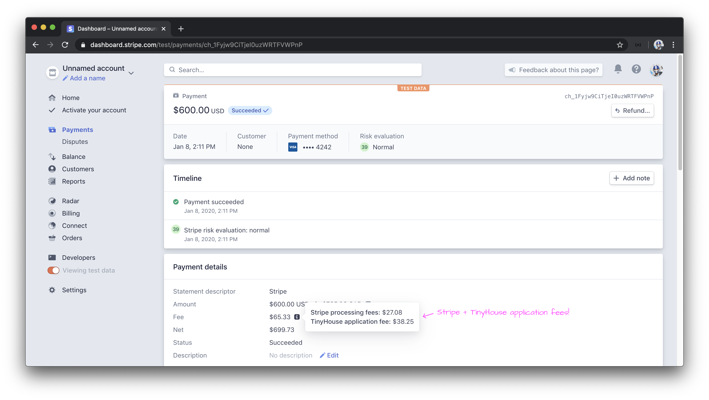
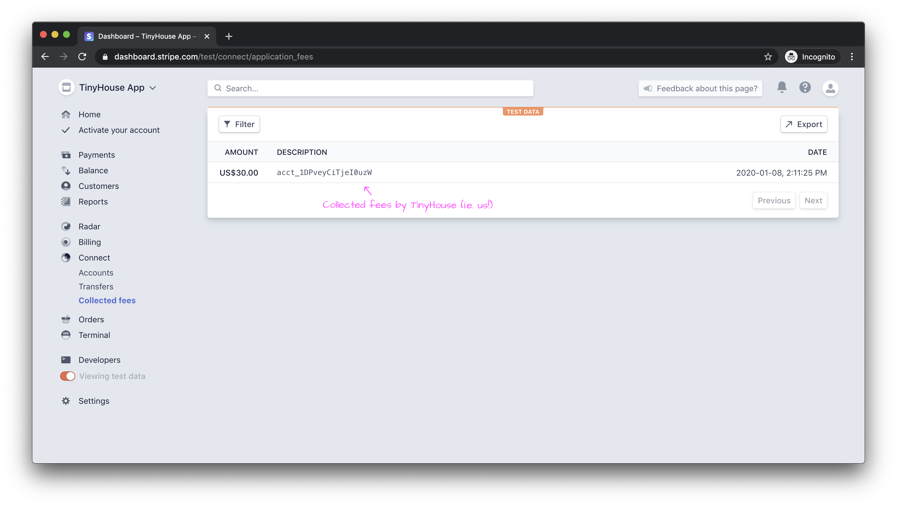

# Executing the CreateBooking Mutation

With the `<ListingCreateBookingModal />` component prepared and presenting the payment element, we'll now focus on executing the `createBooking` mutation when the user provides their payment information and is ready to book!

### `createBooking`

We'll first create the GraphQL document for the `createBooking` mutation. In the `src/lib/graphql/mutations/` folder, we'll create a `CreateBooking/` folder that is to have an `index.ts` file.

```shell
client/
  src/
    lib/
      // ...
      graphql/
        mutations/
          // ...
          CreateBooking/
            index.ts
          // ...
        // ...
      // ...
    // ...
  // ...
```

In the `src/lib/graphql/mutations/CreateBooking/index.ts` file, we'll import the `gql` tag from `apollo-boost` and construct a constant called `CREATE_BOOKING` that is to be the GraphQL mutation document. We'll name the mutation of the same name and it will expect a required input of GraphQL type `CreateBookingInput`. We'll specify the `createBooking` field as the mutation we'll want to run.

We won't need much returned from the `createBooking` mutation at all since when the mutation is successful, we'll simply close the confirmation modal in the listing page and tell the user that the listing has been booked. As a result, we'll only have the `id` of the booking result be returned and we may not even use it.

```ts
import { gql } from "apollo-boost";

export const CREATE_BOOKING = gql`
  mutation CreateBooking($input: CreateBookingInput!) {
    createBooking(input: $input) {
      id
    }
  }
`;
```

In the `src/lib/graphql/mutations/index.ts` file, we'll re-export the `CREATE_BOOKING` mutation document.

```ts
export * from "./CreateBooking";
```

We'll then head over to the terminal and run the `codegen:schema` command to update the schema file in our client project.

    npm run codegen:schema

We'll also run the `codegen:generate` command to regenerate our GraphQL related typings in the client.

    npm run codegen:generate

In our `<ListingCreateBooking />` modal file, we'll import the `useMutation` Hook, the `CREATE_BOOKING` mutation document, and the autogenerated data and variable typings associated with the mutation.

Since we'll need this shortly as well, we'll also import the `displaySuccessNotification()` and `displayErrorMessage()` functions we have in our `src/lib/utils/` folder.

```tsx
import { useMutation } from "@apollo/react-hooks";
```

```tsx
import { CREATE_BOOKING } from "../../../../lib/graphql/mutations";
import {
  CreateBooking as CreateBookingData,
  CreateBookingVariables
} from "../../../../lib/graphql/mutations/CreateBooking/__generated__/CreateBooking";
import {
  formatListingPrice,
  displaySuccessNotification,
  displayErrorMessage
} from "../../../../lib/utils";
```

At the beginning of our `<ListingCreateBookingModal />` component function, we'll declare the `useMutation` Hook, specify the shape of data and variables associated with the mutation, and we'll only destruct the mutation function and the `loading` property from the mutation result.

```tsx
const [createBooking, { loading }] = useMutation<
  CreateBookingData,
  CreateBookingVariables
>(CREATE_BOOKING);
```

We have a function in the component called `handleCreateBooking()` that runs when the user clicks the `"Book"` button and where the injected `stripe` object is available to us that has details on the payment information the user provides.

At the beginning of the `handleCreateBooking()` function, we'll check if the `stripe` prop object doesn't exist for some reason and if so, we'll run the `displayErrorMessage()` function and say `"Sorry! We weren't able to connect with Stripe"`.

```tsx
const handleCreateBooking = async () => {
  if (!stripe) {
    return displayErrorMessage("Sorry! We weren't able to connect with Stripe");
  }

  // ...
};
```

From the `stripe.createToken()` function we executed before within the `handleCreateBooking()` function, we'll be able to destruct an `error` property as well. This `error` will be populated based on invalid payment information provided in the stripe element.

```tsx
const handleCreateBooking = async () => {
  if (!stripe) {
    return displayErrorMessage("Sorry! We weren't able to connect with Stripe");
  }

  let { token: stripeToken, error } = await stripe.createToken();
  // ...
};
```

We can then check to see if the `stripeToken` property is available, and if so, run the `createBooking` mutation with the `input` variable it is to expect.

In the `input` variable object, the `source` will be the `id` from the stripe token. The `checkIn` and `checkOut` variables within `input` expect the dates in string format. We have the `checkIn` and `checkOut` date state properties available in the component so we can use `moment` to format the date objects as strings in the format we'll want - `YYYY-MM-DD`.

```tsx
const handleCreateBooking = async () => {
  if (!stripe) {
    return displayErrorMessage("Sorry! We weren't able to connect with Stripe");
  }

  let { token: stripeToken, error } = await stripe.createToken();
  if (stripeToken) {
    createBooking({
      variables: {
        input: {
          source: stripeToken.id,
          checkIn: moment(checkInDate).format("YYYY-MM-DD"),
          checkOut: moment(checkOutDate).format("YYYY-MM-DD")
        }
      }
    });
  }
};
```

If for some reason, this stripe token doesn't exist, this probably means that the user has either provided invalid payment information or hasn't provided payment information appropriately. If this is to happen, we'll run the `displayErrorMessage()` function. However, in this case, the `error` property destructed from the stripe token function _should_ have a value that determines what went wrong. In the `displayErrorMessage()` function in this condition, if the `error` property from Stripe exists and the `message` property within exists - we'll display it as the message. If not, we'll show our own generic error message of `"Sorry! We weren't able to book the listing. Please try again later!"`.

```tsx
const handleCreateBooking = async () => {
  if (!stripe) {
    return displayErrorMessage("Sorry! We weren't able to connect with Stripe.");
  }

  let { token: stripeToken, error } = await stripe.createToken();
  if (stripeToken) {
    createBooking({
      variables: {
        input: {
          source: stripeToken.id,
          checkIn: moment(checkInDate).format("YYYY-MM-DD"),
          checkOut: moment(checkOutDate).format("YYYY-MM-DD")
        }
      }
    });
  } else {
    displayErrorMessage(
      error && error.message
        ? error.message
        : "Sorry! We weren't able to book the listing. Please try again later."
    );
  }
};
```

We're still not passing in the value of the `id` property in the `input` variable of the mutation which is to reference the `id` of the listing being booked. We have the `listing` object queried in the parent `<Listing />` component. We can look to pass the `id` of the `listing` as a prop called `id` down to the `<ListingCreateBookingModal />` component.

```tsx
const listingCreateBookingModalElement =
  listing && checkInDate && checkOutDate ? (
    <ListingCreateBookingModal
      id={listing.id}
      price={listing.price}
      modalVisible={modalVisible}
      checkInDate={checkInDate}
      checkOutDate={checkOutDate}
      setModalVisible={setModalVisible}
    />
  ) : null;
```

There are two other things we'll want to pass in from the parent `<Listing />` component down to the modal child and involves what we want to happen in the UI _after_ a booking is made successfully. When a booking is made successfully, we'll want the modal closed and the input values in our check-in and check-out inputs cleared out. The state values in the parent `<Listing />` component determine these values here so we'll prepare a function in the parent called `clearBookingData()` which will be responsible in setting the state values back to their predefined states. We'll run the `setModalVisible()` function and pass a value of false. We'll run the `setCheckIn` and `setCheckOut` functions and pass values of `null`.

```tsx
const clearBookingData = () => {
  setModalVisible(false);
  setCheckInDate(null);
  setCheckOutDate(null);
};
```

We'll then pass the `clearBookingData()` function as a prop down to the modal component.

```tsx
const listingCreateBookingModalElement =
  listing && checkInDate && checkOutDate ? (
    <ListingCreateBookingModal
      id={listing.id}
      price={listing.price}
      modalVisible={modalVisible}
      checkInDate={checkInDate}
      checkOutDate={checkOutDate}
      setModalVisible={setModalVisible}
      clearBookingData={clearBookingData}
    />
  ) : null;
```

When the `createBooking` mutation is complete successfully in the modal, we'll also want the listing information presented to us on the listing page to be updated. What part of the `/listing/:id` page would we want to be updated after the mutation is complete? That is to be primarily the `bookingsIndex` of the listing. If we recall, in the `<ListingCreateBooking />` component within the `/listing/:id` page, we attempt to disable the dates of the date pickers where the dates have been specified and selected in the `bookingsIndex` of the listing (i.e. the dates have been booked).

When the user makes a new booking and if they were to remain in the `/listing/:id` page without refreshing, by opening the datepickers again - they should see the dates they've just booked be disabled in the datepickers!
To help achieve this, we can attempt to **refetch** the `listing` query after the `createBooking` mutation is successful.

With that said, we'll destruct the `refetch` property from the `useQuery` Hook in the `<Listing />` component.

```tsx
const { loading, data, error, refetch } = useQuery<ListingData, ListingVariables>(
  LISTING,
  {
    variables: {
      id: match.params.id,
      bookingsPage,
      limit: PAGE_LIMIT
    }
  }
);
```

We'll then create an asynchronous function in the `<Listing />` component called `handleListingRefetch()` that simply runs the `refetch()` function.

```tsx
const handleListingRefetch = async () => {
  await refetch();
};
```

We'll then pass the `handleListingRefetch()` function down as props to the `<ListingCreateBookingModal />` component.

```tsx
const listingCreateBookingElement = listing ? (
  <ListingCreateBooking
    viewer={viewer}
    host={listing.host}
    price={listing.price}
    bookingsIndex={listing.bookingsIndex}
    checkInDate={checkInDate}
    checkOutDate={checkOutDate}
    setCheckInDate={setCheckInDate}
    setCheckOutDate={setCheckOutDate}
    setModalVisible={setModalVisible}
  />
) : null;
```

In the modal component, let's define the new props it is to accept. The new props will involve an `id` of type `string`, a `clearBookingData()` function that returns `void`, and a `handleRefetch()` function that returns a promise that when resolved is `void`.

```tsx
interface Props {
  id: string;
  price: number;
  modalVisible: boolean;
  checkInDate: Moment;
  checkOutDate: Moment;
  setModalVisible: (modalVisible: boolean) => void;
  clearBookingData: () => void;
  handleListingRefetch: () => Promise<void>;
}
```

In the `<ListingCreateBookingModal />` component function, we'll declare the new props that it is to accept: `id`, `clearBookingData`, and `handleListingRefetch`.

```tsx
export const ListingCreateBookingModal = ({
  id,
  price,
  modalVisible,
  checkInDate,
  checkOutDate,
  setModalVisible,
  clearBookingData,
  handleListingRefetch,
  stripe
}: Props & ReactStripeElements.InjectedStripeProps) => {
  // ...
};
```

In the `handleCreateBooking()` function call, we'll pass the `id` available as props to the `id` variable of the input for the `createBooking` mutation.

```tsx
const handleCreateBooking = async () => {
  if (!stripe) {
    return displayErrorMessage("Sorry! We weren't able to connect with Stripe.");
  }

  let { token: stripeToken, error } = await stripe.createToken();
  if (stripeToken) {
    createBooking({
      variables: {
        input: {
          id,
          source: stripeToken.id,
          checkIn: moment(checkInDate).format("YYYY-MM-DD"),
          checkOut: moment(checkOutDate).format("YYYY-MM-DD")
        }
      }
    });
  } else {
    displayErrorMessage(
      error && error.message
        ? error.message
        : "Sorry! We weren't able to book the listing. Please try again later."
    );
  }
};
```

We'll then look to handle the success and error states of our mutation by using the `onCompleted()` and `onError()` callbacks of the `useMutation` Hook used for the `createBooking` mutation.

For the `onCompleted()` callback, we'll clear booking data in the parent and display a success notification with a title of `"You've successfully booked the listing!"` and a description of `"Booking history can always be found in your User page."`. We'll then run the `handleListingRefetch()` function.

For the `onError()` callback, we'll simply display a generic error message of `"Sorry! We weren't able to successfully book the listing. Please try again later!"`.

```tsx
const [createBooking, { loading }] = useMutation<
  CreateBookingData,
  CreateBookingVariables
>(CREATE_BOOKING, {
  onCompleted: () => {
    clearBookingData();
    displaySuccessNotification(
      "You've successfully booked the listing!",
      "Booking history can always be found in your User page."
    );
    handleListingRefetch();
  },
  onError: () => {
    displayErrorMessage(
      "Sorry! We weren't able to successfully book the listing. Please try again later!"
    );
  }
});
```

Lastly, we'll use the `loading` property from our mutation result and place it as a value for the `loading` prop of the actual `"Book"` button in the template.

```tsx
<Button
  size="large"
  type="primary"
  className="listing-booking-modal__cta"
  loading={loading}
  onClick={handleCreateBooking}
>
  Book
</Button>
```

With this change and all the changes we've made for the `<ListingCreateBookingModal />` component, the `src/sections/Listing/components/ListingCreateBookingModal/index.tsx` file will appear as follows.

```tsx
import React from "react";
import { useMutation } from "@apollo/react-hooks";
import { CardElement, injectStripe, ReactStripeElements } from "react-stripe-elements";
import { Button, Divider, Icon, Modal, Typography } from "antd";
import moment, { Moment } from "moment";
import { CREATE_BOOKING } from "../../../../lib/graphql/mutations";
import {
  CreateBooking as CreateBookingData,
  CreateBookingVariables
} from "../../../../lib/graphql/mutations/CreateBooking/__generated__/CreateBooking";
import {
  formatListingPrice,
  displaySuccessNotification,
  displayErrorMessage
} from "../../../../lib/utils";

interface Props {
  id: string;
  price: number;
  modalVisible: boolean;
  checkInDate: Moment;
  checkOutDate: Moment;
  setModalVisible: (modalVisible: boolean) => void;
  clearBookingData: () => void;
  handleListingRefetch: () => Promise<void>;
}

const { Paragraph, Text, Title } = Typography;

export const ListingCreateBookingModal = ({
  id,
  price,
  modalVisible,
  checkInDate,
  checkOutDate,
  setModalVisible,
  clearBookingData,
  handleListingRefetch,
  stripe
}: Props & ReactStripeElements.InjectedStripeProps) => {
  const [createBooking, { loading }] = useMutation<
    CreateBookingData,
    CreateBookingVariables
  >(CREATE_BOOKING, {
    onCompleted: () => {
      clearBookingData();
      displaySuccessNotification(
        "You've successfully booked the listing!",
        "Booking history can always be found in your User page."
      );
      handleListingRefetch();
    },
    onError: () => {
      displayErrorMessage(
        "Sorry! We weren't able to successfully book the listing. Please try again later!"
      );
    }
  });

  const daysBooked = checkOutDate.diff(checkInDate, "days") + 1;
  const listingPrice = price * daysBooked;

  const handleCreateBooking = async () => {
    if (!stripe) {
      return displayErrorMessage("Sorry! We weren't able to connect with Stripe.");
    }

    let { token: stripeToken, error } = await stripe.createToken();
    if (stripeToken) {
      createBooking({
        variables: {
          input: {
            id,
            source: stripeToken.id,
            checkIn: moment(checkInDate).format("YYYY-MM-DD"),
            checkOut: moment(checkOutDate).format("YYYY-MM-DD")
          }
        }
      });
    } else {
      displayErrorMessage(
        error && error.message
          ? error.message
          : "Sorry! We weren't able to book the listing. Please try again later."
      );
    }
  };

  return (
    <Modal
      visible={modalVisible}
      centered
      footer={null}
      onCancel={() => setModalVisible(false)}
    >
      <div className="listing-booking-modal">
        <div className="listing-booking-modal__intro">
          <Title className="listing-boooking-modal__intro-title">
            <Icon type="key"></Icon>
          </Title>
          <Title level={3} className="listing-boooking-modal__intro-title">
            Book your trip
          </Title>
          <Paragraph>
            Enter your payment information to book the listing from the dates between{" "}
            <Text mark strong>
              {moment(checkInDate).format("MMMM Do YYYY")}
            </Text>{" "}
            and{" "}
            <Text mark strong>
              {moment(checkOutDate).format("MMMM Do YYYY")}
            </Text>
            , inclusive.
          </Paragraph>
        </div>

        <Divider />

        <div className="listing-booking-modal__charge-summary">
          <Paragraph>
            {formatListingPrice(price, false)} * {daysBooked} days ={" "}
            <Text strong>{formatListingPrice(listingPrice, false)}</Text>
          </Paragraph>
          <Paragraph className="listing-booking-modal__charge-summary-total">
            Total = <Text mark>{formatListingPrice(listingPrice, false)}</Text>
          </Paragraph>
        </div>

        <Divider />

        <div className="listing-booking-modal__stripe-card-section">
          <CardElement hidePostalCode className="listing-booking-modal__stripe-card" />
          <Button
            size="large"
            type="primary"
            className="listing-booking-modal__cta"
            loading={loading}
            onClick={handleCreateBooking}
          >
            Book
          </Button>
        </div>
      </div>
    </Modal>
  );
};

export const WrappedListingCreateBookingModal = injectStripe(ListingCreateBookingModal);
```

Perfect! Let's know test what happens when we attempt to make a booking for a certain listing!

### Testing our work

First, let's ensure we have a listing created from an account in our application.



We'll then have _another_ user make a booking in the aforementioned listing. We'll provide check-in/check-out dates for the booking and for payment information, we'll provide Visa card details from the list of test card numbers noted in the [Stripe documentation](https://stripe.com/docs/testing#cards).

In the example scenario being undertaken in this lesson documentation, the tenant is to pay the host **`$600`** to book the host's listing for two days.



When the booking is complete, the modal is closed and a success notification is shown notifying the tenant that the booking was made successfully.



If we were to open the datepickers in the same `/listing/:id` page without navigating away, we'll notice the dates that have just been booked are now disabled!



When the tenant (i.e. the user who made the booking) visits their own user page at the appropriate `/user/:id` route, they'll notice the booking they've just made is reflected in the bookings history section.



When the host (i.e. the user who owns the booking) visits the listing page of the listing that has been booked at the appropriate `/listing/:id` route, they'll notice the booking reflected in the bookings history section of the listing.



If the host visits their own user page at the appropriate `/user/:id` route, they'll notice the income they've just made in their user profile section.



If the host was to visit the **Payments** section of their Stripe dashboard account (while viewing test data), they'll see the recent payment that has been paid to them!



If the host looks to view at details about the specific payment, they'll notice the amount extracted for the Stripe and TinyHouse application fees! If we recall, Standard accounts in the Stripe Connect setting are the accounts responsible for paying the fees associated with Stripe and the application marketplace.



Last but not least, if TinyHouse (i.e. us) visit the Stripe dashboard of our Connect platform account (while viewing test data), we'll notice the revenue we've made as part of the application fee of the payment that was just transferred from tenant to host. This can be seen in the **Collected fees** section of the **Connect** tab.

5% of the payment made from tenant to host in this example is **`$30`**.



Amazing! We did it! The main core functionality of our application is now complete! Users can view listings, book new listings, and create listings. For the users that book listings, they pay the person who owns the listing and TinyHouse (i.e. us) receives a small 5% charge of the payment.

> **Note:** For the Stripe payments we collect for a listing, we've kept things simple as we only captured a user's credit card/debit card number, their card expiry date, & CVC code. Depending on the application you're building, there may be other information you need to capture (e.g the user's address, postal code, etc.). [Stripe Elements provides many different UI elements](https://stripe.com/docs/stripe-js) for us to use to capture the information we may be looking for.

Fantastic job so far! In the next coming module, we'll address deployment and how we can have our local development app now hosted with the help of Heroku.
