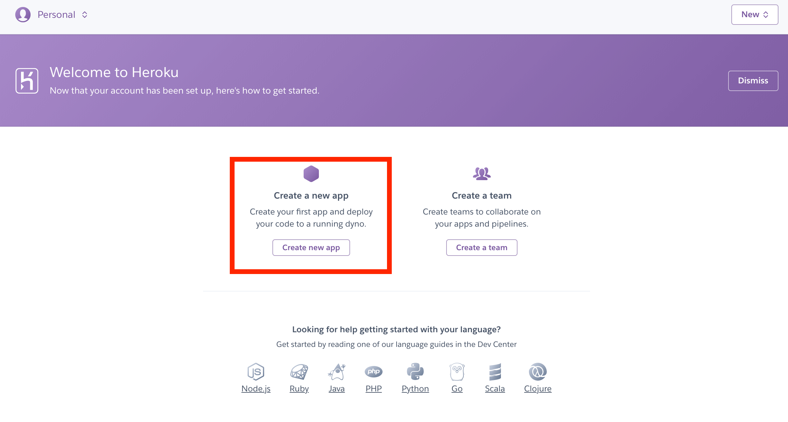
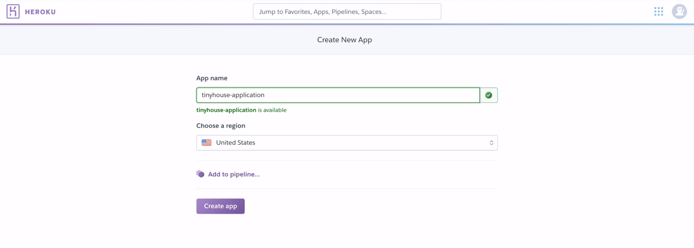
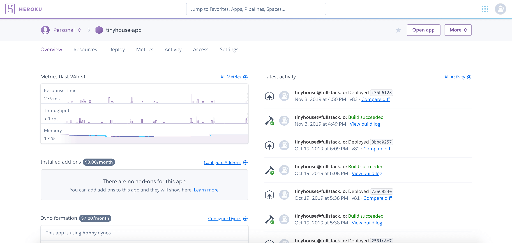
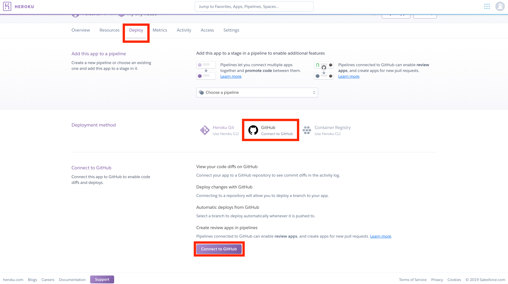
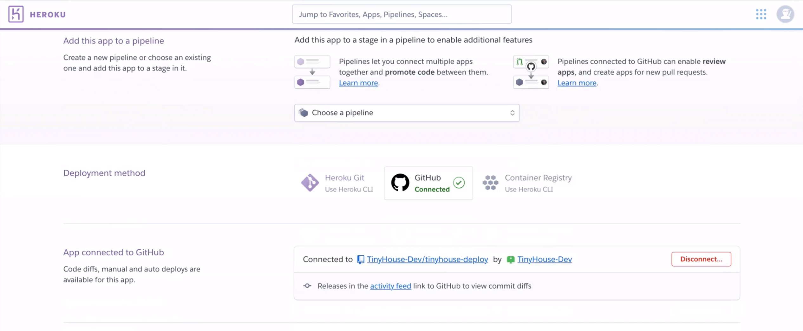
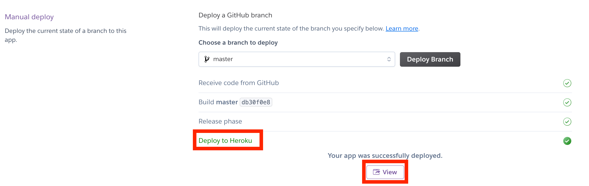
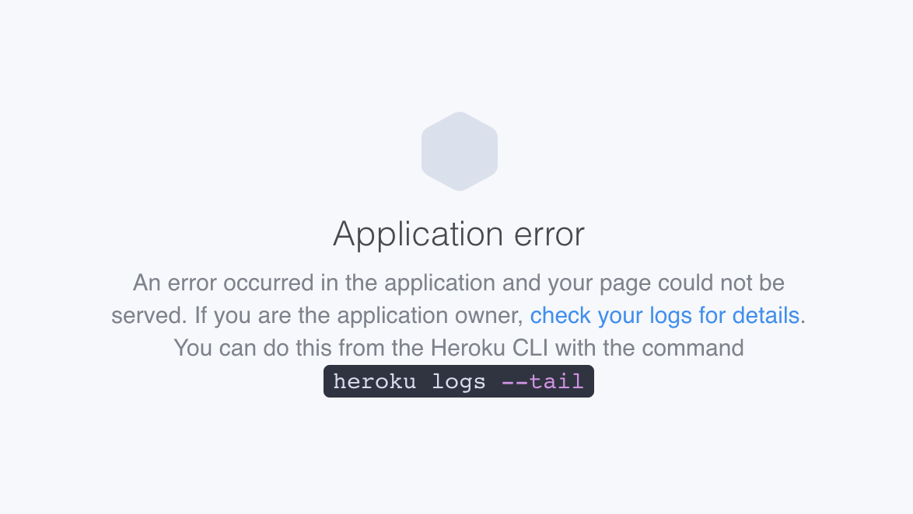
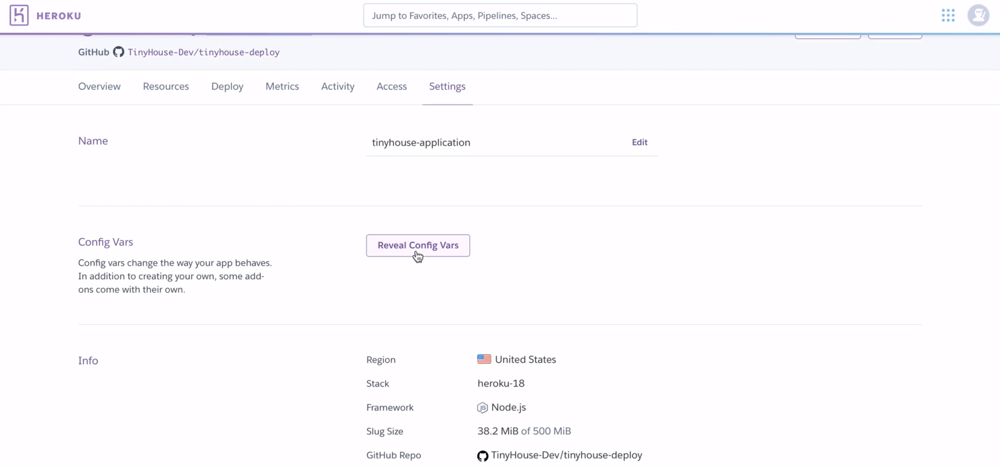
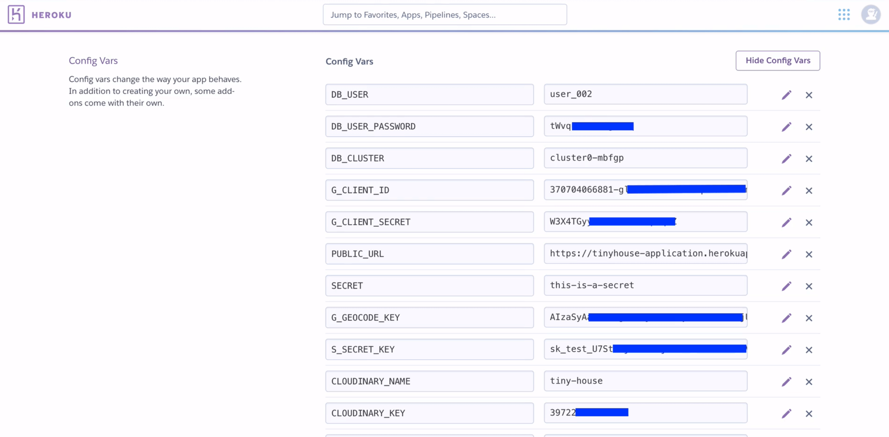

# Deploying with Heroku

### Heroku Sign Up

Heroku is a platform as a service (PaaS) that's been around since June 2007. Heroku supports the deployment of several programming languages such as Ruby, Java, Node.js, Scala, Clojure, Python, PHP, and Go.

Traditionally established to help allow applications be deployed, Heroku now offers multiple different products like their [Platform](https://www.heroku.com/platform) tool to help deploy applications and their [data services](https://www.heroku.com/managed-data-services) solution which consists of Heroku allowing us to use a [Postgres](https://www.postgresql.org/) database on the cloud, [Redis](https://redis.io/), and [Kafka](https://kafka.apache.org/). There's also Heroku's [Enterprise](https://www.heroku.com/enterprise) tool which is a more targeted solution for enterprises and large scale companies.

We're particularly interested in their [Platform](https://www.heroku.com/platform) product which is to help us deploy and run our app on Heroku's Platform As A Service solution. The diagram shown below from [Heroku's documentation](https://www.heroku.com/platform) is a good illustration of how apps can be deployed with Heroku's Platform.


-   At first, developers deploy the code.
-   When an app is deployed onto Heroku's platform, Heroku runs the app in containers that are labeled as [Dynos](https://www.heroku.com/dynos). Dynos (or containers) are isolated environments that provide memory, an operating system, a filesystem/etc. and are the areas that package the application's code and dependencies.
-   The Heroku dashboard gives us information on how our app is running, the dynos that are being used, etc.
-   When a user makes a request to an endpoint that Heroku serves for our application, the user can use the deployed app.

Heroku offers a pretty simple to understand [pricing plan](https://www.heroku.com/pricing) and the most primitive plan is **Free** which is perfect for testing and experimentation.

> **Note:** With the free plan, an app will go to sleep after 30 min of inactivity and will awake as soon as a user tries to access it again (the awake process takes about 15 sec to complete). This isn't ideal for applications we expect users to use often but is perfect for experimenting with the deployment of an application on the cloud. We'll be sticking with the Free plan for this lesson but Heroku does provide very simple capabilities to move from one pricing plan to the next.

To use Heroku, you'll need to sign in or create an account. Head over to <https://www.heroku.com> and click `Sign up` (or `Log in` if you already have an account). When logged in to Heroku, you'll land in the following page and be prompted to create a new app or a team. Click `Create a new app`:



Next, enter your desired app name:



When an application name is provided, we'll then be shown the dashboard for our Heroku application.



The dashboard is where we can see information and statistics of our application. We'll be able to see an overview of the Heroku app, the resources, the dyno process types, the add-ons that we may have added, the cost of each of these add-ons, the metrics associated with our deployed application, any activity that's been done, and other things as well.

If we click the `Deploy` tab, we're given some information on the different deployment methods that we can use. There are essentially three main deployment methods.

-   We can use the [Heroku CLI](https://devcenter.heroku.com/articles/heroku-cli) (i.e. Heroku Command Line Interface).
-   We can connect directly to a GitHub project.
-   We can use the [Container Registry](https://devcenter.heroku.com/articles/container-registry-and-runtime) option.

We're going to go with the approach of trying to connect our Heroku app onto an actual GitHub repository.

### Overview of Deployment

In development, we have two separate applications.

-   We have the **server**, which is the Node/Express/TypeScript application.
-   We have the **client**, which is the React/Webpack/TypeScript app.

#### TypeScript

There are a few things we need to think about but the very first thing that might come to mind is that both our server and client projects are **TypeScript** projects. **TypeScript is a development tool** and is unrecognizable within a Node server or a web browser. The first thing we'll have to do is ensure that both our server and client code are written in plain JavaScript. If we recall in the very beginning, within Part I of our course, we've mentioned how both the server and client projects have `build` scripts that allow us to build the projects into their actual JavaScript formats.

#### Single Node/Express Server

Node.js can be used within our Heroku deployment setup but React isn't understood in the browser. To have our client application be deployed, we'll need to run the `build` script within our Create React App project not to only compile the TypeScript code to JavaScript but to also **compile the React specific code to standard HTML, CSS, and JavaScript**.

To have our server and client projects deployed, we _could_ follow the same format we have in development and deploy the Node server application in one location and have the compiled React application deployed in another location. The compiled client application can then interact with the API from the deployed server project.

Another approach would essentially involve keeping the client and server together and instead of having our Node/Express server just serve the API, **we can have our Node/Express server also serve the client application**. This is the approach we'll be going with!

### Deployment to Heroku

Let's get started in deploying our application. We'll first create a new folder called `tinyhouse-deploy/` that is to contain our prepared application to be deployed onto Heroku.

    client/
    server/
    tinyhouse-deploy/

In our new `tinyhouse-deploy/` folder, we'll create a `.gitignore` file which is the file responsible for telling Git which files in our directory can be ignored. We'll simply copy over what we had in our server project.

    # dependencies
    node_modules/

    # production
    build/

    # misc
    .DS_Store

    # environment variables
    .env

    npm-debug.log*
    yarn-debug.log*
    yarn-error.log*

We'll then create a `package.json` file in the `tinyhouse-deploy/` directory and for now simply specify a few fields which consist of a `start` script that is to run the contents of a `src/index.js` file:

    {
      "name": "tinyhouse-deploy",
      "version": "0.1.0",
      "private": true,
      "scripts": {
        "start": "node src/index.js"
      }
    }

Before we begin to compile our server and client projects and bring the compiled output over to our new folder, there are a few changes we'll first need to make.

When we deploy a Node project onto Heroku, we should tell Heroku which version of Node.js is being used such that it is to match the runtime we've been developing with. To accomplish this, we'll need to add an `engines` property in our `tinyhouse-deploy/` `package.json` file. The [Heroku documentation](https://devcenter.heroku.com/articles/nodejs-support#specifying-a-node-js-version) states that it's highly recommended to specify the Node version that is the same as the version that's currently running in our development environment. We can check this when we head to our terminal and run `node -v`. For example, since we're running Node version `12.4.0`, we'll specify a Node version of `12.4.0` in the `tinyhouse-deploy/` `package.json` file.

    {
      // ...
      "engines": {
        "node": "12.14.0"
      },
      // ...
    }

#### Compressing HTTP Responses

We'll want our server app to serve our React client app which essentially will send a copy of the React client whenever a user loads the app in the browser. Since we're interested in doing this, we should use a **compression** library to compress the files that are going to be served into a smaller size.

Oftentimes within the world of compression, the term **Gzip** is often used and it's a form of data compression that is performed optimally on text-based assets like CSS, JavaScript, and HTML. Gzip can significantly reduce the bandwidth cost of launching a site and it helps contribute to the user having to download smaller files to have the web app launched. At the end of the day, this leads to better performance.

[**Heroku does not modify HTTP requests and responses sent by the application, and therefore does not implement HTTP compression on its own**](https://devcenter.heroku.com/articles/compressing-http-messages-with-gzip). The Heroku documentation points to different resources where compression can be applied depending on the languages being used. For our Node server project, we'll use the [`compression`](https://github.com/expressjs/compression) library.

`compression` is a middleware built for Node/Express applications and is built by the Express team themselves. It supports both `deflate` and `Gzip` compression.

In our Node server development project, we'll head over to the terminal and install the `compression` library as a dependency.

    npm i compression

We'll also install the community prepared type definitions.

    npm i -D @types/compression

In the root `index.ts` file of our server project, we'll import the `compression()` function from the `compression` library.

```ts
import compression from "compression";
```

In the same file and where we declare all our server middleware, we'll specify another middleware that is to have the `compression()` function be run.

```ts
  app.use(compression());
```

#### Serving the static client files

At this moment, let's now see how we can have our Node/Express application serve the (to be built) client static files. When the client code gets compiled eventually to HTML, CSS, and JavaScript, we'll assume that we're going to place that compiled client code within a directory in our server project called `client/`. To serve these client assets, we can specify another Express middleware and use the [`express.static()`](https://expressjs.com/en/starter/static-files.html) function which can be used to serve static files.

```ts
  app.use(express.static(`${__dirname}/client`));
```

> [`__dirname__`](https://nodejs.org/docs/latest/api/modules.html#modules_dirname), in Node, references the directory name of the current module and helps provide the absolute path of the directory that contains the currently executed process.

Next, we'll tell our Node/Express server that when a `GET` request is made to _any_ route, we want to serve the `index.html` file that's going to be contained within the `client/` folder:

```ts
  app.use(express.static(`${__dirname}/client`));
  app.get("/*", (_req, res) => res.sendFile(`${__dirname}/client/index.html`));
```

This essentially states that, regardless of what route the user hits, **the server is going to serve and show the same `index.html` file**. Why? This is because **TinyHouse is a single-page application**. Regardless of what route the user hits, the client will be served the same file. However, **our client will then take the responsibility to determine which content to render depending on which route the user is in** (remember how we've used React Router?). This is the definition of a single-page application which is different from server-rendered applications. Server-rendered React applications would have the server serve different files depending on the route the user hits.

#### `require("dotenv")`

We won't actually need an environment file in our built server application since our Heroku app would declare all the environment variables at runtime. With that said, we can remove the `require("dotenv").config()` function at the very top of our `src/index.ts` file in our server project.

If we recall, we've introduced some environment variables in our React client application as well which consist of the Client ID and Publishable Key of our Stripe environment setup. It's important to note that the environment variables within a React client application are different from the way it's handled in our server application. When we build our React client project, our [Create React App project simply takes the values of our environment variables and directly places them in the code upon build](https://create-react-app.dev/docs/adding-custom-environment-variables/). This is why the **environment variables within our React app should never be secret**.

### The Build Process

Let's now begin the build process for both our server and client projects. We'll head to the terminal and in our server project, we'll run the `npm run build` command we have in our application scripts that will build the Node/Express/TypeScript code and compile it into valid JavaScript.

```shell
server: $ npm run build
```

After our build process is successful, we'll now see a `build/` folder that exists in our server project directory that represents our server code in JavaScript.

We'll head back to the terminal and in our client project, we'll run the `npm run build` command. Not only will this compile the TypeScript code to JavaScript, but it would also compile the React development code to valid HTML, CSS, and JavaScript.

```shell
client: $ npm run build
```

After the build is successful, if we were to take a look at our client project, there will be a new `build/` folder. If we take a look inside the `client/build/` folder, we'll see an `index.html` file which is the `index.html` file that we want our Node/Express server application to serve on every single request that is made.

At this moment, there are `build/` folders for both our client and server projects. We'll move the `build/` folder in our `client/` directory into the `build/` folder within our `server/` project and we'll rename it to say `client/` within the server project.

**Before**:

```shell
client/
  build/
  // ...

server/
  build/
  // ...
```

**After**:

    client/
      // ...

    server/
      build/
        client/ <----- this was our client/build/ folder
      src/
      // ...

Within the `build/` of our server, when any request is made, it's going to serve and send the `index.html` file within the `server/build/client/` folder.

The next thing we'll do is move the `server/build/` folder into the `tinyhouse-deploy/` directory we've set up earlier. We'll rename this `build/` folder to then be called `src/`. This `src/` folder will be the entry point of our actual deployed Node.js application. When Heroku is to run the `start` script available in our `tinyhouse-deploy/` directory, it's going to run the `index.js` file of the `src/` folder.

**Before**:

    server/
      build/
        client/
      // ...

**After**:

    server/
      // ...

    tinyhouse-deploy/
      src/ <----- this was our server/build folder
        client/
      // ...

Finally, we'll need to tell the Node/Express application we're going to deploy what dependencies it's going to need. To do this, we can simply copy over all the `dependencies` we have in our `server/` project into our `tinyhouse-deploy/` project. **We won't need to copy over the `devDependencies` since the development dependencies are utility packages that are used only for deployment**.

    {
      "name": "tinyhouse-deploy",
      "version": "0.1.0",
      "private": true,
      "engines": {
        "node": "12.14.0"
      },
      "dependencies": {
        "@google/maps": "^1.0.2",
        "apollo-server-express": "^2.6.4",
        "body-parser": "^1.19.0",
        "cloudinary": "^1.17.0",
        "cookie-parser": "^1.4.4",
        "express": "^4.17.1",
        "googleapis": "^42.0.0",
        "graphql": "^14.3.1",
        "lodash.merge": "^4.6.2",
        "mongodb": "^3.2.7",
        "stripe": "^7.13.1"
      },
      "scripts": {
        "start": "node src/index.js"
      }
    }

That's it. Our `tinyhouse-deploy/` web app should now be ready to be deployed!

### Deploying with Heroku

We'll head over to the Heroku dashboard for our newly created Heroku application and navigate to the **Deploy** section. We'll now try to connect our Heroku app with an actual GitHub repo. With that said, we'll need to have our `tinyhouse-deploy/` application source code pushed up to GitHub.

> In a very brief explanation, [Git](https://git-scm.com/) is a version control system that helps control the flow of code being pushed. It can be used for both small and very large projects. There are many different hosting providers that exist, [GitHub](https://github.com/), [GitLab](https://github.com/), [BitBucket](https://bitbucket.org/), etc. We're going to be using GitHub which is what Heroku supports.

Once we've pushed the code of our `tinyhouse-deploy/` folder to a new GitHub repository, we'll head back to our Heroku dashboard to search and connect our new repo to our Heroku app.





When our Github repo is connected, Heroku gives us options on how we want to conduct our deployment. For example, we can enable Automatic Deploys which is great if we want a deployment to automatically be triggered when new code is ever pushed to a certain branch of our Github repo.

In this lesson, we'll conduct a simple manual deployment. To do this, we'll click the `Deploy Branch` button that is available to deploy the `master` branch of our GitHub repo.



When we've deployed our branch successfully, Heroku would have taken a copy of the code in our GitHub repo and have it uploaded onto their servers. Heroku, then installs the dependencies in the `package.json` file of our deployed Node application and then automatically runs the `npm start` script available to start our deployed app on the cloud.

Once deployed, we can view the deployed application by navigating to the link Heroku provides or simply clicking this **View** button available in the **Deploy** tab. When we attempt to see our deployed application, we'll see an application error!



### Environment Variables

Heroku fails to start our application because **we haven't specified the values for the environment variables in our deployed project**. To specify the values of the environment variables of our deployed project, we can go to the **Settings** tab and click the **Reveal Config Vars** button.



In this section, we can specify the values of environment variables during the Heroku runtime process.

This is the current `.env` file from our local development server project:

    // server/.env

    NODE_ENV=development
    PORT=9000
    PUBLIC_URL=http://localhost:3000
    SECRET=*******************************************
    DB_USER=*******************************************
    DB_USER_PASSWORD=*******************************************
    DB_CLUSTER=*******************************************
    G_CLIENT_ID=*******************************************.apps.googleusercontent.com
    G_CLIENT_SECRET=*******************************************
    G_GEOCODE_KEY=*******************************************
    S_SECRET_KEY=sk_test_*******************************************
    CLOUDINARY_NAME=*******************************************
    CLOUDINARY_KEY=*******************************************
    CLOUDINARY_SECRET=********************************************

We can reuse the same environment variables from the `.env` file in our server for the Heroku app _except_ for the following:

-   `NODE_ENV` - not needed because Heroku provides a value for this automatically.
-   `PORT` - not needed because Heroku provides a value for this automatically.
-   `PUBLIC_URL` - will need to be updated to the URL our deployed app is running on.

When all the keys we've mentioned have been transferred over and an update made for the `PUBLIC_URL` environment variable, our environment variables section of the Heroku app will look something like the following.



### OAuth Redirect URLs

There's one other change we're going to need to make. If we recall, when we've retrieved and/or obtained the credentials for Google OAuth as well as our Stripe authentication, we've always specified a redirect URL of our local development environment, `http://localhost:3000`. **This wouldn't work for our production application**. We'll need to log-in to these services and update the redirect URLs to the same value as the `PUBLIC_URL` environment variable of our Heroku app.

> Keep in mind that if we update the redirect URL values for the same credentials we use in our local development environment, this will affect our local development environment. Ideally, it's probably beneficial to generate a set of environment credentials - one for our local development environment and one for production.
>
> The credentials we're using for Stripe refer to our Stripe **test** environment. When we're ready for users to provide real payment information, we'll need to use credentials from Stripe that refer to our live Stripe dashboard.

Awesome. We'll now re-deploy our app with the updated environment variables. When complete, we'll notice our application is now fully deployed.


We did it! We've managed to fully build and deploy the TinyHouse application. For anybody else who wants to see our app, all we need to do is share our deployed app URL with them and they'll be able to log into our app, create listings, and even book listings of their own.
