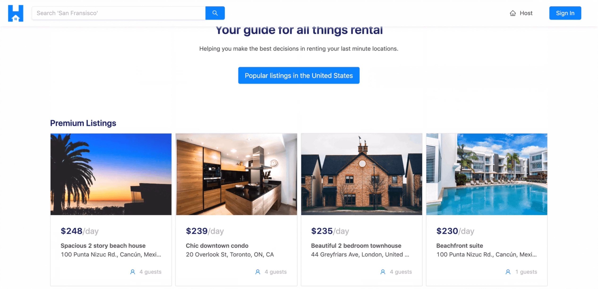
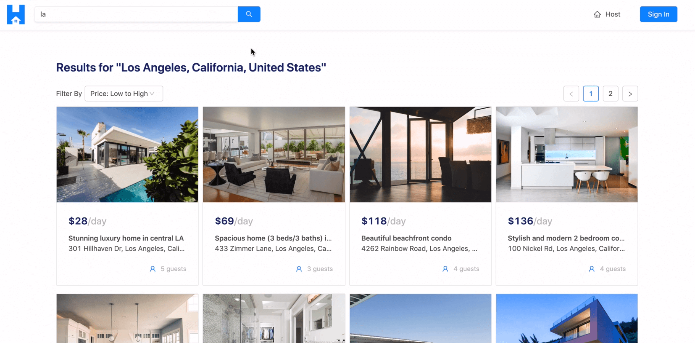
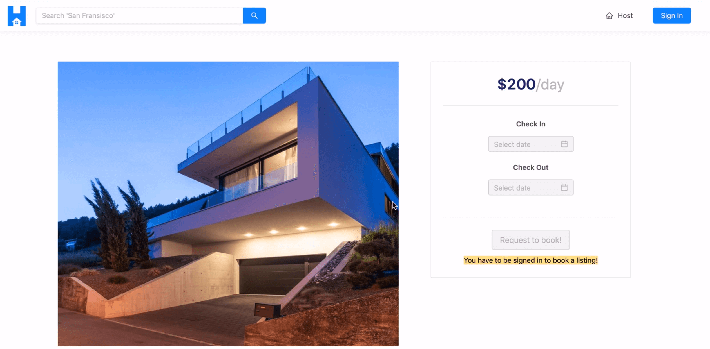
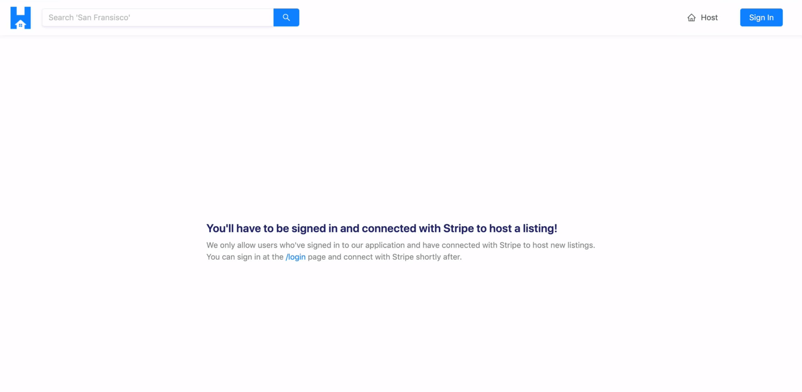
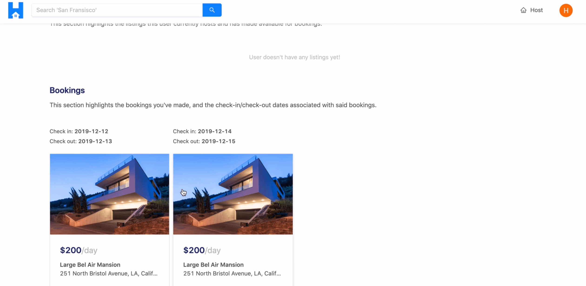
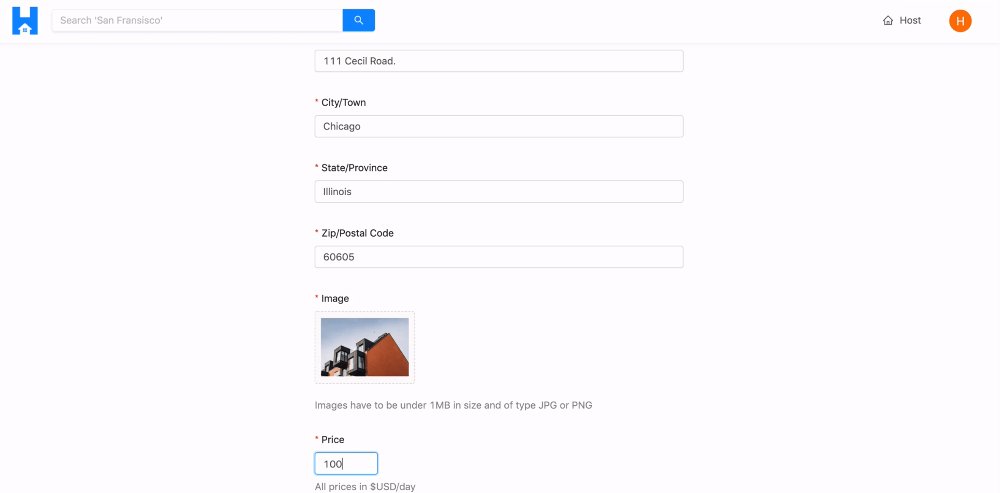

# Walkthrough of Deployed App

> 📝 This module's quiz can be found - [here](./protected/multiple-choice-questions.pdf). 
> 🗒️ Solutions for this module's quiz can be found - [here](./protected/multiple-choice-answers.pdf).

With our application now deployed, we'll spend a little time going through our app in the production setting to verify everything works as intended. At the end of this lesson, we'll also quickly summarize what we've done to have our app be deployed.

In the `/` (i.e. index) route, we can see the homepage we've prepared which consists of the section that displays the premium listings in our TinyHouse application.

If we were to search for a particular location in the input of the app header, (e.g. `"LA"`), we'll be taken to the `/listings/la` route where we get all the listings that pertain to the Los Angeles area.

> **Note:** All the data we see at this very moment is the same data that we were interacting with during development. We haven't done any changes to the database in the collections within the database. If interested, we're able to remove the mock data we've inserted in our database so users can begin to create and view real listings.

Within the `/listings/:location` page, we're able to see the listing cards that give us some information about each of the different listings. We can filter the list of listings shown to us from low to high pricing and vice-versa. We're also able to switch pages for every list of eight listings shown for a single page.

If we click a certain listing card, we'll be taken to the `/listing/:id` page where we can see more information about a particular listing. We'll be given information about listing such as its image, title, host, description, etc.

If we try to host a listing, we may be notified that we have to be signed-in as well as connected with Stripe to host a listing.

With that said, we'll go to the `/login` page and log-in with our Google account.

When successfully logged in, we are taken back to the `/login` page very briefly before being redirected to the `/user/:id` page of our logged-in user. Here is where we can see our logged-in user information. If we were to scroll to the bottom of the User page, we'll see the bookings we've made before.

If we go to a certain `/listing/:id` page and if we attempt to check-in with a certain date and check-out with another day, a confirmation modal will be shown that has information about the booking we're about to make. This is where we can provide valid payment information. We're using test credentials from our Stripe platform account so we'll use the same test card information we've used before. By clicking the "Book" button after the payment information is provided, the `createBooking` mutation is made.

Once complete, we're taken back to the `/listing/:id` page and we're told that we've successfully booked the listing.

If we tried to host a listing of our own, we'll see the message we've seen before that tells us we still have to be connected with Stripe to host a listing. With that said, we'll go back to our user profile page and connect with Stripe.

We'll then attempt to host a brand new listing. When we go to the `/host` page, we'll be presented with the host form. We'll go ahead and create a listing for a city we haven't created before, like Chicago and we'll fill out the rest of the form.

When we attempt to submit the form, and our listing is successfully created, we're taken to the `listing/:id` page for the newly created listing we've just created.

All the main features of our app work just the way we expect it to!

### Deployment with Heroku

Let's spend a short period of time summarizing the different steps we've taken to deploy the TinyHouse application. In summary, we've

-   Built and compiled our **`client/`** and **`server/`** projects.
-   Prepared a **single** Node/Express app to be deployed. The Node/Express app is to serve the compiled React client code **and** GraphQL API.
-   **Compressed** all responses in our Node/Express app.
-   Pushed the Node/Express app code to a **Github Repo**.
-   **Deployed** our app by syncing repo code with the Heroku app instance and triggering a manual deploy.
-   Declared values for environment configuration variables for our Heroku app.
-   Specify redirect URLs for Google and Stripe OAuth to point to the deployed app.

That's it! We've covered practically all the topics we wanted to! We're going to have one more module in this course that will contain individual lessons where we cover certain specific topics that are somewhat important and/or good to know. We'll talk more about this in the next module.

For now, pat yourself on the back because it must have taken a really big effort to get to this point in the course!
