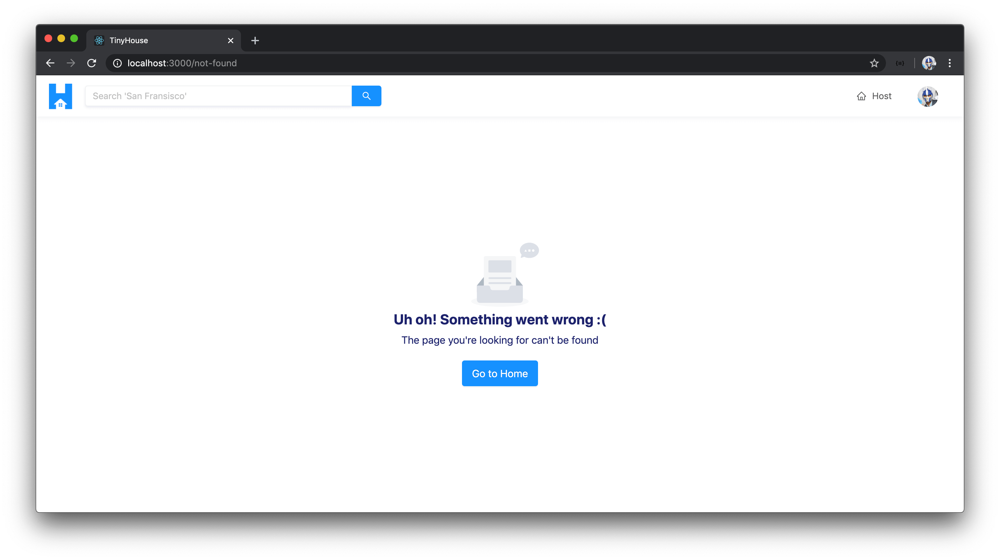

# The NotFound Page

When a user visits a route in our app that isn't one of the defined routes we've established in the root `<App />` component, they'll be presented with a `<NotFound />` component we've created in the `src/sections/NotFound/index.tsx` file.

We'll update the `<NotFound />` component to display the [`<Empty />`](https://ant.design/components/empty/) component from Ant Design to help convey to the user that they're unable to find what they're looking for.

```tsx
import React, { Fragment } from "react";
import { Link } from "react-router-dom";
import { Empty, Layout, Typography } from "antd";

const { Content } = Layout;
const { Text } = Typography;

export const NotFound = () => {
  return (
    <Content className="not-found">
      <Empty
        description={
          <Fragment>
            <Text className="not-found__description-title">
              Uh oh! Something went wrong :(
            </Text>
            <Text className="not-found__description-subtitle">
              The page you're looking for can't be found
            </Text>
          </Fragment>
        }
      />
      <Link to="/" className="not-found__cta ant-btn ant-btn-primary ant-btn-lg">
        Go to Home
      </Link>
    </Content>
  );
};
```

If a user was to visit a non-defined route in our app, they'll be presented with the not-found state we've just esablished.


