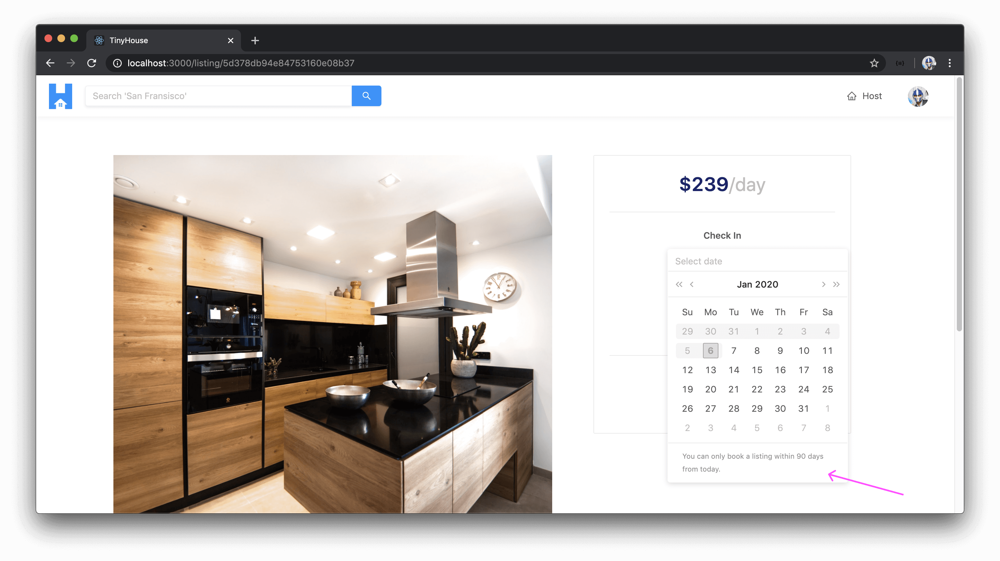
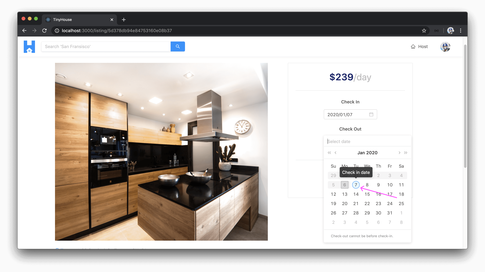

# Additional Listing DatePicker Changes

> 📝 This module's quiz can be found - [here](./protected/multiple-choice-questions.pdf).<br/>
> 🗒️ Solutions for this module's quiz can be found - [here](./protected/multiple-choice-answers.pdf).

The `createBooking` mutation is the mutation that is triggered when a user provides payment information and confirms the booking of a listing between certain dates. We have a check be made to confirm the check-out date a user selects is not before the check-in date the user has selected.

We can add an additional check to confirm the user is to never select booking dates that exceed some point in the future. As an example, we can say **a user isn't allowed to select dates that are 90 or more days in the future**. We can make the server-side validation for this in the `createBooking()` resolver function by comparing the difference between today's date and the check-in/check-out dates in milliseconds.

```ts
const today = new Date();
const checkInDate = new Date(checkIn);
const checkOutDate = new Date(checkOut);

if (checkInDate.getTime() > today.getTime() + 90 * millisecondsPerDay) {
  throw new Error("check in date can't be more than 90 days from today");
}

if (checkOutDate.getTime() > today.getTime() + 90 * millisecondsPerDay) {
  throw new Error("check out date can't be more than 90 days from today");
}
```

`millisecondsPerDay` is a constant we can have in the file that represents the number of milliseconds in a day.

```ts
const millisecondsPerDay = 86400000;
```

On the client, we can update the UI of the datepicker elements to have the dates more than 90 days from today be disabled. We can do this in the `disabledDate()` function within the `<ListingCreateBooking />` component that is used in the `disabledDate` prop of the Ant Design [`<DatePicker />`](https://ant.design/components/date-picker/) elements.

```tsx
const disabledDate = (currentDate?: Moment) => {
  if (currentDate) {
    const dateIsBeforeEndOfDay = currentDate.isBefore(moment().endOf("day"));
    const dateIsMoreThanThreeMonthsAhead = moment(currentDate).isAfter(
      moment()
        .endOf("day")
        .add(90, "days")
    );

    return (
      dateIsBeforeEndOfDay || dateIsMoreThanThreeMonthsAhead || dateIsBooked(currentDate)
    );
  } else {
    return false;
  }
};
```

For the dates that are more than 90 days ahead of today, they'll appear as disabled dates in both the check-in and check-out datepickers.


There are some other minor UI changes we can make to the datepickers. If we were to use the `renderExtraFooter` prop of the Ant Design `<DatePicker />` element, we can display some footer information in each individual datepicker.

```tsx
<div className="listing-booking__card-date-picker">
  <Paragraph strong>Check In</Paragraph>
  <DatePicker
    value={checkInDate ? checkInDate : undefined}
    format={"YYYY/MM/DD"}
    showToday={false}
    disabled={checkInInputDisabled}
    disabledDate={disabledDate}
    onChange={dateValue => setCheckInDate(dateValue)}
    onOpenChange={() => setCheckOutDate(null)}
    renderExtraFooter={() => {
      return (
        <div>
          <Text type="secondary" className="ant-calendar-footer-text">
            You can only book a listing within 90 days from today.
          </Text>
        </div>
      );
    }}
  />
</div>
```

With this change, we'll be presented with a footer message in the datepickers.



We can use the `dateRender` prop for the check-out datepicker to help display the check-in date in the grid with some additional UI. The `dateRender` prop runs a callback function for every date element in a presentable grid. When an iterated date item _is_ the check-in date that was selected, we can display a tooltip and an additional class to help distinguish it from the other dates in the grid. We can display a tooltip with the Ant Design [`<Tooltip />`](https://ant.design/components/tooltip/) component.

```tsx
import { Button, Card, DatePicker, Divider, Tooltip, Typography } from "antd";
```

```tsx
<div className="listing-booking__card-date-picker">
  <Paragraph strong>Check Out</Paragraph>
  <DatePicker
    value={checkOutDate ? checkOutDate : undefined}
    format={"YYYY/MM/DD"}
    showToday={false}
    disabled={checkOutInputDisabled}
    disabledDate={disabledDate}
    onChange={dateValue => verifyAndSetCheckOutDate(dateValue)}
    dateRender={current => {
      if (moment(current).isSame(checkInDate ? checkInDate : undefined, "day")) {
        return (
          <Tooltip title="Check in date">
            <div className="ant-calendar-date ant-calendar-date__check-in">
              {current.date()}
            </div>
          </Tooltip>
        );
      } else {
        return <div className="ant-calendar-date">{current.date()}</div>;
      }
    }}
    renderExtraFooter={() => {
      return (
        <div>
          <Text type="secondary" className="ant-calendar-footer-text">
            Check-out cannot be before check-in.
          </Text>
        </div>
      );
    }}
  />
</div>
```

With this change, we'll be presented with a tooltip and additional styling around the selected check-in date in the check-out datepicker.



For any features we may be interested in adding for the datepicker elements in our `/listing/:id` page, it's important to have the server-side validations to ensure invalid dates aren't selected by the user. Adding the client-side representation for these restrictions/requirements is important to convey to the user what they're able to do.
