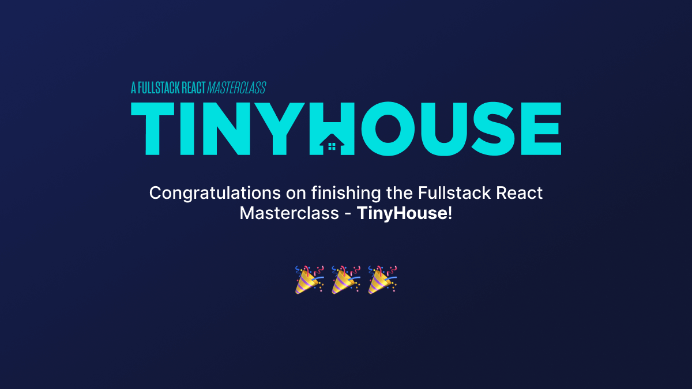

# Part Two Conclusion

Congratulations!! 🎉

You've finished Part II of the course and have built a home-sharing application named TinyHouse. We've covered a variety of different technologies throughout this course - [React](https://reactjs.org/), [GraphQL](https://graphql.org/), [Apollo](https://www.apollographql.com/), [Node.js](https://nodejs.org/en/), [MongoDB](http://mongodb.com/), [Express](https://expressjs.com/), [TypeScript](https://www.typescriptlang.org/), and more.

My colleague and I have had an _immense joy_ producing this course and its taken us more than a year to get to this point. Thank you so much for being a part of this. We're always around so if you have any questions, you can easily find us on Discord.

\--

**Hassan** and **Jing**
