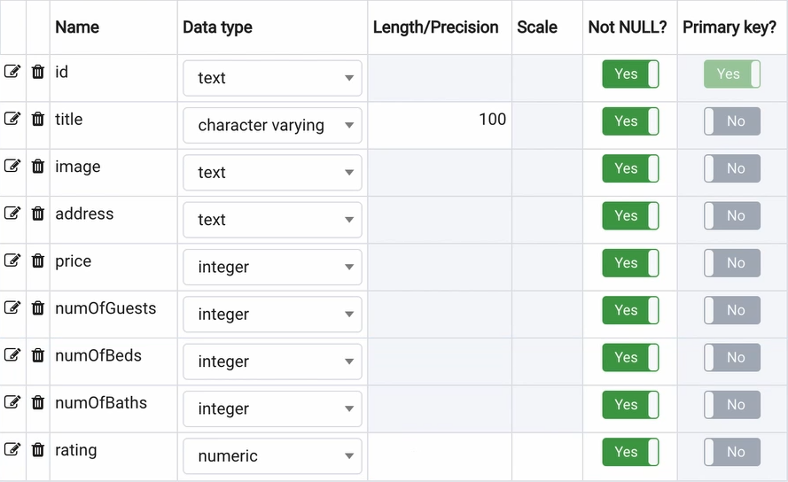
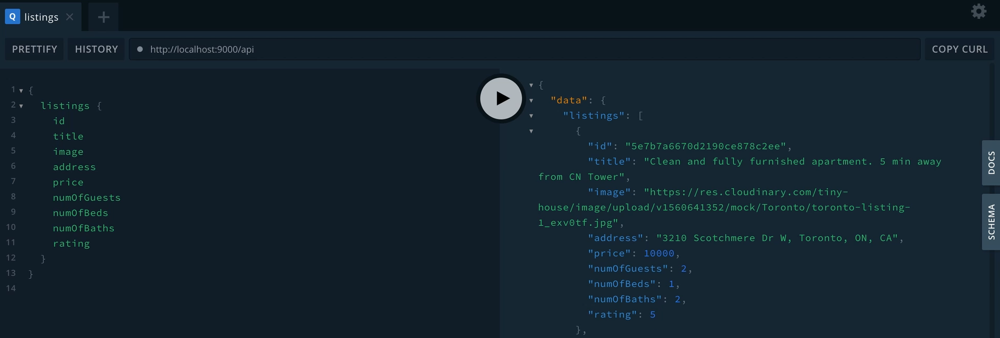

# SQL vs. NoSQL

SQL databases use a defined schema for structured data and NoSQL databases use a dynamic schema for unstructured or polymorphic data. We've heard this quite a bit but what does this actually mean?

To get a better understanding, let's take a look at some live data.

In one browser tab, we'll have a MongoDB database open. We'll refer to the database that was first created with [MongoDB Atlas](https://www.mongodb.com/cloud/atlas) from [lesson 4.9 in Part I of the course](https://www.newline.co/courses/tinyhouse-react-masterclass/lesson_4.9-module-4-summary). In our database, we'll notice each piece of **data is stored as a JSON-like document**.


In another browser tab, we'll have a PostgreSQL database. We'll show you how to install and seed your own PostgreSQL database in the next few lessons. When we take a look at our PostgreSQL database, we'll notice **data is stored in tables much like a spreadsheet**.


Both databases contain the _same listing data_. However, in PostgreSQL, there is a defined schema governing the shape of each listing.



To demonstrate some more, we'll head over to VSCode and start our Node server:

```shell
npm start
```

At this moment, our server is still connected to our MongoDB database. If we execute a query for all the listings, we'll see our entire listings collection in the returned output.



## Structure

When we developed our server in Part I and Part II of the course, we utilized TypeScript in our source code to help define the shape of our listing data in our source code.

```ts
export interface Listing {
  id: string;
  title: string;
  image: string;
  address: string;
  price: number;
  numOfGuests: number;
  numOfBeds: number;
  numOfBaths: number;
  rating: number;
}

export interface Database {
  listings: Repository<ListingEntity>;
}
```

Though the above helped, it didn't really change the structure of how our data is accessible and mutable since our MongoDB database does not have a defined schema. In other words, despite having type definitions in our source code, we can go over to our MongoDB database and insert a new document like the following to our `"listings"` collection:

```ts
{ lunch: “pizza” }
```

If we were to run the same GraphQL query as we did before, we'll see an error!


> This error is GraphQL notifying us that a document/object exists where the title of the listing is not present which doesn't match our GraphQL API structure.

**Our MongoDB database will accept any form of document data because it has no defined schema**. If we were to delete that piece of garbage data, our query will run without any errors.

If we were to try to do the same to a SQL database (e.g. insert a new listing with just a `"lunch"` field of value `"pizza"`), we wouldn't be able to. This (i.e. having structured data) is the core advantage of having a defined schema.


## Flexibility

By using a dynamic schema for unstructured or polymorphic data, our MongoDB database embraces flexibility. Consider this, imagine for some reason going forward:

1. Instead of the `numOfGuests` field in a single listing, we want to call this property `guests`.
2. And instead of having `numOfGuests` be a `number` value, we want this property to capture a `string`.

Implementing this in MongoDB is easy because there is no specific change we'll need to do. We can just start inserting data in the new format we want, or update any of our existing data to the new format, and MongoDB won't complain.

By making the above change in a few listing documents, we'll have a mix of document shapes in our `"listings"` collection. In other words, we now have **polymorphic data**. We're allowed to do this because of our dynamic schema.


In our source code, we'll still need to update our Node server to process this newly added `guests` property and the different types of `numOfGuests` but there is nothing else we'll need to do in our database.

To achieve the same in a SQL database, we'll most likely need to perform a [database migration](https://en.wikipedia.org/wiki/Schema_migration) which can involve:

1. Inserting a new `guests` column in our table.
2. Writing a script to convert `numOfGuests` into `guests`.
3. Dropping the old `numOfGuests` column from our table.
4. And updating our server to use the new `guests` property.

Depending on the size and complexity of a SQL database, a migration could take minutes to hours to complete! Therefore, to affect the least number of users, one may also want to perform a migration when their app usage is low.

Flexibility is the reason why NoSQL databases have become so popular in recent years, especially with start-ups, where they need to be flexible and agile. With that said, if you value structure more than flexibility, you might just prefer a SQL database over a NoSQL database.
