# PostgreSQL

We’ll use **PostgreSQL** as our SQL database. [PostgreSQL](https://www.postgresql.org/) is a powerful relational database and has the highest rating for SQL compliance. It is a fully open-source project and is developed and maintained by a large and active community. PostgreSQL has earned a strong reputation for its reliability and robust feature set, becoming the relational database of choice for many developers.

## Installation

To install PostgreSQL, head over to their official [download page](https://www.postgresql.org/download) and select the operating system you use. Next, click the “Download the installer” button and choose the latest version for your operating system.

Once the download is complete, run the PostgreSQL installer. Make sure you select all the components for installation.

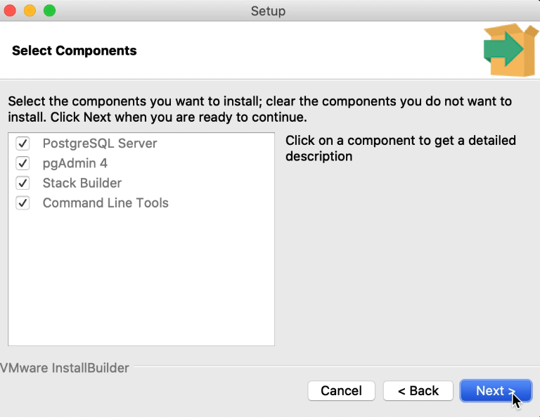

If you're installing PostgreSQL for the first time, you'll be asked to:

-   Pick a directory to store your data.
-   Create a password for a superuser.
-   Choose a port number for your PostgreSQL server (for this, we recommend to use the default `5432` port number).

## pgAdmin

Once the installation is complete, you should be able to find **pgAdmin** on your computer. pgAdmin is an application that can be used to create, modify, and delete your PostgreSQL databases using either SQL (Structured Query Language) or a GUI (Graphical User Interface).

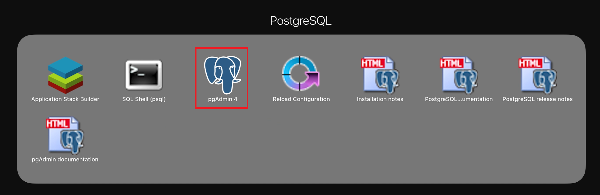

When you launch pgAdmin, you will be asked to enter a password. This is the same password you set up during the installation process.

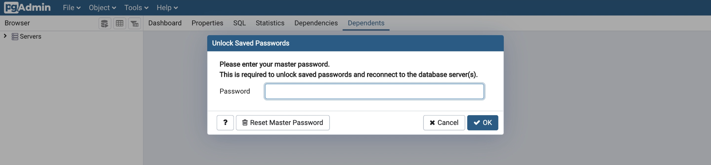

On the left navigation panel, you'll find your databases. To create a new database, simply right-click on “Databases” and select “Create/Database…”.

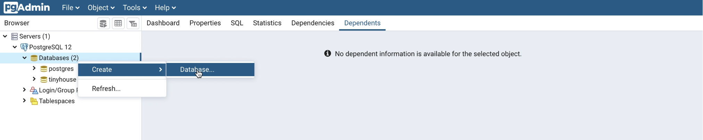

Next, enter a name for your new database (e.g. `test_db_001`). Then, hit "Save".

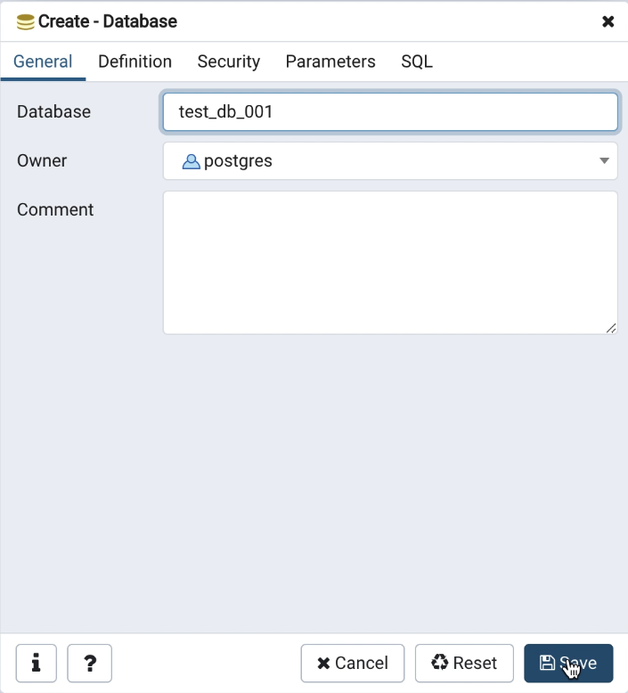

To create a table for your database, select “Schemas” on the left-hand panel, then right-click on “Tables”, and then select “Create/Table...”.

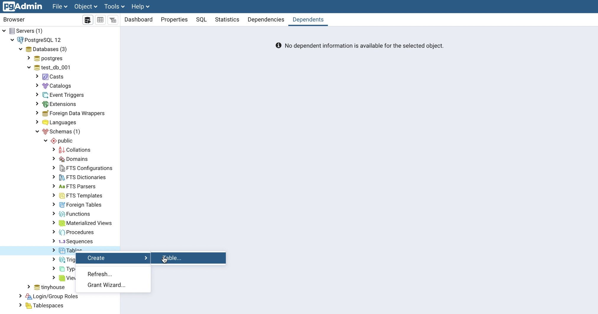

In the Create-Table dialog window, enter a name for your new table (e.g. `test_users`).

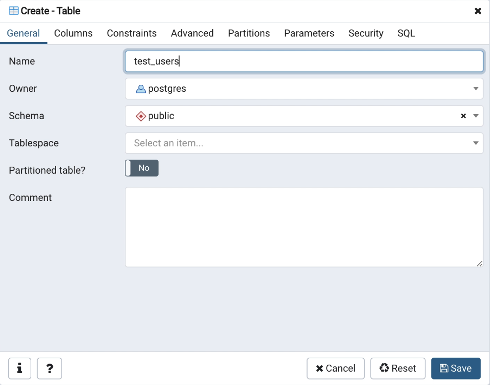

Next, navigate to the “Columns” tab to start building a schema for your new table. Click the “+” icon to add a new column.

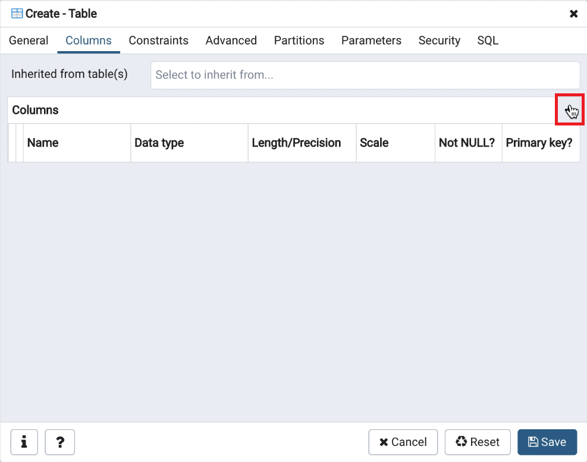

For the first column, we'll specify `id` as the name and select `text` as the data type. We'll set the `Not NULL?` and `Primary key?` constraints to “Yes”.

-   The `Not NULL?` constraint ensures a column cannot contain any null value.
-   The `Primary key?` constraint ensures a column must contain unique values that can be used to identify each row of data.

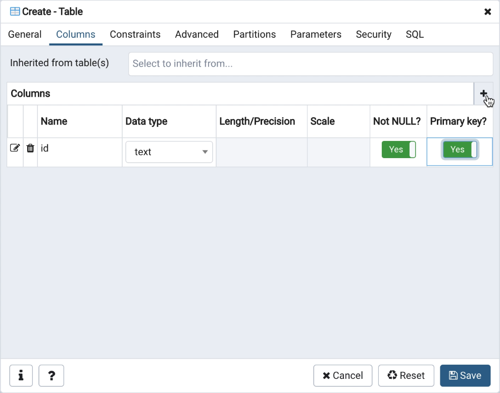

We'll add a second column which we'll specify as `name` for the name of the column and select `character varying` as the data type. For this column, we'll set the `Not NULL?` constraint to “Yes” and specify `100` for the `Length` constraint.

-   The `text` data type in PostgreSQL is equivalent to `string` in TypeScript.
-   The `character varying` data type is the same as `text` except we can specify a maximum number of characters. In our case, we picked `100` characters as the max.

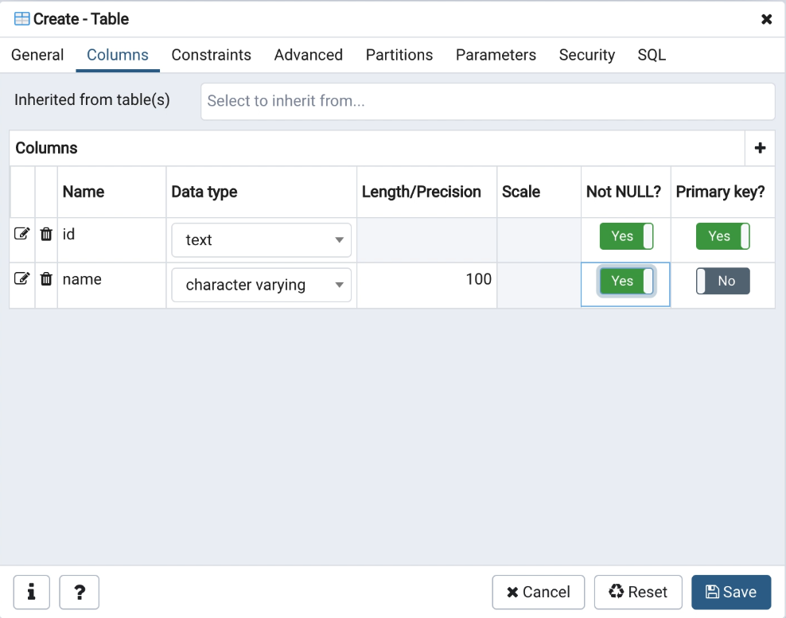

We'll explore more data types in the next few lessons as we convert our apps to use PostgreSQL.

> If you're interested to take a look at the full list of PostgreSQL data types, we encourage you to check out the [official documentation](https://www.postgresql.org/docs/current/datatype.html).

If we clicked on the “Save” button right now, we would have created a new table using the GUI. However, if we navigate to the “SQL” tab, we'll see the SQL statement for doing the exact same thing.

```sql
CREATE TABLE public.test_users (
  id text NOT NULL,
  name character varying(100) NOT NULL,
  PRIMARY KEY (id)
);

ALTER TABLE public.test_users OWNER to postgres;
```

If we copy this statement, click “Cancel”, select “Tools/Query Tool” from the top navigation bar, and execute the copied statement - we would create a new table using SQL!

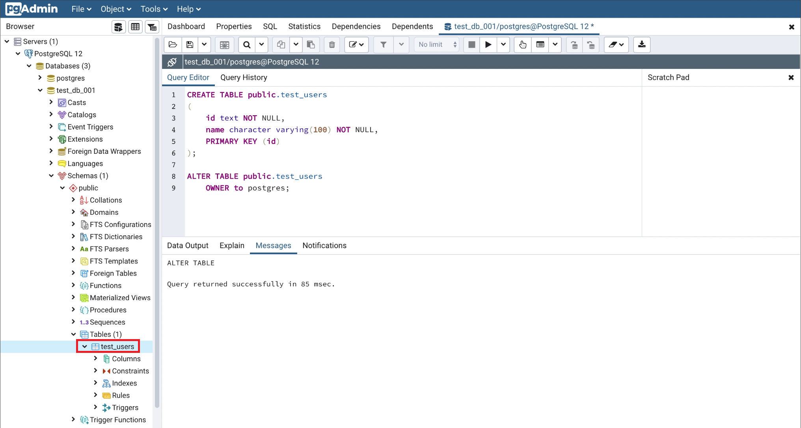

## CRUD using SQL

**SQL** which stands for **Structured Query Language** is the standard language used to access and manipulate data from relational databases. Let's execute some CRUD (Create, Read, Update, and Delete) operations using SQL statements.

To insert data into a table, we can run the `INSERT` statement. This is equivalent to MongoDB's `insertOne({...})` function.

```sql
INSERT INTO public.test_users(id, name) VALUES ('001', 'bob');
INSERT INTO public.test_users(id, name) VALUES ('002', 'bobby');
INSERT INTO public.test_users(id, name) VALUES ('003', 'john');
INSERT INTO public.test_users(id, name) VALUES ('004', 'johnson');
```

To see all of the data in a table, we can run the `SELECT` statement. This is equivalent to MongoDB's `find()` function.

```sql
SELECT * FROM public.test_users
```

To find a specific row of data, we can also run the `SELECT` statement with a `WHERE` clause. This is equivalent to MongoDB's `find({ _id: ... })` function.

```sql
SELECT * FROM public.test_users WHERE id='001';
```

To update an existing row of data, we can run the `UPDATE` statement. This is equivalent to MongoDB's `updateOne({...})` function.

```sql
UPDATE public.test_users SET name='bob_name_updated' WHERE id='001';
```

To delete an existing row of data, we can run the `DELETE` statement. This is equivalent to MongoDB's `deleteOne({...})` function.

```sql
DELETE FROM public.test_users WHERE id='001';
```

We can modify our table using the `ALTER TABLE` statement. With the `RENAME COLUMN` and the `ADD COLUMN` clauses, we can rename one of our existing columns into `username` and can add a new column called `email` respectively. With this change, we've modified our database schema using SQL!

```sql
ALTER TABLE public.test_users RENAME COLUMN "name" TO "username";
ALTER TABLE public.test_users ADD COLUMN email character varying(100);
```

Finally, let's test our new database schema by inserting a new user:

```sql
INSERT INTO public.test_users(id, username, email) VALUES ('005', 'bob', 'bob@email.com');
```

There are a lot more SQL statements than the ones we just explored. If you're interested in learning more SQL, we encourage you to check out SQL tutorials that are freely available such as the one from [w3schools](https://www.w3schools.com/sql/default.asp).

The ultimate goal for us is not to create SQL statements manually. We want our Node server to generate SQL statements based on the user inputs from our React application. For this, an [ORM](https://en.wikipedia.org/wiki/Object-relational_mapping) is a great tool to use with which we'll talk more about in the next lesson!
