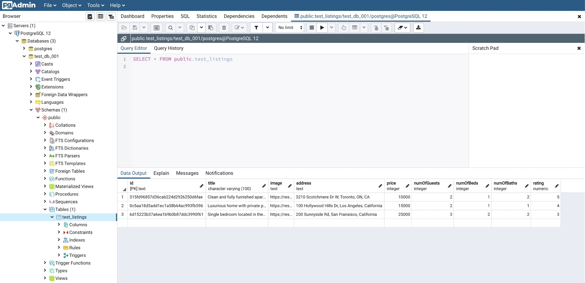

# TypeORM

## What is ORM?

In our previous lesson, we wrote SQL statements like the following to perform CRUD operations on our PostgreSQL database:

```sql
INSERT INTO public.test_users(id, name) VALUES ('001', 'bob');

SELECT * FROM public.test_users WHERE id='001';

UPDATE public.test_users SET name='bob_name_updated' WHERE id='001';

DELETE FROM public.test_users WHERE id='001';
```

SQL statements like the above are the most basic and simple statements that are often taught to new developers. Depending on what you want to achieve and the complexity of your database, SQL statements can become _extremely complex_. Some SQL statements can be hundreds of lines of code and many companies have dedicated SQL developers!

**Object-Relational Mapping (ORM)** is a technique that lets you access and modify data from a database using an object-oriented paradigm. In other words, instead of writing SQL statements manually, we can use a library to generate these SQL statements using some "virtual database object". For example, to perform the same CRUD operations on our PostgreSQL database as the above while using an ORM, our code could look something like the following:

```ts
// INSERT INTO public.test_users(id, name) VALUES ('001', 'bob');
const user = await db.users.create({ id: "001", name: "bob" }).save();

// SELECT * FROM public.test_users WHERE id='001';
const user = await db.listings.findOne({ id: "001" });

// UPDATE public.test_users SET name='bob_name_updated' WHERE id='001';
const user = await db.users.findOne({ id: "001" });
user.name = "bob_name_updated";
await user.save();

// DELETE FROM public.test_users WHERE id='001';
const user = await db.users.findOne({ id: "001" });
await user.remove();
```

As we can see, an ORM can abstract away our SQL implementation. With that said, there are some advantages and disadvantages of using an ORM.

### Pros of ORM 👍

- We can write in the language of our choice. For us, this will be TypeScript.
- It abstracts away the database so switching from MongoDB to PostgreSQL (as an example) is extremely easy.
- Many ORMs support advanced features such as database migrations.
- Unless you're a master at SQL, statements generated by an ORM will most likely perform better than the ones you write yourself.

### Cons of ORM 👎

- An ORM must be configured before usage.
- By abstracting away the database, many new developers won't understand what's happening under the hood.

## TypeORM

The ORM we'll be using for this course is [**TypeORM**](https://typeorm.io/#/). TypeORM is an extremely popular ORM that supports multiple database systems such as MySQL, PostgreSQL, MongoDB, and more. It also integrates extremely well with TypeScript.

Before we start to integrate TypeORM into our TinyHouse application, let's spend some time getting familiar with TypeORM's API using a simple Node server. To begin, we'll clone the source code from [lesson 4.9 in Part I of the course](https://www.newline.co/courses/tinyhouse-react-masterclass/lesson_4.9-module-4-summary).

### Install & Update

First, we'll make sure our npm packages are installed:

```shell
npm install
```

Next, we'll make sure our npm packages are updated:

```shell
npm update
```

If npm warns about any vulnerabilities from our packages, we'll also want to make sure we fix those:

```shell
npm audit fix
```

Since we'll be using TypeORM and PostgreSQL instead of MongoDB, we'll uninstall the MongoDB driver and the accompanying type definitions file:

```shell
npm uninstall mongodb --save
npm uninstall @types/mongodb --save-dev
```

I> To integrate TypeORM into our Node server, we'll simply follow the instruction found on their [official documentation](https://github.com/typeorm/typeorm#installation). First, we'll install the packages that TypeORM requires:

```shell
npm install typeorm reflect-metadata
```

Next, we'll install the PostgreSQL database driver:

```shell
npm install pg
```

Next, we'll enable the following settings in our `tsconfig.json`:

{lang=json,line-numbers=off,crop-start-line=9,crop-end-line=10}
<<[server/tsconfig.json](./protected/source_code/server/tsconfig.json)

### Config

In our server project, we'll create a new `.env` file with a `PORT` variable set to `9000`:

```
PORT=9000
```

Remember that when we were using MongoDB, we had to setup `DB_USER`, `DB_USER_PASSWORD`, and `DB_CLUSTER` values in our `.env` file to specify the configuration variables we'll need to connect to our database? TypeORM on the other hand, uses an `ormconfig.json` file to store these variables. We'll head over to their [official quick start guide](https://github.com/typeorm/typeorm#quick-start) to get a copy of this file and place it in the root of our server project.

```json
{
  "type": "mysql",
  "host": "localhost",
  "port": 3306,
  "username": "test",
  "password": "test",
  "database": "test",
  "synchronize": true,
  "logging": false,
  "entities": ["src/entity/**/*.ts"],
  "migrations": ["src/migration/**/*.ts"],
  "subscribers": ["src/subscriber/**/*.ts"]
}
```

With the copied over `ormconfig.json` file, we'll make the following modifications:

1. Change `type` to `postgres`.
2. Change `port` to the port our PostgreSQL server runs on (e.g. for us, this is `5432`).
3. Change `username` to our PostgreSQL superuser (e.g. for us, this is simply `postgres`).
4. Change `password` to our superuser's password (e.g. for us, this is `myPassword`).
5. Change `database` to the PostgreSQL database we wish to connect to (e.g. for us, we'll reference the database from the previous lesson, `test_db_001`).
6. We'll leave `synchronize` to `true` which tells TypeORM to update the schema in our PostgreSQL server automatically when we update the schema in our source code.
7. We'll leave `logging` to `false`. However, if we want to see the SQL statements generated by TypeORM in our console, we can turn this option to `true`.
8. Finally, we'll update the path to the `entities`, `migrations`, and `subscribers` fields to a location within the `src/database/` directory in our server project.

With these changes, our server `ormconfig.json` file will look like the following:

{lang=json,line-numbers=off}
<<[server/ormconfig.json](./protected/source_code/server/ormconfig.json)

By updating the variables in this `ormconfig.json` file, TypeORM can be configured to connect to other databases, such as MongoDB or MySQL!

### Set-up

According to TypeORM's installation instructions, we'll first need to import `reflect-metadata` at the beginning of our code. We'll do this in the root `src/index.ts` file of our server project.

{lang=ts,line-numbers=off,crop-start-line=3,crop-end-line=3}
<<[server/src/index.ts](./protected/source_code/server/src/index.ts)

Next, we'll head over to our `src/database/index.ts` file and modify our `connectDatabase()` function to use TypeORM's `createConnection()` method, which takes the information from our `ormconfig.json` file to connect our Node server to our PostgreSQL database.

```ts
import { createConnection } from "typeorm";
import { Database } from "../lib/types";

export const connectDatabase = async (): Promise<Database> => {
  const connection = await createConnection();
};
```

Next, we'll create a new folder called `entity/` in our `src/database/` directory. Because TypeORM is designed to support multiple database systems, such as PostgreSQL and MongoDB, **the term `entity` is used to represent a SQL table or a MongoDB collection**. This `entity/` folder is where we'll define our database schema.

Inside this folder, we'll create and export a `ListingEntity`. We'll specify the shape of the `ListingEntity` to resemble the shape of a listing as we've seen in Part I of our course (e.g. with `id`, `title`, `image`, etc.)

- `@Entity()` will be used to specify the name of our SQL table.
- `@PrimaryColumn()` ensures a column must contain unique values that can be used to identify each row of data.

{lang=ts,line-numbers=off}
<<[server/src/database/entity/ListingEntity.ts](./protected/source_code/server/src/database/entity/ListingEntity.ts)

In our `ListingEntity`, we introduced some data types:

- `text` represents a `string` which we learned about in the previous lesson.
- `varchar` (a.k.a. character varying) also represents a `string`, however, we can set a maximum length to this data type.
- `integer` represents an integer number.
- `decimal` represents a decimal or floating-point number.

I> To see a full list of data types TypeORM supports, head over to their [official documentation](https://github.com/typeorm/typeorm/blob/master/docs/entities.md#column-types).

To remove the `no initializer` TypeScript error that we might see, we'll disable the `strictPropertyInitialization` in our server's `tsconfig.json` file:

{lang=json,line-numbers=off,crop-start-line=11,crop-end-line=11}
<<[server/tsconfig.json](./protected/source_code/server/tsconfig.json)

With these changes made, we'll head back to our `connectDatabase()` function to import the new `ListingEntity` and export a `Database` object to contain a `listings` property that is to represent the `Listing` table/entity in our database. We'll use TypeORM's `getRepository()` method to do this.

{lang=ts,line-numbers=off}
<<[server/src/database/index.ts](./protected/source_code/server/src/database/index.ts)

Next, we'll need to modify our TypeScript definitions to:

- Instead of using MongoDB's `Collection` type, we'll use TypeORM's `Repository` type.
- Instead of specifying MongoDB's `_id` as `ObjectId`'s, we'll specify `id` fields of type `string`.

Making these changes, our server's `src/lib/types.ts` file will look like the following.

{lang=ts,line-numbers=off}
<<[server/src/lib/types.ts](./protected/source_code/server/src/lib/types.ts)

To explore TypeORM’s API a bit more, let's head over to our GraphQL `typeDefs` file and make the following changes to our GraphQL API:

- We'll add a new `listing` query which will find one listing based on user input.
- We'll add a new `createListing` mutation which will insert a new listing into our database.
- We'll add a new `updateListing` mutation which will find and update one listing based on user input.
- We'll change the `id` field of the `Listing` GraphQL object to be nullable (i.e. from `ID!` to `ID`). This is because TypeORM's `deleteOne()` method that we'll eventually use will return the deleted object without the `id`.

{lang=ts,line-numbers=off}
<<[server/src/graphql/typeDefs.ts](./protected/source_code/server/src/graphql/typeDefs.ts)

Before we start to modify our GraphQL resolvers to use TypeORM instead of the MongoDB driver methods, let's seed our PostgreSQL database with some data. In the previous lesson, we learned how to manually insert data into a PostgreSQL database using the `INSERT` SQL statement. We'll look to do the same from our source code with TypeORM's `create()` and `save()` methods. We'll make these changes in our server's `temp/seed.ts` file. Instead of using MongoDB's `ObjectId()` method to represent a unique `id`, we'll use Node's [`crypto`](https://nodejs.org/api/crypto.html) module instead.

```ts
require("dotenv").config();

import crypto from "crypto";
import { connectDatabase } from "../src/database";
import { Listing } from "../src/lib/types";

const seed = async () => {
  try {
    console.log("[seed] : running...");

    const db = await connectDatabase();

    const listings: Listing[] = [
      {
        id: crypto.randomBytes(16).toString("hex"),
        title: "Clean and fully furnished apartment. 5 min away from CN Tower",
        image:
          "https://res.cloudinary.com/tiny-house/image/upload/v1560641352/mock/Toronto/toronto-listing-1_exv0tf.jpg",
        address: "3210 Scotchmere Dr W, Toronto, ON, CA",
        price: 10000,
        numOfGuests: 2,
        numOfBeds: 1,
        numOfBaths: 2,
        rating: 5,
      },
      {
        id: crypto.randomBytes(16).toString("hex"),
        title: "Luxurious home with private pool",
        image:
          "https://res.cloudinary.com/tiny-house/image/upload/v1560645376/mock/Los%20Angeles/los-angeles-listing-1_aikhx7.jpg",
        address: "100 Hollywood Hills Dr, Los Angeles, California",
        price: 15000,
        numOfGuests: 2,
        numOfBeds: 1,
        numOfBaths: 1,
        rating: 4,
      },
      {
        id: crypto.randomBytes(16).toString("hex"),
        title: "Single bedroom located in the heart of downtown San Fransisco",
        image:
          "https://res.cloudinary.com/tiny-house/image/upload/v1560646219/mock/San%20Fransisco/san-fransisco-listing-1_qzntl4.jpg",
        address: "200 Sunnyside Rd, San Fransisco, California",
        price: 25000,
        numOfGuests: 3,
        numOfBeds: 2,
        numOfBaths: 2,
        rating: 3,
      },
    ];

    for (const listing of listings) {
      await db.listings.create(listing).save();
    }

    console.log("[seed] : success");
  } catch {
    throw new Error("failed to seed database");
  }
};

seed();
```

With our seed file updated, let's run our server's `seed` script.

```shell
npm run seed
```

When our seed script is complete, we'll be able to see our seeded data in our `test_listings` table from the pgAdmin application:



### Resolvers

Finally, we'll modify our GraphQL resolvers to use TypeORM. We'll start simple and find one listing from our `test_listings` table and we'll use TypeORM's `findOne()` method to do so.

We'll specify the `listing()` resolver in our server's `src/graphql/resolvers/Listing/index.ts` file to fetch a single listing based on an `id` argument provided.

```ts
import crypto from "crypto";
import { IResolvers } from "apollo-server-express";
import { Database, Listing } from "../../../lib/types";

export const listingResolvers: IResolvers = {
  Query: {
    listing: async (
      _root: undefined,
      { id }: { id: string },
      { db }: { db: Database }
    ): Promise<Listing> => {
      const listing = await db.listings.findOne({ id });

      if (!listing) {
        throw new Error(`failed to find listing with id: ${id}`);
      }

      return listing;
    },
  },
};
```

To find all the listings in our `test_listings` table, we'll use TypeORM's `find()` method.

{lang=ts,line-numbers=off,crop-query=(firstLineOf(.listingResolvers),choose(.listingResolvers.Query, 0),lastLineOf(.listingResolvers))}
<<[server/src/graphql/resolvers/Listing/index.ts](./protected/source_code/server/src/graphql/resolvers/Listing/index.ts)

Next, we'll specify some of the mutations we'll want our API to handle. To insert a new listing in our `test_listings` table, we'll use TypeORM's `create()` method to create a new instance of an entity locally, then we'll use the `save()` method to save it to our database. In this instance, we'll have our `createListing()` resolver simply create the same mock listing whenever run.

```ts
import crypto from "crypto";
import { IResolvers } from "apollo-server-express";
import { Database, Listing } from "../../../lib/types";

export const listingResolvers: IResolvers = {
  // ...
  Mutation: {
    createListing: async (
      _root: undefined,
      _args: {},
      { db }: { db: Database }
    ): Promise<Listing> => {
      const newListing: Listing = {
        id: crypto.randomBytes(16).toString("hex"),
        title: "[NEW] Clean and fully furnished apartment. 5 min away from CN Tower",
        image:
          "https://res.cloudinary.com/tiny-house/image/upload/v1560641352/mock/Toronto/toronto-listing-1_exv0tf.jpg",
        address: "3210 Scotchmere Dr W, Toronto, ON, CA",
        price: 10000,
        numOfGuests: 2,
        numOfBeds: 1,
        numOfBaths: 2,
        rating: 5,
      };

      return await db.listings.create(newListing).save();
    },
  },
};
```

We'll then create a mutation to update a listing in our `test_listings` table and we'll use TypeORM's `save()` method to save any entity changes to our database. In this mutation, we'll have the mutation receive an `id` argument of the listing to be updated and simply have the title of the intended listing be updated to a string of `"[UPDATED] This is my updated title!"`.

```ts
import crypto from "crypto";
import { IResolvers } from "apollo-server-express";
import { Database, Listing } from "../../../lib/types";

export const listingResolvers: IResolvers = {
  // ...

  Mutation: {
    // ...
    updateListing: async (
      _root: undefined,
      { id }: { id: string },
      { db }: { db: Database }
    ): Promise<Listing> => {
      const listing = await db.listings.findOne({ id });

      if (!listing) {
        throw new Error(`failed to find listing with id: ${id}`);
      }

      listing.title = "[UPDATED] This is my updated title!";

      return await listing.save();
    },
  },
};
```

Finally, to delete a listing from our `test_listings` table, we'll use TypeORM's `remove()` method. With all these changes, our server `src/graphql/resolvers/Listing/index.ts` file will look like the following:

{lang=ts,line-numbers=off}
<<[server/src/graphql/resolvers/Listing/index.ts](./protected/source_code/server/src/graphql/resolvers/Listing/index.ts)

I> To see a full list of different actions that can be with TypeORM's repository API, check out their [official documentation](https://github.com/typeorm/typeorm/blob/master/docs/repository-api.md).

Finally, we can start our Node server and test out our GraphQL API:

```shell
npm start
```

In the GraphQL Playground, we should now be able to:

- Find all listings using the `listings` query.
- Find a certain listing using the `listing(id: ID!)` query.
- Create a new listing using the `createListing` mutation.
- Update a listing using the `updateListing(id: ID!)` mutation.
- Delete a listing using the `deleteListing(id: ID!)` mutation.

Now that we have gotten familiar with TypeORM's API, in the next lesson, we'll integrate PostgreSQL & TypeORM into our TinyHouse application (i.e. code for Part II of the course)!
