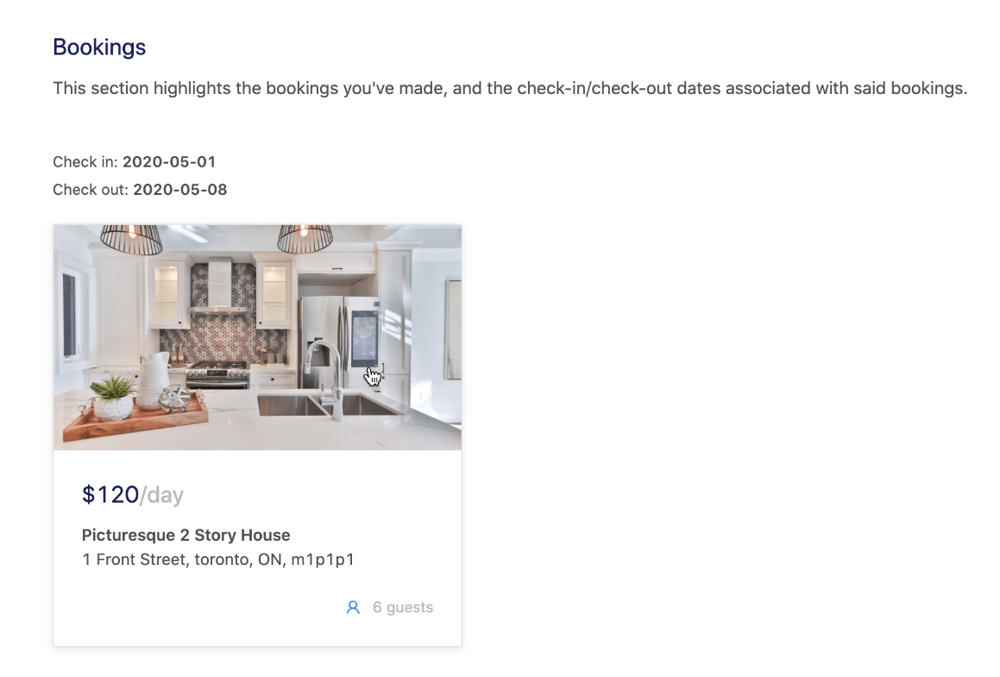

# TinyHouse - PostgreSQL & TypeORM

I> 📝 In this lesson, we'll be using the following seed data to populate our database - [listings](https://gist.github.com/djirdehh/a3f7877b578d9b70f1e3c81e38556cdb) and [users](https://gist.github.com/djirdehh/c6c9a9b911c4aa6d26f1be4cf0785dee). This seed data does not reference MongoDB's `ObjectId` property which is important as we upload this data to our PostgreSQL database.

In this lesson, we'll integrate PostgreSQL and TypeORM into our TinyHouse application. To begin, we'll clone the source code from [lesson 15.6 from Part 2 of the course](https://www.newline.co/courses/tinyhouse-react-masterclass-part-2/additional-listing-date_picker-changes).

I> We are beginning this lesson from the last point of our source code for the TinyHouse app. Whatever you've managed to complete Part II of the course with will be a good starting point for this lesson.

## Install & Update

First, we'll head over to our client application and make sure our npm packages are installed:

```shell
npm install
```

That will be all we'll do for our React client. All the further changes we need to make to integrate PostgreSQL & TypeORM into TinyHouse will be on the server-side!

We'll head over to our Node server and make sure our npm packages are installed:

```shell
npm install
```

Next, we'll make sure our npm packages are updated:

```shell
npm update
```

If npm warns about any vulnerabilities from our packages, we'll also want to make sure we fix those:

```shell
npm audit fix
```

Since we'll be using TypeORM and PostgreSQL instead of MongoDB, we'll be uninstalling the MongoDB driver and accompanying type definitions:

```shell
npm uninstall mongodb --save
npm uninstall @types/mongodb --save-dev
```

Like what we did in the previous lesson, we'll first install the packages TypeORM requires:

```shell
npm install typeorm reflect-metadata
```

Next, we'll install the PostgreSQL database driver:

```shell
npm install pg
```

Next, we'll enable the following settings in the `tsconfig.json` file to complement some of the code we'll write with TypeORM:

{lang=json,line-numbers=off,crop-start-line=9,crop-end-line=11}
<<[server/tsconfig.json](./protected/source_code/server/tsconfig.json)

## Configuration

We'll create a new `.env` file (or update our existing available `.env` file) with the following variables set.

```
PORT=9000
G_CLIENT_ID=******************
G_CLIENT_SECRET=******************
PUBLIC_URL=http://localhost:3000
SECRET=******************
NODE_ENV=development
G_GEOCODE_KEY=******************
S_SECRET_KEY=******************
S_CLIENT_ID=******************
CLOUDINARY_NAME=******************
CLOUDINARY_KEY=******************
CLOUDINARY_SECRET=******************
```

I> In this lesson, we're focused on swapping our server interaction from MongoDB to PostgreSQL. You can use the same environment variables you used when going through Part 2 of the course but remove the `DB_USER`, `DB_USER_PASSWORD`, and `DB_CLUSTER` environment variables since we won't need these any longer.

Next, we'll copy over the same `ormconfig.json` from our previous lesson and drop it into our TinyHouse server project since we are to have a similar ORM configuration. We'll also need to create a new PostgreSQL database. To do this, we'll open pgAdmin and create a new database called `tinyhouse` and we'll update our `ormconfig.json` with our new database name.

The `ormconfig.json` file of our server project will look like the following:

{lang=json,line-numbers=off}
<<[server/ormconfig.json](./protected/source_code/server/ormconfig.json)

I> Some of your ORM config values may look different depending on your database username, password, etc.

## Set-up

Like what we did in the previous lesson, we'll first need to import `reflect-metadata` at the beginning of our server project which we'll do in our server `src/index.ts` file.

{lang=ts,line-numbers=off,crop-start-line=3,crop-end-line=3}
<<[server/src/index.ts](./protected/source_code/server/src/index.ts)

Next, we'll head over to our `database` folder and modify our `connectDatabase()` function to use TypeORM's `createConnection()` method to connect our Node server to our PostgreSQL database. We'll also import entities that we'll soon create - `BookingEntity`, `ListingEntity`, and `UserEntity`.

{lang=ts,line-numbers=off}
<<[server/src/database/index.ts](./protected/source_code/server/src/database/index.ts)

### TypeORM Entities

We'll create a new folder called `entity/` in our server `src/database/` directory to define our database schema. Inside the `entity/` folder, we'll create and export a `BookingEntity`, `ListingEntity`, and a `UserEntity` in separate files. When building our entities, we'll reference our TypeScript definitions since they'll represent how our entities are to be shaped. The only difference would be that our `Listing` and `User` TypeScript type definitions are to have an `authorized?: boolean` property whereas our database equivalents would not.

With this in mind, our `BookingEntity` will look like the following:

{lang=ts,line-numbers=off}
<<[server/src/database/entity/BookingEntity.ts](./protected/source_code/server/src/database/entity/BookingEntity.ts)

Our `ListingEntity` will appear as follows:

{lang=ts,line-numbers=off}
<<[server/src/database/entity/ListingEntity.ts](./protected/source_code/server/src/database/entity/ListingEntity.ts)

And our `UserEntity` will look like the following:

{lang=ts,line-numbers=off}
<<[server/src/database/entity/UserEntity.ts](./protected/source_code/server/src/database/entity/UserEntity.ts)

In our newly prepared entities, we introduced some new data types:

- `enum` is equivalent to TypeScript's `enum` and we can provide a reference to our `ListingType` enum that we've defined in our server `src/lib/types.ts` file
- `simple-array` store array values in a single `string` column under the hood.
- `simple-json` stores JSON objects in a single `string` column using `JSON.stringify` under the hood.

I> To see a full list of data types TypeORM supports for each database system, head over to their [official documentation](https://github.com/typeorm/typeorm/blob/master/docs/entities.md#column-types)

Next, we'll modify our TypeScript definitions to match our database schema:

- Instead of using MongoDB's `Collection` type, we'll use TypeORM's `Repository` type.
- Instead of using MongoDB's `_id` field of `ObjectId`'s, we'll reference `id` fields of type `string`.

With these changes, our server `src/lib/types.ts` file in its entirety will look like the following:

{lang=ts,line-numbers=off}
<<[server/src/lib/types.ts](./protected/source_code/server/src/lib/types.ts)

### Seed Database

Before we start to modify our GraphQL resolvers to use TypeORM instead of the MongoDB driver methods, we'll first seed our PostgreSQL database with some data.

Instead of using MongoDB's `insertOne()` method, we'll use TypeORM's `create()` method to create a new instance of an entity locally, then we'll use the `save()` method to save it to our database.

Our server `temp/seed.ts` file will appear as follows:

```ts
require("dotenv").config();

import { connectDatabase } from "../src/database";
import { Listing, ListingType, User } from "../src/lib/types";

const listings: Listing[] = [
  // ...
];

const users: User[] = [
  // ...
];

const seed = async () => {
  try {
    console.log("[seed] : running...");

    const db = await connectDatabase();

    for (const listing of listings) {
      await db.listings.create(listing).save();
    }

    for (const user of users) {
      await db.users.create(user).save();
    }

    console.log("[seed] : success");
  } catch {
    throw new Error("failed to seed database");
  }
};

seed();
```

I> Do obtain a copy of the mock listings and users for this lesson from the following links - [mock listings](https://gist.github.com/djirdehh/a3f7877b578d9b70f1e3c81e38556cdb) and [mock users](https://gist.github.com/djirdehh/c6c9a9b911c4aa6d26f1be4cf0785dee). The seed data we use here is modified to remove MongoDB's `ObjectId` usage within each mock listing and user object.

We'll also update our `clear()` script just in case we need to reset our database. Instead of using MongoDB's `drop()` method, we'll use TypeORM's `clear()` method instead.

Our server `temp/clear.ts` file will look like the following:

{lang=ts,line-numbers=off}
<<[server/temp/clear.ts](./protected/source_code/server/temp/clear.ts)

With these changes, we'll now run our `seed()` function to populate our PostgreSQL database with mock data:

```shell
npm run seed
```

When our seed script is complete, we'll be able to see our seeded data in our `tinyhouse` database from the pgAdmin application.

### User Resolvers

We'll now begin to modify our GraphQL resolvers to use TypeORM. We'll start by updating our `Query.user` resolver:

- We won't need to do anything to our `findOne()` method because MongoDB and TypeORM's API for `findOne()` is identical.
- We'll cast the `user` object of the found user as our TypeScript `User` type. This is done so that we can assign an `authorized` property to it later on in the function.
- Since our PostgreSQL table uses an `id` column instead of an `_id` field, we'll change that across the entire file as well. We can also remove our custom `User.id` resolver since this will be handled trivially by our GraphQL server.

Our `Query.user` resolver function will look like the following:

```ts
export const userResolvers: IResolvers = {
  Query: {
    user: async (
      _root: undefined,
      { id }: UserArgs,
      { db, req }: { db: Database; req: Request }
    ): Promise<User> => {
      try {
        const user = (await db.users.findOne({ id })) as User;

        if (!user) {
          throw new Error("user can't be found");
        }

        const viewer = await authorize(db, req);

        if (viewer && viewer.id === user.id) {
          user.authorized = true;
        }

        return user;
      } catch (error) {
        throw new Error(`Failed to query user: ${error}`);
      }
    },
  },
  User: {
    // ...
  },
};
```

Next, we'll update our `User.bookings` resolver:

- Instead of using MongoDB's `find()` method, we'll use TypeORM's `findByIds()` method. TypeORM's `findByIds()` method takes optional parameters for `skip` and `take` which work similarly to MongoDB's `skip` and `limit` parameters respectively.

I> TypeORM has additional options for their find methods. To learn more, check out their [official documentation](https://github.com/typeorm/typeorm/blob/master/docs/find-options.md).

Our `User.bookings` resolver will appear as follows:

```ts
export const userResolvers: IResolvers = {
  Query: {
    // ...
  },
  User: {
    // ...
    bookings: async (
      user: User,
      { limit, page }: UserBookingsArgs,
      { db }: { db: Database }
    ): Promise<UserBookingsData | null> => {
      try {
        if (!user.authorized) {
          return null;
        }

        const data: UserBookingsData = {
          total: 0,
          result: [],
        };

        const bookings = await db.bookings.findByIds(user.bookings, {
          skip: page > 0 ? (page - 1) * limit : 0,
          take: limit,
        });

        data.total = user.bookings.length;
        data.result = bookings;

        return data;
      } catch (error) {
        throw new Error(`Failed to query user bookings: ${error}`);
      }
    },
  },
};
```

Similarly, we'll also update our `User.listings` resolver.

- We'll use TypeORM's `findByIds()` method with the `skip` and `take` optional parameters.

With all the changes we've made, our `src/graphql/resolvers/User/index.ts` file will look like the following:

{lang=ts,line-numbers=off}
<<[server/src/graphql/resolvers/User/index.ts](./protected/source_code/server/src/graphql/resolvers/User/index.ts)

### Viewer Resolvers

We'll now navigate and make changes to our `viewerResolvers`. First, we'll replace any references with MongoDB's `_id` property with just `id`. We'll also delete the `Viewer.id` resolver since this will be resolved trivially.

Next, we'll modify the `logInViaGoogle()` function with the following changes.

- Instead of using MongoDB's `findOneAndUpdate()` method, we'll use TypeORM's `save()` method to save any entity changes to our database.
- We'll also use TypeORM's `create()` method to create a new instance of an entity locally then we'll use the `save()` method to save it to our database.

```ts
const logInViaGoogle = async (
  code: string,
  token: string,
  db: Database,
  res: Response
): Promise<User | undefined> => {
  // ...
  // access userId, userName, userAvatar, and userEmail
  // ...

  if (!userId || !userName || !userAvatar || !userEmail) {
    throw new Error("Google login error");
  }

  let viewer = await db.users.findOne({ id: userId });

  if (viewer) {
    viewer.name = userName;
    viewer.avatar = userAvatar;
    viewer.contact = userEmail;
    viewer.token = token;
    await viewer.save();
  } else {
    const newUser: User = {
      id: userId,
      token,
      name: userName,
      avatar: userAvatar,
      contact: userEmail,
      income: 0,
      bookings: [],
      listings: [],
    };

    viewer = await db.users.create(newUser).save();
  }

  res.cookie("viewer", userId, {
    ...cookieOptions,
    maxAge: 365 * 24 * 60 * 60 * 1000,
  });

  return viewer;
};
```

Next, we'll modify our `logInViaCookie()` function:

- Instead of using MongoDB's `findOneAndUpdate()` method, we'll use TypeORM's `findOne()` method to find our viewer from our database.
- We'll then use TypeORM's `save()` method to save any entity changes to our database.

{lang=ts,line-numbers=off,crop-query=.logInViaCookie}
<<[server/src/graphql/resolvers/Viewer/index.ts](./protected/source_code/server/src/graphql/resolvers/Viewer/index.ts)

Next, we'll modify the `Mutation.connectStripe` and `Mutation.disconnectStripe` resolvers in our `viewerResolvers` map:

- For both of these resolvers, instead of using MongoDB's `findOneAndUpdate()` method, we'll use TypeORM's `save()` method to save any entity changes to our database.

```ts
export const viewerResolvers: IResolvers = {
  Query: {
    // ...
  },
  Mutation: {
    // ...
    connectStripe: async (
      _root: undefined,
      { input }: ConnectStripeArgs,
      { db, req }: { db: Database; req: Request }
    ): Promise<Viewer> => {
      try {
        const { code } = input;

        const viewer = await authorize(db, req);
        if (!viewer) {
          throw new Error("viewer cannot be found");
        }

        const wallet = await Stripe.connect(code);
        if (!wallet) {
          throw new Error("stripe grant error");
        }

        viewer.walletId = wallet.stripe_user_id;
        await viewer.save();

        return {
          id: viewer.id,
          token: viewer.token,
          avatar: viewer.avatar,
          walletId: viewer.walletId,
          didRequest: true,
        };
      } catch (error) {
        throw new Error(`Failed to connect with Stripe: ${error}`);
      }
    },
    disconnectStripe: async (
      _root: undefined,
      _args: {},
      { db, req }: { db: Database; req: Request }
    ): Promise<Viewer> => {
      try {
        const viewer = await authorize(db, req);
        if (!viewer || !viewer.walletId) {
          throw new Error("viewer cannot be found or has not connected with Stripe");
        }

        const wallet = await Stripe.disconnect(viewer.walletId);
        if (!wallet) {
          throw new Error("stripe disconnect error");
        }

        viewer.walletId = null;
        await viewer.save();

        return {
          id: viewer.id,
          token: viewer.token,
          avatar: viewer.avatar,
          walletId: viewer.walletId,
          didRequest: true,
        };
      } catch (error) {
        throw new Error(`Failed to disconnect with Stripe: ${error}`);
      }
    },
  },
};
```

We'll also need to modify our utility `authorize()` function to return a `UserEntity` so that we can use TypeORM's `save()` method elsewhere in our resolvers. We'll update the `src/lib/utils/index.ts` file with these changes:

{lang=ts,line-numbers=off}
<<[server/src/lib/utils/index.ts](./protected/source_code/server/src/lib/utils/index.ts)

### Listing Resolvers

We'll now update the resolvers in our `listingResolvers` map and begin with the `Query.listing` resolver with these changes:

- We won't need to do anything to our `findOne()` method because MongoDB and TypeORM's API for `findOne()` are identical.
- We'll cast the `listing` constant as the TypeScript `Listing` type so that we can assign an `authorized` property to it later on in the function.
- Since our PostgreSQL table uses an `id` column instead of an `_id` field, we'll change that across the entire file as well. This will also mean we can remove our custom `Listing.id` resolver since that will be handled trivially.

```ts
export const listingResolvers: IResolvers = {
  Query: {
    listing: async (
      _root: undefined,
      { id }: ListingArgs,
      { db, req }: { db: Database; req: Request }
    ): Promise<Listing> => {
      try {
        const listing = (await db.listings.findOne({ id })) as Listing;
        if (!listing) {
          throw new Error("listing can't be found");
        }

        const viewer = await authorize(db, req);
        if (viewer && viewer.id === listing.host) {
          listing.authorized = true;
        }

        return listing;
      } catch (error) {
        throw new Error(`Failed to query listing: ${error}`);
      }
    },
    // ...
  },
  // ...
};
```

Next, we'll look to update our `Query.listings` resolver:

- Here, we'll introduce TypeORM's [`order` option](https://github.com/typeorm/typeorm/blob/master/docs/find-options.md) for their find methods.

- We'll also need to create a new `Order` TypeScript definition for our `order` variable. This will be done in the server `src/graphql/resolvers/Listing/types.ts` file:

{lang=ts,line-numbers=off,crop-start-line=55,crop-end-line=57}
<<[server/src/graphql/resolvers/Listing/types.ts](./protected/source_code/server/src/graphql/resolvers/Listing/types.ts)

- TypeORM's `find()` method takes optional parameters for `order`, `skip`, and `take` which work similarly to MongoDB's `sort`, `skip`, and `limit` parameters.
- We'll also utilize TypeORM's `count()` method to return the total number of listings that match our `where` query. This is used by our React client to compute the total number of pages for pagination.

```ts
export const listingResolvers: IResolvers = {
  Query: {
    // ...
    listings: async (
      _root: undefined,
      { location, filter, limit, page }: ListingsArgs,
      { db }: { db: Database }
    ): Promise<ListingsData> => {
      try {
        const query: ListingsQuery = {};
        const data: ListingsData = {
          region: null,
          total: 0,
          result: [],
        };

        if (location) {
          const { country, admin, city } = await Google.geocode(location);

          if (city) query.city = city;
          if (admin) query.admin = admin;
          if (country) {
            query.country = country;
          } else {
            throw new Error("no country found");
          }

          const cityText = city ? `${city}, ` : "";
          const adminText = admin ? `${admin}, ` : "";
          data.region = `${cityText}${adminText}${country}`;
        }

        let order: Order | null = null;

        if (filter && filter === ListingsFilter.PRICE_LOW_TO_HIGH) {
          order = { price: "ASC" };
        }

        if (filter && filter === ListingsFilter.PRICE_HIGH_TO_LOW) {
          order = { price: "DESC" };
        }

        const count = await db.listings.count(query);
        const listings = await db.listings.find({
          where: { ...query },
          order: { ...order },
          skip: page > 0 ? (page - 1) * limit : 0,
          take: limit,
        });

        data.total = count;
        data.result = listings;

        return data;
      } catch (error) {
        throw new Error(`Failed to query listings: ${error}`);
      }
    },
  },
  // ...
};
```

Next, we'll modify our `Mutation.hostListing` resolver with the following changes:

- Instead of using MongoDB's `ObjectId()` method, we'll use Node's `crypto` library instead.
- Instead of using MongoDB's `insertOne()` method, we'll use TypeORM's `create()` method to create a new instance of an entity locally and we'll use the `save()` method to save it to our database.

```ts
export const listingResolvers: IResolvers = {
  Query: {
    // ...
  },
  Mutation: {
    hostListing: async (
      _root: undefined,
      { input }: HostListingArgs,
      { db, req }: { db: Database; req: Request }
    ): Promise<Listing> => {
      verifyHostListingInput(input);

      const viewer = await authorize(db, req);
      if (!viewer) {
        throw new Error("viewer cannot be found");
      }

      const { country, admin, city } = await Google.geocode(input.address);
      if (!country || !admin || !city) {
        throw new Error("invalid address input");
      }

      const imageUrl = await Cloudinary.upload(input.image);

      const newListing: Listing = {
        id: crypto.randomBytes(16).toString("hex"),
        ...input,
        image: imageUrl,
        bookings: [],
        bookingsIndex: {},
        country,
        admin,
        city,
        host: viewer.id,
      };

      const insertedListing = await db.listings.create(newListing).save();

      viewer.listings.push(insertedListing.id);
      await viewer.save();

      return insertedListing;
    },
  },
  // ...
};
```

We'll now make an update for our `Listing.bookings` resolver.

- Instead of using MongoDB's `find()` method, we'll use TypeORM's `findByIds()` method.
- We'll use the optional parameters `skip` and `take` to enable pagination.

```ts
export const listingResolvers: IResolvers = {
  // ...
  Listing: {
    // ...
    bookings: async (
      listing: Listing,
      { limit, page }: ListingBookingsArgs,
      { db }: { db: Database }
    ): Promise<ListingBookingsData | null> => {
      try {
        if (!listing.authorized) {
          return null;
        }

        const data: ListingBookingsData = {
          total: 0,
          result: [],
        };

        const bookings = await db.bookings.findByIds(listing.bookings, {
          skip: page > 0 ? (page - 1) * limit : 0,
          take: limit,
        });

        data.total = listing.bookings.length;
        data.result = bookings;

        return data;
      } catch (error) {
        throw new Error(`Failed to query listing bookings: ${error}`);
      }
    },
  },
};
```

### PostgreSQL - Indexing

Indexes support the efficient execution of queries in a table. Without indexes, PostgreSQL must scan through every row of data to select the records that match the query statement. If an appropriate index exists for a query, PostgreSQL can use that index to limit the number of records to check.

For our MongoDB database, we created a **compound index** using the `country`, `admin`, and `city` fields for our listings collection. For our PostgreSQL database, we'll do something very similar by creating a [**multicolumn index**](https://www.postgresql.org/docs/9.5/indexes-multicolumn.html) for our listings table using the following SQL statement:

```sql
CREATE INDEX location_index ON public.listings (country, admin, city);
```

We'll create and run the above query in the “Tools/Query Tool” action from the top navigation bar of pgAdmin for our `tinyhouse` PostgreSQL database.


### Booking Resolvers

Finally, we'll now update our `Mutation.createBooking` resolver with the following changes.

- Instead of using MongoDB's `ObjectId()` method, we'll use Node's `crypto` library instead.
- Since our PostgreSQL table uses an `id` column instead of an `_id` field, we'll change that across the entire file as well. We can also remove our custom `Booking.id` resolver since that will be handled trivially by our GraphQL server.
- Instead of using MongoDB's `insertOne()` method, we'll use TypeORM's `create()` method to create a new instance of an entity locally and we'll then use the `save()` method to save it to our database.
- Instead of using MongoDB's `updateOne()` method, we'll use TypeORM's `save()` method to save any entity changes to our database.

With these changes, our `createBooking` resolver in our `bookingResolvers` map within `src/graphql/Booking/index.ts` will look like the following:

```ts
export const bookingResolvers: IResolvers = {
  Mutation: {
    createBooking: async (
      _root: undefined,
      { input }: CreateBookingArgs,
      { db, req }: { db: Database; req: Request }
    ): Promise<Booking> => {
      try {
        const { id, source, checkIn, checkOut } = input;

        let viewer = await authorize(db, req);
        if (!viewer) {
          throw new Error("viewer cannot be found");
        }

        const listing = await db.listings.findOne({ id });
        if (!listing) {
          throw new Error("listing can't be found");
        }

        if (listing.host === viewer.id) {
          throw new Error("viewer can't book own listing");
        }

        const today = new Date();
        const checkInDate = new Date(checkIn);
        const checkOutDate = new Date(checkOut);

        if (checkInDate.getTime() > today.getTime() + 90 * millisecondsPerDay) {
          throw new Error("check in date can't be more than 90 days from today");
        }

        if (checkOutDate.getTime() > today.getTime() + 90 * millisecondsPerDay) {
          throw new Error("check out date can't be more than 90 days from today");
        }

        if (checkOutDate < checkInDate) {
          throw new Error("check out date can't be before check in date");
        }

        const bookingsIndex = resolveBookingsIndex(
          listing.bookingsIndex,
          checkIn,
          checkOut
        );

        const totalPrice =
          listing.price *
          ((checkOutDate.getTime() - checkInDate.getTime()) / millisecondsPerDay + 1);

        const host = await db.users.findOne({ id: listing.host });

        if (!host || !host.walletId) {
          throw new Error(
            "the host either can't be found or is not connected with Stripe"
          );
        }

        await Stripe.charge(totalPrice, source, host.walletId);

        const newBooking: Booking = {
          id: crypto.randomBytes(16).toString("hex"),
          listing: listing.id,
          tenant: viewer.id,
          checkIn,
          checkOut,
        };

        const insertedBooking = await db.bookings.create(newBooking).save();

        host.income = host.income + totalPrice;
        await host.save();

        viewer.bookings.push(insertedBooking.id);
        await viewer.save();

        listing.bookingsIndex = bookingsIndex;
        listing.bookings.push(insertedBooking.id);
        await listing.save();

        return insertedBooking;
      } catch (error) {
        throw new Error(`Failed to create a booking: ${error}`);
      }
    },
  },
  // ...
};
```

### Testing Our Application

We've made all the changes we need to do! Now will be a great time to test our PostgreSQL database and TypeORM integration. First, we'll start our Node server by running the following command on the server directory.

```shell
npm start
```

Then, we'll start our React client by running the following command on the client directory.

```shell
npm start
```

First, we'll look to make sure our location search, pagination, and price sorting work as intended.


Next, we'll attempt to sign in with a Google account.


We'll check to see that connecting with Stripe works.


We'll make sure our host listing functionality works.


We'll look to see if we can book a listing with no issues.


When a booking has just been booked, we'll be able to confirm that the booked dates are disabled in the datepicker. Great!


We'll then be able to head over to the profile page where we can see the booking we just made.



And finally, for the tenant whose listing has been booked, we can confirm that the income shows the newly earned amount from the person who's booked the listing.


Perfect! We just successfully removed MongoDB from our stack and added PostgreSQL & TypeORM to our TinyHouse application 🎉.
