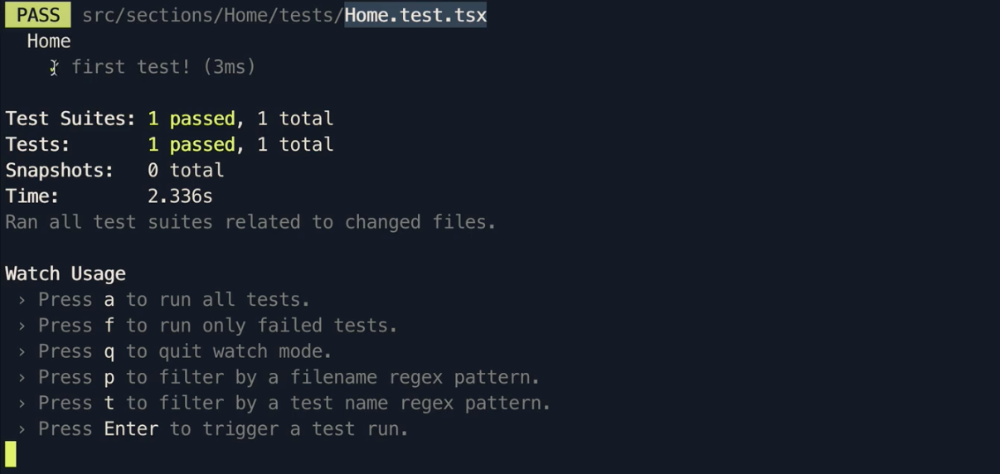

# Getting Started

Continuing from where we left off in our TinyHouse application and taking a look at our client project's `package.json` file, we'll notice type definitions already installed for the Jest library.

{lang=tsx,line-numbers=off,crop-start-line=8,crop-end-line=8}
<<[client/package.json](./protected/source_code/client/package.json)

This installed type definition comes from the generated code that Create React App helped scaffold for us to instantiate a client-side React application.

The Jest library itself is also installed but part of the `react-scripts` bundle installed and used to run scripts in our app.

{lang=tsx,line-numbers=off,crop-start-line=21,crop-end-line=21}
<<[client/package.json](./protected/source_code/client/package.json)

The [Running Tests](https://create-react-app.dev/docs/running-tests/) section of Create React App's documentation gives us information on the Jest set-up made with CRA. Of particular interest is the filename convention Jest in CRA will look for with regards to test files:

- Files with `.js` suffix in `__tests__` folders.
- Files with `.test.js` suffix.
- Files with `.spec.js` suffix.

> The above files will have the `.ts` file extension for React TypeScript projects.

## Our first test

We'll create a simple dummy test to ensure our Jest set-up works as expected. In the next coming lessons, we'll begin by writing tests for the `Home` component so we'll create this test in a `tests` folder under the `src/sections/Home/tests/` directory. We'll label the test file `Home.test.tsx`.

```
src/
  sections/
    // ...
    Home/
      tests/
        Home.test.tsx
      // ..
    // ...
```

We've given the filename a convention of `.test` to have the Jest runner pick up and run tests from this file. The extension is a TypeScript extension since we'll be writing TypeScript compatible code. Lastly, the extension has the JSX denotion with it since we'll want to render component markup in our tests.

We'll set-up a simple test that's independant to the component we're about to test and simply checks for the equality of numbers that are the same to one another.

```tsx
import { Home } from '../index';

describe(('Home') => {
  it(('first test!') => {
    expect(1).toEqual(1);
  });
});
```

There exists a `test` script in our client app, so we'll be able to run the test by executing the script.

```shell
client: $ npm run test
```

With our test suite running, we'll be presented with information about how our test passes.



## Installing dependencies

We'll conclude this lesson by installing the dependencies we'll need moving forward to test our React components. Though CRA seems to have all of its dependencies under the `dependencies` field of `package.json`, we'll go ahead and install the new testing dependencies as `devDependencies`.

We'll first install React Testing Library.

```shell
client: $ npm install --save-dev @testing-library/react
```

We'll then install Apollo React Testing.

```shell
client: $ npm install @apollo/react-testing
```
