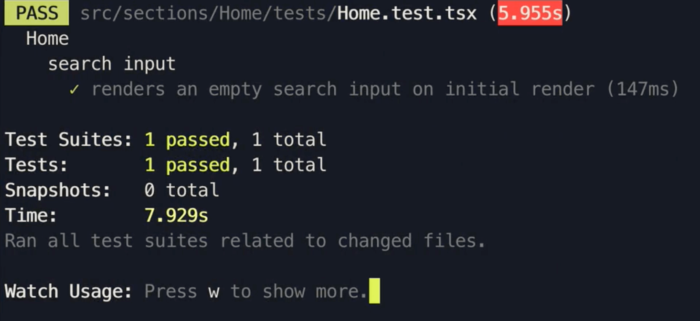

# Testing the Home Component I

With the `Home` component there are two main aspects of the component we would like to test.

1.  The search input functionality at the top of the page functions the way we expect it to.
2.  The premium listings section of the homepage shows the UI we expect under the different states of the GraphQL request being made (loading, error, or success).

With this in mind, the tests in the newly created `Home.test.tsx` file can be structured as follows:

```tsx
import { Home } from "../index";

describe("Home", () => {
  describe("search input", () => {
    // ...
  });

  describe("premium listings", () => {
    // ...
  });
});
```

We'll begin by first preparing tests for the search input.

## Testing the search input

The very first test we can do with the search input in the `Home` component is verify that the input is provided an empty value when the `Home` component is first rendered. Though a test like this won't test any dynamic functionality, it will be a good test to begin with to help see how we can begin to instantiate our component in our test.

```tsx
import { Home } from "../index";

describe("Home", () => {
  describe("search input", () => {
    it("renders an empty search input on initial render", () => {
      // ...
    });
  });

  // ...
});
```

The very first thing we'll want to do in our test is render the `Home` component. To do so, we'll import and use the `render()` function from React Testing Library.

```tsx
import React from "react";
import { render } from "@testing-library/react";
import { Home } from "../index";

describe("Home", () => {
  describe("search input", () => {
    it("renders an empty search input on initial render", () => {
      render(<Home />);
    });
  });

  // ...
});
```

Though the above would work in simple cases, running the test above will have our unit test _fail_. The primary reason to this would be due to the fact that the `Home` component depends on context from the Apollo client since it makes a query with a React Apollo hook (`useQuery`) and uses the results of the query to render certain UI. By simply rendering the `Home` component in our test, the rendered component has no context on any Apollo functionality.

This is where we'll need to use the `MockedProvider` component from Apollo React Testing. The search input is independant of the status of the query made so we won't have to concern ourselves with providing valid mock GraphQL data. Instead we'll mock the GraphQL request in the loading state since this will help make our test more concise.

With the above in mind, our test will look something like the following:

```tsx
import React from "react";
import { render } from "@testing-library/react";
import { MockedProvider } from "@apollo/react-testing";
import { Home } from "../index";

describe("Home", () => {
  describe("search input", () => {
    it("renders an empty search input on initial render", () => {
      render(
        <MockedProvider mocks={[]}>
          <Home />
        </MockedProvider>
      );
    });
  });

  // ...
});
```

Attempting to run the test above, our test will _still_ fail. This will be due to a similar reason but now attributed to how our `Home` component uses components from React Router and such needs to understand the context of React Router in our test.

As mentioned in the [React Router documentation](https://reactrouter.com/web/guides/testing), we'll need to provide Router context to the components we render in our tests. We'll achieve this by wrapping our component with React Router's base `Router` component and provide a `history` prop from the [history](https://github.com/ReactTraining/history) package:

```tsx
import React from "react";
import { createMemoryHistory } from "history";
import { Router } from "react-router-dom";
import { render } from "@testing-library/react";
import { MockedProvider } from "@apollo/react-testing";
import { Home } from "../index";

describe("Home", () => {
  describe("search input", () => {
    it("renders an empty search input on initial render", () => {
      render(
        <MockedProvider mocks={[]}>
          <Router history={history}>
            <Home />
          </Router>
        </MockedProvider>
      );
    });
  });

  // ...
});
```

Now if we where to run our test above, our test will _pass_ which tells us we were at least able to render the `Home` component. We still may be presented with a console warning around the `window.scrollTo` function which pertains to how we set-up scroll to top functionality in our components. Since this has no bearing in any tests we'll write, we'll have the `window.scrollTo` function simply return a no operation function in our test file to avoid seeing the console warning.

```tsx
import React from "react";
import { createMemoryHistory } from "history";
import { Router } from "react-router-dom";
import { render } from "@testing-library/react";
import { MockedProvider } from "@apollo/react-testing";
import { Home } from "../index";

describe("Home", () => {
  // remove console error with window.scrollTo
  window.scrollTo = () => {};

  describe("search input", () => {
    it("renders an empty search input on initial render", () => {
      const history = createMemoryHistory();
      render(
        <MockedProvider mocks={[]}>
          <Router history={history}>
            <Home />
          </Router>
        </MockedProvider>
      );
    });
  });

  // ...
});
```

Since our `Home` component deals with asynchronous functionality and UI updates after some of this async work is complete, we'll want to have our assertions be kept within React Testing Library's `waitFor` utility method.

```tsx
import React from "react";
import { createMemoryHistory } from "history";
import { Router } from "react-router-dom";
import { render, waitFor } from "@testing-library/react";
import { MockedProvider } from "@apollo/react-testing";
import { Home } from "../index";

describe("Home", () => {
  // remove console error with window.scrollTo
  window.scrollTo = () => {};

  describe("search input", () => {
    it("renders an empty search input on initial render", async () => {
      const history = createMemoryHistory();
      render(
        <MockedProvider mocks={[]}>
          <Router history={history}>
            <Home />
          </Router>
        </MockedProvider>
      );

      await waitFor(() => {});
    });
  });

  // ...
});
```

Now, we can finally begin to conduct our test. To test the value of the search input component, we first need to find DOM node of this element in our test. We'll use the `getByPlaceholder` utility from React Testing Library to help us find the search input DOM node based on its placeholder value.

With the DOM node found, we can then assert the `value` of the node to be an empty string (i.e. have no value). Since the `.value` property is for HTML Input element, we'll cast the DOM node we find as `HTMLInputElement`.

With these changes, our `Home.test.tsx` test file will look like the following:

```tsx
import { createMemoryHistory } from "history";
import React from "react";
import { Router } from "react-router-dom";
import { render, waitFor } from "@testing-library/react";
import { MockedProvider } from "@apollo/react-testing";
import { Home } from "../index";

describe("Home", () => {
  // remove console error with window.scrollTo
  window.scrollTo = () => {};

  describe("search input", () => {
    it("renders an empty search input on initial render", async () => {
      const history = createMemoryHistory();
      const { getByPlaceholderText } = render(
        <MockedProvider mocks={[]}>
          <Router history={history}>
            <Home />
          </Router>
        </MockedProvider>
      );

      await waitFor(() => {
        const searchInput = getByPlaceholderText(
          "Search 'San Fransisco'"
        ) as HTMLInputElement;

        expect(searchInput.value).toEqual("");
      });
    });
  });

  // describe("premium listings", () => {

  // });
});
```

By running our test file, we'll see that our test passes!


