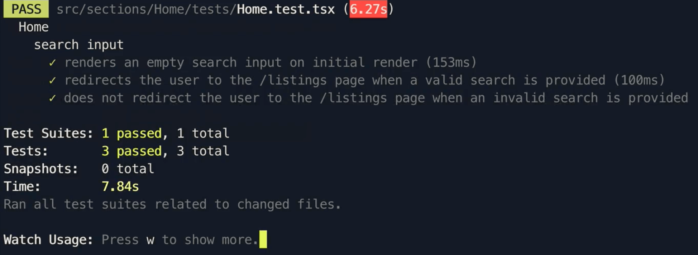
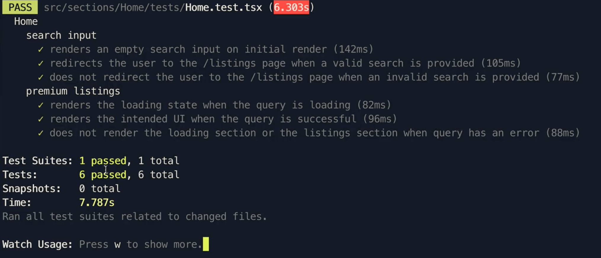

# Testing the Home Component II

In this lesson, we'll continue preparing and completing the tests we have in mind for the `Home` component.

## Search Input

We'll introduce two other tests to the search input functionality. In these new tests, however, we'll test how the search input functionality behaves when a user provides valid information or invalid information and attempts to make the search.

-   When a valid search is made, the user should be _redirected_ to the `/listings` route with their search appended to the route pathname.
-   When an invalid search is made (e.g. empty input), the user should _not_ be redirected to the `/listings` route.

```tsx
import React from "react";
import { createMemoryHistory } from "history";
import { Router } from "react-router-dom";
import { render, waitFor } from "@testing-library/react";
import { MockedProvider } from "@apollo/react-testing";
import { Home } from "../index";

describe("Home", () => {
  // remove console error with window.scrollTo
  window.scrollTo = () => {};

  describe("search input", () => {
    it("renders an empty search input on initial render", async () => {
      // ...
    });

    // new tests
    it("redirects the user to the /listings page when a valid search is provided", async () => {});

    it("does not redirect the user to the /listings page when an invalid search is provided", async () => {});
  });

  // ...
});
```

We'll begin with the test that involves having the user be navigated to the `/listings` route upon a successful search. The set-up in this test will be very similar to the test we've created before.

```tsx
it("redirects the user to the /listings page when a valid search is provided", async () => {
  const history = createMemoryHistory();
  const { getByPlaceholderText } = render(
    <MockedProvider mocks={[]}>
      <Router history={history}>
        <Home />
      </Router>
    </MockedProvider>
  );
});
```

To determine the input search was successful, we'll need to replicate the actions the user takes in the UI. We'll replicate these actions by using the `fireEvent` utility from React Testing Library and firing the two events we can make to mimic the fact the user attempted to make the search.

1.  Fire an event to change the input value.
2.  Fire an event to press the `Enter` key (i.e. to submit the search).

For the first event, we'll use the `change()` helper from the `fireEvent` utility to trigger an input change event. We'll provide a target value of a certain location the user is attempting to search for.

For the second event, we'll use the `keyDown()` helper from the `fireEvent` utility to trigger a key down event. We'll provide an event value representing the `Enter` key being selected.

We'll finally make our assertion by checking the value of `location.pathname` for the `history` object passed to our Router instance in our test. With these changes, our test will look like the following:

```tsx
// ...
import { render, fireEvent, waitFor } from "@testing-library/react";
// ...

it("redirects the user to the /listings page when a valid search is provided", async () => {
  const history = createMemoryHistory();
  const { getByPlaceholderText } = render(
    <MockedProvider mocks={[]}>
      <Router history={history}>
        <Home />
      </Router>
    </MockedProvider>
  );

  await waitFor(() => {
    const searchInput = getByPlaceholderText(
      "Search 'San Fransisco'"
    ) as HTMLInputElement;

    fireEvent.change(searchInput, { target: { value: "Toronto" } });
    fireEvent.keyDown(searchInput, {
      key: "Enter",
      keyCode: 13,
    });

    expect(history.location.pathname).toBe("/listings/Toronto");
  });
});
```

The opposite test will be _very_ similar. The only difference would be we provide an empty value for the input change being made and we'll assert that the location does not change (i.e. remains in the `/` route).

```tsx
// ...
import { render, fireEvent, waitFor } from "@testing-library/react";
// ...

it("does not redirect the user to the /listings page when an invalid search is provided", async () => {
  const history = createMemoryHistory();
  const { getByPlaceholderText } = render(
    <MockedProvider mocks={[]}>
      <Router history={history}>
        <Home />
      </Router>
    </MockedProvider>
  );

  await waitFor(() => {
    const searchInput = getByPlaceholderText(
      "Search 'San Fransisco'"
    ) as HTMLInputElement;

    fireEvent.change(searchInput, { target: { value: "" } });
    fireEvent.keyDown(searchInput, {
      key: "Enter",
      keyCode: 13,
    });

    expect(history.location.pathname).toBe("/");
  });
});
```

Running our tests, we should be presented with the tests we've prepared to now be passing!



## Premium Listings

We'll now move towards writing tests to assert how the UI for the Premium Listings section of the homepage behaves.

There's three tests we can think about here:

-   A loading message should be shown when the query for premium listings is being made.
-   The intended UI should be shown when the query for premium listings is complete.
-   The loading message and the intended UI should _not_ show when the query for premium listings error.

Our test structure for this section of tests will look as follows:

```tsx
describe("Home", () => {
  // ...

  describe("search input", () => {
    // ...
  });

  describe("premium listings", () => {
    it("renders the loading state when the query is loading", async () => {});

    it("renders the intended UI when the query is successful", async () => {});

    it("does not render the loading section or the listings section when query has an error", async () => {});
  });
});
```

### Premium Listings - Loading

Preparing the test for the loading state of the query will be just how we prepared the tests before - by providing a blank array as the value of the `mocks` property of the `<MockedProvider />` component.

We'll make our assertions here by inspecting the DOM nodes of the titles that get shown for the different UI states. In the `<Home />` component, we'll first ensure a title prop is passed to the skeleton component to mimic how the other child component is shown.

```tsx
const renderListingsSection = () => {
  if (loading) {
    return <HomeListingsSkeleton title="Premium Listings - Loading" />;
  }

  if (data) {
    return <HomeListings title="Premium Listings" listings={data.listings.result} />;
  }

  return null;
};
```

In the `<HomeListingsSkeleton />` component, we'll then use the `title` prop to display a title message.

```tsx
// ...
import { Card, List, Typography } from "antd";

// ...
const { Title } = Typography;

export const HomeListingsSkeleton = ({ title }: Props) => {
  const emptyData = [{}, {}, {}, {}];

  return (
    <div className="home-listings-skeleton">
      <Title level={4} className="home-listings__title">
        {title}
      </Title>
      {/* ... */}
    </div>
```

Going back to our test, we'll use React Testing Library's `queryByText` helper to attempt to query for the different text nodes we'll look. `queryByText` either returns the node when found or `null` if the node can't be found. We'll specify that in the loading state:

-   The node with text `Premium Listings` should be null.
-   The node with text `Premium Listings - Loading` should not be null.

Our first test will look like the following:

```tsx
it("renders the loading state when the query is loading", async () => {
  const history = createMemoryHistory();
  const { queryByText } = render(
    <MockedProvider mocks={[]}>
      <Router history={history}>
        <Home />
      </Router>
    </MockedProvider>
  );

  await waitFor(() => {
    expect(queryByText("Premium Listings - Loading")).not.toBeNull();
    expect(queryByText("Premium Listings")).toBeNull();
  });
});
```

### Premium Listings - Success

Our second test around the premium listings section will be set-up similar to the first one except that in this instance we'll look to provide mock data to mock the fact that the query was successful.

Additionally, in the `<MockedProvider />` component, we'll state the `addTypename` prop is given a false value since the mock data we provide won't have any `__typename`'s associated with it. Finally, our assertion will be the opposite to the above test we made (i.e. we should find a node with text that resembles the final state but should _not_ find a node with text that resembles the loading state).

```tsx
// ...
import { LISTINGS } from "../../../lib/graphql/queries";
import { ListingsFilter } from "../../../lib/graphql/globalTypes";
// ...

it("renders the intended UI when the query is successful", async () => {
  const listingsMock = {
    request: {
      query: LISTINGS,
      variables: {
        filter: ListingsFilter.PRICE_HIGH_TO_LOW,
        limit: 4,
        page: 1,
      },
    },
    result: {
      data: {
        listings: {
          region: null,
          total: 10,
          result: [
            {
              id: "1234",
              title: "Bev Hills",
              image: "image.png",
              address: "90210 Bev Hills",
              price: 9000,
              numOfGuests: 5,
            },
          ],
        },
      },
    },
  };

  const history = createMemoryHistory();
  const { queryByText } = render(
    <MockedProvider mocks={[listingsMock]} addTypename={false}>
      <Router history={history}>
        <Home />
      </Router>
    </MockedProvider>
  );

  await waitFor(() => {
    expect(queryByText("Premium Listings")).not.toBeNull();
    expect(queryByText("Premium Listings - Loading")).toBeNull();
  });
});
```

> When providing the request payload in the mock data for `<MockedProvider />`, be sure to make the request look _identical_ to the request made in the component (this includes having the same values for the variables used in the query). Otherwise, you may find yourself in a situation where you're unable to mock a success state of the query where the data you specify is the data in the mocked setting.

### Premium Listings - Error

For the error state, the main change we'll make here is instead of specify a `result` object in our mock GraphQL object, we'll specify an `error` property to mock the behaviour that a network error has occured. In our assertions for this test, we'll assert that _neither_ of the node's we've been looking for before is to be defined (i.e. they should both be `null`).

```tsx
// ...
import { LISTINGS } from "../../../lib/graphql/queries";
import { ListingsFilter } from "../../../lib/graphql/globalTypes";
// ...

it("does not render the loading section or the listings section when query has an error", async () => {
  const listingsMock = {
    request: {
      query: LISTINGS,
      variables: {
        filter: ListingsFilter.PRICE_HIGH_TO_LOW,
        limit: 4,
        page: 1,
      },
    },
    error: new Error("Network Error"),
  };

  const history = createMemoryHistory();
  const { queryByText } = render(
    <MockedProvider mocks={[listingsMock]} addTypename={false}>
      <Router history={history}>
        <Home />
      </Router>
    </MockedProvider>
  );

  await waitFor(() => {
    expect(queryByText("Premium Listings")).toBeNull();
    expect(queryByText("Premium Listings - Loading")).toBeNull();
  });
});
```

With all the changes we've made, our entire test file will look like the following:

```tsx
import { createMemoryHistory } from "history";
import React from "react";
import { Router } from "react-router-dom";
import { render, fireEvent, waitFor } from "@testing-library/react";
import { MockedProvider } from "@apollo/react-testing";
import { LISTINGS } from "../../../lib/graphql/queries";
import { ListingsFilter } from "../../../lib/graphql/globalTypes";
import { Home } from "../index";

describe("Home", () => {
  // remove console error with window.scrollTo
  window.scrollTo = () => {};

  describe("search input", () => {
    it("renders an empty search input on initial render", async () => {
      const history = createMemoryHistory();
      const { getByPlaceholderText } = render(
        <MockedProvider mocks={[]}>
          <Router history={history}>
            <Home />
          </Router>
        </MockedProvider>
      );

      await waitFor(() => {
        const searchInput = getByPlaceholderText(
          "Search 'San Fransisco'"
        ) as HTMLInputElement;

        expect(searchInput.value).toEqual("");
      });
    });

    it("redirects the user to the /listings page when a valid search is provided", async () => {
      const history = createMemoryHistory();
      const { getByPlaceholderText } = render(
        <MockedProvider mocks={[]}>
          <Router history={history}>
            <Home />
          </Router>
        </MockedProvider>
      );

      await waitFor(() => {
        const searchInput = getByPlaceholderText(
          "Search 'San Fransisco'"
        ) as HTMLInputElement;

        fireEvent.change(searchInput, { target: { value: "Toronto" } });
        fireEvent.keyDown(searchInput, {
          key: "Enter",
          keyCode: 13,
        });

        expect(history.location.pathname).toBe("/listings/Toronto");
      });
    });

    it("does not redirect the user to the /listings page when an invalid search is provided", async () => {
      const history = createMemoryHistory();
      const { getByPlaceholderText } = render(
        <MockedProvider mocks={[]}>
          <Router history={history}>
            <Home />
          </Router>
        </MockedProvider>
      );

      await waitFor(() => {
        const searchInput = getByPlaceholderText(
          "Search 'San Fransisco'"
        ) as HTMLInputElement;

        fireEvent.change(searchInput, { target: { value: "" } });
        fireEvent.keyDown(searchInput, {
          key: "Enter",
          keyCode: 13,
        });

        expect(history.location.pathname).toBe("/");
      });
    });
  });

  describe("premium listings", () => {
    it("renders the loading state when the query is loading", async () => {
      const history = createMemoryHistory();
      const { queryByText } = render(
        <MockedProvider mocks={[]}>
          <Router history={history}>
            <Home />
          </Router>
        </MockedProvider>
      );

      await waitFor(() => {
        expect(queryByText("Premium Listings - Loading")).not.toBeNull();
        expect(queryByText("Premium Listings")).toBeNull();
      });
    });

    it("renders the intended UI when the query is successful", async () => {
      const listingsMock = {
        request: {
          query: LISTINGS,
          variables: {
            filter: ListingsFilter.PRICE_HIGH_TO_LOW,
            limit: 4,
            page: 1,
          },
        },
        result: {
          data: {
            listings: {
              region: null,
              total: 10,
              result: [
                {
                  id: "1234",
                  title: "Bev Hills",
                  image: "image.png",
                  address: "90210 Bev Hills",
                  price: 9000,
                  numOfGuests: 5,
                },
              ],
            },
          },
        },
      };

      const history = createMemoryHistory();
      const { queryByText } = render(
        <MockedProvider mocks={[listingsMock]} addTypename={false}>
          <Router history={history}>
            <Home />
          </Router>
        </MockedProvider>
      );

      await waitFor(() => {
        expect(queryByText("Premium Listings")).not.toBeNull();
        expect(queryByText("Premium Listings - Loading")).toBeNull();
      });
    });

    it("does not render the loading section or the listings section when query has an error", async () => {
      const listingsMock = {
        request: {
          query: LISTINGS,
          variables: {
            filter: ListingsFilter.PRICE_HIGH_TO_LOW,
            limit: 4,
            page: 1,
          },
        },
        error: new Error("Network Error"),
      };

      const history = createMemoryHistory();
      const { queryByText } = render(
        <MockedProvider mocks={[listingsMock]} addTypename={false}>
          <Router history={history}>
            <Home />
          </Router>
        </MockedProvider>
      );

      await waitFor(() => {
        expect(queryByText("Premium Listings")).toBeNull();
        expect(queryByText("Premium Listings - Loading")).toBeNull();
      });
    });
  });
});
```

By running the `npm run test` script, we should be presented with all our tests passing!


