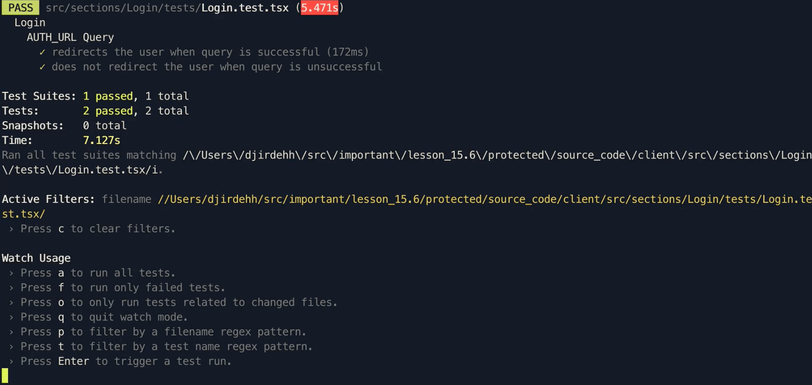

# Testing the Login Component I

With the `Login` component there are two main aspects of the component we would like to test.

1.  How the user is redirected to Google's authentication URL when they attempt to sign-in and the authentication URL is manually queried.
2.  How the login mutation is triggered when the user visits the `/login` route with a `code` query parameter provided by Google's servers.

With this in mind, the tests in the newly created `Login.test.tsx` file can be structured as follows:

```tsx
import { Login } from "../index";

describe("Login", () => {
  describe("AUTH_URL Query", () => {
    // ...
  });

  describe("LOGIN Mutation", () => {
    // ...
  });
});
```

In this lesson, we'll prepare tests around the `AUTH_URL` query.

## AUTH_URL Query

When it comes to how the `Login` component behaves when a user attempts to be directed to Google's authentication URL, there are two behaviors we can look to assert:

1.  When the user clicks the Sign-in button and the AUTH_URL is successfully queried, the user is redirected to the authentication URL returned from the query.
2.  When the user clicks the Sign-in button and the AUTH_URL query is unsuccessful, the user is not redirected anywhere and an error message is shown.

These two tests will be arranged as follows:

```tsx
import { Login } from "../index";

describe("Login", () => {
  describe("AUTH_URL Query", () => {
    it("redirects the user when query is successful", () => {
      // ...
    });

    it("does not redirect the user when query is unsuccessful", () => {
      // ...
    });
  });

  // ...
});
```

### User is redirected when the query is successful

We'll begin to prepare the preparation of the first test. We'll do very similar to what we did in the previous component we tested and look to prepare how the `<Login />` component can be rendered in our test.

To render our `<Login />` component, there are a few initial things we'll need to do:

-   We'll need to mock the `AUTH_URL` query such that it's mocked to be successful and returns the expected data.
-   We'll need to wrap our `<Login />` component with React Router's `<Router />` since the `<Login />` component uses specific React Router functionality.
-   We'll need to declare a value for the required `setViewer` prop the `<Login />` component expects.

Doing the above, our component to be rendered in our test will look as follows:

```tsx
import React from "react";
import { Route, Router } from "react-router-dom";
import { createMemoryHistory } from "history";
import { render } from "@testing-library/react";
import { MockedProvider } from "@apollo/react-testing";
import { AUTH_URL } from "../../../lib/graphql/queries";
import { Login } from "../index";

const defaultProps = {
  setViewer: () => {},
};

describe("Login", () => {
  describe("AUTH_URL Query", () => {
    it("redirects the user when query is successful", () => {
      const authUrlMock = {
        request: {
          query: AUTH_URL,
        },
        result: {
          data: {
            authUrl: "https://google.com/signin",
          },
        },
      };

      const history = createMemoryHistory({
        initialEntries: ["/login"],
      });
      render(
        <MockedProvider mocks={[authUrlMock]} addTypename={false}>
          <Router history={history}>
            <Route path="/login">
              <Login {...defaultProps} />
            </Route>
          </Router>
        </MockedProvider>
      );
    });
  });

  // ...
});
```

There are two small changes we've made to the above when compared to the tests we've set up in the `<Home />` component. First, we've wrapped our `<Login />` component with both React Router's `<Router />` component and `<Route />`. In addition, we've provided a value of `/login` as the value in the `initialEntries` array of our `history` object.

-   We've wrapped the `<Login />` component with a `<Route />` component that has a path of `/login` to emulate the fact that the component is only rendered in the `/login` route. We didn't do this for the `<Home />` component since not providing a value for a `<Route />` has it default to the index route (`/`) with the component shown is rendered under.
-   We've provided a value of `/login` in the `initialEntries` array to specify the exact location the user is in. With this test, the route is the same however for our other tests we'll write around the `LOGIN` mutation, here is where we'll need to dictate the `code` query parameter in our route.

The other change we've implemented is we've created a `defaultProps` object at the top of our file and used the spread operator to directly specify the prop values in the object to our rendered component. Our tests do not need to know what the `setViewer()` function exactly does since it's a functionality that is the responsibility of the parent. As a result we've specified the value of the function as an empty operation `() => {}`.

At this point, our test is appropriately set-up and we can now think of the assertions we want to write. In our test, the main assertion we would like to test for is _if_ the user has been redirected successfully. To do this, we can create a [**mock** function](https://jestjs.io/docs/en/mock-functions) around the functionality we want to test and assert that it is called the way we expect it to.

Let's break this down. In our `<Login />` component, when the `AUTH_URL` is successfully, we've set the redirect functionality to occur with the browser [`window.location.assign()`](https://developer.mozilla.org/en-US/docs/Web/API/Location/assign) function.

```tsx
      window.location.assign(data.authUrl);
```

Can or should we test for the functionality for this function in our test? Not really - our test first doesn't run on the browser so there's no way it has any context on what this function does. However, we can create some sort of spy on this function in our test and assert the fact _that the function was called with the correct payload_. If that is to occur, we can safely conclude the user is to be redirected.

To do this, we can create a mock function in Jest with `jest.fn()` and we'll do this at the beginning of the test.

```tsx
it("redirects the user when query is successful", () => {
  window.location.assign = jest.fn();

  // ...
});
```

In our test assertion, we can then use Jest's [`toHaveBeenCalledWith()` function](https://jestjs.io/docs/en/expect#tohavebeencalledwitharg1-arg2-) to help assert that this mock function was called! Furthermore, we'll ensure that the function was called with the value we obtain from our successful query. We'll do this within React Testing Library's `waitFor()` utility and additionally, we'll create another assertion to verify that the error message that occurs when the query fails is _not_ shown.

With all these changes, our entire test will look like the following:

```tsx
//...
import { render, fireEvent, waitFor } from "@testing-library/react";
// ...

describe("Login", () => {
  describe("AUTH_URL Query", () => {
    it("redirects the user when query is successful", async () => {
      window.location.assign = jest.fn();

      const authUrlMock = {
        request: {
          query: AUTH_URL,
        },
        result: {
          data: {
            authUrl: "https://google.com/signin",
          },
        },
      };

      const history = createMemoryHistory({
        initialEntries: ["/login"],
      });
      const { queryByText, getByRole } = render(
        <MockedProvider mocks={[authUrlMock]} addTypename={false}>
          <Router history={history}>
            <Route path="/login">
              <Login {...defaultProps} />
            </Route>
          </Router>
        </MockedProvider>
      );

      const authUrlButton = getByRole("button");
      fireEvent.click(authUrlButton);

      await waitFor(() => {
        expect(window.location.assign).toHaveBeenCalledWith("https://google.com/signin");
        expect(
          queryByText("Sorry! We weren't able to log you in. Please try again later!")
        ).toBeNull();
      });
    });
  });
});
```

### User is not redirected when the query is unsuccessful

Our second test within the set of tests around the `AUTH_URL` query will be the opposite of our first test. We'll set this test up the same way, however in this case we'll have our `AUTH_URL` query return a GraphQL error and no data. We'll then assert that the user is _not redirected_ (i.e. the mock function is _not called_) and the error message we expect to see is called.

With this, our second test will look as follows:

```tsx
//...
import { GraphQLError } from "graphql";
// ...

describe("Login", () => {
  describe("AUTH_URL Query", () => {
    // ...

    it("does not redirect the user when query is unsuccessful", async () => {
      window.location.assign = jest.fn();

      const authUrlMock = {
        request: {
          query: AUTH_URL,
        },
        errors: [new GraphQLError("Something went wrong")],
      };

      const history = createMemoryHistory({
        initialEntries: ["/login"],
      });
      const { queryByText, getByRole } = render(
        <MockedProvider mocks={[authUrlMock]} addTypename={false}>
          <Router history={history}>
            <Route path="/login">
              <Login {...defaultProps} />
            </Route>
          </Router>
        </MockedProvider>
      );

      const authUrlButton = getByRole("button");
      fireEvent.click(authUrlButton);

      await waitFor(() => {
        expect(window.location.assign).not.toHaveBeenCalledWith(
          "https://google.com/signin"
        );
        expect(
          queryByText("Sorry! We weren't able to log you in. Please try again later!")
        ).not.toBeNull();
      });
    });
  });
});
```

By introducing the small change we've done before at the beginning of our test to help remove any warnings around the `window.scrollTo` method - our entire test file will now look like the following.

```tsx
import React from "react";
import { Route, Router } from "react-router-dom";
import { createMemoryHistory } from "history";
import { render, fireEvent, waitFor } from "@testing-library/react";
import { MockedProvider } from "@apollo/react-testing";
import { GraphQLError } from "graphql";
import { AUTH_URL } from "../../../lib/graphql/queries";
import { Login } from "../index";

const defaultProps = {
  setViewer: () => {},
};

describe("Login", () => {
  // avoid console warnings around scrollTo
  window.scrollTo = () => {};

  describe("AUTH_URL Query", () => {
    it("redirects the user when query is successful", async () => {
      window.location.assign = jest.fn();

      const authUrlMock = {
        request: {
          query: AUTH_URL,
        },
        result: {
          data: {
            authUrl: "https://google.com/signin",
          },
        },
      };

      const history = createMemoryHistory({
        initialEntries: ["/login"],
      });
      const { queryByText, getByRole } = render(
        <MockedProvider mocks={[authUrlMock]} addTypename={false}>
          <Router history={history}>
            <Route path="/login">
              <Login {...defaultProps} />
            </Route>
          </Router>
        </MockedProvider>
      );

      const authUrlButton = getByRole("button");
      fireEvent.click(authUrlButton);

      await waitFor(() => {
        expect(window.location.assign).toHaveBeenCalledWith("https://google.com/signin");
        expect(
          queryByText("Sorry! We weren't able to log you in. Please try again later!")
        ).toBeNull();
      });
    });

    it("does not redirect the user when query is unsuccessful", async () => {
      window.location.assign = jest.fn();

      const authUrlMock = {
        request: {
          query: AUTH_URL,
        },
        errors: [new GraphQLError("Something went wrong")],
      };

      const history = createMemoryHistory({
        initialEntries: ["/login"],
      });
      const { queryByText, getByRole } = render(
        <MockedProvider mocks={[authUrlMock]} addTypename={false}>
          <Router history={history}>
            <Route path="/login">
              <Login {...defaultProps} />
            </Route>
          </Router>
        </MockedProvider>
      );

      const authUrlButton = getByRole("button");
      fireEvent.click(authUrlButton);

      await waitFor(() => {
        expect(window.location.assign).not.toHaveBeenCalledWith(
          "https://google.com/signin"
        );
        expect(
          queryByText("Sorry! We weren't able to log you in. Please try again later!")
        ).not.toBeNull();
      });
    });
  });

  describe("LOGIN Mutation", () => {});
});
```

By running the `npm run test` script, we should be presented with newly created tests passing.


