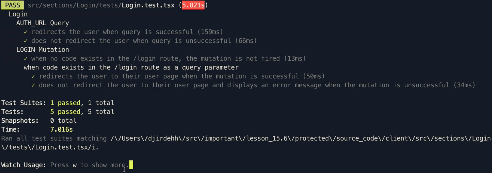

# Testing the Login Component II

In this lesson, we'll complete the tests we have in mind for the `Login` component.

## LOGIN Mutation

We'll write several tests to assert the behavior of the `LOG_IN` mutation in the `<Login />`. In our `<Login />` component, we've specified the use of a `useEffect()` Hook which is to _only_ trigger the `LOGIN` mutation when a `code` query parameter exists in the URL.

{lang=tsx,line-numbers=off,crop-start-line=47,crop-end-line=58}
<<[client/src/sections/Login/index.tsx](./protected/source_code/client/src/sections/Login/index.tsx)

When the mutation is in the loading state, we display a loading indicator. When the mutation becomes successful and data from the mutation exists, we redirect the user to their user page. Lastly, if the mutation was to ever error, we display an error banner.

{lang=tsx,line-numbers=off,crop-start-line=78,crop-end-line=93}
<<[client/src/sections/Login/index.tsx](./protected/source_code/client/src/sections/Login/index.tsx)

From all this behavior, we can think of structuring our tests around the `LOGIN` mutation as follows:

- When no `code` query parameter exists in the `/login` route, the `LOGIN` mutation is not fired.
- When the `LOGIN` mutation is fired and successful, the user is redirected to their user page.
- When the `LOGIN` mutation is fired and errors, the user is not redirected and an error message is shown.

> Additionally, we can write a test around the loading behavior of the `LOGIN` mutation.

With this in mind, our tests can be structured as follow within the test block around the `LOGIN` mutation.

```tsx
describe("Login", () => {
  // ...
  describe("LOGIN Mutation", () => {
    it("when no code exists in the /login route, the mutation is not fired", async () => {});

    describe("when code exists in the /login route as a query parameter", () => {
      it("redirects the user to their user page when the mutation is successful", async () => {});

      it("does not redirect the user to their user page and displays an error message when the mutation is unsuccessful", async () => {});
    });
  });
});
```

### When no code exists

We'll begin by writing the first test to assert that when no `code` parameter exists in the `/login` route, the mutation is not fired.

We'll render the `<Login />` component in this test similar to how we rendered it in the tests from the last lesson with some minor changes.

- We'll mock the `LOGIN` mutation with a successful response. Despite our mutation being mocked successfully, we'll assert that the user is _not_ redirected which likewise tells that the mutation wasn't appropriately called in the first place.
- We'll assert if the user has not been redirected in this case by inspecting the value of the `history.location.pathname` field. This is because the redirect that occurs here is due to React Router (the `<Redirect />` component in particular) and as a result, we can use the `history` object in our `<Router>` context of our test to assert if the location pathname has changed.

With this mind, our test will appear as follows:

```tsx
// ...
import { LOG_IN } from "../../../lib/graphql/mutations";
// ...

describe("Login", () => {
  // ...
  describe("LOGIN Mutation", () => {
    it("when no code exists in the /login route, the mutation is not fired", async () => {
      const logInMock = {
        request: {
          query: LOG_IN,
          variables: {
            input: {
              code: "1234",
            },
          },
        },
        result: {
          data: {
            logIn: {
              id: "111",
              token: "4321",
              avatar: "image.png",
              hasWallet: false,
              didRequest: true,
            },
          },
        },
      };

      const history = createMemoryHistory({
        initialEntries: ["/login"],
      });
      render(
        <MockedProvider mocks={[logInMock]} addTypename={false}>
          <Router history={history}>
            <Route path="/login">
              <Login {...defaultProps} />
            </Route>
          </Router>
        </MockedProvider>
      );

      await waitFor(() => {
        expect(history.location.pathname).not.toBe("/user/111");
      });
    });

    // ...
  });
});
```

### When code exists and mutation is successful

For the test around the `code` query parameter existing and the mutation being successful, we'll simply want to assert the history location has changed. We'll have this upcoming test be similar to the one above except we'll provide a `code` query parameter value in `/login` pathname we specify in the `initialEntries` array of our history object.

Finally, we'll assert that the `history.location.pathname` does become the value we expect the user to be redirected to which is `/user/${id}` with `id` being the `id` value returned from our GraphQL result.

With this in mind, our test will appear as follows:

```tsx
describe("Login", () => {
  // ...
  describe("LOGIN Mutation", () => {
    // ...

    describe("when code exists in the /login route as a query parameter", () => {
      it("redirects the user to their user page when the mutation is successful", async () => {
        const logInMock = {
          request: {
            query: LOG_IN,
            variables: {
              input: {
                code: "1234",
              },
            },
          },
          result: {
            data: {
              logIn: {
                id: "111",
                token: "4321",
                avatar: "image.png",
                hasWallet: false,
                didRequest: true,
              },
            },
          },
        };

        const history = createMemoryHistory({
          initialEntries: ["/login?code=1234"],
        });
        render(
          <MockedProvider mocks={[logInMock]} addTypename={false}>
            <Router history={history}>
              <Route path="/login">
                <Login {...defaultProps} />
              </Route>
            </Router>
          </MockedProvider>
        );

        await waitFor(() => {
          expect(history.location.pathname).toBe("/user/111");
        });
      });
    });
  });
});
```

### When code exists and mutation is unsuccessful

For our last test, we'll want to assert that the user _is not_ redirected to a user page (i.e. they remain where they are) if the `LOGIN` mutation was to error. For this test, we'll set up our mock GraphQL response to have a GraphQL error and we'll assert that the `history.location.pathname` value isn't changed to a `/user/${id}` route. Additionally, we'll also look to assert that an error message exists in the component.

With the above in mind, our last test will appear as follows:

```tsx
// ...
import { GraphQLError } from "graphql";
// ...

describe("Login", () => {
  // ...
  describe("LOGIN Mutation", () => {
    // ...

    describe("when code exists in the /login route as a query parameter", () => {
      // ...

      it("does not redirect the user to their user page and displays an error message when the mutation is unsuccessful", async () => {
        const logInMock = {
          request: {
            query: LOG_IN,
            variables: {
              input: {
                code: "1234",
              },
            },
          },
          errors: [new GraphQLError("Something went wrong")],
        };

        const history = createMemoryHistory({
          initialEntries: ["/login?code=1234"],
        });
        const { queryByText } = render(
          <MockedProvider mocks={[logInMock]} addTypename={false}>
            <Router history={history}>
              <Route path="/login">
                <Login {...defaultProps} />
              </Route>
            </Router>
          </MockedProvider>
        );

        await waitFor(() => {
          expect(history.location.pathname).not.toBe("/user/111");
          expect(
            queryByText("Sorry! We weren't able to log you in. Please try again later!")
          ).not.toBeNull();
        });
      });
    });
  });
});
```

I> Instead of testing that the `history.location.pathname` value _isn't_ the `/user/:id` route, one can also assert that the `history.location.pathname` value _remains_ in the `/login` route.

With all the tests we've written for the `<Login />` component, the `src/sections/Login/tests/Login.test.tsx` file will now look like the following:

{lang=tsx,line-numbers=off}
<<[client/src/sections/Login/tests/Login.test.tsx](./protected/source_code/client/src/sections/Login/tests/Login.test.tsx)

By running the `npm run test` script, we should see all our tests pass!


