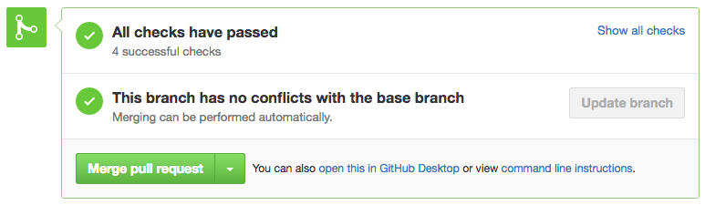

# Pushing code & creating PRs

> Though in this lesson, we'll touch on the topic of Git and Continous Integration pipelines - we don't spend any time diving into details on either of these topics.

In this short lesson, we'll take a bit of a tangent and talk about something we haven't talked about it in the course - pushing code and creating PRs.

Throughout the course, we continued building from lesson to lesson without ever considering pushing/storing our code in a version control system of sorts.

Regardless of what platform you use ([Github](https://github.com/), [Bitbucket](https://bitbucket.org/product), [Gitlab](https://gitlab.com/), etc.), you may be familiar with working with a repository like the following.


[Github's documentation](https://docs.github.com/en/github/creating-cloning-and-archiving-repositories/about-repositories) gives us a good explanation of what a repository is - _"A repository is like a folder for your project. Your project's repository contains all of your project's files and stores each file's revision history. You can also discuss and manage your project's work within the repository"._

In the above image example, assume the repo named `dummy-test-repo` is the representation of the work we've done to build TinyHouse through the course while missing a few of the recent tests we've just created. How would one best go about pushing this code onto the repository? Do we push directly to the `main`/`master` branch?

If you're working on a personal project or on a project that's being moved fairly quickly and you wanted to get code into the main branch - you could push directly. However, when working on a large repository with many different developers, this is usually frowned upon. Some reasons are:

-   The `main`/`master` branch is often the branch directly deployed to users around the world. If you were to push a breaking change directly to this branch - users may experience a broken application.
-   Oftentimes, teams set-up continuous integration pipelines to have builds that _test_ the code being written _before_ it is to get merged in. If one was to push directly to master and bypass this step, this leads to the point mentioned above - users may experience a broken application.
-   Assuming code you push is working perfectly, if you had a team of people directly pushing code to a single branch continuously throughout - you will most likely hit a point where one person's code breaks another and/or conflicts exist between the work of two or more people.

With that said, what is often the appropriate step to pushing new code? It is to create a Pull Request.

Here is a quick breakdown of how new work can be introduced:

### Push changes to a remote branch

When working locally and you find yourself happy with the work you've done - you can use `git` to checkout to a new branch locally and commit the changes saved.

```shell
git checkout -b login-functionality # checkout to new branch
git add . # add changes
git commit -m 'Introducing login functionality' # commit changes with a new message
git push origin login-functionality # push changes to remote branch
```

### Create Pull Request

When a new remote branch is created, one is able to then create a Pull Request for the changes the new branch brings. [Github's documentation](https://docs.github.com/en/github/collaborating-with-issues-and-pull-requests/about-pull-requests) summarizes what Pull Requests are - _"Pull requests let you tell others about changes you've pushed to a branch in a repository on GitHub. Once a pull request is opened, you can discuss and review the potential changes with collaborators and add follow-up commits before your changes are merged into the base branch."_.


As the person creating the Pull Request, it's recommended to provide as much detail as possible explaining the new work being introduced. There's no particular format one has to adhere to but the below are some notes that are commonly mentioned

```md
### What does this PR do?

<!-- explanation on what the PR does -->

### Open questions/discussions/notes

<!-- questions/discussions/notes -->

### Ways to test/confirm changes in PR

<!-- steps that can be done to test/confirm changes being brought in PR -->
```

### Get Reviewers + Verify PR Status Checks

When the PR description is appropriately filled, the creator of the PR can request for reviewers to review the work in the PR. The reviewers can provide comments, notes, and discussion points and can finally **approve** the PR or **request further changes**.

When the PR is approved, the person who created the PR can often check to see if the repository has a continuous integration pipeline to run builds/tests on the PR itself _before_ it gets merged in. One can also have the repository specify status checks to notify the person who has created the PR that everything is passing and there are no conflicts with the base branch.



### Merge Pull Request

When the PR has gotten its reviewers and everything else looks good - the PR can now be merged in with (hopefully) minimal repercussion.


When a PR is merged, the old preexisting remote branch can often then be deleted. If a deployment happens to production, its at this point a good time to often double-check the work introduced works perfectly well in production as well.
