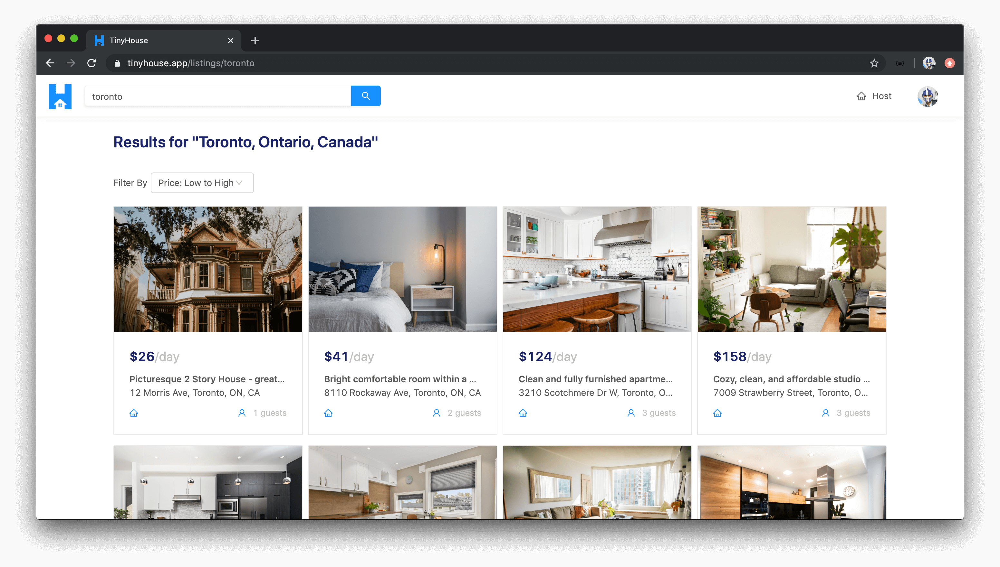
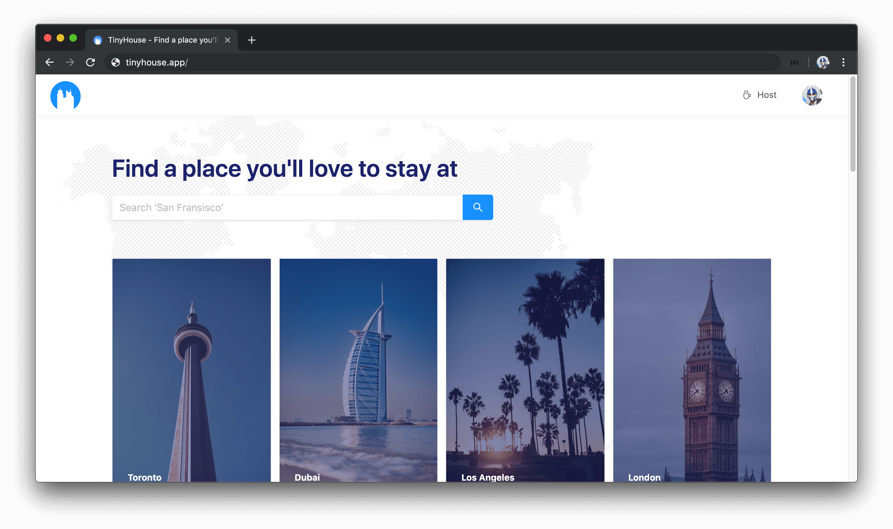
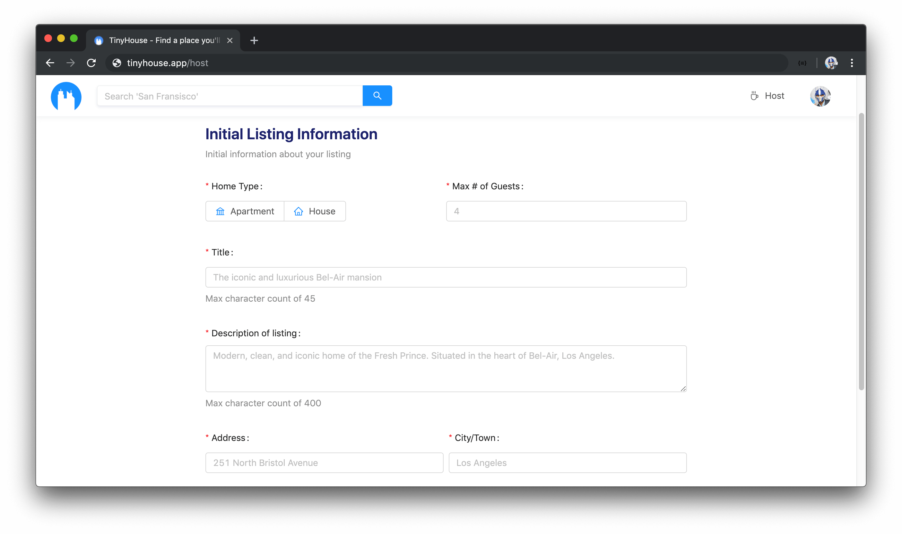
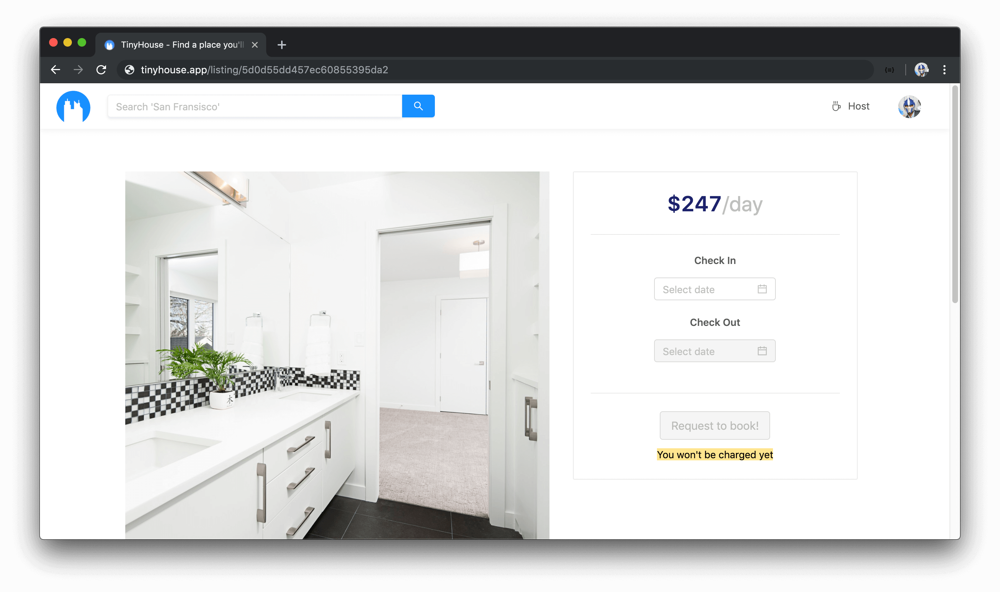
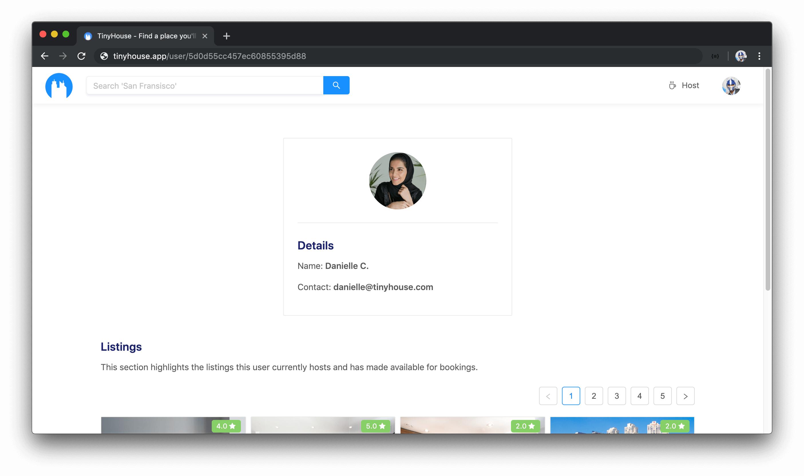
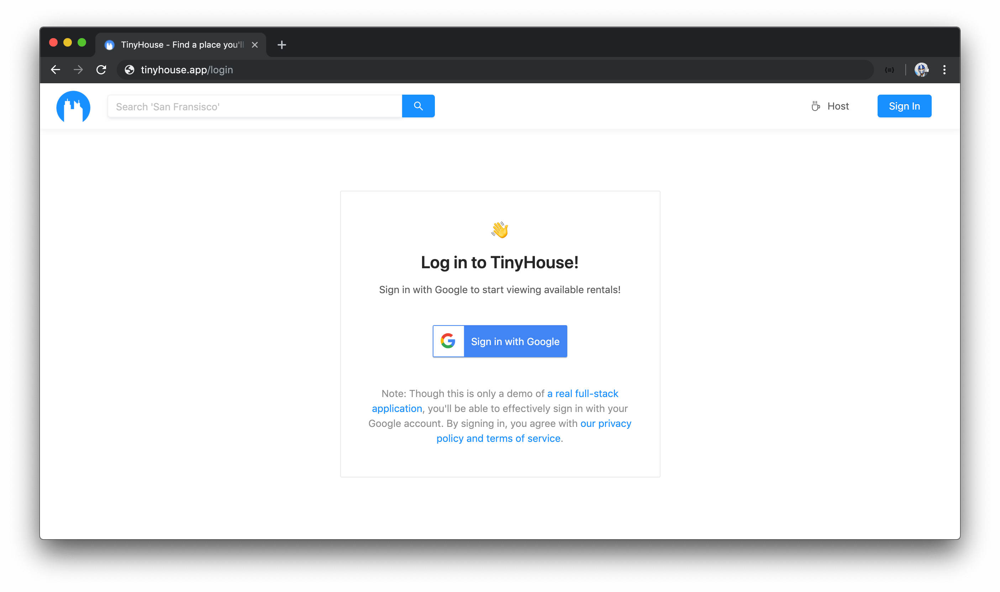
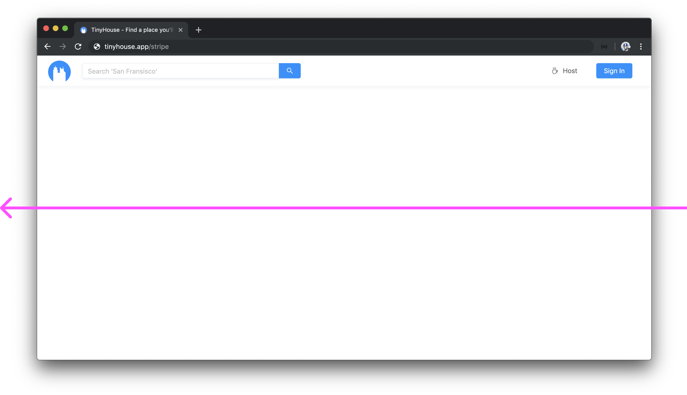
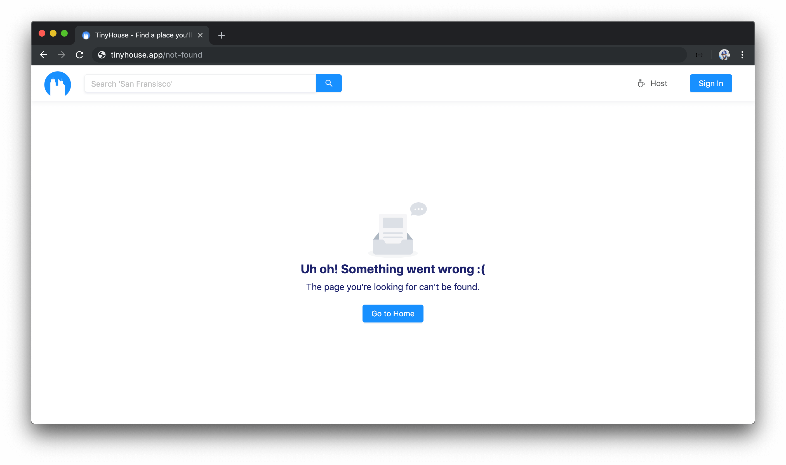

# Routing in TinyHouse

> 📖 This lesson's lecture slides can be found - [here](./protected/lecture-slides.pdf).

Routing is the process of navigating through a web application with the help of URLs. When a link in a webpage is clicked, the URL changes which then navigates a user to a new page.

Though the capability to change routes is helpful, we don't always _need_ it. We could always have an entire application be displayed within a single homepage. However, if an app starts to become large, it would be quite difficult to show all the information the app is to contain within a _single_ webpage. This is why nearly all large scale web applications (e.g. [YouTube](http://youtube.com/), [Twitter](http://twitter.com/), [Airbnb](http://airbnb.com/), etc.) provide the capability to route between different pages.

Our TinyHouse application is going to have routing. As an example, if a user was to ever venture to the `/listings/toronto` route, they would see the listings for the city that they're looking for - which in this case is **"Toronto"**.

There are often two ways to achieve routing within a web application - **server-side routing** or **client-side routing**.

## Server-side Routing

In **server-side routing**, web page navigation is **handled completely by the server**. When a user clicks on a link, the browser sends a _new request_ to the server to fetch the web page.

### Pros

-   Server-side routing will only request the web page that the user is viewing, not the entire web app. As a result, the initial page load is often faster since we're only downloading the content for one web page.
-   Search Engine Optimization (SEO) is optimized for server-rendered applications.

### Cons

-   Every URL change results in a full-page refresh as the server returns the contents to the client. This is the unpleasant _blinking_ state that's shown to a user when a user navigates from route to route.
-   Templates that are to remain the same might have to be requested from the server over and over again (e.g. a header and a footer that stays the same on all web pages).

## Client-side Routing

In **client-side routing**, web page navigation is **handled completely by the JavaScript that is loaded on the browser**. When a user clicks on a link, the browser simply renders "new content" from the code already loaded in memory.

Because of this, client-side routed web applications are often called **Single-Page Applications** (SPAs). These are applications that consist of just _one web page_ and the different routes in the application are the _same_ web page displaying _different_ views.

### Pros

-   Since there isn't a need to wait for a server response after the initial page load, navigating between web pages is often faster than server-rendered applications. Additionally, the white "blinking" state no longer exists when navigating from route to route.

### Cons

-   Since the template of the entire web app needs to be loaded on the first request, the initial page load time is often longer than server-rendered applications.
-   Search engine crawling is less optimized. With modern browsers, there is some good progress being made on crawling SPAs for search engines, but it isn’t nearly as efficient as server-side routed websites.

## TinyHouse Routes

Our TinyHouse application is going to be a Single-Page Application, or in other words - an application that is client-side routed. With that said, let's brainstorm all the routes we'll need based on how we want our app to perform.

In total, our TinyHouse application will have about 7 defined routes.

-   The `/` route (a.k.a. the `index` route).

-   The `/host` route.

-   The `/listing/:id` route.

-   The `/listings/:location` route.

-   The `/user/:id` route.

-   The `/login` route.

-   The `/stripe` route.

The index route (`/`) will display the homepage of our application. This is where we'll have our landing page that explains TinyHouse as well as certain links to navigate the user to see the most premium listings, listings for popular cities, etc.

The `/host` route will be the location where a user can create a new listing. The page displayed in the `/host` route will check if a user is logged in to our application and connected to our 3rd party payment processor - [Stripe](https://stripe.com/). If the user is logged in and connected with Stripe, they'll see a form where they'll be able to fill in the details of their soon to be created listing.

The `/listing/:id` route will display the details of a single listing. This route will take an `id` as a dynamic URL parameter. If a user is to look at their own listing, the listing page will also display sensitive information such as the bookings that have been made for the listing.

The `/listings/:location` route will display all the listings matching a certain location. For example, if a user was interested in seeing the listings for the city of Toronto - they'll navigate to the `/listings/toronto` route where the `:location` URL parameter in this context is `toronto`.

The `/user/:id` route will display the details of a single user and will also take an `id` URL parameter. If the user is to view their own user page, sensitive information such as the amount of income made will be shown.

The `/login` page will allow the user to begin the login process with their Google account. In addition, the `/login` page is going to be the redirect URL where Google OAuth will send the user to when signed in, with a `code` query parameter that we'll use to authenticate the user in our application.

The `/stripe` page will be the redirect URL that Stripe OAuth will return, when a user connects with their Stripe account, with a `code` query parameter that we'll use to communicate to our Node server. Unlike the `login` page, the `stripe` page will _only_ be used for the redirect so if the user attempts to access the `/stripe` route directly in the URL bar, we'll redirect them elsewhere.

And finally, the page in the `/not-found` route will be shown to the user if the user attempts to access any route we haven't established as a route of our application.

We'll get a better understanding of what we intend to build for each of these routes as we proceed through the course.
