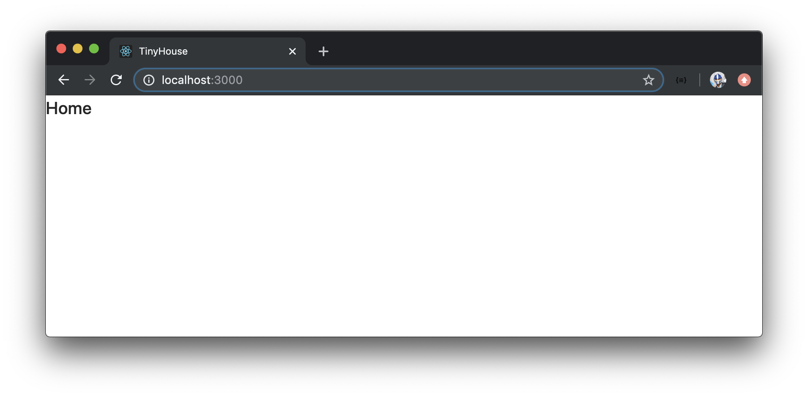
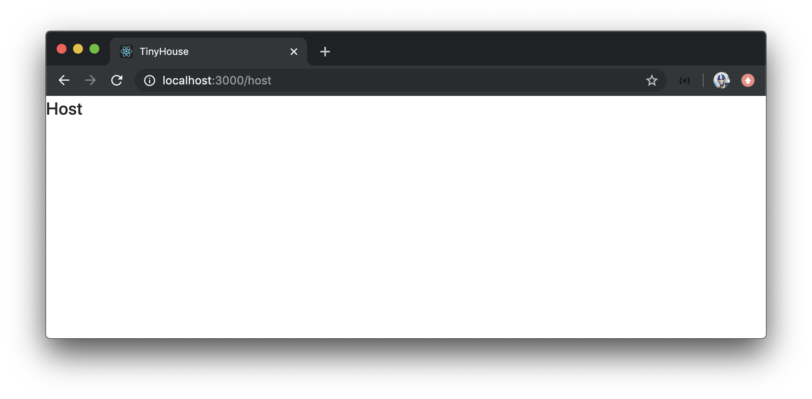
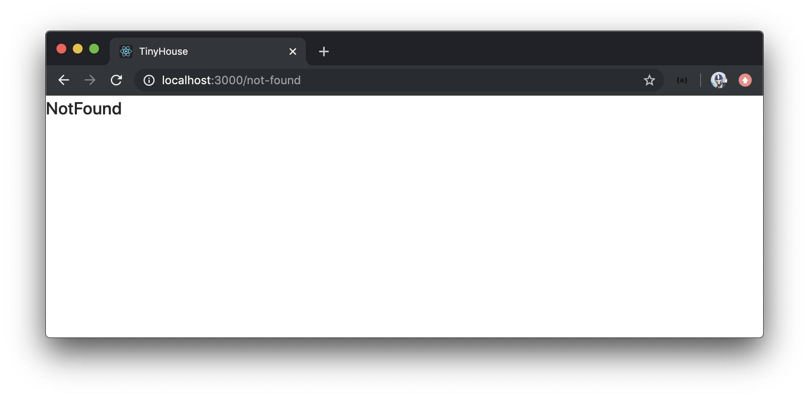

# React Router

> 📝 This module's quiz can be found - [here](./protected/multiple-choice-questions.pdf).<br/>
> 🗒️ Solutions for this module's quiz can be found - [here](./protected/multiple-choice-answers.pdf).
>
> **Note:** In **Module 15** (i.e. the Bonus Module), we've added a spin-off lesson titled **React Router Hooks** that describes how React Router now provides a few Hooks we can use! Through the course, feel free to use that lesson as a reference to recognize how certain things we may do later on (e.g. access URL parameters of a route) can be done with certain Hooks.

While many different routing libraries exist for React applications, the community's clear favorite is [React Router](https://github.com/ReactTraining/react-router). React Router gives us a wonderful foundation for building rich applications that have numerous components across many different views and URLs.

We'll install React Router into our application. In the terminal of our client project, we'll install the [`react-router-dom`](https://github.com/ReactTraining/react-router#readme) library which is the React Router `npm` package. We'll also install additional type definitions for the `react-router-dom` library.

```shell
npm install react-router-dom @types/react-router-dom
```

## TinyHouse Routes

In the main `src/index.tsx` file where we render our React application, we'll begin constructing the initial routes we'll want to be defined. We'll assume component files have already been set up in the sections folder, and we'll look to import the components we want to render for separate routes. These would be the `<Home />`, `<Host />`, `<Listing />`, `<Listings />`, `<NotFound />`, and `<User />` components.

```tsx
import { Home, Host, Listing, Listings, NotFound, User } from "./sections";
```

React Router provides a few separate components to help conduct client-side routing. At the core of every React Router application is the main router components - [`BrowserRouter` & `HashRouter`](https://reacttraining.com/react-router/web/guides/primary-components/routers). We'll use `BrowserRouter` which is preferred for client-side routed applications since URL paths with `BrowserRouter` won't have a hash (#) symbol. We'll import `BrowserRouter` and label it as `Router`.

> The `HashRouter` component sets URLs in _hash mode_. Hash mode URLs always contain a hash symbol (#) after the hostname. Hash mode means application routes will be displayed something like this - `https://tinyhouse.app/#/host`. The benefit to this often lies with allowing us to have multiple client-side routes without having to provide the necessary server-side fallbacks. This is because everything after the hash _is never sent to the server_.
>
> Our TinyHouse application is a single-page application which means the server will return the same index page regardless of which route the user is in. Because of this, hash mode URLs will be unnecessary which is why we conform to using the `BrowserRouter` component from `react-router-dom`.

For route matching, React Router also provides two other components - [`Switch` and `Route`](https://reacttraining.com/react-router/web/guides/primary-components/route-matchers). We'll import the `Switch` and `Route` components as well.

```tsx
import { BrowserRouter as Router, Route, Switch } from "react-router-dom";
```

In the `src/index.tsx` file, we'll construct a function component labeled `App` that will hold the responsibility in rendering a certain component based on the route the user is in. In the `App` component return statement, we'll return the `<Router />` component as the parent.

```tsx
const App = () => {
  return <Router>{/* ... */}</Router>;
};
```

Within `<Router />`, we'll place the React Router `<Switch/>` component that will help control which routed component should be shown.

Route matching is done with the help of the React Router `<Route/>` component that takes a few props.

-   The `path` prop is used to determine the pathname in which a certain component should be rendered.
-   The `component` prop is used to determine which component should be shown for a particular pathname.

We'll set up our application routes as follows:

```tsx
const App = () => {
  return (
    <Router>
      <Switch>
        <Route exact path="/" component={Home} />
        <Route exact path="/host" component={Host} />
        <Route exact path="/listing/:id" component={Listing} />
        <Route exact path="/listings/:location?" component={Listings} />
        <Route exact path="/user/:id" component={User} />
        <Route component={NotFound} />
      </Switch>
    </Router>
  );
};
```

For each `<Route />` component except the last, we've also used the [`exact` prop](https://github.com/ReactTraining/react-router/blob/master/packages/react-router/docs/api/Route.md#exact-bool) to ensure that the intended components should only be rendered when the URL path matches the specified pathname _exactly_.

#### `/`

The index `"/"` route is to render the `<Home />` component.

#### `/host`

The `"/host"` route is to render the `<Host />` component.

#### `/listing/:id`

The `"/listing/:id"` route is to render the `<Listing />` component. The `:id` syntax is how we're stating the `/listing` route is to have an `id` URL parameter that is to be set dynamically in our application.

#### `/listings/:location?`

The `"/listings/:location?"` route is to render the `<Listings />` component with a dynamic `location` URL parameter. The `"?"` in the route states that the `location` parameter is _optional_ and the `/listings` route without the `location` parameter will still render the `<Listings />` component.

#### `/user/:id`

The `"/user/:id"` route with a dynamic `id` parameter is to render the `<User />` component.

#### `/not-found`

And finally, if a route is specified that we haven't defined, React Router will default to the last route we've prepared that doesn't have a `path` prop. We've stated in this condition, the `<NotFound />` component will render.

We'll now render the `<App />` functional component we've created within our ReactDOM `render()` function.

```tsx
render(
  <ApolloProvider client={client}>
    <App />
  </ApolloProvider>,
  document.getElementById("root")
);
```

At this moment, we haven't created any of the components that are to be rendered in our app. With that said, let's set up the different folders in our `src/sections/` directory to represent the different components we want to be created.

```shell
client/
  src/
    // ...
    sections/
      Home/
      Host/
      Listing/
      Listings/
      NotFound/
      User/
    // ...
  // ...
```

In each of these folders, we'll keep things simple and only create a single `index.tsx` file responsible for creating and returning the component function. We'll state that each component function, for now, is to render the name of the route displayed to the user.

The `<Home />` component will simply say `"Home"`:

```tsx
import React from "react";

export const Home = () => {
  return <h2>Home</h2>;
};
```

The `<Host />` component will say `"Host"`:

```tsx
import React from "react";

export const Host = () => {
  return <h2>Host</h2>;
};
```

The `<Listing />` component will say `"Listing"`:

```tsx
import React from "react";

export const Listing = () => {
  return <h2>Listing</h2>;
};
```

We'll remove all the work we've done in our `sections/Listings/` folder from Part I of the course. We'll simply have an `index.tsx` file contained within where a `<Listings />` component is to say `"Listings"`:

```tsx
import React from "react";

export const Listings = () => {
  return <h2>Listings</h2>;
};
```

The `<NotFound />` component will say `"NotFound"`:

```tsx
import React from "react";

export const NotFound = () => {
  return <h2>NotFound</h2>;
};
```

And the `<User />` component will say `"User"`:

```tsx
import React from "react";

export const User = () => {
  return <h2>User</h2>;
};
```

In the `sections/index.ts` file, we'll re-export all the created components so the components can be imported directly from the `sections/` folder.

```typescript
export * from "./Home";
export * from "./Host";
export * from "./Listing";
export * from "./Listings";
export * from "./NotFound";
export * from "./User";
```

When we save all our changes and launch our client application in the browser, we'll be displayed with the `<Home />` component in the index route.



When we navigate to the different routes we've set up, we'll see the individual components that should show for each route. For example, when we head to the `/host` route, we'll see the `<Host />` component.



When we visit `/listing/:id` and provide an `id` parameter, we'll see the `<Listing />` component.


When we visit `/listings/:location?` and provide a value for the `location` parameter, we'll be presented with the `<Listings />` component.


Visting `/user/:id` with an `id` parameter will show us the `<User />` component.


If we enter a random route that we haven't specified, our `<NotFound />` component will show.



Amazing. We're now officially using React Router to display different components in different client-side routes. We'll build a few of the other routes we'll have in our application (e.g. `/login` and `/stripe`) when we begin to work on those sections.
