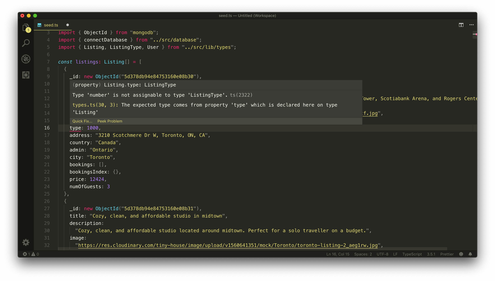
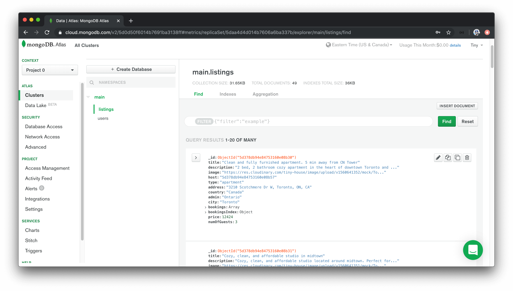

# Seed & Clear Data from MongoDB

> 📝 The mock listings array used in this lesson can be found - [here](https://gist.github.com/djirdehh/0ff45cb73b6f293bbb8e8c84366f6952).<br/>
> 📝 The mock users array used in this lesson can be found - [here](https://gist.github.com/djirdehh/13865b60af912e13c32a6f8ec1a49b52).<br/>
> 📝 This module's quiz can be found - [here](./protected/multiple-choice-questions.pdf).<br/>
> 🗒️ Solutions for this module's quiz can be found - [here](./protected/multiple-choice-answers.pdf).

Now that we have our database structure setup, let's add some mock data to our database so we'll have data that we can begin to use in our GraphQL resolvers and our client UI.

We'll use the `seed()` function we've already created in Part I to help seed our database. This `seed()` function was created in the `seed.ts` file in the `temp/` folder of our server project. We'll make some changes to our `seed()` function and this file.

First, we'll import the `Listing`, `ListingType`, and `User` type definitions from the `src/lib/types.ts` file.

```ts
import { Listing, ListingType, User } from "../src/lib/types";
```

We'll create two constants, outside of the seed function, labeled `listings` and `users` and assign the types for these constants as the `Listing` and `User` array type.

```ts
const listings: Listing[] = [];
const users: User[] = [];
```

Next, we'll paste the mock data we've prepared for these constant values.

```ts
const listings: Listing[] = [
  {
    _id: new ObjectId("5d378db94e84753160e08b30"),
    title: "Clean and fully furnished apartment. 5 min away from CN Tower",
    description:
      "2 bed, 2 bathroom cozy apartment in the heart of downtown Toronto and only 5 min away from the CN Tower, Scotiabank Arena, and Rogers Center.",
    image:
      "https://res.cloudinary.com/tiny-house/image/upload/v1560641352/mock/Toronto/toronto-listing-1_exv0tf.jpg",
    host: "5d378db94e84753160e08b57",
    type: ListingType.apartment,
    address: "3210 Scotchmere Dr W, Toronto, ON, CA",
    country: "Canada",
    admin: "Ontario",
    city: "Toronto",
    bookings: [],
    bookingsIndex: {},
    price: 12424,
    numOfGuests: 3,
    numOfBeds: 2,
    numOfBaths: 1,
    numOfStars: 768,
    numOfVotes: 768,
    rating: 1
  }
  // ...
];

const users: User[] = [
  {
    _id: "5d378db94e84753160e08b55",
    token: "token_************",
    name: "James J.",
    avatar:
      "https://res.cloudinary.com/tiny-house/image/upload/w_1000,ar_1:1,c_fill,g_auto/v1560648533/mock/users/user-profile-1_mawp12.jpg",
    contact: "james@tinyhouse.com",
    walletId: "acct_************",
    income: 723796,
    bookings: [],
    listings: [
      new ObjectId("5d378db94e84753160e08b31"),
      new ObjectId("5d378db94e84753160e08b4b"),
      new ObjectId("5d378db94e84753160e08b4c")
    ]
  }
  // ...
];
```

> Find the prepared mock data for listings [here](https://gist.github.com/djirdehh/0ff45cb73b6f293bbb8e8c84366f6952) and for users [here](https://gist.github.com/djirdehh/13865b60af912e13c32a6f8ec1a49b52).

We've provided a total of around 37 listing documents with each object representing a single listing that has been submitted to our application. The listings here in this mock data cover six cities around the world - **Toronto**, **Dubai**, **Los Angeles**, **London**, **San Fransisco**, and **Cancun**. All the data here is _mock_ data with free to use images and made-up information about the details of a listing such as the address.

Each of these listings conforms to the `Listing` Interface shape we've set up. They all have titles, descriptions, images, and so on. If we attempt to change the value of a field that doesn't conform to the type in the interface, TypeScript will warn us.



The `users` mock array represents the mock users we'll have in our application. Each of these user objects conforms to the `User` interface shape and consist of fake data of a fictional user. Note that the `token` and `walletId` fields for every mock user are given dummy values since these aren't real user accounts and they won't be going through authentication or connecting with the payment provider. The `listings` field for each of these users is a list of `ObjectId` values for the `listings` in which the user has created.

The `listings` and `users` mock arrays are to be populated to the `"listings"` and `"users"` collections in our database. Notice how we haven't prepared mock data for bookings? Our mock application state will be where no user has booked any listing yet. As a result, booking data will only be populated through the application.

### `seed()`

Let's now modify our `seed()` function to utilize the new mock data. We'll remove the old listings array we had before. We already have a `for` loop being used to add every single `listing` document from our mock array into our `"listings"` collection.

We'll introduce another loop to add every `user` from the mock `users` array into the `"users"` collection. This will have the `seed()` function look as follows:

```ts
const seed = async () => {
  try {
    console.log("[seed] : running...");

    const db = await connectDatabase();

    for (const listing of listings) {
      await db.listings.insertOne(listing);
    }

    for (const user of users) {
      await db.users.insertOne(user);
    }

    console.log("[seed] : success");
  } catch {
    throw new Error("failed to seed database");
  }
};
```

To run our `seed` function, we can execute the `seed` script we have in our terminal which is a script already set up in the `package.json` file to run the the contents of the `temp/seed.ts` file.

```shell
npm run seed
```

When the `seed` script has been run and we take a look at our cluster in Atlas, we'll now see the newly introduced `"listings"` and `"users"` collections with the mock data we've supplied!



## Clearing Data

At certain times in our development, we may get to some points in which we're interested in re-seeding our collections back to the original setting of our mock data if more data gets added.

To do this, we could log into the MongoDB Atlas dashboard and use the UI to delete the collections one by one before we run the `seed()` function again. But to keep things simpler, we'll create an `npm` command to do the clearing for us.

This will appear similar to the `seed()` function, we'll create a `clear.ts` file in our `temp` folder that will be responsible for being able to _clear_ our database.

```shell
server/
  // ...
  temp/
    clear.ts
    seed.ts
  // ...
```

In the `temp/clear.ts` file, we'll require the `dotenv` library, import the `connectDatabase()` function, and create a `clear()` function that will hold the responsibility in clearing out our collection data.

```ts
require("dotenv").config();

import { connectDatabase } from "../src/database";

const clear = async () => {};
```

To empty or remove a collection (i.e. to _drop_ a collection), we can use MongoDB's [`drop()`](https://docs.mongodb.com/manual/reference/method/db.collection.drop/) function. In our `clear()` function, we'll drop the `bookings`, `listings,` and `users` collections.

We'll do an extra check and first retrieve all the documents for the different collections, and only run the `drop()` function when a collection is populated (i.e. has at least one document).

Running the functionality within a `try` statement, attempting to catch any errors if they arise, and executing the `clear()` function at the end will have our `temp/clear.ts` file look like the following:

```ts
require("dotenv").config();

import { connectDatabase } from "../src/database";

const clear = async () => {
  try {
    console.log("[clear] : running...");

    const db = await connectDatabase();

    const bookings = await db.bookings.find({}).toArray();
    const listings = await db.listings.find({}).toArray();
    const users = await db.users.find({}).toArray();

    if (bookings.length > 0) {
      await db.bookings.drop();
    }

    if (listings.length > 0) {
      await db.listings.drop();
    }

    if (users.length > 0) {
      await db.users.drop();
    }

    console.log("[clear] : success");
  } catch {
    throw new Error("failed to clear database");
  }
};

clear();
```

In our server `package.json` file, we'll create a `clear` script that when run will run the contents of the `temp/clear.ts` file.

```ts
    "clear": "ts-node temp/clear.ts",
```

Now at any moment in time, if we need to re-seed the database back to its original mock data state, we can simply run the `clear` script followed by the `seed` script.
