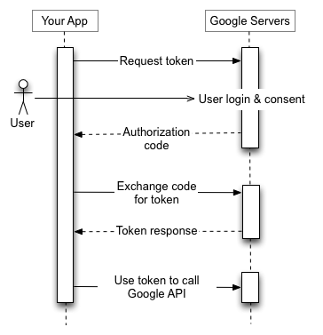

# OAuth 2.0

> 📖 This lesson's lecture slides can be found - [here](./protected/lecture-slides.pdf).

OAuth is an open industry-standard authorization protocol that enables applications to obtain limited access to user accounts without giving away any passwords.

As an example, we've seen sign-in requests like the one below when trying to log-in to an application that allows you to authenticate with a different provider (e.g. Google Sign-In).

In the image above, we're able to successfully sign-in to an application labeled [tinyhouse.app](https://tinyhouse.app) with a Google account. As a user signing in, this is essentially where we tell the application "I grant you permission to access my account or a portion of my account". Notice that in this example, Google tells us exactly what information the app will have access to which in this case is the user's name, email address, language preference, and profile picture.

Being able to sign-in with an approach like this (i.e via OAuth) has some major advantages. In the event that an application suffers a breach, our Google password will remain safe because OAuth doesn’t share passwords but instead uses **authorization tokens** to prove identities. OAuth also allows us to leverage other platforms where users most likely already have accounts created helping avoid the need for users to create new accounts to use a certain application.

## OAuth in TinyHouse

We're going to use [Google Sign-In/OAuth](https://developers.google.com/identity/sign-in/web/sign-in) to authenticate and sign in users to our TinyHouse application. OAuth between different providers behave similarly to one another. Though implementing Google Sign-In/OAuth differs slightly depending on the application making the request ([web server](https://developers.google.com/identity/sign-in/web/backend-auth), [client app](https://developers.google.com/identity/sign-in/web/sign-in), etc.), they all follow a similar pattern. We'll go through the steps of how Google Sign-In/OAuth will be used in our application.

In our context, OAuth includes the following roles:

- **Resource Owner**: the user/person that signs in and grants our app (TinyHouse) access to their Google account.
- **App**: The TinyHouse app. Once the user grants us access to their account, we (i.e. TinyHouse) can make API calls to Google's servers on behalf of our user (e.g. add an item to their Google calendar, send an email on their behalf, etc.).
- **Authorization & Resource Server**: this is the server that holds the data and provides the APIs. In our case, this will be Google's server.

With the roles identified, let's dive into how the flow will behave. In the very beginning, a user will be able to click a `Sign in with Google` button to begin the Google sign-in process.

The first step after this point is redirecting the user to Google's authentication page to log in.

When the user provides their account information, Google then handles the user authentication, session selection, and user consent. Once logged in, Google will return an authorization `code` to our client app.

Our client application will then pass this `code` to our Node server app. Once our server receives this `code`, we'll make _another request_ from our server project to Google using the `code` to get the user's access `token`.

With the user's access `token`, we've obtained access and can use the token to interact with Google APIs to act on _behalf of the user_. In our application, we'll use the access token to interact with Google's [People API](https://developers.google.com/people) to get the user's name, email address, and profile image to store in our database.

Here's the flow we've just shown being summarized in a [UML sequence diagram](https://www.uml-diagrams.org/sequence-diagrams.html) from [Google's developer documentation](https://developers.google.com/identity/protocols/OAuth2).

> Sequence diagram (otherwise known as UML sequence diagrams) show how items in a system or code interact with one another and the interactions in the sequence of events that occur.

This can be summarized as follows:

- When a user attempts to sign-in, they're taken to Google's login and consent screen.
- When signed in successfully, an **authorization `code`** is returned from Google's servers to our application.
- A request is made from our app to Google Servers with the authorization `code` to retrieve the **access token** of the user.
- With the access token available in our app, we're able to make requests to Google APIs on _behalf of the user_.
