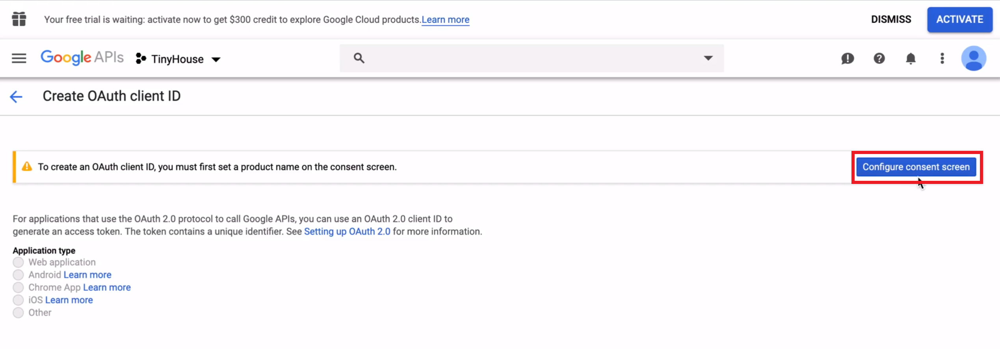

# Google Sign-In (OAuth)

> 📝 A sample of the `.env` file in our server project, after this lesson is complete, can be found - [here](https://gist.github.com/djirdehh/fa492810460f33f72990a3a3d31e4280).

Any application that uses Google OAuth to access Google APIs must have credentials that identify the application to Google's server.

To achieve this, we'll need to login to Google's API console: [`https://console.developers.google.com`](https://console.developers.google.com).

When logged in, we'll create a new project by clicking the project drop-down menu and selecting **NEW PROJECT**.


We'll provide a project name of `TinyHouse` and create the project.

With the project created, we'll be redirected to the dashboard of the created project. Next, we'll click **Credentials** on the left-hand pane which will take us the credentials page.

We'll click the **Create credentials** button available to us to create new credentials and we'll select the **OAuth Client ID** option. **OAuth Client ID** is the credential that can allow us to request user consent so our app can access user data.


We're told that to create an OAuth Client ID, we must set a product name on the consent screen.



We'll click the **Configure consent screen** button available to us to configure the consent screen we'll want to display to the user.

In the **OAuth consent screen** form, we'll state that the app, where the consent screen is being established, is to be public for any Google Account. We'll state the **Application Name** as TinyHouse and the support email will be the email address of the account connected to the developer console.

**Scopes** is where we can state the access we want to the user's private data from our application. We won't make any changes to what's populated by default which involves gaining access to the email and profile information of the user. With these changes, we can click **Save** at the bottom of the form to save the changes we've made for the **OAuth consent screen**.


At this point, we'll now be able to create an OAuth Client ID. In the **Create OAuth client ID** form, we'll set the application type to **Web application** since we're creating a web app. We'll also name our credential the **TinyHouse Web Client**.

We'll then need to specify authorized origins and redirect URIs. An authorized origin refers to the URI of the client application and can't contain a wildcard or a path. For development, we'll list our local development origin - `http://localhost:3000`.

Redirect URIs refer to the path in our application that users are redirected to _after_ they've successfully authenticated with Google. We'll state that the user should be redirected to a `/login` path within `localhost:3000`.


> **Note:** The values we've provided for an authorized origin and redirect URL are **development** credentials. We'll need to update them to a new set of values (or create separate credentials) when we eventually deploy our app.

At this moment, our application can use the `OAuth Client ID` credential to help access Google APIs on behalf of users signed in to our application.

> **Note:** Google OAuth may be limited to 100 logins until the consent screen is published, which may require a verification process that can take several days. We'll be able to develop our application well before the 100 logins limit is ever reached so we won't have an urgent need to publish our consent screen.

With the information provided in the `Create OAuth client ID` form, we can click **Save** at the bottom of the form to create the OAuth Client ID. This is where a **`Client ID`** and **`Client Secret`** is returned to us. Since these are configuration values that should be kept secret, we'll look to place these values in our Node server `.env` file.

### Save API keys

We'll head to the `.env` file of our server project and introduce two new environment variables - `G_CLIENT_ID` and `G_CLIENT_SECRET` to reference the **Client ID** and **Client Secret** of the OAuth Client ID we've just created.

We'll also introduce another environment variable to reference the origin of our client application in development - <http://localhost:3000>. We'll use this environment variable as we set up the functionality to have users sign-in to our application. We'll call this environment variable `PUBLIC_URL`.

At this moment, our `.env` file will look something like the following:

```shell
PORT=9000
PUBLIC_URL=http://localhost:3000
DB_USER=************
DB_USER_PASSWORD=*****************
DB_CLUSTER=*****************
G_CLIENT_ID=**************************.apps.googleusercontent.com
G_CLIENT_SECRET=**************************
```

In the next lesson, we'll begin creating the GraphQL fields in our API that we'll use to help us set-up Google OAuth in our application.
