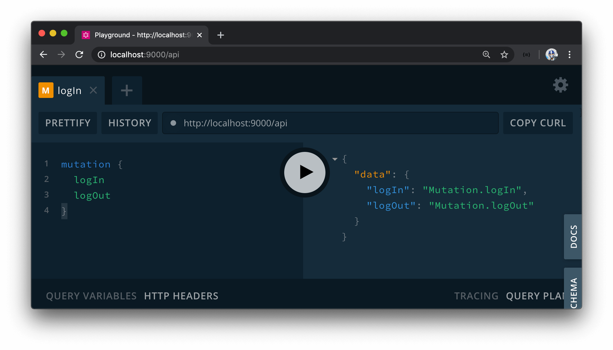

# Google Sign-In GraphQL Fields

Let's brainstorm the GraphQL fields we'll need to integrate Google OAuth into our app.

The first thing we'll do is clear out our schema from Part I of the course. We'll go to the type definitions file in our server project (`src/graphql/typeDefs.ts`) file and remove the definitions for the fields we had before.

```ts
import { gql } from "apollo-server-express";

export const typeDefs = gql`
  type Query {}
  type Mutation {}
`;
```

We can also delete the `Listing` folder from our `src/graphql/resolvers/` folder since we'll no longer need the `listingResolvers` map we created in Part I. This will also require us to remove the import and use of the `listingResolvers` map in the `src/graphql/resolvers/index.ts` file.

```ts
import merge from "lodash.merge";

export const resolvers = merge();
```

In our GraphQL type definitions file, we'll create three new GraphQL fields to help with authenticating users with Google OAuth.

The first step in our OAuth flow requires us to redirect our user to Google so they can authorize our app and sign in. We'll need to generate the URL that will navigate the user to the Google consent form. We'll construct this URL in our server application and have our client app be able to retrieve this URL from the server through a query field. This query field will be the **`authUrl`** field.

Once Google Sign-In provides a value for the authorization `code` and redirects the user to the `/login` page of our app, we'll want to have our React app pass the `code` onto our Node server. Our Node server will then make a request to Google servers with the `code` to retrieve the access `token` of the signed-in user. The **`logIn`** mutation will be the mutation our React client application will fire while passing in the `code` to make the request to Google to retrieve the token for a user.

Finally, we'll have a **`logOut`** mutation to have the user be able to log-out from our app.

`authUrl`, `logIn`, and `logOut` are the three GraphQL root-level fields we'll need to handle Google OAuth. Let's prepare our GraphQL API type definitions and resolvers with these new fields.

### `authUrl`

In the `src/graphql/typeDefs.ts` file, we'll introduce an `authUrl` field in our root `Query` object. This field when resolved will return a string.

```ts
import { gql } from "apollo-server-express";

export const typeDefs = gql`
  type Query {
    authUrl: String!
  }

  type Mutation {}
`;
```

### `logIn`

Our `logIn` mutation will accept a `code` argument and when resolved will return an instance of the user (with which we're going to call the `Viewer`) that has been logged-in. We'll handle this in the next lesson and for now simply state that the `logIn` mutation when resolved will return a string.

```ts
import { gql } from "apollo-server-express";

export const typeDefs = gql`
  type Query {
    authUrl: String!
  }

  type Mutation {
    logIn: String!
  }
`;
```

### `logOut`

The `logOut` mutation when resolved will also return an instance of the logged in user. For now, we'll state that it is to return a `string` as well. With these changes, our `src/graphql/typeDefs.ts` file will look like the following:

```ts
import { gql } from "apollo-server-express";

export const typeDefs = gql`
  type Query {
    authUrl: String!
  }

  type Mutation {
    logIn: String!
    logOut: String!
  }
`;
```

### Resolver functions

Next, we'll set up the boilerplate of our resolver functions for the fields we've just created in our schema. We'll have these resolver functions be part of a `resolvers` map that we'll call `viewerResolvers`.

> `Viewer` is the term we'll use in our app to refer to the user that's viewing (i.e. using) our app and as a result will be the term used to refer to the user that's attempting to log-in to our application.

We'll create a `Viewer/` folder that is to have an `index.ts` file in the `src/graphql/resolvers/` folder.

```shell
server/
  src/
    graphql/
      resolvers/
        Viewer/
          index.ts
      // ...
    // ...
```

In the `src/graphql/resolvers/index.ts` file, we'll import the `IResolvers` map from `apollo-server-express` and set it as the type of the `viewerResolvers` map we'll create.

```ts
import { IResolvers } from "apollo-server-express";

export const viewerResolver: IResolvers = {};
```

To have our resolver functions be set up for the next lesson, we'll have each of our resolver functions return strings that refer to which field is being queried without building any of the implementation just yet.

```ts
import { IResolvers } from "apollo-server-express";

export const viewerResolvers: IResolvers = {
  Query: {
    authUrl: () => {
      return "Query.authUrl";
    }
  },
  Mutation: {
    logIn: () => {
      return "Mutation.logIn";
    },
    logOut: () => {
      return "Mutation.logOut";
    }
  }
};
```

Finally, to have our `viewerResolvers` map recognized in our Apollo Server instance - we'll need to import the `viewerResolvers` map in the `src/graphql/resolvers/index.ts` file and place it in the lodash `merge()` function.

```ts
import merge from "lodash.merge";
import { viewerResolvers } from "./Viewer";

export const resolvers = merge(viewerResolvers);
```

With our server running, if we open the GraphQL Playground at <http://localhost:9000/api>, we'll see that each of the GraphQL fields we've set up can be queried.

The `authUrl` query.


The `logIn` and `logOut` mutations.



In the next lesson, we'll update the resolvers we've created to execute the functionality we would want.
