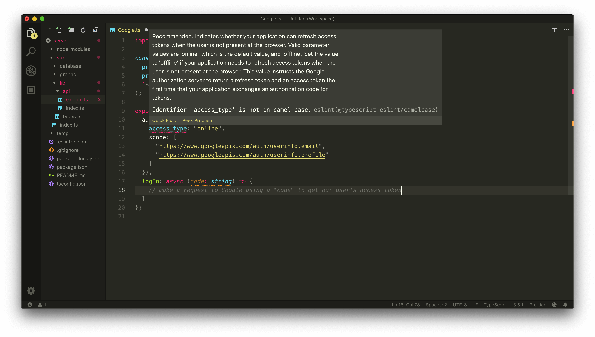
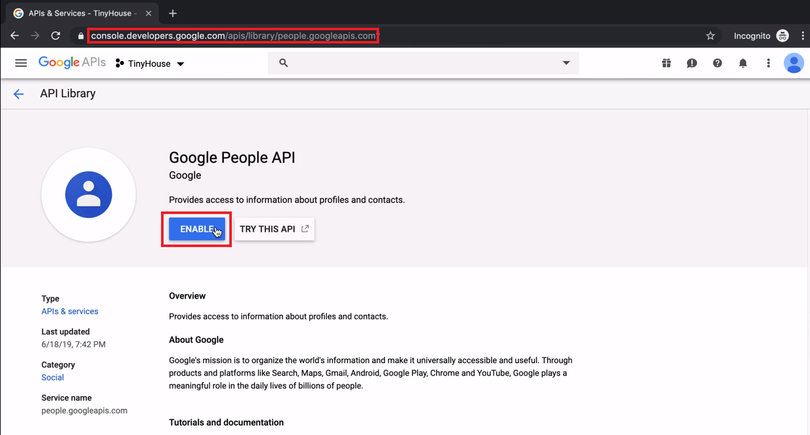

# Using Google Sign-In & People API

> 📝 Documentation on the Google APIs Node.js Client library can be found - [here](https://github.com/googleapis/google-api-nodejs-client).<br />
> 📝 Documentation on the full list of OAuth 2.0 scopes one can request can be found - [here](https://developers.google.com/identity/protocols/googlescopes).<br />
> 📝 Documentation on the method used to get information about a person's Google account can be found - [here](https://developers.google.com/people/api/rest/v1/people/get).

To access Google's APIs, we're going to use Google's officially supported Node.js library - the [Google APIs Node.js Client](https://github.com/googleapis/google-api-nodejs-client). The Google APIs Node.js Client provides authorization and authentication with OAuth 2.0 and provides the capability for our Node application to interact with the full list of supported Google APIs.

In the terminal of our Node server, we'll install the Google APIs Node.js Client as an application dependency:

```shell
npm install googleapis
```

The `googleapis` package is a TypeScript library so we won't need to install any additional type definitions.

Next, we'll create an `api/` folder in our source code's `lib/` folder. This is where we'll keep all our server interaction with 3rd party APIs. We'll create a `Google.ts` file within the `lib/api/` folder to store the methods we'll create that connect with Google's APIs.

We'll also create an `index.ts` file in the `lib/api/` folder to export the functionalities from the different files we'll eventually set up in our `api/` folder.

```shell
server/
  src/
    // ...
    lib/
      api/
        Google.ts
        index.ts
    // ...
  // ...
```

In the `lib/api/index.ts` file, we'll re-export everything we'll create from the `Google.ts` file.

```ts
export * from "./Google";
```

## Google APIs

The first thing we'll do in the `lib/api/Google.ts` file is import the `google` object class from the `googleapis` package we've just installed.

```ts
import { google } from "googleapis";
```

Next, we'll construct an object we'll label `Google` that is to expose exactly what we'll need in our app.

```ts
import { google } from "googleapis";

export const Google = {};
```

The first property we'll create in our `Google` object is an `authUrl` field where the value is to the authentication URL Google is to provide where users can sign-in with their Google account. This is needed in Step 1 of our Google OAuth flow.

The second field we'll have in our exported `Google` object is a `logIn()` function. This `logIn()` function is where we would make a request to Google using a `code` argument to get a user's access token. This is needed in one of the later steps of our Google OAuth flow.

```ts
import { google } from "googleapis";

export const Google = {
  authUrl: "Google's authentication URL for our app",
  logIn: async (code: string) => {
    // make a request to Google using a "code" argument to get a user's access token
  }
};
```

### `authUrl`

The documentation in the [Google APIs Node.js Client](https://github.com/googleapis/google-api-nodejs-client#oauth2-client) shows us the steps needed to create an authentication URL. We'll need to configure a new `auth` object with OAuth `client_id` and `client_secret` values as well as a redirect URL. In the last lesson, we've conveniently saved `client_id`, `client_secret`, and redirect URL values as environment variables in our `.env` file.

We'll run the `google.auth.Oauth2()` constructor function and pass in the client id, client secret, and the redirect URL we have as environment variables.

```ts
const auth = new google.auth.OAuth2(
  process.env.G_CLIENT_ID,
  process.env.G_CLIENT_SECRET,
  `${process.env.PUBLIC_URL}/login`
);
```

`G_CLIENT_ID` and `G_CLIENT_SECRET` are the configuration variables for the OAuth Client ID we've created in the Google Developers Console. `PUBLIC_URL` is the base path of our React app which in development is set to `http:/localhost:3000`. We're appending `/login` since we want the user to be redirected to the login path.

In the [Google APIs Node.js Client documentation](https://github.com/googleapis/google-api-nodejs-client#oauth2-client), it then shows us that we can run a `generateAuthUrl()` function from the constructed `auth` object to create the authentication URL that can navigate the user to Google's consent screen.

Before our TinyHouse app can access Google APIs on behalf of our users, we must obtain an access token that grants access to those APIs. A single access token can grant varying degrees of access to multiple APIs. A parameter called `scope` controls this. To see the full list of scopes one can add to an app, we can go to the following documentation link - <https://developers.google.com/identity/protocols/googlescopes>. For our app, all we'll need is the **user's email and basic profile info**.

In our the `authUrl` field of the exported `Google` object, we'll run the `generateAuthUrl()` from the `auth` object. In the `scope` option, we'll state that we're interested in the user's email and basic user info profile. We'll also state that the value of an `access_type` field is `online`.

```ts
import { google } from "googleapis";

const auth = new google.auth.OAuth2(
  process.env.G_CLIENT_ID,
  process.env.G_CLIENT_SECRET,
  `${process.env.PUBLIC_URL}/login`
);

export const Google = {
  authUrl: auth.generateAuthUrl({
    access_type: "online",
    scope: [
      "https://www.googleapis.com/auth/userinfo.email",
      "https://www.googleapis.com/auth/userinfo.profile"
    ]
  }),
  logIn: async (code: string) => {
    // make a request to Google using a "code" to get our user's access token
  }
};
```

ESLint will give us a warning with regards to the `access_type` option field since an ESLint rule exists that expects identifiers to always be in camelCase.



This ESLint rule is something we would want to keep. In this case, however, the `access_type` field is in `snake_case` format as determined by the Google Node.js client and we won't be able to change it. Here's where we can apply a small change to _disable_ the `@typescript-eslint/camelcase` rule in the line where `access_type` is declared. This will look something like this:

```ts
export const Google = {
  authUrl: auth.generateAuthUrl({
    // eslint-disable-next-line @typescript-eslint/camelcase
    access_type: "online"
    // ...
  })
  // ...
};
```

The ESLint warning will no longer be shown and the `authUrl` field for our `Google` object will now return the authentication url.

### `logIn()`

Let's now build the function to obtain a user's access token and other information. This will be the `logIn()` function that will run _after_ the `code` from the `authUrl` is passed along from the client.

The `auth` object we've constructed has a `getToken()` function that accepts a code and creates an HTTP request to Google's servers to obtain the user's `access_token`. In the beginning of our `logIn()` function, we'll run the `getToken()` function and destruct the `tokens` value it returns.

```ts
export const Google = {
  // ...,
  logIn: async (code: string) => {
    const { tokens } = await auth.getToken(code);
  }
};
```

The `tokens` value we've destructed contains both the `access_token` as well as a value called a `refresh_token`. For our app, we are just using the tokens to obtain the user's information right away so we won't need to save them in our database. If we were to develop an app that uses these tokens for other APIs (e.g. using Gmail or Google Calendar API), we would most likely need them saved in our database for later use.

We'll then run the `setCredentials()` function from the `auth` object and pass in `tokens` to configure the `auth` object.

```ts
export const Google = {
  // ...,
  logIn: async (code: string) => {
    const { tokens } = await auth.getToken(code);

    auth.setCredentials(tokens);
  }
};
```

At this moment, we can now use the configured `auth` object to make a request to Google's **People API** to get the user information we'll need. To do so, we'll run the `people()` constructor from the imported google object.

```ts
export const Google = {
  // ...,
  logIn: async (code: string) => {
    const { tokens } = await auth.getToken(code);

    auth.setCredentials(tokens);

    await google.people();
  }
};
```

The `people()` function accepts an options object where it will expect us to state the `version` number. We'll set the `version` as `v1` to mimic the Google Node.js client documentation. We'll then also pass the `auth` object along as another option property.

```ts
export const Google = {
  // ...,
  logIn: async (code: string) => {
    const { tokens } = await auth.getToken(code);

    auth.setCredentials(tokens);

    await google.people({ version: "v1", auth });
  }
};
```

From the `people()` constructor, we'll access and run the `get()` function from a `people` property that is to be returned from the `people()` constructor. In the `get()` function, we'll specify the `resourceName` and `personFields` we would like. For `resourceName` we'll say `people/me` and for `personFields` we'll say `emailAddresses`, `names` and `photos`. We'll destruct the `data` from the complete function and simply return it from our `logIn` function. We'll return an object that contains a `user` property which is the data retrieved from Google.

With all these changes, the complete `logIn()` function in our `Google` object will look like the following:

```ts
export const Google = {
  // ...
  logIn: async (code: string) => {
    const { tokens } = await auth.getToken(code);

    auth.setCredentials(tokens);

    const { data } = await google.people({ version: "v1", auth }).people.get({
      resourceName: "people/me",
      personFields: "emailAddresses,names,photos"
    });

    return { user: data };
  }
};
```

And the entire `lib/api/Google.ts` file will appear as:

```ts
import { google } from "googleapis";

const auth = new google.auth.OAuth2(
  process.env.G_CLIENT_ID,
  process.env.G_CLIENT_SECRET,
  `${process.env.PUBLIC_URL}/login`
);

export const Google = {
  authUrl: auth.generateAuthUrl({
    // eslint-disable-next-line @typescript-eslint/camelcase
    access_type: "online",
    scope: [
      "https://www.googleapis.com/auth/userinfo.email",
      "https://www.googleapis.com/auth/userinfo.profile"
    ]
  }),
  logIn: async (code: string) => {
    const { tokens } = await auth.getToken(code);

    auth.setCredentials(tokens);

    const { data } = await google.people({ version: "v1", auth }).people.get({
      resourceName: "people/me",
      personFields: "emailAddresses,names,photos"
    });

    return { user: data };
  }
};
```

There's one last thing we'll need to consider. Since we're interested in interacting with the **People API**, we should head over to the Google developers console for our project, search for the **People API** in the API library, and explicitly enable it as an API we'd like to use for our project.



We've set up the functions to now be able to connect with Google APIs to either generate an authentication URL for a consent form or use Google's **People API** to get information for a certain user. At this moment, however, our React client app can't interact with this functionality. Which is why in the next lesson, we'll update the `authUrl`, `logIn`, and `logOut` resolvers in our GraphQL API to use the functionalities we've set up in this lesson.
