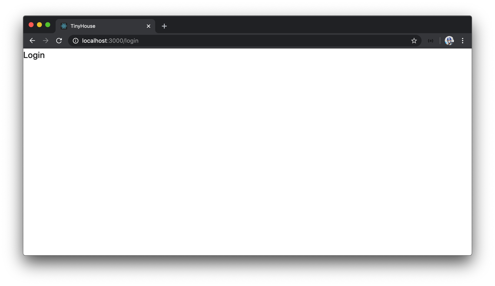
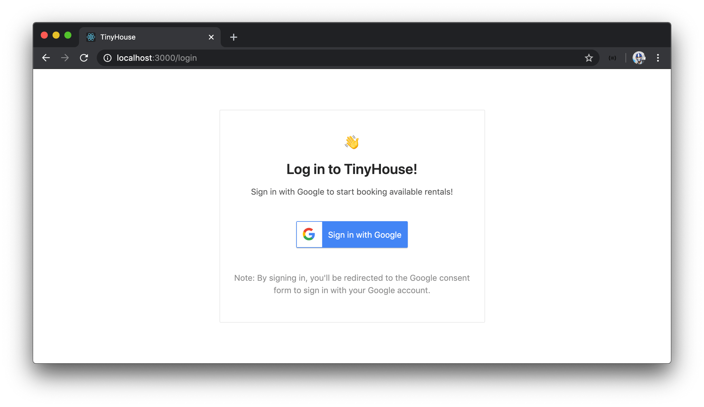

# Building the UI for Login

> 📝 The `google_logo.jpg` image asset used in this lesson can be found - [here](./public/assets/google_logo.jpg).

We'll now switch over to work in our React application and have it communicate with the server to allow a user to sign-in via Google OAuth.

The first thing we'll do is create the GraphQL documents for the new GraphQL **queries** and **mutations** we established on the server. In Part II of this course, we'll be grouping all the GraphQL documents of our app within a `graphql/` folder we'll create in a `src/lib/` folder. In `src/lib/graphql/`, we'll create two separate folders (`queries/` and `mutations/`) to contain the documents for the queries and mutations of our GraphQL API respectively.

```shell
client/
  // ...
  src/
    lib/
      graphql/
        queries/
        mutations/
    // ...
  // ...
```

We've created three new GraphQL root-level fields so we'll create folders for each of these fields. We'll create the `AuthUrl/` folder within the `queries/` folder and is to have an `index.ts` file which is to contain the `authUrl` query document. We'll create a `LogIn/` folder and a `LogOut/` folder, within `mutations/`, to contain the `LogIn/` and `LogOut/` mutation documents respectively. We'll have both the `LogIn/` and `LogOut/` folder contain `index.ts` files.

```shell
client/
  // ...
  src/
    lib/
      graphql/
        queries/
          AuthUrl/
            index.ts
        mutations/
          LogIn/
            index.ts
          LogOut/
            index.ts
    // ...
  // ...
```

### `AuthUrl`, `LogIn`, `LogOut`

In the `AuthUrl/index.ts` file within `lib/graphql/queries/`, we'll import the `gql` tag from the `apollo-boost` package and export a GraphQL constant for making a query to the `authUrl` field. We'll name this query `AuthUrl`.

```ts
import { gql } from "apollo-boost";

export const AUTH_URL = gql`
  query AuthUrl {
    authUrl
  }
`;
```

In the `LogIn/index.ts` file within `lib/graphql/mutations/`, we'll import the `gql` tag and export a constant to make our `logIn` mutation. We'll name the mutation `LogIn` and state that it must accept an `input` argument with which the mutation field will accept as well. We'll have all the fields of the `Viewer` be queried from the result of the mutation - `id`, `token`, `avatar`, `hasWallet`, and `didRequest`.

```ts
import { gql } from "apollo-boost";

export const LOG_IN = gql`
  mutation LogIn($input: LogInInput) {
    logIn(input: $input) {
      id
      token
      avatar
      hasWallet
      didRequest
    }
  }
`;
```

In the `LogOut/index.ts` file within `lib/graphql/mutations/`, we'll import the `gql` tag and export a constant to contain the `LogOut` mutation. We'll also have all the fields from the `Viewer` object queried from our mutation result.

```ts
import { gql } from "apollo-boost";

export const LOG_OUT = gql`
  mutation LogOut {
    logOut {
      id
      token
      avatar
      hasWallet
      didRequest
    }
  }
`;
```

With the GraphQL query and mutation documents defined in our client, we can autogenerate the corresponding TypeScript definitions with our `codegen` scripts. We'll first need to modify the `codegen:generate` script. In Part I of the course we had our `gql` documents within `.tsx` files in our `src/` folder. In Part II, we are to keep all GraphQl documents in their own `.ts` files within the `lib/graphql` folder.

We've also mentioned in Part I how the [`apollo codegen`](https://github.com/apollographql/apollo-tooling#apollo-clientcodegen-output) utility autogenerates a global types file that contains `enum` and `input` object type values of the GraphQL API and is kept in root of the client project by default. In Part II of this course, we'll have the global types file be kept within the `src/lib/graphql/` folder. So we'll apply the `--globalTypesFile` option and state the file will be in `src/lib/grapqhl/globalTypes.ts`.

With these changes, the `codegen:generate` script in our client's `package.json` file will look like the following:

```json
    "codegen:generate": "npx apollo client:codegen --localSchemaFile=schema.json --includes=src/**/*.ts --globalTypesFile=./src/lib/graphql/globalTypes.ts --target=typescript"
```

In our terminal, we'll run the `codegen:schema` command to re-generate the `schema.json` file in our client project.

```shell
npm run codegen:schema
```

We'll then run the `codegen:generate` command to generate the TypeScript definitions from our GraphQL queries and mutations.

```shell
npm run codegen:generate
```

When complete, we'll notice the auto-generated TypeScript definitions within the folders where we've kept our GraphQL documents!

### `<Login />`

We'll want our users to log-in via a `/login` path of our client application. And we'll want a corresponding `<Login />` component to be shown in this path.

We'll first create this `<Login />` component in our `src/sections/` folder, and for now, simply have this `<Login />` component display a header element that says `Login`.

```tsx
import React from "react";

export const Login = () => {
  return (
    <div>
      <h2>Login</h2>
    </div>
  );
};
```

In the `src/sections/index.ts` file, we'll be sure to re-export the `<Login />` component function.

```ts
export * from "./Login";
```

We'll then import the `<Login />` component in our `src/index.tsx` file and create a new `<Route />` that will have the `<Login />` component be shown in the `/login` path.

```tsx
import { Home, Host, Listing, Listings, Login, NotFound, User } from "./sections";

const App = () => {
  return (
    <Router>
      <Switch>
        {/* ... */}
        <Route exact path="/login" component={Login} />
        {/* ... */}
      </Switch>
    </Router>
  );
};
```

If we were to go to [`http://localhost:3000/login`](http://localhost:3000/login) with our React client application running, we'll see our `<Login />` component rendered.



Before we start to query for the Google authentication URL and conduct the `logIn` mutation, we'll make our `<Login />` component more presentable. We'll want our application's login page to look something like the following.



It'll have a simple card with some details telling the user to sign if they're interested in booking rentals. We'll also add some secondary text that tells the user if they sign in - they'll be taken to Google's consent form.

The three main components we're going to use from Ant Design for this page are the [`<Layout />`](https://ant.design/components/layout/), [`<Card />`](https://ant.design/components/card/), and [`<Typography />`](https://ant.design/components/typography/) components.

- The [`<Layout />`](https://ant.design/components/layout/) component helps handle the overall layout of a page.
- The [`<Card />`](https://ant.design/components/card/) component is a simple rectangular container (i.e. a card).
- The [`<Typography />`](https://ant.design/components/typography/) component gives us some simple styles for headings, body texts, and lists.

When we build the markup, we're also going to use some CSS classes that we've already created to add some additional custom styling.

Let's begin creating the UI of our `<Login />` component.

> **Note:** We use an image asset labeled `google-logo.jpg` in the `src/sections/Login/assets/` folder for the sign-in button. Find a source for this image asset - [here](./public/assets/google_logo.jpg).

In the `src/sections/Login/index.tsx` file, we'll first import the `<Card />`, `<Layout />` and `<Typography />` components from Ant Design. We'll also import the `google-logo.jpg` asset from the adjacent `assets/` folder.

```tsx
import { Card, Layout, Typography } from "antd";

// Image Assets
import googleLogo from "./assets/google_logo.jpg";
```

We'll destruct the child `<Content />` component from `<Layout />` and the child `<Text />` and `<Title />` components from the parent `<Typography />`.

```tsx
const { Content } = Layout;
const { Text, Title } = Typography;
```

In our `<Login />` component's return statement, we'll return the `<Content />` component. The `<Content />` component will have a `<Card />` component as a child. The `<Card />` component will have a `<div />` element that is to be the intro section. The intro section will display a `<Title />` where the wave emoji is shown and another `<Title />` that says `"Log In to TinyHouse"`. There'll also be a text statement that is to say `"Sign in with Google to start booking available rentals!"`.

```tsx
import React from "react";
import { Card, Layout, Typography } from "antd";

// Image Assets
import googleLogo from "./assets/google_logo.jpg";

const { Content } = Layout;
const { Text, Title } = Typography;

export const Login = () => {
  return (
    <Content className="log-in">
      <Card className="log-in-card">
        <div className="log-in-card__intro">
          <Title level={3} className="log-in-card__intro-title">
            <span role="img" aria-label="wave">
              👋
            </span>
          </Title>
          <Title level={3} className="log-in-card__intro-title">
            Log in to TinyHouse!
          </Title>
          <Text>Sign in with Google to start booking available rentals!</Text>
        </div>
      </Card>
    </Content>
  );
};
```

Outside of the intro section and in the `<Card />` component, we'll have a button that will have the google image and a `<span />` that says `"Sign in with Google"`. Finally, we'll have secondary text that will state `"By signing in, you'll be redirected to the Google consent form to sign in with your Google account"`.

At this point, our `<Login />` component in the `src/sections/Login/index.tsx` file will look like the following:

```tsx
import React from "react";
import { Card, Layout, Typography } from "antd";

// Image Assets
import googleLogo from "./assets/google_logo.jpg";

const { Content } = Layout;
const { Text, Title } = Typography;

export const Login = () => {
  return (
    <Content className="log-in">
      <Card className="log-in-card">
        <div className="log-in-card__intro">
          <Title level={3} className="log-in-card__intro-title">
            <span role="img" aria-label="wave">
              👋
            </span>
          </Title>
          <Title level={3} className="log-in-card__intro-title">
            Log in to TinyHouse!
          </Title>
          <Text>Sign in with Google to start booking available rentals!</Text>
        </div>
        <button className="log-in-card__google-button">
          
          <span className="log-in-card__google-button-text">Sign in with Google</span>
        </button>
        <Text type="secondary">
          Note: By signing in, you'll be redirected to the Google consent form to sign in
          with your Google account.
        </Text>
      </Card>
    </Content>
  );
};
```

To help have the contents in the `<Login />` component centered in the middle of the page, we'll make a small change in the root `src/index.tsx` file. We'll import the `<Layout />` component from Ant Design and wrap our `<Switch />` statement with the `<Layout />` component that has an `id` of `app`.

```tsx
// ...
import { Layout } from "antd";
// ...

const App = () => {
  return (
    <Router>
      <Layout id="app">
        <Switch>{/* ... */}</Switch>
      </Layout>
    </Router>
  );
};
```

When we take a look at the `/login` route of our React application, we'll now see the login page look like the way we want it to.


Great! In the next lesson, we'll see how we can manually make our authentication URL query when the user clicks the `Sign in with Google` button.

> To reiterate, markup (i.e. HTML/JSX) and CSS/styling is **not a primary lesson of this course**. As a result, we've provided all the custom CSS we'll need from the beginning and simply reference/use them when we prepare the markup for our components.
