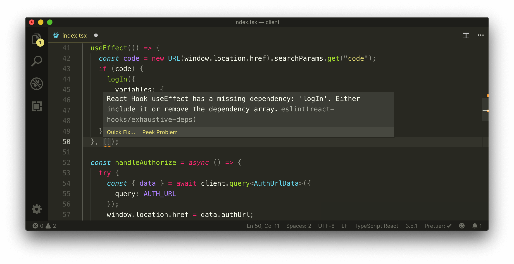

# Executing Login

With the UI of our `<Login />` component mostly prepared, we'll now handle how we can make the `authUrl` query to direct the user to the Google consent form. We'll then look to handle the response when the consent form redirects a signed-in user back to our client application.

## Viewer state object

Just like how we have the concept of a `Viewer` in our server, we'll create the same `Viewer` concept in our client (i.e. the person viewing the app). This `Viewer` object on the client will determine whether the user has been logged in, and the `id` and `avatar` of this user is available, as well whether the user has connected to their Stripe account.

We'll create the `Viewer` interface type in a `types.ts` file within the `src/lib/` folder which is to be the file we'll keep type definitions that is to be accessed in multiple parts of the client app.

```shell
client/
  // ...
  src/
    lib/
      // ...
      types.ts
    // ...
  // ...
```

The `Viewer` interface we'll create will have the same properties as we've seen before - `id`, `token`, `avatar`, `hasWallet`, and `didRequest`.

```ts
export interface Viewer {
  id: string | null;
  token: string | null;
  avatar: string | null;
  hasWallet: boolean | null;
  didRequest: boolean;
}
```

For most of the `Viewer` fields, `null` means the fields requested is not available. In our `logIn` mutation, we're requesting all the fields within the `Viewer` object type and if they're not available, they will come back as `null` values.

In the main starting point of our app, the `src/index.tsx` file, we'll import the `Viewer` interface and we'll use the `useState` Hook to create a `viewer` state object that the child components of `<App />` will be able to access and use. We'll initialize this `viewer` state object with `null` values for all the fields except for the `didRequest` field which will be given a `false` boolean value.

In the `useState` Hook, we'll also destruct a `setViewer()` function which will be used to update the state `viewer` object.

```tsx
import React, { useState } from "react";
// ...
import { Viewer } from "./lib/types";

const initialViewer: Viewer = {
  id: null,
  token: null,
  avatar: null,
  hasWallet: null,
  didRequest: false
};

const App = () => {
  const [viewer, setViewer] = useState<Viewer>(initialViewer);
  ...
};
```

We'll want to have the `setViewer()` function be available in the `<Login />` component so the client `viewer` object can be updated _after_ the `logIn` mutation runs. To have the `setViewer()` function be available in the `Login` component we can take advantage of React Router's [render props](https://reactjs.org/docs/render-props.html) pattern and pass in the `setViewer()` function.

```tsx
<Route exact path="/login" render={props => <Login {...props} setViewer={setViewer} />} />
```

> React Router has now introduced Hooks! Be sure to check out the **React Router Hooks** video in **Module 15** of the course to highlight how the above can be done with Hooks.

## `<Login />`

The `<Login />` component now expects a `setViewer` prop with which we should check for. In the `<Login />` component file, we'll create a `Props` interface and state that `setViewer` is a prop it will receive. The `setViewer` prop is to be a function that receives a `viewer` object with which it uses to update the `viewer` state property and won't return anything (i.e. `void`). We have the interface for what represents a `viewer` in our client so we'll import this `Viewer` interface and assign it as the type of the `viewer` argument within the `setViewer` function prop type. We'll then destruct the `setViewer` prop from the props argument of the `<Login />` component function.

```tsx
import React from "react";
import { Card, Layout, Typography } from "antd";
import { Viewer } from "../../lib/types";

interface Props {
  setViewer: (viewer: Viewer) => void;
}

export const Login = ({ setViewer }: Props) => {
  // ...
};
```

### Manual query of authUrl

We'll continue to work on the `<Login />` component. The first thing we'll look to tackle is how we can make the query for the authentication URL from Google Sign-in/OAuth and direct our user to this URL when they attempt to sign-in.

We've created the `authUrl` field in our GraphQL API that will provide this authentication URL. We know that the [`useQuery` Hook](https://www.apollographql.com/docs/react/api/react-hooks/#usequery) from React Apollo runs a query upon component mount. That isn't what we want to do here. In this context, we'll rather have the `authUrl` query fired on the click event of the **Sign in with Google** Button.

To manually fire a query upon an event other than component rendering, React Apollo gives us two options to do so:

1.  Use the [`useLazyQuery` Hook](https://www.apollographql.com/docs/react/api/react-hooks/#uselazyquery)
2.  Run the `query()` function from the `client` object obtained from the [`useApolloClient` Hook](https://www.apollographql.com/docs/react/api/react-hooks/#useapolloclient).

> The `useQuery` and `useLazyQuery` Hooks leverage and use the `client` object that can be accessed directly from the `useApolloClient` Hook.

We'll import and use the `useApolloClient` Hook. At the top of the `<Login />` component, we'll run `useApolloClient()` to get the `client` object.

```tsx
// ...
import { useApolloClient } from "@apollo/react-hooks";
// ...

export const Login = ({ setViewer }: Props) => {
  const client = useApolloClient();
  // ...
};
```

With this `client` object, we have access to a `query()` function that will allow us to run the `authUrl` query manually. With that said, we'll create a `handleAuthorize()` component function that will fire when the user clicks the **Sign in with Google** button in our `<Login>` component template. We'll attach this function as a click listener to the button.

```tsx
export const Login = ({ setViewer }: Props) => {
  const client = useApolloClient();

  const handleAuthorize = async () => {};

  return (
    <Content className="log-in">
      {/* ... */}
      <button className="log-in-card__google-button" onClick={handleAuthorize}>
        {/* ... */}
      </button>
      {/* ... */}
    </Content>
  );
};
```

In the `handleAuthorize()` function, we'll want to use the `client` object from our `useApolloClient` Hook to request the `authUrl` query. First, we'll need to import the `authUrl` query document from the `src/lib/graphql/` folder.

```tsx
import { AUTH_URL } from "../../lib/graphql/queries";
```

We'll also import the corresponding type definitions for the `authUrl` query data.

```tsx
import { AuthUrl as AuthUrlData } from "../../lib/graphql/queries/AuthUrl/__generated__/AuthUrl";
```

In the `handleAuthorize()` function, we'll have a `try...catch` statement. The `try` statement will use the `client` object to make our query. The `query()` function from `client` will appear similar to how the `useQuery` Hook behaves. It accepts a type variable for the data (and variables) of the query and an options argument where we can pass in the query document. It returns a result of options where in this case, we're only interested in returning the `data` from the query.

```tsx
const handleAuthorize = async () => {
  try {
    const { data } = await client.query<AuthUrlData>({
      query: AUTH_URL
    });
  } catch {}
};
```

With our client application running, if we were to head over the login page and click the **Sign in with Google** button, we'll notice the API call being made in our browsers developer console.


We'll need to have our app be redirected to the url that's returned from the `authUrl` query. To simply redirect our app to the new URL, we'll use the `window.location.href` property and set it to the `data.authUrl` value.

```tsx
const handleAuthorize = async () => {
  try {
    const { data } = await client.query<AuthUrlData>({
      query: AUTH_URL
    });
    window.location.href = data.authUrl;
  } catch {}
};
```

Now, when we click the **Sign In With Google** Button, we'll be taken to the Google Consent page!


The consent page we see here refers to the project we've set up in our Google cloud developer console with which we've given the name of TinyHouse. If we were to provide a valid email and password for a Google account and sign-in, we'll be redirected back to the `/login` route of our app.


Why are we being redirected to `/login`? This is because we've stated in the Google Developer Console for our TinyHouse project, the redirect URI of the OAuth client credentials we've generated (and are using) is going to be [`http://localhost:3000/login`](http://localhost:3000/login), which is the login page for our development environment.

When we're redirected to the `/login` page, Google returns a **`code` as part of the URL query parameter**. The redirected URL will look something like this.

```shell
http://localhost:3000/login?code=4%2FugEBqN1GTkoGRcAT1mhI6BJGzVLfG4QkbmDGQmNEoGVU3siS1SMeA31jlGhLhF8vPn-a9PxlXv5y0on8MngB3EI&scope=email+profile+https%3A%2F%2Fwww.googleapis.com%2Fauth%2Fuserinfo.email+https%3A%2F%2Fwww.googleapis.com%2Fauth%2Fuserinfo.profile+openid&authuser=0&session_state=8e67fe612c8f54b79daba690e97c2bb5601cb372..5538&prompt=consent#
```

At this point, we've finished Step 1 of our Google OAuth flow. Our React client must now pass this authorization `code` to our Node server where our server will use the `code` to communicate with **Google's People API** and determine if this is an existing user logging to our app or a new user.

### `logIn`

We've set up the `logIn` mutation in our GraphQL API that when triggered will accept the `code` returned from Google and essentially "log in" our user. To run this mutation, we'll use the `useMutation` Hook React Apollo provides.

In our `<Login />` component, we'll first import the `LOG_IN` mutation document.

```tsx
import { LOG_IN } from "../../lib/graphql/mutations";
```

We'll import the autogenerated type definitions for the data to be returned from the `logIn` mutation and the variables it accepts.

```tsx
import {
  LogIn as LogInData,
  LogInVariables
} from "../../lib/graphql/mutations/LogIn/__generated__/LogIn";
```

Lastly, we'll also import the `useMutation` Hook from React Apollo.

```tsx
import { useApolloClient, useMutation } from "@apollo/react-hooks";
```

At the top of our `<Login />` component, we'll use the `useMutation` Hook to destruct the `logIn` mutation request as well the results we're interested in. We'll be interested in the `data`, `loading`, and `error` properties with which we'll rename to `logInData`, `logInLoading`, and `logInError`.

```tsx
export const Login = ({ setViewer }: Props) => {
  const client = useApolloClient();
  const [
    logIn,
    { data: logInData, loading: logInLoading, error: logInError }
  ] = useMutation<LogInData, LogInVariables>(LOG_IN);
  ...
};
```

We'll want to run the `logIn` mutation request in a certain condition. We want to run the request **the moment our `<LogIn />` component is being rendered _and_ the `code` is available as a query parameter**. To run an effect in a certain condition like this, we can use React's `useEffect` Hook.

We'll import the `useEffect` Hook and declare it near the top of our component function.

```tsx
import React, { useEffect } from "react";

export const Login = ({ setViewer }: Props) => {
  const client = useApolloClient();
  const [
    logIn,
    { data: logInData, loading: logInLoading, error: logInError }
  ] = useMutation<LogInData, LogInVariables>(LOG_IN);

  useEffect(() => {}, []);
};
```

We'll place an empty dependencies list since we don't want the effect we'll create to ever run after the component has been mounted. We'll access the `code` from the URL query parameter with the [URL()](https://developer.mozilla.org/en-US/docs/Web/API/URL/URL) constructor and the capability to use the [`searchParams.get()`](https://developer.mozilla.org/en-US/docs/Web/API/URL/searchParams#Examples) function. This will allow us to access the value of a certain parameter in our URL. In this case, we're interested in accessing the value of the `code` parameter.

```tsx
useEffect(() => {
  const code = new URL(window.location.href).searchParams.get("code");
}, []);
```

> **Note:** The [`searchParams`](https://developer.mozilla.org/en-US/docs/Web/API/URL/searchParams#Examples) property and the [`URL`](https://developer.mozilla.org/en-US/docs/Web/API/URL/URL) interface may not be applicable for the Internet Explorer browser. We advise you to use any of the newer browsers such as Chrome, Firefox, Edge, and Safari.

In our effect callback, we'll place an `if` condition to state that only if the `code` is available, will we make the `logIn` request and pass the `code` as a variable.

```tsx
useEffect(() => {
  const code = new URL(window.location.href).searchParams.get("code");
  if (code) {
    logIn({
      variables: {
        input: { code }
      }
    });
  }
}, []);
```

The `useEffect` Hook will display a warning since it'll tell us that if we want to use the `logIn` function, we'll need to declare it as a dependency to the Hook.



Since the `logIn` request is being instantiated within the component, we _won't_ add it as a dependency to our `useEffect` Hook. If the component was to ever re-render, a new version of `logIn` will be set up which may cause our `useEffect` Hook to run again, which is something we'll definitely not want.

### `useRef`

Here, we'll use an additional Hook we haven't seen yet called the [**`useRef`**](https://reactjs.org/docs/hooks-reference.html#useref) Hook. The `useRef` Hook accepts an argument with which it returns **a mutable object which will persist for the lifetime of the component**.

We'll import the `useRef` Hook, pass the `logIn` function into the `useRef` Hook function, and assign the result to a `const` we'll call `logInRef`. In our effect callback, we can access the mutable `logIn` property we've passed in with the `.current` property of the object returned from the `useRef` Hook. This will look something like this:

```tsx
import React, { useEffect, useRef } from "react";
// ...

export const Login = ({ setViewer }: Props) => {
  const client = useApolloClient();
  const [
    logIn,
    { data: logInData, loading: logInLoading, error: logInError }
  ] = useMutation<LogInData, LogInVariables>(LOG_IN);
  const logInRef = useRef(logIn);

  useEffect(() => {
    const code = new URL(window.location.href).searchParams.get("code");
    if (code) {
      logInRef.current({
        variables: {
          input: { code }
        }
      });
    }
  }, []);

  // ...
};
```

The `logInRef.current` property will reference the original function regardless of how many renders happen again. Our `useEffect` Hook recognizes this and doesn't require us to specify the `logInRef` property in the dependencies list.

> The way we've used the `useRef` Hook in this example should be done _sparingly_. If you're dealing with actual data properties an effect may depend on, you may want to include it in the dependencies list to avoid bugs/issues. In this case however, we're referencing a function that's going to remain the same regardless of how many times our component renders!

### Success, loading, & error states

When our `logIn` mutation fires, we'll like to do something right after our mutation has finished successfully. What we intend to do is use the `setViewer()` function to update the `viewer` state object in the parent component with the new `viewer` data being received from the mutation. There are a few ways where we can run some functionality after the success of a mutation or query. One simple way of doing so is using the **`onCompleted()`** callback function available to us as an option of our `useMutation` hook from React Apollo.

**`onCompleted()`** is a callback property that is executed once a mutation is successfully completed. The only argument it has is the data from the successful mutation. We'll define the `onCompleted()` callback as part of our `useMutation` options and in the callback, we'll check if the `data` argument and `data.logIn` values exist. If `data` and `data.logIn` exists, we'll call the `setViewer` function and set the `viewer` with the `data` received.

```tsx
const [
  logIn,
  { data: logInData, loading: logInLoading, error: logInError }
] = useMutation<LogInData, LogInVariables>(LOG_IN, {
  onCompleted: data => {
    if (data && data.logIn) {
      setViewer(data.logIn);
    }
  }
});
```

Let's now update our `<LogIn />` component to better notify the user when the log-in process is happening and when it completes successfully or where it might error.

When the user is being logged in, we probably want to show some loading indicator. We'll import and use the Ant Design [`Spin`](https://ant.design/components/spin/) component, and return the `<Spin />` component with a message when the `loading` property from our `logIn` mutation is `true`.

```tsx
// ...
import { Card, Layout, Spin, Typography } from "antd";
// ...

export const Login = ({ setViewer }: Props) => {
  // ...
  const [
    logIn,
    { data: logInData, loading: logInLoading, error: logInError }
  ] = useMutation<LogInData, LogInVariables>(LOG_IN, {
    onCompleted: data => {
      if (data && data.logIn) {
        setViewer(data.logIn);
      }
    }
  });

  // ...

  if (logInLoading) {
    return (
      <Content className="log-in">
        <Spin size="large" tip="Logging you in..." />
      </Content>
    );
  }

  return (
    // ...,
  );
};
```

### `<ErrorBanner />`, `displaySuccessNotification()`, `displayErrorMessage()`

When a query is successful (or when it errors), or when a mutation is successful (or when it errors) - we'll always want to notify the user about this in our UI.

- For mutations that run upon component mount and is successful, we'll use Ant Design's [`<Notification />`](https://ant.design/components/notification/) component to display a success notification in the page.
- For when most mutations (or a manually triggered query) fail, we'll use Ant Design's [`<Message />`](https://ant.design/components/message) component to display an error message in the page.
- When queries on page load (or the `LogIn` mutation when the `<Login />` component mount) fails, we'll want to display an error [`<Alert />`](https://ant.design/components/alert/) banner.

These pieces of UI functionality are going to be used in multiple parts of our React app so we'll create them in a shared location that can be easily used everywhere.

In the `src/lib/` folder, we'll create a `components/` folder that has an `ErrorBanner/` component folder with an `index.ts` file. We'll have the `components/` folder in `src/lib/` contain an `index.ts` file.

```shell
client/
  // ...
  src/
    lib/
      components/
        ErrorBanner/
          index.ts
        index.ts
      // ...
    // ...
  // ...
```

We'll also create a `utils/` folder within `src/lib/` that is to have an `index.ts` file as well.

```shell
client/
  // ...
  src/
    lib/
      components/
        ErrorBanner/
          index.ts
        index.ts
      utils/
        index.ts
    // ...
  // ...
```

The `<ErrorBanner />` component is the shared alert banner component we'll want to show when a query on page load (or mutations during component mount) ever fails. In the `src/lib/components/ErrorBanner/index.ts` file, we'll import and use Ant Design's `<Alert />` component and state that the `<ErrorBanner />` component may receive a `message` or `description` prop. We'll use the capability to define default prop values for when the `message` or `description` props are never passed in. Finally, we'll have the `<ErrorBanner />` component render the `<Alert />` component with the prop options we'll want (`banner`, `closable`, `type="error"`, etc.).

The `<ErrorBanner />` component file will look like the following:

```tsx
import React from "react";
import { Alert } from "antd";

interface Props {
  message?: string;
  description?: string;
}

export const ErrorBanner = ({
  message = "Uh oh! Something went wrong :(",
  description = "Look like something went wrong. Please check your connection and/or try again later."
}: Props) => {
  return (
    <Alert
      banner
      closable
      message={message}
      description={description}
      type="error"
      className="error-banner"
    />
  );
};
```

In the `src/lib/components/index.ts` file, we'll re-export the `<ErrorBanner />` component from the adjacent `ErrorBanner/` folder.

```ts
export * from "./ErrorBanner";
```

The `utils/index.ts` file in the `src/lib/` folder will be where we create the functions Ant Design gives to render the `<Notification />` and `<Message />` components. In the `utils/index.ts` file, we'll import the `message` and `notification` functions from Ant Design.

We'll have a `displaySuccessNotification()` function that accepts a `message` argument and an optional `description` argument to then return a success `notification` to be placed on the top left of the page.

```tsx
import { message, notification } from "antd";

export const displaySuccessNotification = (message: string, description?: string) => {
  return notification["success"]({
    message,
    description,
    placement: "topLeft",
    style: {
      marginTop: 50
    }
  });
};
```

We'll have a `displayErrorMessage()` function that accepts an `error` argument and simply returns the results of `message.error()`.

```ts
import { message, notification } from "antd";

export const displaySuccessNotification = (message: string, description?: string) => {
  return notification["success"]({
    message,
    description,
    placement: "topLeft",
    style: {
      marginTop: 50
    }
  });
};

export const displayErrorMessage = (error: string) => {
  return message.error(error);
};
```

### `<Login />`

In our `<Login />` component, we'll import the `<ErrorBanner />` component from the `src/lib/components/` folder.

```tsx
import { ErrorBanner } from "../../lib/components";
```

We'll also import the `displaySuccessNotification()` and `displayErrorMessage()` functions from the `src/lib/utils` folder.

```tsx
import { displaySuccessNotification, displayErrorMessage } from "../../lib/utils";
```

At the end of our `onCompleted()` callback function of our `useMutation` Hook, we'll use the `displaySuccessNotification()` function to display a success message of `"You've successfully logged in!"`.

```tsx
const [
  logIn,
  { data: logInData, loading: logInLoading, error: logInError }
] = useMutation<LogInData, LogInVariables>(LOG_IN, {
  onCompleted: data => {
    if (data && data.logIn) {
      setViewer(data.logIn);
      displaySuccessNotification("You've successfully logged in!");
    }
  }
});
```

In the `catch` statement for our `<Login />` component's `handleAuthorize()` function, we'll place the `displayErrorMessage()` function with an error message of `"Sorry! We weren't able to log you in. Please try again later!"`.

```tsx
const handleAuthorize = async () => {
  try {
    const { data } = await client.query<AuthUrlData>({
      query: AUTH_URL
    });
    window.location.href = data.authUrl;
  } catch {
    displayErrorMessage("Sorry! We weren't able to log you in. Please try again later!");
  }
};
```

In the `<Login />` component, if the `logInError` property from our `logIn` mutation result is ever `true`, we'll conditionally create a constant called `logInErrorBannerElement` that is to be the `<ErrorBanner />` component. We'll place the `logInErrorBannerElement` above our `<Card className="log-in-card"/>` and render the rest of our component template.

```tsx
export const Login = ({ setViewer }: Props) => {
  // ...
  const [
    logIn,
    { data: logInData, loading: logInLoading, error: logInError }
  ] = useMutation<LogInData, LogInVariables>(LOG_IN, {
    onCompleted: data => {
      if (data && data.logIn) {
        setViewer(data.logIn);
      }
    }
  });

  // ...

  const logInErrorBannerElement = logInError ? (
    <ErrorBanner description="We weren't able to log you in. Please try again soon." />
  ) : null;

  return (
    <Content className="log-in">
      {logInErrorBannerElement}
      <Card className="log-in-card">{/* ... */}</Card>
    </Content>
  );
};
```

The last thing we'll do in our `<Login />` component is check that when the user successfully logs in, we wouldn't want to keep them in the `/login` page any longer. Instead, we'll want to redirect them to the `/user` page where we'll later populate with user information of the logged in user.

To achieve a redirect to another route in our app, we can use the [`<Redirect />`](https://github.com/ReactTraining/react-router/blob/master/packages/react-router/docs/api/Redirect.md) component that React Router gives us. In our `<Login />` component file, we'll import `Redirect` from `react-router-dom`.

`<Redirect />` is a component that does a _redirect_ when rendered. In our `<Login />` component, we'll check if the `logInData` from our mutation exists, and if so, render the `<Redirect />` component with a `to` prop with a target location of `/user/viewerId` where `viewerId` is the `id` of the viewer.

```tsx
export const Login = ({ setViewer }: Props) => {
  // ...
  const [
    logIn,
    { data: logInData, loading: logInLoading, error: logInError }
  ] = useMutation<LogInData, LogInVariables>(LOG_IN, {
    onCompleted: data => {
      if (data && data.logIn) {
        setViewer(data.logIn);
      }
    }
  });

  // ...

  if (logInData && logInData.logIn) {
    const { id: viewerId } = logInData.logIn;
    return <Redirect to={`/user/${viewerId}`} />;
  }

  return <Content className="log-in">{/* ... */}</Content>;
};
```

With all the changes we've made, the `<Login />` component and the `src/sections/Login/index.tsx` file will look like the following.

```tsx
import React, { useEffect, useRef } from "react";
import { Redirect } from "react-router-dom";
import { useApolloClient, useMutation } from "@apollo/react-hooks";
import { Card, Layout, Spin, Typography } from "antd";
import { ErrorBanner } from "../../lib/components";
import { LOG_IN } from "../../lib/graphql/mutations";
import { AUTH_URL } from "../../lib/graphql/queries";
import {
  LogIn as LogInData,
  LogInVariables
} from "../../lib/graphql/mutations/LogIn/__generated__/LogIn";
import { AuthUrl as AuthUrlData } from "../../lib/graphql/queries/AuthUrl/__generated__/AuthUrl";
import { displaySuccessNotification, displayErrorMessage } from "../../lib/utils";
import { Viewer } from "../../lib/types";

// Image Assets
import googleLogo from "./assets/google_logo.jpg";

interface Props {
  setViewer: (viewer: Viewer) => void;
}

const { Content } = Layout;
const { Text, Title } = Typography;

export const Login = ({ setViewer }: Props) => {
  const client = useApolloClient();
  const [
    logIn,
    { data: logInData, loading: logInLoading, error: logInError }
  ] = useMutation<LogInData, LogInVariables>(LOG_IN, {
    onCompleted: data => {
      if (data && data.logIn) {
        setViewer(data.logIn);
        displaySuccessNotification("You've successfully logged in!");
      }
    }
  });
  const logInRef = useRef(logIn);

  useEffect(() => {
    const code = new URL(window.location.href).searchParams.get("code");
    if (code) {
      logInRef.current({
        variables: {
          input: { code }
        }
      });
    }
  }, []);

  const handleAuthorize = async () => {
    try {
      const { data } = await client.query<AuthUrlData>({
        query: AUTH_URL
      });
      window.location.href = data.authUrl;
    } catch {
      displayErrorMessage(
        "Sorry! We weren't able to log you in. Please try again later!"
      );
    }
  };

  if (logInLoading) {
    return (
      <Content className="log-in">
        <Spin size="large" tip="Logging you in..." />
      </Content>
    );
  }

  if (logInData && logInData.logIn) {
    const { id: viewerId } = logInData.logIn;
    return <Redirect to={`/user/${viewerId}`} />;
  }

  const logInErrorBannerElement = logInError ? (
    <ErrorBanner description="Sorry! We weren't able to log you in. Please try again later!" />
  ) : null;

  return (
    <Content className="log-in">
      {logInErrorBannerElement}
      <Card className="log-in-card">
        <div className="log-in-card__intro">
          <Title level={3} className="log-in-card__intro-title">
            <span role="img" aria-label="wave">
              👋
            </span>
          </Title>
          <Title level={3} className="log-in-card__intro-title">
            Log in to TinyHouse!
          </Title>
          <Text>Sign in with Google to start booking available rentals!</Text>
        </div>
        <button className="log-in-card__google-button" onClick={handleAuthorize}>
          
          <span className="log-in-card__google-button-text">Sign in with Google</span>
        </button>
        <Text type="secondary">
          Note: By signing in, you'll be redirected to the Google consent form to sign in
          with your Google account.
        </Text>
      </Card>
    </Content>
  );
};
```

That's it for now! At this moment, when we attempt to sign-in with Google, we're taken to Google's authentication/consent form.


After providing the correct sign-in information and signing in, we're _redirected_ to the `<Login />` component where the loading indicator is shown and the `code` query parameter is in the URL.


When we see the spinning loading indicator in the UI, this is where the `logIn` mutation is in flight. When complete successfully, we're redirected to the `/user` page of the logged-in user and we see a success notification!


Amazing! At this moment, our client now recognizes the `viewer` that's logged in and keeps that information within a `viewer` state value in the main parent `<App />` component.

If, for some reason or another, the query for the `authUrl` field fails when a user clicks the **Sign in with Google** button - an error message will be displayed near the top of the page notifying the user.


If the `logIn` mutation that's run when the user is redirected to the `/login` page fails, an error banner will be shown in the top of the rendered template.


