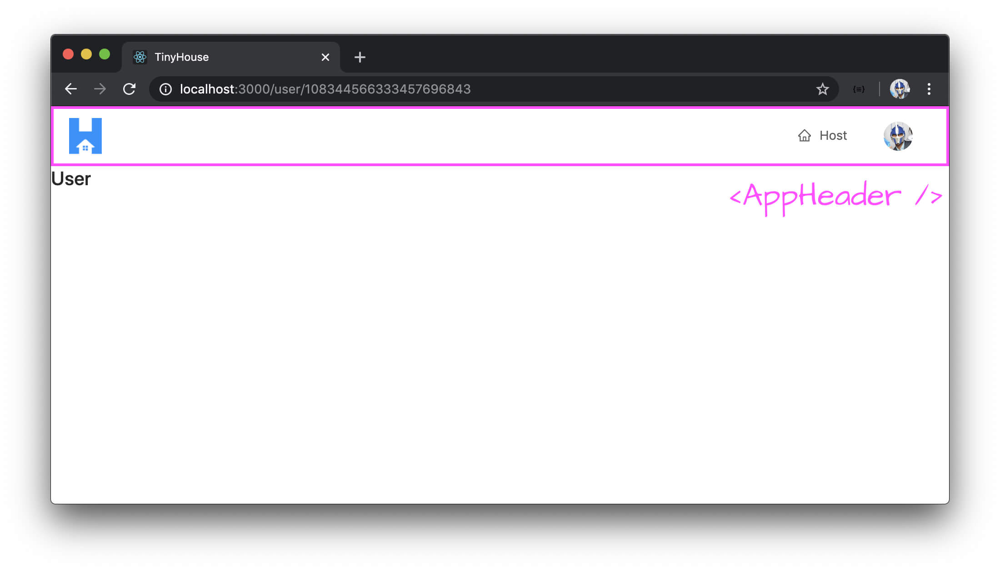
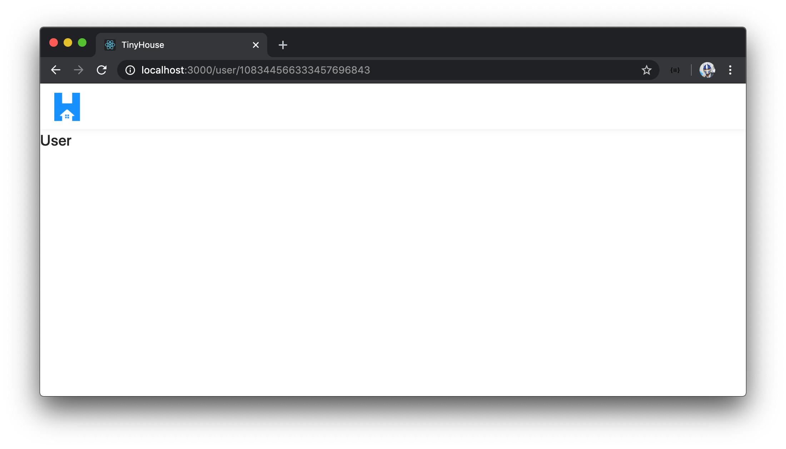
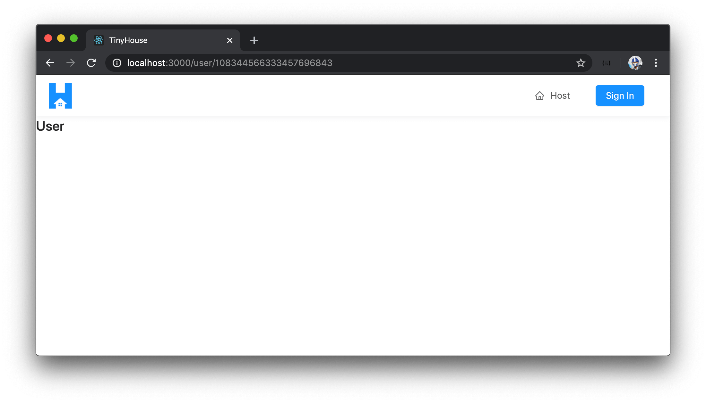
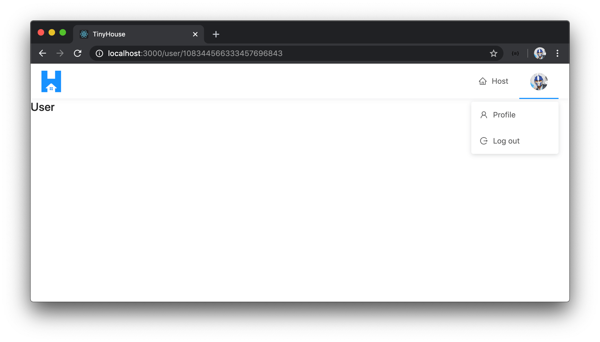
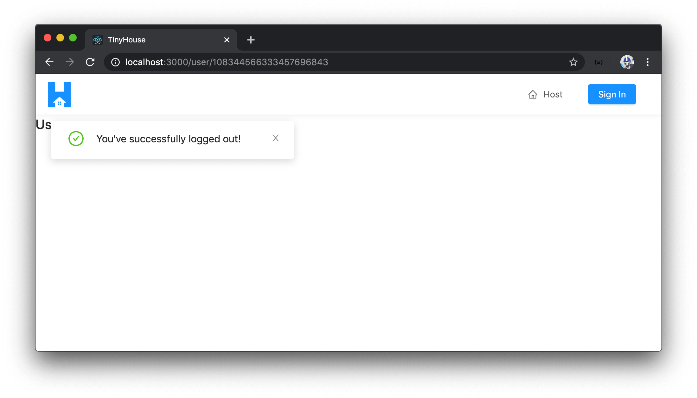

# Building the App Header & Logout

> 📝 The `tinyhouse-logo.png` image asset used in this lesson can be found - [here](./public/assets/tinyhouse-logo.png).

We've been able to go through Google's Sign-In flow and obtain the details of a signed-in viewer in our client app. In this lesson, we'll look to find a way to notify the viewer whenever they're in the logged-in state. We'll achieve this by creating an app header element that indicates when a viewer is logged in and will also allow the viewer to navigate between different routes in the app.

### `<AppHeader />`

We'll create an `<AppHeader />` component that'll be shown in all different pages and will allow the user to navigate around the app, log in, and log out.



We'll have this `<AppHeader />` component be established within a new `src/sections/` folder.

```shell
client/
  // ...
  src/
    // ...
    sections/
      AppHeader
        index.tsx
      // ...
    // ...
  // ...
```

> **Note:** We use an image asset labeled `tinyhouse-logo.png` in the `src/sections/AppHeader/assets/` folder for the app header. Find a source for this image asset - [here](./public/assets/tinyhouse-logo.png).

The `<AppHeader />` component will use the `<Header />` component from Ant Design's [`<Layout />`](https://ant.design/components/layout/) component. We'll first look to have the `<AppHeader />` component display the application logo. In the `src/sections/AppHeader/index.tsx` file, we'll import the `React` library, the `<Layout />` component from Ant Design, and the `tinyhouse-logo` asset. We'll also import the `<Link />` component from `react-router-dom` that we'll use to allow the user to click the logo in the app header and navigate back to the index route (i.e. `/`).

```tsx
import React from "react";
import { Link } from "react-router-dom";
import { Layout } from "antd";

import logo from "./assets/tinyhouse-logo.png";
```

We'll destruct the `<Header />` component from `<Layout />`. We'll construct the `<AppHeader />` component and have it return a header with the `tinyhouse-logo` image kept in a `<Link />` component that acts as a link to the index route (`/`).

```tsx
import React from "react";
import { Link } from "react-router-dom";
import { Layout } from "antd";

import logo from "./assets/tinyhouse-logo.png";

const { Header } = Layout;

export const AppHeader = () => {
  return (
    <Header className="app-header">
      <div className="app-header__logo-search-section">
        <div className="app-header__logo">
          <Link to="/">
            
          </Link>
        </div>
      </div>
    </Header>
  );
};
```

In the `src/sections/index.ts` file, we'll have the `<AppHeader />` component function be re-exported.

```ts
export * from "./AppHeader";
```

In the parent `src/index.tsx` file, we'll import the `<AppHeader />` component and look to place it at the top of our `<App />` component return statement. To have the `<AppHeader />` component shown in every route, we'll place it outside of the router `<Switch />` statement. To ensure the `<AppHeader />` component stays affixed to the top of the page even if we were to scroll down, we'll import and use the [`<Affix />`](https://ant.design/components/affix/) component from Ant design and wrap our `AppHeader` component with it. By specifying the `offsetTop` option to `0` for the `<Affix />` component, we're stating that we want the child elements within it to stay at the very top of the page.

```tsx
// ...
import { Affix } from "antd";
// ...

const App = () => {
  // ...
  return (
    <Router>
      <Affix offsetTop={0} className="app__affix-header">
        <AppHeader />
      </Affix>
      <Switch>{/* ... */}</Switch>
    </Router>
  );
};
```

When we launch our client application, we'll now be presented with the `<AppHeader />` component that shows our application logo regardless of what route we're in.



### `<MenuItems />`

We'll leverage the [`<Menu />` component](https://ant.design/components/menu/) from Ant Design to help show a menu of links that the user can use in the `<AppHeader />`. When the viewer is _not_ signed-in, we'll want to show a link to the `/host` page and a "Sign In" button to take them to the `/login` page.



However, when the user is signed in - instead of the "Sign In" button, we're interested in showing the avatar of the viewer that itself is a drop-down button that will allow the viewer to navigate to their profile (i.e. user page) or log out of the application.



The menu items section of the app header will have some decent functionality of its own so we'll abstract that section away to a new component we'll call `<MenuItems />` that will be set up in the `components/` folder of `AppHeader/`.

We'll also have an `index.ts` file be kept in the `src/sections/AppHeader/components/` folder.

```shell
client/
  // ...
  src/
    // ...
    AppHeader/
      components/
        MenuItems/
          index.tsx
        index.ts
    // ...
  // ...
```

In the `MenuItems/index.tsx` file, we'll first aim to have the menu items show the `"Host"` link and the `"Sign In"` button. We'll import and use the `<Button />`, `<Icon />`, and `<Menu />` components from Ant Design to help us here. We'll destruct the child `<Item />` and `<SubMenu />` components from Ant Design that we'll use. We'll use the `<Link />` component from React Router to have the "Host" menu item be navigable to the `/host` route and the "Sign In" button be navigable to the `/login` route.

```tsx
import React from "react";
import { Link } from "react-router-dom";
import { Button, Icon, Menu } from "antd";

const { Item, SubMenu } = Menu;

export const MenuItems = () => {
  return (
    <Menu mode="horizontal" selectable={false} className="menu">
      <Item key="/host">
        <Link to="/host">
          <Icon type="home" />
          Host
        </Link>
      </Item>
      <Item key="/login">
        <Link to="/login">
          <Button type="primary">Sign In</Button>
        </Link>
      </Item>
    </Menu>
  );
};
```

In the `src/sections/AppHeader/components/index.ts` file, we'll re-export the `<MenuItems />` component function.

```ts
export * from "./MenuItems";
```

We'll import the `<MenuItems />` component in the `<AppHeader />` component and render it as a child component.

```tsx
import React from "react";
import { Link } from "react-router-dom";
import { Layout } from "antd";

import logo from "./assets/tinyhouse-logo.png";

const { Header } = Layout;

export const AppHeader = () => {
  return (
    <Header className="app-header">
      <div className="app-header__logo-search-section">
        <div className="app-header__logo">
          <Link to="/">
            
          </Link>
        </div>
      </div>
      <div className="app-header__menu-section">
        <MenuItems viewer={viewer} setViewer={setViewer} />
      </div>
    </Header>
  );
};
```

If we launch our client application in the browser, we'll be presented with the `"Host"` link and `"Sign In"` button.


If we were to click the `"Host"` link or `"Sign In"` button, we'll be taken to the `/host` page and `/login` page respectively.

We'll now want to conditionally show the viewer avatar in the `<MenuItems />` element **if the user is logged in**. To do so, we'll need access to the `viewer` state value in our parent `<App />` component. In the `<App />` component, we'll pass the `viewer` state value as a prop down to the rendered `<AppHeader />` component.

```tsx
const App = () => {
  const [viewer, setViewer] = useState<Viewer>(initialViewer);

  return (
    <Router>
      <Affix offsetTop={0} className="app__affix-header">
        <AppHeader viewer={viewer} />
      </Affix>
      <Switch>{/* ... */}</Switch>
    </Router>
  );
};
```

In the `<AppHeader />` component we'll declare the `viewer` prop and pass it along down to the `<MenuItems />` component. We'll import the `Viewer` interface from the `lib/types.ts` file and set it as the type of the `viewer` prop.

```tsx
// ...
import { Viewer } from "../../lib/types";
// ...

interface Props {
  viewer: Viewer;
}

export const AppHeader = ({ viewer }: Props) => {
  return (
    <Header className="app-header">
      <div className="app-header__logo-search-section">
        <div className="app-header__logo">
          <Link to="/">
            
          </Link>
        </div>
      </div>
      <div className="app-header__menu-section">
        <MenuItems viewer={viewer} />
      </div>
    </Header>
  );
};
```

With the `viewer` prop available in `<MenuItems />`, we can conditionally render the viewer avatar and drop-down menu when the viewer is signed in. The drop-down menu will be created with the help of the `<SubMenu />` child component Ant Design provides.

Within the `<MenuItems />` component, we'll create a `const` element called `subMenuLogin` which will be a `<SubMenu />` component. This `subMenuLogin` element will have a "Profile" menu item to be used as a link to the user page and a `"Log out"` menu item which will be used as a trigger to help log out the user.

```tsx
import React from "react";
import { Button, Icon, Menu } from "antd";

const { Item, SubMenu } = Menu;

export const MenuItems = () => {
  const subMenuLogin = (
    <SubMenu>
      <Item key={"/user/"}>
        <Icon type="user" />
        Profile
      </Item>
      <Item key="logout">
        <Icon type="logout" />
        Log out
      </Item>
    </SubMenu>
  );

  return (
    // ...
  );
};
```

We'll conditionally have the `subMenuLogin` element display the submenu item if the `viewer` is logged in. To do so, we can check for a valid property of the `viewer` object. For example, if the `id` of the `viewer` exists, it most likely means the server was able to return a `viewer` instance. If the `viewer` doesn't exist, we'll have the `subMenuLogin` element display the `"Sign In"` button. We'll render the `subMenuLogIn` `const` element in the return statement of the `<MenuItems />` component.

```tsx
import React from "react";
import { Link } from "react-router-dom";
import { Button, Icon, Menu } from "antd";
import { Viewer } from "../../../../lib/types";

interface Props {
  viewer: Viewer;
}

const { Item, SubMenu } = Menu;

export const MenuItems = ({ viewer }: Props) => {
  const subMenuLogin = viewer.id ? (
    <SubMenu>
      <Item key="/user">
        <Icon type="user" />
        Profile
      </Item>
      <Item key="/logout">
        <Icon type="logout" />
        Log out
      </Item>
    </SubMenu>
  ) : (
    <Item>
      <Link to="/login">
        <Button type="primary">Sign In</Button>
      </Link>
    </Item>
  );

  return (
    <Menu mode="horizontal" selectable={false} className="menu">
      <Item key="/host">
        <Link to="/host">
          <Icon type="home" />
          Host
        </Link>
      </Item>
      {subMenuLogin}
    </Menu>
  );
};
```

The `<SubMenu />` component takes a `title` prop with which we'll be able to use to show the avatar of the logged-in user. We'll import an `<Avatar />` component from Ant Design and place it in the `title` prop and use the `avatar` property within the `viewer` object as the source.

To ensure the viewer avatar is to be shown only when the `viewer.avatar` property exists, we'll state that both the `viewer.id` and `viewer.avatar` fields should exist (i.e. not be `null`) to render the `<SubMenu />` element.

```tsx
import React from "react";
import { Link } from "react-router-dom";
import { Avatar, Button, Icon, Menu } from "antd";
import { Viewer } from "../../../../lib/types";

interface Props {
  viewer: Viewer;
}

const { Item, SubMenu } = Menu;

export const MenuItems = ({ viewer }: Props) => {
  const subMenuLogin =
    viewer.id && viewer.avatar ? (
      <SubMenu title={<Avatar src={viewer.avatar} />}>
        <Item key="/user">
          <Icon type="user" />
          Profile
        </Item>
        <Item key="/logout">
          <Icon type="logout" />
          Log out
        </Item>
      </SubMenu>
    ) : (
      <Item>
        <Link to="/login">
          <Button type="primary">Sign In</Button>
        </Link>
      </Item>
    );

  return (
    <Menu mode="horizontal" selectable={false} className="menu">
      <Item key="/host">
        <Link to="/host">
          <Icon type="home" />
          Host
        </Link>
      </Item>
      {subMenuLogin}
    </Menu>
  );
};
```

In our UI, let's attempt to login and go through the consent flow. When being taken back to our app, we'll notice after a brief period - we're now presented with our avatar image and a drop-down menu! Amazing!


### `logOut`

We'll now wire the `logOut` mutation with the `"Log out"` button in our `<AppHeader />` menu items.

> If we recall, the `logOut` mutation resolver function doesn't achieve much at this moment. It simply returns an empty `viewer` object which is something we can do on the client. In the next module, `logOut` will help clear out a cookie to prevent the viewer from having a persistent log-in state. We'll have the `"Log Out"` item in the dropdown trigger the `LogOut` mutation when clicked to set us up for the next module.

In the `<MenuItems />` component, we'll import the `LOG_OUT` mutation document and the autogenerated interface for the data to be returned from the mutation. We'll also import the `useMutation` Hook.

At the top of the `<MenuItems />` component function, we'll use the `useMutation` Hook and simply return the `logOut` mutation request function only.

```tsx
// ...
import { useMutation } from "@apollo/react-hooks";
import { LOG_OUT } from "../../../../lib/graphql/mutations";
import { LogOut as LogOutData } from "../../../../lib/graphql/mutations/LogOut/__generated__/LogOut";
// ...

export const MenuItems = ({ viewer }: Props) => {
  const [logOut] = useMutation<LogOutData>(LOG_OUT);
  // ...
};
```

In the `subMenuLogin` element, we'll wrap the contents of the "Log out" item with a `div` element that when clicked will trigger a component `handleLogOut()` function that will subsequently call the `logOut` mutation function.

Additionally, when the "Profile" item in the `<SubMenu />` element is clicked, we'll use the `<Link />` component from React Router to help navigate the `viewer` to the `user` page with the `id` of the `viewer`.

```tsx
// ...
import { useMutation } from "@apollo/react-hooks";
import { LOG_OUT } from "../../../../lib/graphql/mutations";
import { LogOut as LogOutData } from "../../../../lib/graphql/mutations/LogOut/__generated__/LogOut";
// ...

export const MenuItems = ({ viewer }: Props) => {
  const [logOut] = useMutation<LogOutData>(LOG_OUT);

  const handleLogOut = () => {
    logOut();
  };

  const subMenuLogin =
    viewer.id && viewer.avatar ? (
      <SubMenu title={<Avatar src={viewer.avatar} />}>
        <Item key={`/user/${viewer.id}`}>
          <Link to={`/user/${viewer.id}`}>
            <Icon type="user" />
            Profile
          </Link>
        </Item>
        <Item key="/logout">
          <div onClick={handleLogOut}>
            <Icon type="logout" />
            Log out
          </div>
        </Item>
      </SubMenu>
    ) : (
      <Item>
        <Link to="/login">
          <Button type="primary">Sign In</Button>
        </Link>
      </Item>
    );

  return (
    // ...
  );
};
```

When the `logOut` mutation is successful, we'll want to notify the user it was successful and set the `viewer` client state object to a value that references a signed off viewer. To update the `viewer` state value in the parent `<App />` component, we'll need access to the `setViewer()` function available from the parent `<App />`.

In the `<App />` component, we'll pass the `setViewer()` function as a prop down to `<AppHeader />`.

```tsx
<AppHeader viewer={viewer} setViewer={setViewer} />
```

In the `<AppHeader />` component, we'll declare the `setViewer` prop and pass it along to the `<MenuItems />` component. This will complete what we intended to do for `<AppHeader />` component which will have the `<AppHeader />` component file look like the following:

```tsx
import React from "react";
import { Link } from "react-router-dom";
import { Layout } from "antd";
import { Viewer } from "../../lib/types";
import { MenuItems } from "./components";

import logo from "./assets/tinyhouse-logo.png";

interface Props {
  viewer: Viewer;
  setViewer: (viewer: Viewer) => void;
}

const { Header } = Layout;

export const AppHeader = ({ viewer, setViewer }: Props) => {
  return (
    <Header className="app-header">
      <div className="app-header__logo-search-section">
        <div className="app-header__logo">
          <Link to="/">
            
          </Link>
        </div>
      </div>
      <div className="app-header__menu-section">
        <MenuItems viewer={viewer} setViewer={setViewer} />
      </div>
    </Header>
  );
};
```

In the `<MenuItems />` component, we'll declare the `setViewer()` function as an expected prop as well.

```tsx
// ...

interface Props {
  viewer: Viewer;
  setViewer: (viewer: Viewer) => void;
}

export const MenuItems = ({ viewer, setViewer }: Props) => {
  // ...
};
```

When the `logOut` mutation is successful, it'll return an empty `viewer` object (with a `didRequest` field set to `true`) as part of data. We'll use the `useMutation` `onCompleted()` callback and run the `setViewer()` function to set the `viewer` state value to the new received logged out `viewer` object.

```tsx
export const MenuItems = ({ viewer, setViewer }: Props) => {
  const [logOut] = useMutation<LogOutData>(LOG_OUT, {
    onCompleted: data => {
      if (data && data.logOut) {
        setViewer(data.logOut);
      }
    }
  });
};
```

We'll also look to display a success notification to tell the user they were able to sign off successfully. We'll import the `displaySuccessNotification()` function we have in the `src/lib/utils/index.ts` file and run it after the `setViewer()` function is used in the `onCompleted()` callback.

```tsx
// ...
import { displaySuccessNotification } from "../../../../lib/utils";
// ...

export const MenuItems = ({ viewer, setViewer }: Props) => {
  const [logOut] = useMutation<LogOutData>(LOG_OUT, {
    onCompleted: data => {
      if (data && data.logOut) {
        setViewer(data.logOut);
        displaySuccessNotification("You've successfully logged out!");
      }
    }
  });
};
```

If the `logOut` mutation was to ever fail, we'll want to notify the user. When the mutation fails, we'll want to run the `displayErrorMessage()` function we have in our `lib/utils/index.ts` file to show an error alert. Since we want to simply run a function, we can do so in the `onError()` callback of the `useMutation` Hooks which is a callback function React Apollo provides that runs when the mutation has _failed_.

With all the intended changes made to the `<MenuItems />` component, the `<MenuItems />` component file will look like the following:

```tsx
import React from "react";
import { Link } from "react-router-dom";
import { useMutation } from "@apollo/react-hooks";
import { Avatar, Button, Icon, Menu } from "antd";
import { LOG_OUT } from "../../../../lib/graphql/mutations";
import { LogOut as LogOutData } from "../../../../lib/graphql/mutations/LogOut/__generated__/LogOut";
import { displaySuccessNotification, displayErrorMessage } from "../../../../lib/utils";
import { Viewer } from "../../../../lib/types";

interface Props {
  viewer: Viewer;
  setViewer: (viewer: Viewer) => void;
}

const { Item, SubMenu } = Menu;

export const MenuItems = ({ viewer, setViewer }: Props) => {
  const [logOut] = useMutation<LogOutData>(LOG_OUT, {
    onCompleted: data => {
      if (data && data.logOut) {
        setViewer(data.logOut);
        displaySuccessNotification("You've successfully logged out!");
      }
    },
    onError: () => {
      displayErrorMessage(
        "Sorry! We weren't able to log you out. Please try again later!"
      );
    }
  });

  const handleLogOut = () => {
    logOut();
  };

  const subMenuLogin =
    viewer.id && viewer.avatar ? (
      <SubMenu title={<Avatar src={viewer.avatar} />}>
        <Item key="/user">
          <Link to={`/user/${viewer.id}`}>
            <Icon type="user" />
            Profile
          </Link>
        </Item>
        <Item key="/logout">
          <div onClick={handleLogOut}>
            <Icon type="logout" />
            Log out
          </div>
        </Item>
      </SubMenu>
    ) : (
      <Item>
        <Link to="/login">
          <Button type="primary">Sign In</Button>
        </Link>
      </Item>
    );

  return (
    <Menu mode="horizontal" selectable={false} className="menu">
      <Item key="/host">
        <Link to="/host">
          <Icon type="home" />
          Host
        </Link>
      </Item>
      {subMenuLogin}
    </Menu>
  );
};
```

This should help us achieve what we set out to do! If we take a look at our app, sign in, then click the log out button - we'll notice that the viewer state has been removed! Great!



There are two important notes to make here before we close the lesson.

1.  The `logOut` graphQL mutation at this moment doesn't achieve anything significant. It simply returns an empty `viewer` object which we could have done on the client-side instead.

2.  Though we're able to effectively log-in as a user with the Google Sign-In flow, there's still a large flaw in our application. If we were to ever refresh our app when logged in, **our login state in the client is gone**. This isn't user-friendly since a user will have to sign-in to our application every time they refresh the page or close and open the browser tab/window.

This is going to be part of the investigation we'll make in the next module of the course by seeing how a viewer can maintain a _persistent_ login state in our application.
