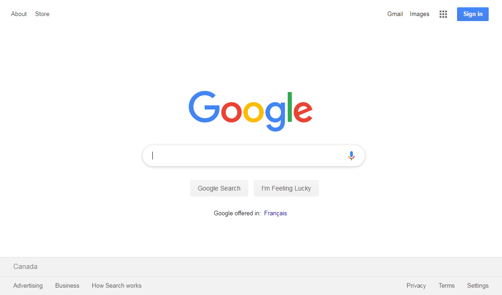
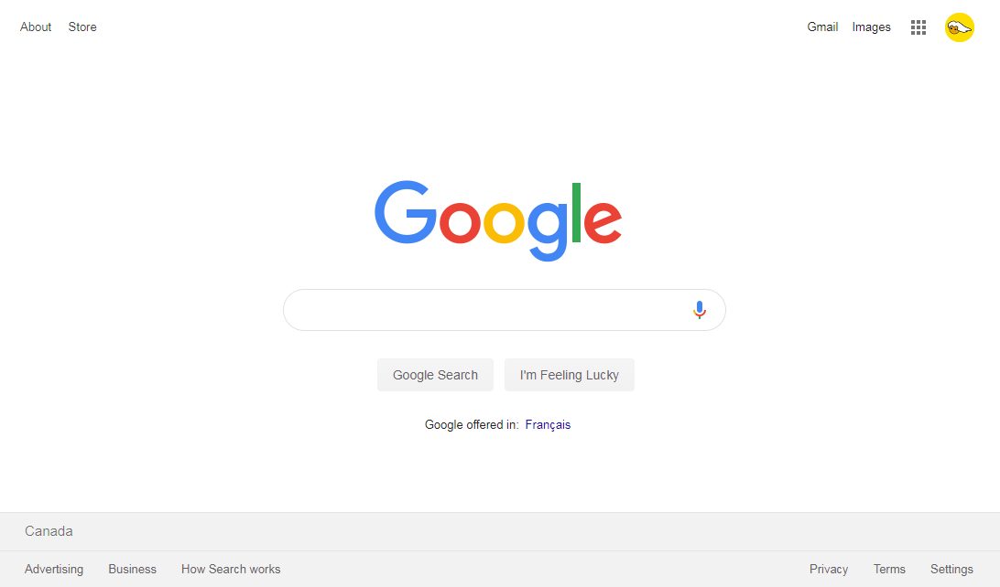
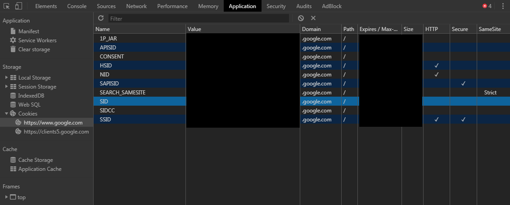

# Cookies & Login Sessions

In the last module, we've successfully managed to create our login functionality. However, when logged in and when we refresh a page in our app (or close the browser and reopen it), we'll notice that we're not in the logged-in state any longer. This is because we haven't implemented any **persistent login sessions**.

Persistent login sessions allow users to stay logged-in over multiple browser sessions. Closing and reopening the browser or reloading the web app will not log out the user. This is what all major web apps do. We can observe this behavior in applications like [GitHub](https://github.com/), [YouTube](http://youtube.com/), [Twitter](http://twitter.com/), [Google](http://google.com/), etc.

How do these apps achieve this? Well, it's with something you may have heard about before known as **cookies**! Let's see an example of this.

First, we'll open a brand new incognito window in our browser since we won't want any cookies already in our browser's memory to affect our exercise.

> We'll be using the [Google Chrome](https://www.google.com/chrome/) browser in this exercise.

Next, we'll go to Google's main website - <https://www.google.com> and we'll see that we're in the logged-out state.

If we were to log-in with our Google account, head back to <https://www.google.com>, and _refresh_ the web page in our browser, we'll see that Google keeps us logged-in.

Google Chrome allows us to view, edit, and delete cookies with their dev tools. We'll open the dev tools in our browser and navigate to where we can see information about our browser cookies. In Google Chrome, cookies are shown in the `Application` tab.

We'll select the cookie called **`SID`** and delete it. We're not 100% sure what this cookie was created to do or what it stands for (only Google's engineers know that for sure), but we probably think it stands for **Session ID**.

Now, with the cookie deleted, we'll refresh the web page. And surprise! Google does not keep us logged-in!

As we can see, this particular web app utilizes **cookies** to persist login sessions.

A **browser cookie** is data that a server can send to a user's web browser where the browser can often send _back_ to the server. Cookies are often used to store user sessions and personalized preferences for a user among other things.

In the next few lessons, we'll compare cookies with modern browser APIs that allow for storing information in the client before we implement persistent login sessions in our app!
