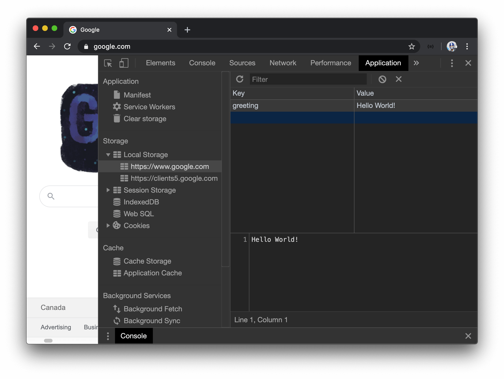
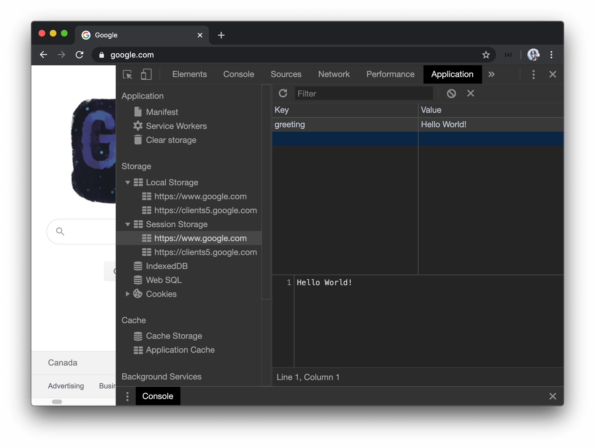

# localStorage vs. sessionStorage vs. cookies

> 📖 This lesson's lecture slides can be found - [here](./protected/lecture-slides.pdf).

Before we dive into implementing a persistent login session, we'll touch on the different storage mechanisms of the web browser. We'll discuss **`localStorage`**, **`sessionStorage`**, and **`cookies`**. All three of these mechanisms allows us to store data in key-value pairs as `strings` in the browser's memory. However, there are key differences between each of them.

### LocalStorage

With **`localStorage`**,

-   Stored data is **persistent in browser memory**.
-   Stored data is **only** accessible through **client-side JavaScript**.
-   Stored data is **not automatically sent to the server** during an HTTP request.

Let's test this out! In the `Console` tab of our browser's dev tools, we'll run the following command:

```ts
localStorage.setItem("greeting", "Hello World!");
```

We can then navigate to the section of our dev tools that highlight what's been stored in `localStorage`. In Google Chrome, this can be seen in the `Application` tab. We'll now see a `"greeting" : "Hello World!"` key-value pair.



If we were to refresh the web page, close and reopen the tab, close and reopen the browser, or even restart our computer, the data remains. The only way to delete this data is to either clear our browser's memory or explicitly delete the `localStorage` item with the following:

```ts
localStorage.removeItem("greeting");
```

### SessionStorage

**`sessionStorage`** behaves very similar to `localStorage` since:

-   Stored data is **only** accessible through **client-side JavaScript**.
-   Stored data is **not automatically sent to the server** during an HTTP request.

However, with `sessionStorage`, stored data is **deleted once the browser tab or window is closed**

We can test this out as well. We'll run the following command in the `Console` of our browsers dev tools.

```ts
sessionStorage.setItem("greeting", "Hello World!");
```

If we navigate to where we can see `sessionStorage` data with which will be in the `Application` tab in Chrome. We'll see the `"greeting" : "Hello World!"` key-value pair.



Refreshing the web-page will not delete the data. However, by closing and reopening the browser tab or closing and reopening the browser window, the data will be deleted. Just like `localStorage`, data can also be deleted by clearing out the browser's memory or with the following command:

```ts
sessionStorage.removeItem("greeting");
```

### Cookies

With **cookies**,

-   stored data is **persistent in browser memory**.
-   stored data is **inaccessible with JavaScript on the client (when an `HttpOnly` flag is set)**.
-   stored data is **automatically sent to the server** during an HTTP request.

Just like `localStorage`, cookies are persistent in memory. This means that by refreshing the web-page, closing and reopening a browser tab, closing and reopening the browser window, or even restarting our computer will not delete this data. A cookie is often deleted when the cookie is to be used up to an expiration date or by clearing our browser's memory.

Another interesting property of a cookie is that it can be tagged with an `HttpOnly` flag. By setting a cookie to `HttpOnly`, we ensure that the cookie can _only_ be accessed from the server and as a result can't be tampered with by JavaScript running on the browser.

Lastly, unlike `localStorage` or `sessionStorage`, **`cookies` are automatically sent to the server on every HTTP request**.

### localStorage & sessionStorage Security

`localStorage` & `sessionStorage` are accessible through JavaScript running in the browser.

Because of this, authentication data stored in these types of storage are vulnerable to [**cross-site scripting (XSS) attacks**](https://developer.mozilla.org/en-US/docs/Glossary/Cross-site_scripting). XSS is a vulnerability where attackers can inject client-side scripts (i.e JavaScript) to run on a web app.

To prevent XSS, we could:

-   ensure that all links are from a trusted source. This includes the URLs of HTML `` elements and `<a/>` tags.
-   escape untrusted data (which is often automatically done when using a modern front-end framework such as React).

### Cookie Security

Cookies, when used with the `HttpOnly` flag, are not accessible through JavaScript and thus are immune to XSS. We can also set a `Secure` flag to a cookie to guarantee the cookie is only sent over HTTPS. These are some of the reasons why cookies are often used to store tokens or session data.

However, cookies _are_ vulnerable to a different type of attack - [**cross-site request forgery (CSRF)**](https://developer.mozilla.org/en-US/docs/Glossary/CSRF). CSRF, in a nutshell, is a type of attack that occurs when one is lured to a malicious website or email which causes the web browser to perform an unwanted HTTP request to another website which one is currently authenticated. This is an exploit of how the browser handles cookies.

Another flag for the cookie, the `SameSite` flag, was designed to counter CSRF attacks by ensuring that cookies are not sent with cross-site requests. Though the `SameSite` flag is new, it's supported by most major browsers. However, as of now, not all web browsers support this technology. So in the meantime, the best strategy to counter CSRF is to also include a token (e.g. `X-CSRF-TOKEN`) with every HTTP request to help ensure the intended user is making the request.

In the next few lessons, we'll see how cookies can be used to persist login sessions and we'll follow up with how clients can add a `X-CSRF-TOKEN` to requests as an additional step to preventing CRSF attacks.
