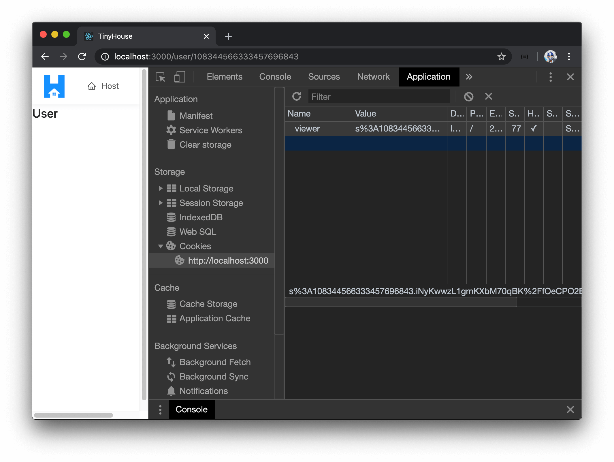

# Adding the Viewer Cookie on the Server

> 📝 A sample of the `.env` file in our server project, after this lesson is complete, can be found - [here](https://gist.github.com/djirdehh/9909f55a4126a78302090b47f0033cca).

### cookie-parser

To integrate cookies into our Node Express server app, we'll use the [`cookie-parser`](https://github.com/expressjs/cookie-parser) package provided to us by the Express team. `cookie-parser` helps parse HTTP requests and can be applied as an Express middleware. We'll head to the terminal and in our server project, install the `cookie-parser` package.

```shell
npm install cookie-parser
```

We'll also install the community-supported type definitions of `cookie-parser` as a development dependency.

```shell
npm install -D @types/cookie-parser
```

For our server app to parse incoming cookies from our client, we'll need to make some small changes. The `cookieParser()` function from `cookieParser` takes an optional `secret` parameter. If this `secret` is set, then cookies can be signed with this secret which will ensure that cookies aren't to be tampered with. To ensure the secret we'll apply is a secret that can be specified as part of the application's configuration, we'll declare the value of this secret in our server `.env` file.

We'll create a new environment variable called `SECRET`. This isn't something that we have to specify with a certain value so for our development environment we'll simply say something along the lines of `"this-is-a-secret"`.

```shell
SECRET=this-is-a-secret
```

> **Note:** In production, it will be more appropriate to use a longer and more randomly generated string. Something that resembles more like the client secret of our Google OAuth client credentials.

We'll now import the `cookieParser` package in our `src/index.ts` file and apply `cookieParser` as an application middleware. We'll pass in the optional secret value by referencing the secret in our environment configuration.

```ts
require("dotenv").config();

// ...
import cookieParser from "cookie-parser";
// ...

const mount = async (app: Application) => {
  const db = await connectDatabase();

  app.use(cookieParser(process.env.SECRET));

  const server = new ApolloServer({
    typeDefs,
    resolvers,
    context: () => ({ db })
  });

  server.applyMiddleware({ app, path: "/api" });
  app.listen(process.env.PORT);

  console.log(`[app] : http://localhost:${process.env.PORT}`);
};

mount(express());
```

We'll want the `logIn()` and `logOut()` resolver functions in our API to be able to read and set a cookie depending on whether the viewer is logging in or logging out. To read or set a cookie, we'll need access to the `req` and `res` objects in our resolver functions. To have the `req` and `res` objects available in any resolver function that may need it, we'll want to introduce them in the context of our resolver functions.

The `context` function property of our Apollo Server constructor is run with the `req` and `res` objects for every request, so we can simply access these properties and pass them along as part of the context object for all our resolvers.

```ts
const server = new ApolloServer({
  typeDefs,
  resolvers,
  context: ({ req, res }) => ({ db, req, res })
});
```

With these changes, the `src/index.ts` file will look like the following:

```ts
require("dotenv").config();

import express, { Application } from "express";
import cookieParser from "cookie-parser";
import { ApolloServer } from "apollo-server-express";
import { connectDatabase } from "./database";
import { typeDefs, resolvers } from "./graphql";

const mount = async (app: Application) => {
  const db = await connectDatabase();

  app.use(cookieParser(process.env.SECRET));

  const server = new ApolloServer({
    typeDefs,
    resolvers,
    context: ({ req, res }) => ({ db, req, res })
  });

  server.applyMiddleware({ app, path: "/api" });
  app.listen(process.env.PORT);

  console.log(`[app] : http://localhost:${process.env.PORT}`);
};

mount(express());
```

### Updating logIn and logOut

We'll now head over to our `viewerResolvers` map in the `src/graphql/resolvers/Viewer/index.ts` file and look to set and clear a cookie in the `logIn()` and `logOut()` resolver functions respectively.

There are a few things we're going to need to do.

-   The `logInViaGoogle()` function that runs when the user signs in with Google will be modified to _create_ a cookie.
-   The `logOut()` resolver function will be modified to _clear_ the cookie when the user logs out.
-   Lastly, we'll create a `logInViaCookie()` utility function that can be run as part of our `logIn()` resolver which will help the **user log-in via a cookie when a Google authorization code is not provided**.

#### `cookieOptions`

We can set a cookie with the `res.cookie()` function available from the `cookie-parser` package. When we set a cookie, we're able to pass an `options` object that will help us create a secure cookie. Since we'll use these options in a few different cases, let's create this `options` object at the top of the file as `cookieOptions`.

```ts
const cookieOptions = {};
```

Here are the options we'll add to our cookie.

-   We'll set the [`httpOnly`](https://www.owasp.org/index.php/HttpOnly) flag to `true` to ensure the cookie is not to be accessible by client-side JavaScript. This helps counters [XSS attacks](https://developer.mozilla.org/en-US/docs/Glossary/Cross-site_scripting).
-   We'll set the [`sameSite`](https://www.owasp.org/index.php/SameSite) flag to `true` to ensure the cookie is not sent with cross-site requests. This is available in most modern browsers and helps prevent [CSRF attacks](https://developer.mozilla.org/en-US/docs/Glossary/CSRF).
-   The `signed` property will help ensure the cookie is not tampered with by creating an HMAC of the value and base64 encoding it. We'll set the `signed` property to `true` as well.
-   The `secure` property ensures the cookie is only sent over HTTPS. We'll only want this option in production since in development environment, [localhost](http://localhost), is in HTTP. What we'll do here is use an environment variable (that we can call `NODE_ENV`) that will check for if we are in development. We'll have the cookie `secure` property as `false` if we are in development otherwise set it as `true`.

```ts
const cookieOptions = {
  httpOnly: true,
  sameSite: true,
  signed: true,
  secure: process.env.NODE_ENV === "development" ? false : true
};
```

In our `server/.env` file, we'll create the `NODE_ENV` environment variable and provide a value of `development`.

```shell
NODE_ENV=development
```

#### `logInViaGoogle()`

In the `logInViaGoogle()` function, after a user successfully signs in, we'll look to set a new cookie. To have the `res` object available, we'll state the `res` object will be a parameter of the function and we'll assign its type to the `Response` interface we can import from `express`.

```ts
// ...
import { Response } from "express";
// ...

const logInViaGoogle = async (
  code: string,
  token: string,
  db: Database,
  res: Response
): Promise<User | undefined> => {
  // ...
};
```

At the end of the `logInViaGoogle()` function and after we've obtained a relevant user object, we'll use the [`res.cookie()`](https://expressjs.com/en/api.html#res.cookie) function from `cookie-parser` to set a new cookie with the key of `viewer`. For the value of this cookie, we'll use the `userId` of the user we've obtained.

```ts
// ...
import { Response } from "express";
// ...

const logInViaGoogle = async (
  code: string,
  token: string,
  db: Database,
  res: Response
): Promise<User | undefined> => {
  // ...
  // get user information
  // ...

  res.cookie("viewer", userId);

  return viewer;
};
```

> One could take an additional security step here to encode the `userId` value as we set it as the value of the cookie and decode it when we attempt to retrieve the cookie. Since we're already signing the cookie, we won't take this additional step.

In the third positional argument of `res.cookie()`, we'll declare the options of the cookie with the `cookieOptions` we've created above. We'll introduce one other option in this case which is the `maxAge` option which helps set the _maximum age_ of our cookie in Millisecond format. We wouldn't want this cookie to expire any time soon so for our case we'll set the expiration to 1 year.

```ts
// ...
import { Response } from "express";
// ...

const logInViaGoogle = async (
  code: string,
  token: string,
  db: Database,
  res: Response
): Promise<User | undefined> => {
  // ...
  // get user information
  // ...

  res.cookie("viewer", userId, {
    ...cookieOptions,
    maxAge: 365 * 24 * 60 * 60 * 1000
  });

  return viewer;
};
```

#### `logOut()`

In the `logOut()` resolver function, we'll look to clear this `viewer` cookie when the viewer ever signs out. We'll access the `res` object available as context and use the [`res.clearCookie()`](https://expressjs.com/en/api.html#res.clearCookie) function of `cookie-parser` to specify that the viewer cookie is the cookie we'll like to clear. We'll also pass the `cookieOptions` we've specified as the second argument value of `res.clearCookie()` since **most web browsers will only clear the cookie if the given options is identical to those given to `res.cookie()` (excluding an `expires` or `maxAge` property)**.

```ts
logOut: (
  _root: undefined,
  _args: {},
  { res }: { res: Response }
): Viewer => {
  try {
    res.clearCookie("viewer", cookieOptions);
    return { didRequest: true };
  } catch (error) {
    throw new Error(`Failed to log out: ${error}`);
  }
}
```

#### `logInViaCookie()`

The last thing we'll do is create and use a `logInViaCookie()` function. We'll create this `logInViaCookie()` function right below the `logInViaGoogle()` function.

The `logInViaCookie()` function will be fairly straightforward. It'll try to find a user document in our database using the viewer id retrieved from the `viewer` cookie that can be found in the _request_. We'll say that the `logInViaCookie()` function is to accept the user token, the `db` object, and the `req` and `res` properties. We'll set the type of the `req` property as the `Request` interface we'll import from `express`. This function will be a promise that when resolved successfully should return an instance of a `User` or `undefined`.

```ts
// ...
import { Request, Response } from "express";
// ...

const logInViaCookie = async (
  token: string,
  db: Database,
  req: Request,
  res: Response
): Promise<User | undefined> => {};
```

We'll use Mongo's [`findOneAndUpdate()`](https://docs.mongodb.com/manual/reference/method/db.collection.findOneAndUpdate/) method and we'll state that we're interested in finding the viewer where the id matches that from the viewer cookie in our `req`. Since our cookie is signed, we'll need to access it from the `signedCookies` property of `req`.

```ts
// ...
import { Request, Response } from "express";
// ...

const logInViaCookie = async (
  token: string,
  db: Database,
  req: Request,
  res: Response
): Promise<User | undefined> => {
  const updateRes = await db.users.findOneAndUpdate({ _id: req.signedCookies.viewer });
};
```

If this viewer is found, we'll update the `token` field with the most recent randomly generated token from logging in. We'll set the `returnOriginal` property to `false` since we're interested in retrieving the updated value.

```ts
// ...
import { Request, Response } from "express";
// ...

const logInViaCookie = async (
  token: string,
  db: Database,
  req: Request,
  res: Response
): Promise<User | undefined> => {
  const updateRes = await db.users.findOneAndUpdate(
    { _id: req.signedCookies.viewer },
    { $set: { token } },
    { returnOriginal: false }
  );
};
```

We'll access the updated document by accessing the `value` of the result. If this viewer doesn't exist, we'll clear out the cookie since this tells us the cookie doesn't have the appropriate viewer id. If the viewer is found we'll simply return it from our function.

```ts
const logInViaCookie = async (
  token: string,
  db: Database,
  req: Request,
  res: Response
): Promise<User | undefined> => {
  const updateRes = await db.users.findOneAndUpdate(
    { _id: req.signedCookies.viewer },
    { $set: { token } },
    { returnOriginal: false }
  );

  let viewer = updateRes.value;

  if (!viewer) {
    res.clearCookie("viewer", cookieOptions);
  }

  return viewer;
};
```

We'll now look to use the `logInViaCookie()` function in our `logIn()` resolver. If a `logIn` mutation is ever fired from our client and a `code` _isn't_ being passed in, this will entail that the viewer is attempting to login from their cookie. So in this, we'll call the `logInViaCookie()` function.

We'll update our `logIn()` resolver to destruct the `req` and `res` properties from the resolver context. We'll update how we've called the `logInViaGoogle()` function by passing in the `res` object it now expects.

With these changes, our `logIn()` resolver function will look as follows:

```ts
    logIn: async (
      _root: undefined,
      { input }: LogInArgs,
      { db, req, res }: { db: Database; req: Request; res: Response }
    ): Promise<Viewer> => {
      try {
        const code = input ? input.code : null;
        const token = crypto.randomBytes(16).toString("hex");

        const viewer: User | undefined = code
          ? await logInViaGoogle(code, token, db, res)
          : await logInViaCookie(token, db, req, res);

        if (!viewer) {
          return { didRequest: true };
        }

        return {
          _id: viewer._id,
          token: viewer.token,
          avatar: viewer.avatar,
          walletId: viewer.walletId,
          didRequest: true
        };
      } catch (error) {
        throw new Error(`Failed to log in: ${error}`);
      }
    },
```

Now, with our server and client projects running, when we head to the client side of our app and log-in, we'll see a cookie called `viewer` being set on our client browser by our server.



If we log out of our application, this `viewer` cookie will be cleared.

That should be it! The server is now prepared to set and clear a cookie that will help with persisting login sessions after a user initially signs-in with Google. In the next lesson, we'll pick up the client-side work to see how we can fire the `logIn` mutation whenever the app is being launched with which a cookie will now be passed along.
