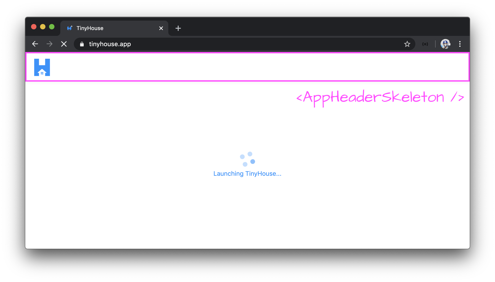
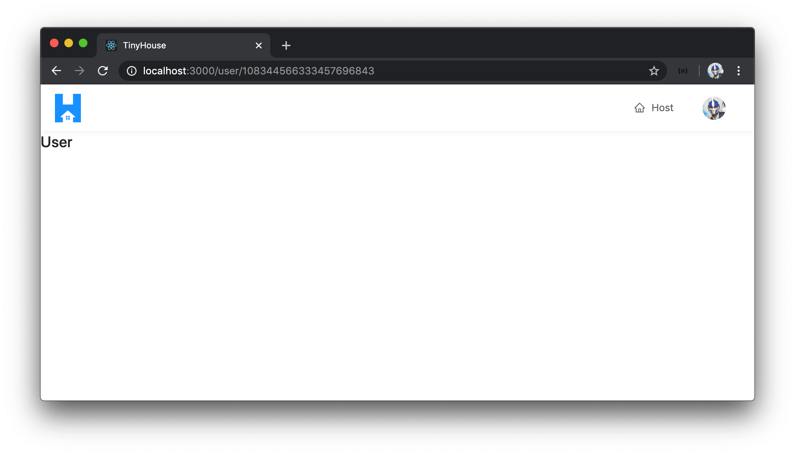
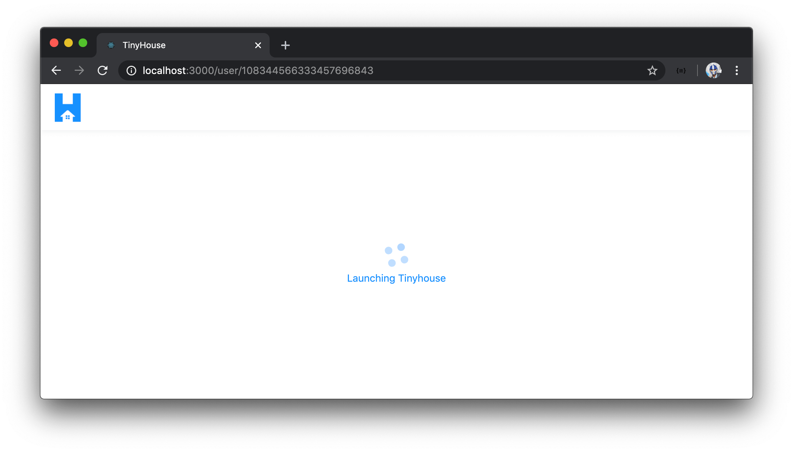
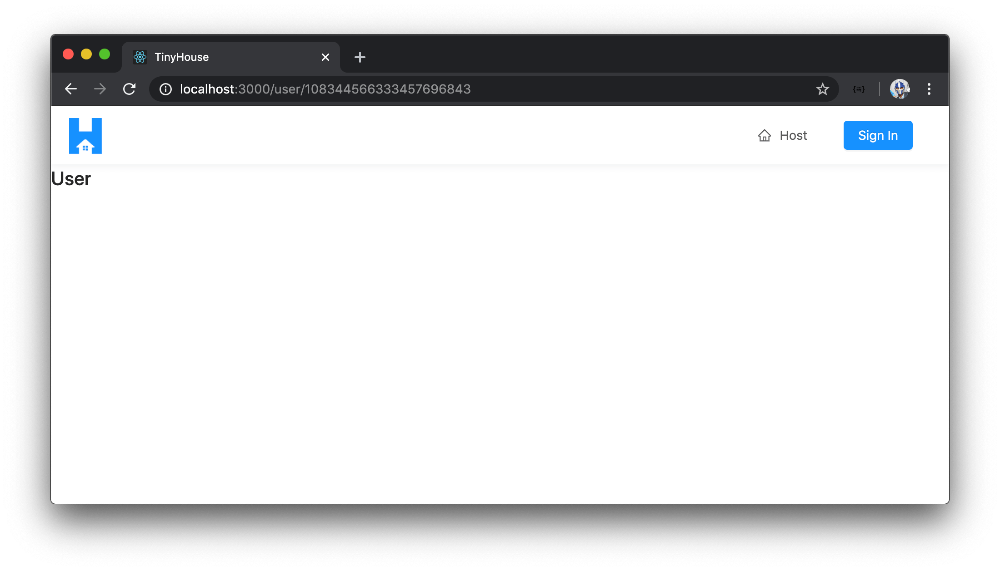
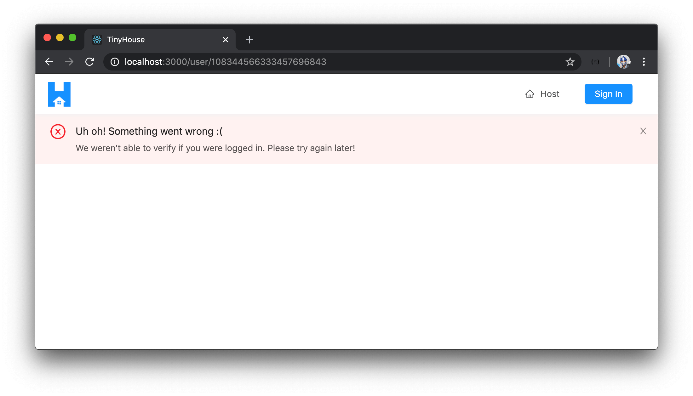

# Adding the Viewer Cookie on the Client

Our server is now able to help set and clear the `viewer` cookie in our client when we sign-in and sign-out respectively. In this lesson, we'll modify our client application such that it will use the `viewer` cookie to automatically log a viewer in when the app first renders and the cookie is available.

To help log the user in, we'll fire the `logIn` mutation we already have available in our API. Since we'll want to run this mutation when the app renders and regardless of _which_ component or page is being rendered, we'll have this mutation fire in the uppermost parent `<App />` component.

We're interested in running the `logIn` mutation the moment the application first loads or in other words the moment when the `<App />` component first renders. To help conduct the mutation during this effect, we'll import and use the `useEffect` Hook in the `src/index.tsx` file. Since we're interested in executing the `logIn` mutation, we'll import the `LOG_IN` mutation document and the autogenerated type variables for the `LOG_IN` mutation. We'll also import the `useMutation` Hook from `react-apollo`.

```tsx
import React, { useState, useEffect } from "react";
// ...
import { ApolloProvider, useMutation } from "@apollo/react-hooks";
// ...
import { LOG_IN } from "./lib/graphql/mutations";
import {
  LogIn as LogInData,
  LogInVariables
} from "./lib/graphql/mutations/LogIn/__generated__/LogIn";
// ...
```

In the `<App />` component, we'll use the `useMutation` Hook and pass in the `LOG_IN` mutation document and return the `logIn()` request function and the `error` result value. Similar to how we've conducted the `logIn` mutation in our `<Login />` component - we'll state when the mutation is successful, we'll set the `viewer` state value in our client with the returned `data` from our mutation. We'll use the `onCompleted()` callback function to achieve this.

```tsx
const App = () => {
  const [viewer, setViewer] = useState<Viewer>(initialViewer);
  const [logIn, { error }] = useMutation<LogInData, LogInVariables>(LOG_IN, {
    onCompleted: data => {
      if (data && data.logIn) {
        setViewer(data.logIn);
      }
    }
  });

  // ...
};
```

We'll use the `useEffect` Hook and look to run the effect only when the component first renders by placing an empty dependencies list. To satisfy the `useEffect` Hook and prevent multiple runs of the effect when the component is to ever re-render, we'll import the `useRef` Hook and use the `useRef` Hook to create a `ref` object to represent the `logIn()` request function and have it remain constant through the life of the component. We'll access and run the `logIn` mutation in our effect callback by accessing the `current` property of the `ref` object we've created.

```tsx
const App = () => {
  const [viewer, setViewer] = useState<Viewer>(initialViewer);
  const [logIn, { error }] = useMutation<LogInData, LogInVariables>(LOG_IN, {
    onCompleted: data => {
      if (data && data.logIn) {
        setViewer(data.logIn);
      }
    }
  });

  const logInRef = useRef(logIn);

  useEffect(() => {
    logInRef.current();
  }, []);

  // ...
};
```

We'll want to show some loading state to the user while the user is being logged in. The loading UI we'll look to show will be page-level where a skeleton of the `<AppHeader />` is shown and a spinning indicator is shown in the body of the UI.



The skeleton of the `<AppHeader />` will improve the perceived performance of our app since the functional `<AppHeader />` will show shortly after.

Let's first create this `<AppHeaderSkeleton />` component. We'll create this component in the `src/lib/components/` folder.

```shell
client/
  // ...
  src/
    lib/
      components/
        AppHeaderSkeleton/
          index.tsx
        // ...
    // ...
  // ...
```

We'll re-export the `<AppHeaderSkeleton />` component we plan to create from the `src/lib/components/index.ts` file.

```ts
export * from "./AppHeaderSkeleton";
```

The `<AppHeaderSkeleton />` component will be very similar to the `<AppHeader />` component except that it won't accept any props and simply show just the application logo without any menu items. We'll copy the code over from `<AppHeader />` and also copy over our app logo asset to an `assets/` folder within `src/lib/components/AppHeaderSkeleton/`.

```tsx
import React from "react";
import { Layout } from "antd";

import logo from "./assets/tinyhouse-logo.png";

const { Header } = Layout;

export const AppHeaderSkeleton = () => {
  return (
    <Header className="app-header">
      <div className="app-header__logo-search-section">
        <div className="app-header__logo">
          
        </div>
      </div>
    </Header>
  );
};
```

To show loading UI when the log-in request is in flight in the parent `<App />` component, we could use the `loading` value from the mutation result but in this case, we'll check for the `didRequest` property of the `viewer` state object and the `error` state of our request. We know that the `didRequest` field will only be set to `true` when the request for viewer information has been made complete so we'll use this field to verify that the viewer hasn't finished the log-in attempt. We'll also check for the `error` status of our mutation request. If at any moment, the mutation contains errors, we'll stop displaying the loading indicator and show a banner in our app.

In the `src/index.tsx` file, we'll import the `<AppHeaderSkeleton />` component from the `src/lib/components/` folder and we'll import the `<Spin />` component from Ant Design.

```tsx
// ...
import { Affix, Spin, Layout } from "antd";
// ...
import { AppHeaderSkeleton } from "./lib/components";
// ...
```

In the `<App />` component, we'll check for if the `viewer.didRequest` field is not true and the `logIn` mutation hasn't errored. In this case, our `<App />` component will show the `<AppHeaderSkeleton />` and a spinning indicator that says `"Launching TinyHouse..."`.

```tsx
const App = () => {
  const [viewer, setViewer] = useState<Viewer>(initialViewer);
  const [logIn, { error }] = useMutation<LogInData, LogInVariables>(LOG_IN, {
    onCompleted: data => {
      if (data && data.logIn) {
        setViewer(data.logIn);
      }
    }
  });

  const logInRef = useRef(logIn);

  useEffect(() => {
    logInRef.current();
  }, []);

  if (!viewer.didRequest && !error) {
    return (
      <Layout className="app-skeleton">
        <AppHeaderSkeleton />
        <div className="app-skeleton__spin-section">
          <Spin size="large" tip="Launching Tinyhouse" />
        </div>
      </Layout>
    );
  }

  // ...
};
```

If there was ever an error during the login process, we'll import and use the `<ErrorBanner />` component we created before to show an error banner at the top of our app. We'll state an error message along the lines of `"We weren't able to verify if you were logged in. Please try again soon!"`. We'll set this error banner element to a constant we'll call `logInErrorBannerElement` and have the `logInErrorBannerElement` shown at the top of the expected returned elements of the `<App />` component.

With all the changes made to the `<App />` component, the `src/index.tsx` file will now look like the following:

```tsx
import React, { useState, useEffect, useRef } from "react";
import { render } from "react-dom";
import { BrowserRouter as Router, Route, Switch } from "react-router-dom";
import ApolloClient from "apollo-boost";
import { ApolloProvider, useMutation } from "@apollo/react-hooks";
import { Affix, Spin, Layout } from "antd";
import {
  AppHeader,
  Home,
  Host,
  Listing,
  Listings,
  Login,
  NotFound,
  User
} from "./sections";
import { AppHeaderSkeleton, ErrorBanner } from "./lib/components";
import { LOG_IN } from "./lib/graphql/mutations";
import {
  LogIn as LogInData,
  LogInVariables
} from "./lib/graphql/mutations/LogIn/__generated__/LogIn";
import { Viewer } from "./lib/types";
import * as serviceWorker from "./serviceWorker";
import "./styles/index.css";

const client = new ApolloClient({
  uri: "/api"
});

const initialViewer: Viewer = {
  id: null,
  token: null,
  avatar: null,
  hasWallet: null,
  didRequest: false
};

const App = () => {
  const [viewer, setViewer] = useState<Viewer>(initialViewer);
  const [logIn, { error }] = useMutation<LogInData, LogInVariables>(LOG_IN, {
    onCompleted: data => {
      if (data && data.logIn) {
        setViewer(data.logIn);
      }
    }
  });
  const logInRef = useRef(logIn);

  useEffect(() => {
    logInRef.current();
  }, []);

  if (!viewer.didRequest && !error) {
    return (
      <Layout className="app-skeleton">
        <AppHeaderSkeleton />
        <div className="app-skeleton__spin-section">
          <Spin size="large" tip="Launching Tinyhouse" />
        </div>
      </Layout>
    );
  }

  const logInErrorBannerElement = error ? (
    <ErrorBanner description="We weren't able to verify if you were logged in. Please try again later!" />
  ) : null;

  return (
    <Router>
      <Layout id="app">
        {logInErrorBannerElement}
        <Affix offsetTop={0} className="app__affix-header">
          <AppHeader viewer={viewer} setViewer={setViewer} />
        </Affix>
        <Switch>
          <Route exact path="/" component={Home} />
          <Route exact path="/host" component={Host} />
          <Route exact path="/listing/:id" component={Listing} />
          <Route exact path="/listings/:location?" component={Listings} />
          <Route
            exact
            path="/login"
            render={props => <Login {...props} setViewer={setViewer} />}
          />
          <Route exact path="/user/:id" component={User} />
          <Route component={NotFound} />
        </Switch>
      </Layout>
    </Router>
  );
};

render(
  <ApolloProvider client={client}>
    <App />
  </ApolloProvider>,
  document.getElementById("root")
);

// If you want your app to work offline and load faster, you can change
// unregister() to register() below. Note this comes with some pitfalls.
// Learn more about service workers: https://bit.ly/CRA-PWA
serviceWorker.unregister();
```

That should be it! When our parent `<App />` component renders, it'll fire off the `logIn()` mutation request. As the request is fired, the `viewer` cookie (when available) is sent to the server automatically. If the `viewer` cookie is available and the server can locate the user in the `users` collection of our database from the viewer cookie id, the server will return the user information to the client. Our client app will then set the `viewer` state object with this returned user information. In other words, **the user will have successfully logged-in via a cookie**.

Let's give it a try. With our server and client projects running, we'll launch our client app and we'll sign in again. When successfully signed in, we'll be back in our app in the logged in state. When we close the browser or close the tab, reopen it, or refresh our app, we'll stay in the logged-in state!



We'll also see the brief loading indicator that says `"Launching TinyHouse"` (but in essence is the in-flight status of our login request via a cookie) whenever the `logIn()` request is made from the `<App />` component but hasn't finished.



When we now log out, the `viewer` cookie will be cleared from our browser and upon refreshing the app we won't be logged in any longer.



Amazing! If the `logIn` request ever errored, our app will be shown with an error banner that notifies the user that something might have gone wrong.


