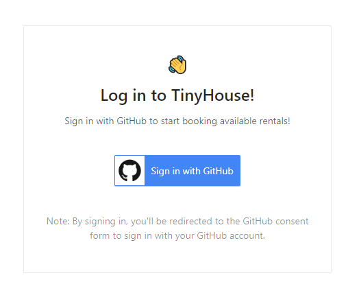
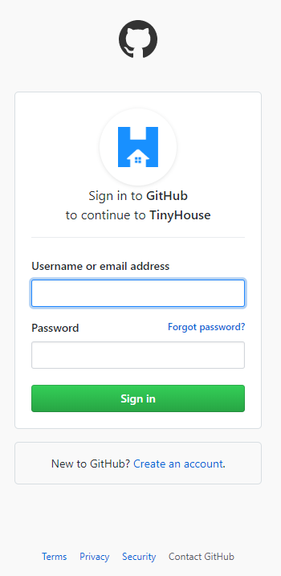
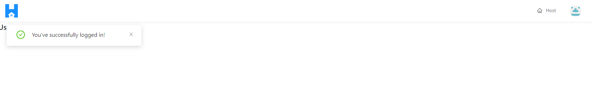
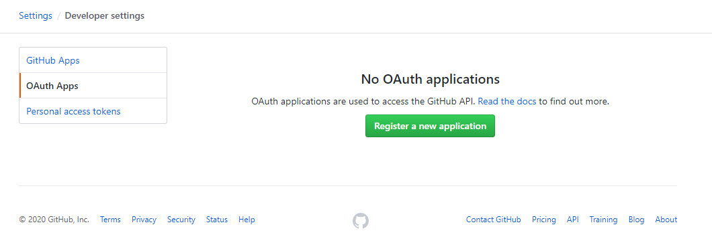
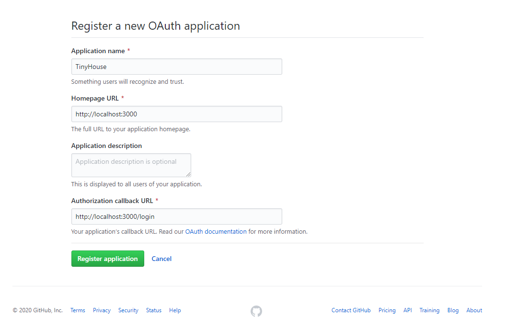
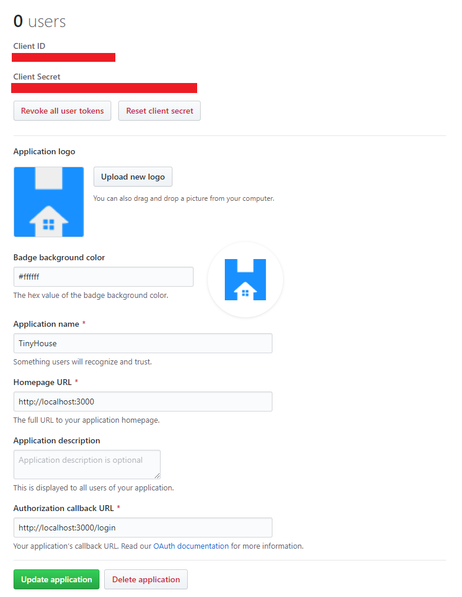

# GitHub OAuth Challenge

This challenge is part of the [TinyHouse](https://www.newline.co/tinyhouse) Fullstack React Masterclass. By completing this challenge, you'll integrate GitHub user authentication onto the TinyHouse application!

This directory contains the starting scaffold for you to use as well as the completed solution. Below, we'll specify the challenge requirements, describe the functionality we intend to have, and give you tips along the way.

> For more details and steps to conduct authentication with Github, refer to the [Authorizing OAuth Apps
](https://developer.github.com/apps/building-oauth-apps/authorizing-oauth-apps/#web-application-flow) section in Github's developer documentation.

## Challenge Details

### Starting point

At the starting `/scaffold`, a GraphQL API exists where we're able to execute an `authUrl` query and a `logIn` mutation. This remains the same from the Google user authentication approach shown in the video lessons. __The challenge here is to modify the GraphQL resolver functions for the `authUrl` and `logIn` GraphQL fields to facilitate authentication with a user's GitHub account as opposed to their Google account.__

```gql
type Viewer {
  id: ID
  token: String
  avatar: String
  hasWallet: Boolean
  didRequest: Boolean!
}

input LogInInput {
  code: String!
}

type Query {
  authUrl: String!
}

type Mutation {
  logIn(input: LogInInput): Viewer!
  logOut: Viewer!
}
```

> __Tip:__ When working in the `server/` project, we encourage you to use a different `"users"` collection for users that are to sign-in with their Github account. This is done as to not pollute the existing `"users"` collection that have been created using Google accounts in our main video lessons. As an example, in the `solutions/` directory, we called our new users collection `"users_gh"`.

```ts
export const connectDatabase = async (): Promise<Database> => {
  const client = await MongoClient.connect(url, { useNewUrlParser: true });
  const db = client.db("main");

  return {
    bookings: db.collection<Booking>("bookings"),
    listings: db.collection<Listing>("listings"),
    users: db.collection<User>("users_gh")
  };
};
```

### Requirements

**In this challenge, we'll focus on modifying our React client and our Node server to allow a user to log in and authenticate using GitHub instead of Google.**

1. Adapt the UI of the `/login` page to encourage the user to sign-in with their Github account.



2. When the user clicks the "Sign in with GitHub" button, ensure that they are navigated to GitHub's login form. The `url` for this page should come from the `authUrl` query in our API.



3. Once the user enters their login information, ensure that GitHub will redirect the user back to the TinyHouse application with an authorization `code`. Use the authorization `code` to complete the OAuth process and sign a user in our TinyHouse application.



## Instructions

How to attempt this challenge:

1. Clone this repo.
2. Solve the challenge.
3. Compare your solution with the `solution/` folder provided in this directory.

If you feel stuck at any moment in time, feel free to hop over and ask a question in the **`#tinyhouse`** channel of the Newline Discord organization!

## Tips

1. Just like how we had to create an OAuth application on Google's developer console, we'll need to create an OAuth application on GitHub as well. We can do that [here](https://github.com/settings/developers).



2. When creating a new OAuth application in Github's developer console, you can fill in the details of your application and the callback URL. For our case, we can specify the callback URL with the `/login` pathname similar to how we've done it for Google OAuth.



3. When a Github OAuth app is successfully created, we'll be presented our app's client ID and secret which we can keep as environment variables in our server application.



4. For more details and steps to conduct authentication with Github, refer to the [Authorizing OAuth Apps
](https://developer.github.com/apps/building-oauth-apps/authorizing-oauth-apps/#web-application-flow) section in Github's developer documentation.
