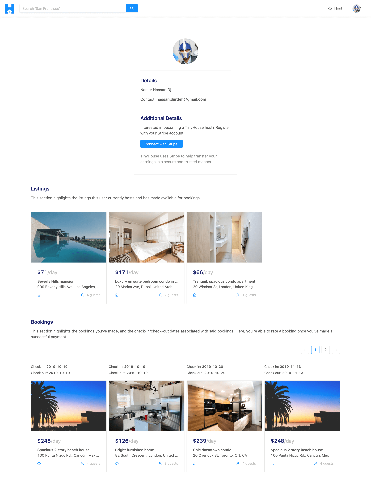

# Module 6 Introduction

In this module, we'll build the User page. In the User page, we'll display information of a certain user as well as the show the listings the user hosts. In addition, when a user views their own User page, they'll be able to see the sensitive booking information only available to them.

The User page is to be displayed in the `/user/:id` route of our app and in its complete state will look similar to the following:

In this module, we'll:

-   Create the GraphQL fields in our API to query information for a certain user from the `"users"` collection.
-   Build the GraphQL resolver functions to resolve the data for the certain fields we want to be returned for a single user.
-   Discuss the difference between offset and cursor-based pagination, and implement offset-based pagination for a few fields in our `User` GraphQL object.
-   Finally, build the UI of the User page in our client.
